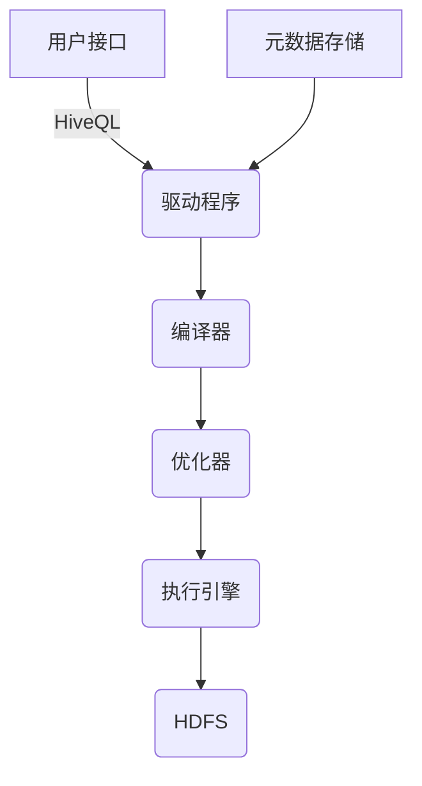

# Hive与人工智能：构建智能数据平台

## 1.背景介绍

### 1.1 大数据时代的到来

随着互联网、物联网、移动互联网和社交媒体的快速发展,数据量呈现出爆炸式增长。根据IDC(国际数据公司)的预测,到2025年,全球数据总量将达到175ZB(1ZB=1万亿TB)。这些海量的数据来自各个领域,包括金融、电信、制造、医疗、交通等,蕴含着巨大的商业价值。如何高效地存储、管理和分析这些大数据,已经成为当前企业和组织面临的重大挑战。

### 1.2 大数据平台的需求

为了应对大数据带来的挑战,企业需要构建一个高效、可扩展、智能的大数据平台。这种平台不仅能够存储和管理海量数据,还能够对数据进行深入分析,发现隐藏其中的商业洞察力,从而支持企业做出明智的决策。

### 1.3 Hive与人工智能的结合

Apache Hive是一种建立在Hadoop之上的数据仓库基础工具,它为结构化的数据查询提供了类SQL接口。Hive使用户可以使用类似SQL的语句来查询、汇总和分析存储在Hadoop分布式文件系统(HDFS)中的大规模数据集。

人工智能(AI)技术近年来发展迅猛,在图像识别、自然语言处理、推荐系统等领域取得了突破性进展。将人工智能技术与Hive相结合,可以构建一个智能的大数据平台,实现数据的智能分析和处理,为企业带来更大的商业价值。

## 2.核心概念与联系  

### 2.1 Hive的核心概念

#### 2.1.1 Hive架构

Hive采用了基于HDFS的分布式元数据存储,并且使用自身的查询引擎来处理查询。Hive的架构主要包括以下几个核心组件:

- **用户接口**:用户可以通过命令行(CLI)、JDBC/ODBC或Web UI等方式与Hive进行交互。
- **驱动程序(Driver)**:负责处理用户输入的查询,生成执行计划,并协调查询的执行。
- **编译器(Compiler)**:将HiveQL查询语句转换为一系列的MapReduce作业。
- **优化器(Optimizer)**:优化查询执行计划,以提高查询性能。
- **执行引擎(Execution Engine)**:执行MapReduce作业,并将结果返回给驱动程序。
- **元数据存储(Metastore)**:存储Hive表、视图、分区等元数据信息。

#### 2.1.2 Hive数据模型

Hive支持多种数据模型,包括表、视图、分区表、桶表等。用户可以使用类似SQL的语法来创建、修改和查询这些数据模型。

- **表(Table)**:表是Hive中最基本的数据模型,用于存储结构化数据。
- **视图(View)**:视图是一种虚拟表,它基于一个或多个基础表,提供了一种自定义的数据表示方式。
- **分区表(Partitioned Table)**:分区表是一种特殊的表,它根据指定的分区键将数据分割成多个分区,每个分区存储在HDFS上的不同路径下。
- **桶表(Bucketed Table)**:桶表是一种特殊的表,它根据指定的桶键将数据分割成多个桶,每个桶存储在同一个HDFS文件中。

#### 2.1.3 HiveQL

HiveQL是Hive提供的一种类SQL查询语言,用于对存储在HDFS上的数据进行查询、汇总和分析。HiveQL语法与标准SQL非常相似,但也有一些差异,主要是为了适应分布式计算环境。

HiveQL支持大多数标准SQL语句,如`SELECT`、`INSERT`、`UPDATE`、`DELETE`、`CREATE TABLE`、`DROP TABLE`等。此外,它还提供了一些特殊的语句,如`LOAD DATA`、`CREATE VIEW`、`ALTER TABLE`等,用于处理Hive特有的数据模型。

### 2.2 人工智能的核心概念

#### 2.2.1 机器学习

机器学习是人工智能的一个重要分支,它赋予计算机从数据中自动分析获得模式的能力,并利用所学的模式对未知数据进行预测或决策。机器学习算法可以分为以下几种类型:

- **监督学习**:根据已标记的训练数据,学习一个模型,用于对新的未标记数据进行预测或分类。
- **无监督学习**:从未标记的数据中发现内在的模式或规律,常用于聚类和降维等任务。
- **强化学习**:通过与环境的交互,学习如何采取最优行动以maximise累积奖励。
- **深度学习**:基于人工神经网络的一种机器学习方法,能够从大量数据中自动学习特征表示。

#### 2.2.2 自然语言处理

自然语言处理(NLP)是人工智能的另一个重要分支,旨在使计算机能够理解和处理人类语言。NLP技术包括以下几个主要任务:

- **语言模型**:学习语言的统计规律,用于生成自然语言或评估语句的可能性。
- **信息抽取**:从自然语言文本中提取结构化信息,如实体、关系、事件等。
- **文本分类**:根据文本内容将文档归类到预定义的类别中。
- **机器翻译**:将一种自然语言转换为另一种自然语言。
- **问答系统**:根据给定的问题,从知识库中检索相关信息并生成自然语言回答。

#### 2.2.3 计算机视觉

计算机视觉是人工智能的另一个重要应用领域,旨在使计算机能够从数字图像或视频中获取有意义的信息。计算机视觉技术包括以下几个主要任务:

- **图像分类**:将图像归类到预定义的类别中,如识别图像中的物体、场景等。
- **目标检测**:在图像中定位并标记出感兴趣的目标对象。
- **语义分割**:将图像中的每个像素点分配到预定义的类别中,实现对象实例的精确分割。
- **视频分析**:从视频序列中提取有意义的信息,如目标跟踪、行为识别等。

### 2.3 Hive与人工智能的联系

将Hive与人工智能技术相结合,可以构建一个智能的大数据平台,实现数据的智能分析和处理。具体来说,它们之间的联系主要体现在以下几个方面:

1. **数据预处理**:Hive可以对存储在HDFS上的原始数据进行清洗、转换和整理,为后续的机器学习和数据分析任务提供高质量的数据输入。

2. **特征工程**:Hive提供了丰富的数据处理功能,可以从原始数据中提取有意义的特征,作为机器学习模型的输入。

3. **模型训练**:可以将Hive与机器学习框架(如Apache Spark MLlib、TensorFlow等)集成,利用Hive处理的数据训练机器学习模型。

4. **模型评估**:可以使用Hive对机器学习模型的预测结果进行评估和分析,从而优化模型性能。

5. **模型部署**:训练好的机器学习模型可以部署到Hive环境中,通过UDF(用户定义函数)或UDTF(用户定义表值函数)的形式,对新的数据进行实时预测或分析。

6. **自然语言分析**:可以将NLP技术与Hive相结合,对存储在Hive中的非结构化文本数据(如社交媒体数据、评论数据等)进行语义分析和情感分析。

7. **计算机视觉分析**:可以将计算机视觉技术与Hive相结合,对存储在Hive中的图像或视频数据进行智能分析,如目标检测、场景识别等。

通过将Hive与人工智能技术相结合,企业可以充分利用大数据的价值,实现数据驱动的智能决策,提高业务效率和竞争力。

## 3.核心算法原理具体操作步骤

在将Hive与人工智能技术相结合的过程中,涉及到多种核心算法和技术,下面将详细介绍其中几种核心算法的原理和具体操作步骤。

### 3.1 决策树算法

决策树是一种常用的监督学习算法,它通过构建决策树模型来对数据进行分类或回归预测。决策树算法的核心思想是根据特征的不同取值,将数据集递归地划分为更小的子集,直到每个子集都属于同一个类别或满足某个停止条件为止。

#### 3.1.1 算法原理

决策树算法的核心原理是基于信息熵(Entropy)和信息增益(Information Gain)来选择最优特征进行数据划分。

1. **信息熵**:信息熵用于衡量数据集的混乱程度或不确定性。对于一个包含k个类别的数据集D,其信息熵定义为:

$$
Ent(D) = -\sum_{i=1}^{k}p_ilog_2p_i
$$

其中,$$p_i$$表示数据集D中属于第i个类别的比例。信息熵的取值范围为[0,1],当数据集中只有一个类别时,信息熵为0;当所有类别的比例相等时,信息熵取最大值。

2. **信息增益**:信息增益用于衡量通过特征A对数据集D进行划分后,信息熵的减少程度。对于特征A的每个可能取值$$a_i$$,它将数据集D划分为若干个子集$$D_i$$,则信息增益定义为:

$$
Gain(D,A) = Ent(D) - \sum_{i=1}^{n}\frac{|D_i|}{|D|}Ent(D_i)
$$

其中,$$|D_i|$$表示子集$$D_i$$的数据个数,$$|D|$$表示原始数据集D的数据个数。

算法选择具有最大信息增益的特征作为当前节点进行数据划分。

3. **树的生成**:决策树的生成是一个递归的过程。对于当前节点,根据最大信息增益的特征进行数据划分,生成子节点。对于每个子节点,重复上述过程,直到满足停止条件(如所有实例属于同一类别、没有剩余特征可供划分或达到预定的树深度等)。

#### 3.1.2 具体操作步骤

以下是使用Hive和Apache Spark MLlib构建决策树模型的具体操作步骤:

1. **数据准备**:使用Hive对原始数据进行清洗、转换和特征工程,生成机器学习所需的特征数据。

2. **数据加载**:将Hive中处理好的数据加载到Apache Spark的RDD或DataFrame中。

3. **算法选择**:从Apache Spark MLlib中选择决策树算法,如`DecisionTreeClassifier`用于分类任务,或`DecisionTreeRegressor`用于回归任务。

4. **参数设置**:设置决策树算法的相关参数,如最大树深度、最小实例数、最大bin数等。

5. **模型训练**:使用训练数据集训练决策树模型。

6. **模型评估**:使用测试数据集评估模型的性能,计算指标如准确率、精确率、召回率等。

7. **模型调优**:根据评估结果,调整算法参数或进行特征选择,重新训练模型,直到达到满意的性能。

8. **模型保存**:将训练好的模型保存到HDFS或其他存储系统中,以便后续部署和使用。

9. **模型部署**:将模型部署到Hive环境中,通过UDF或UDTF的形式对新的数据进行实时预测或分析。

10. **结果输出**:将预测结果存储到Hive表中,或者直接输出到HDFS等存储系统中。

通过上述步骤,我们可以将Hive与Apache Spark MLlib相结合,构建决策树模型,实现大数据集上的智能分析和预测任务。

### 3.2 K-Means聚类算法

K-Means是一种常用的无监督学习算法,它通过将数据划分为k个聚