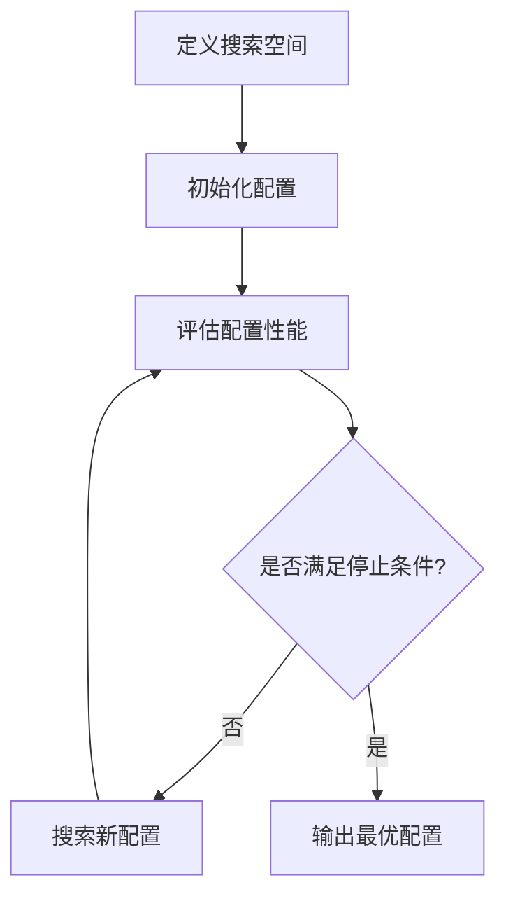

# Hyperparameter Tuning 原理与代码实战案例讲解

## 1.背景介绍

在机器学习和深度学习领域中,模型的性能在很大程度上取决于超参数(Hyperparameters)的选择。超参数是指在模型训练过程中需要人为设置的参数,例如学习率、正则化系数、网络层数等。选择合适的超参数对于获得良好的模型性能至关重要。然而,由于超参数空间通常是高维且复杂的,手动搜索最优超参数组合是一项艰巨的任务。

为了解决这一问题,研究人员提出了自动化超参数调优(Hyperparameter Tuning)技术。超参数调优旨在自动化搜索最优超参数组合的过程,从而提高模型的泛化性能,减少人工试错的工作量。目前,超参数调优已经成为机器学习工作流程中不可或缺的一个环节。

## 2.核心概念与联系

超参数调优涉及以下几个核心概念:

1. **搜索空间(Search Space)**: 所有可能的超参数组合构成的空间。搜索空间的维度等于超参数的个数,每个维度对应一个超参数。

2. **配置(Configuration)**: 搜索空间中的一个具体超参数组合,即一个可能的解。

3. **目标函数(Objective Function)**: 用于评估配置性能的函数,通常是模型在验证集上的指标(如准确率、F1分数等)。目标函数的值越高(或越低),表明该配置的性能越好。

4. **搜索策略(Search Strategy)**: 用于在搜索空间中探索新配置的策略,例如随机搜索、网格搜索、贝叶斯优化等。

上述概念之间的关系可以用以下流程图表示:



## 3.核心算法原理具体操作步骤

尽管存在多种超参数调优算法,但它们的工作原理大致相似。以下是一般超参数调优算法的操作步骤:

1. **定义搜索空间**: 首先需要确定要优化的超参数及其取值范围,从而构建搜索空间。

2. **初始化配置**: 根据搜索策略从搜索空间中采样一个或多个初始配置。

3. **评估配置性能**: 使用目标函数评估每个配置在验证集上的性能。

4. **终止条件检查**: 检查是否满足停止条件,例如达到最大评估次数、性能满足要求或资源耗尽等。如果满足,则输出当前最优配置并终止;否则,进入下一步。

5. **搜索新配置**: 根据搜索策略和历史评估结果,从搜索空间中采样新的配置。常见的搜索策略包括:

    - **随机搜索(Random Search)**: 在搜索空间中随机采样新配置。
    - **网格搜索(Grid Search)**: 在有限的离散搜索空间中穷举所有可能的配置。
    - **贝叶斯优化(Bayesian Optimization)**: 利用高斯过程(Gaussian Process)等概率模型近似目标函数,并基于该模型预测新配置的期望改进量,从而智能地搜索新配置。

6. **重复步骤3-5**: 重复评估新配置的性能、检查终止条件和搜索新配置,直至满足终止条件。

上述算法可以通过并行化评估多个配置来提高效率。此外,还可以引入提前终止(Early-Stopping)策略,在训练过程中及时终止性能较差的配置,从而节省计算资源。

## 4.数学模型和公式详细讲解举例说明

在超参数调优中,贝叶斯优化是一种常用且有效的搜索策略。它利用概率模型来近似目标函数,从而智能地搜索新配置。以下是贝叶斯优化的数学原理:

假设我们有一个黑盒目标函数 $f: \mathcal{X} \rightarrow \mathbb{R}$,其中 $\mathcal{X}$ 是搜索空间。我们的目标是找到 $x^* = \arg\max_{x \in \mathcal{X}} f(x)$。由于目标函数的具体形式未知,我们使用高斯过程(Gaussian Process, GP)来对其进行建模。

高斯过程是一种非参数概率模型,它为任意有限集合的输入点指定了一个联合高斯分布。具体地,高斯过程定义为:

$$
f(x) \sim \mathcal{GP}(m(x), k(x, x'))
$$

其中 $m(x)$ 是均值函数,通常设为0; $k(x, x')$ 是核函数(Kernel Function),用于测量输入 $x$ 和 $x'$ 之间的相似性。常用的核函数包括高斯核(Gaussian Kernel)、马氏核(Matérn Kernel)等。

给定已观测的数据 $\mathcal{D} = \{(x_i, y_i)\}_{i=1}^n$,其中 $y_i = f(x_i)$,我们可以根据高斯过程的性质得到目标函数在新输入点 $x$ 处的后验分布:

$$
f(x) | \mathcal{D}, x \sim \mathcal{N}(\mu(x), \sigma^2(x))
$$

其中,均值和方差分别为:

$$
\begin{aligned}
\mu(x) &= \mathbf{k}(x)^\top (\mathbf{K} + \sigma_n^2\mathbf{I})^{-1} \mathbf{y} \\
\sigma^2(x) &= k(x, x) - \mathbf{k}(x)^\top (\mathbf{K} + \sigma_n^2\mathbf{I})^{-1} \mathbf{k}(x)
\end{aligned}
$$

这里 $\mathbf{k}(x)$ 是核矩阵 $\mathbf{K}$ 的一列,表示 $x$ 与已观测数据点之间的相似性; $\sigma_n^2$ 是噪声方差; $\mathbf{I}$ 是单位矩阵。

在每一次迭代中,我们根据一个采集函数(Acquisition Function)来选择下一个需要评估的配置点 $x_{n+1}$。常用的采集函数包括期望改进量(Expected Improvement, EI)、上置信界(Upper Confidence Bound, UCB)等。以期望改进量为例,它定义为:

$$
\alpha_\text{EI}(x) = \mathbb{E}\left[\max\{0, f(x) - f(x^+)\}\right]
$$

其中 $x^+$ 是当前最优解,可由 $f(x^+) = \max_{x_i \in \mathcal{D}} f(x_i)$ 得到。期望改进量衡量在点 $x$ 处评估目标函数,相对于当前最优解的期望改进量。我们选择期望改进量最大的点作为下一个评估点:

$$
x_{n+1} = \arg\max_{x \in \mathcal{X}} \alpha_\text{EI}(x)
$$

重复上述过程,直至满足终止条件。通过这种方式,贝叶斯优化能够有效地平衡探索(Exploration,评估目标函数在新区域的值)和利用(Exploitation,在已知的高值区域继续搜索)两个方面,从而更有效地搜索到全局最优解。

## 5.项目实践:代码实例和详细解释说明

为了更好地理解超参数调优的实现,我们将使用 Python 中的 Optuna 库来优化一个简单的机器学习模型。Optuna 是一个功能强大的超参数优化框架,支持多种搜索策略和并行化评估。

在这个示例中,我们将优化一个用于手写数字识别的简单卷积神经网络(CNN)模型。我们将在 MNIST 数据集上训练和评估该模型,并使用 Optuna 来自动调整模型的超参数,包括学习率、正则化系数和卷积核大小等。

首先,导入所需的库:

```python
import optuna
import torch
import torch.nn as nn
import torch.nn.functional as F
import torchvision
from torchvision import transforms
```

定义 CNN 模型:

```python
class CNN(nn.Module):
    def __init__(self, num_conv_layers, num_filters, filter_size, dropout_rate):
        super(CNN, self).__init__()
        self.conv_layers = nn.ModuleList([
            nn.Conv2d(1, num_filters, filter_size, padding=1),
            nn.ReLU(),
            nn.MaxPool2d(2)
        ])
        for _ in range(num_conv_layers - 1):
            self.conv_layers.extend([
                nn.Conv2d(num_filters, num_filters, filter_size, padding=1),
                nn.ReLU(),
                nn.MaxPool2d(2)
            ])
        self.dropout = nn.Dropout(dropout_rate)
        self.fc = nn.Linear(num_filters * 4 * 4, 10)

    def forward(self, x):
        for layer in self.conv_layers:
            x = layer(x)
        x = x.view(x.size(0), -1)
        x = self.dropout(x)
        x = self.fc(x)
        return x
```

定义目标函数,用于评估给定超参数配置下模型的性能:

```python
def objective(trial):
    # 从搜索空间中采样超参数
    num_conv_layers = trial.suggest_int('num_conv_layers', 1, 5)
    num_filters = trial.suggest_int('num_filters', 16, 64)
    filter_size = trial.suggest_int('filter_size', 3, 5)
    dropout_rate = trial.suggest_float('dropout_rate', 0.1, 0.5)
    lr = trial.suggest_float('lr', 1e-5, 1e-1, log=True)
    weight_decay = trial.suggest_float('weight_decay', 1e-5, 1e-2, log=True)

    # 构建模型和优化器
    model = CNN(num_conv_layers, num_filters, filter_size, dropout_rate)
    optimizer = torch.optim.Adam(model.parameters(), lr=lr, weight_decay=weight_decay)
    criterion = nn.CrossEntropyLoss()

    # 加载数据集
    transform = transforms.Compose([
        transforms.ToTensor(),
        transforms.Normalize((0.1307,), (0.3081,))
    ])
    train_dataset = torchvision.datasets.MNIST('data', train=True, download=True, transform=transform)
    test_dataset = torchvision.datasets.MNIST('data', train=False, download=True, transform=transform)
    train_loader = torch.utils.data.DataLoader(train_dataset, batch_size=64, shuffle=True)
    test_loader = torch.utils.data.DataLoader(test_dataset, batch_size=64, shuffle=False)

    # 训练模型
    for epoch in range(10):
        model.train()
        for data, target in train_loader:
            optimizer.zero_grad()
            output = model(data)
            loss = criterion(output, target)
            loss.backward()
            optimizer.step()

    # 评估模型
    model.eval()
    correct = 0
    with torch.no_grad():
        for data, target in test_loader:
            output = model(data)
            pred = output.argmax(dim=1, keepdim=True)
            correct += pred.eq(target.view_as(pred)).sum().item()

    accuracy = correct / len(test_dataset)

    # 返回目标函数值(需要最小化)
    return 1 - accuracy

# 创建 Optuna 研究对象并优化
study = optuna.create_study(direction='minimize')
study.optimize(objective, n_trials=100)

# 输出最优超参数配置和对应的准确率
print('Best hyperparameters: ')
print(study.best_params)
print(f'Best accuracy: {1 - study.best_value:.4f}')
```

在上述代码中,我们首先定义了一个简单的 CNN 模型,包括可调整的超参数如卷积层数、滤波器数量、滤波器大小和dropout率。然后,我们定义了目标函数 `objective`,它将从给定的搜索空间中采样超参数配置,构建相应的模型,在 MNIST 数据集上训练和评估该模型,并返回模型的误差率(需要最小化)作为目标函数值。

接下来,我们创建一个 Optuna 研究对象,并调用 `study.optimize` 方法来优化目标函数。该方法将重复执行 `objective` 函数,每次使用不同的超参数配置,并根据返回的目标函数值来智能地搜索新的配置。我们设置了 100 次试验的最大迭代次数。

最后,我们输出了最优超参数配置及其对应的准确率。通过自动化的超参数调优,我们可以有效地找到一组高性能的超参数,从而提高模型的泛化能力。

## 6.实际应用场景

超参数调优技术在各种机