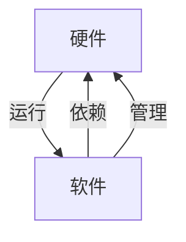

## 1.背景介绍

在信息化时代，IT基础设施是企业运营的重要支撑。从硬件设备到软件应用，这些基础资源的运行流程对企业的正常运营至关重要。而理解这些流程，则有助于我们更好地管理和优化资源，提高运营效率。

## 2.核心概念与联系

在讨论IT基础资源的运行流程之前，我们需要明确几个核心概念：

- 硬件：物理设备，如服务器、存储设备、网络设备等。
- 软件：运行在硬件上的程序，如操作系统、数据库、应用程序等。
- 运行流程：硬件和软件协同工作的过程，包括启动、运行、维护、关闭等步骤。

这三者之间的联系可以用下面的Mermaid流程图来表示：



## 3.核心算法原理具体操作步骤

硬件和软件的运行流程可以分解为以下几个步骤：

1. 硬件启动：包括电源开启、硬件自检、设备初始化等步骤。
2. 软件加载：操作系统启动，加载必要的驱动程序和服务。
3. 应用运行：加载和运行用户的应用程序。
4. 维护和优化：定期进行硬件和软件的维护和优化，保证其正常运行。
5. 关闭流程：当不需要运行时，按照一定的顺序关闭软件和硬件。

## 4.数学模型和公式详细讲解举例说明

在IT基础资源的运行流程中，我们可以运用一些数学模型和公式来描述和优化这个过程。例如，我们可以用排队论来描述和优化硬件资源的使用情况。

假设我们有一个服务器，其服务率为$\mu$，到达率为$\lambda$，那么其利用率$\rho$可以用下式表示：

$$\rho = \frac{\lambda}{\mu}$$

当$\rho$接近1时，表示服务器的利用率很高，可能需要增加硬件资源或优化软件来降低利用率。

## 5.项目实践：代码实例和详细解释说明

在实际项目中，我们可以通过脚本来自动化IT基础资源的运行流程。例如，我们可以编写一个Shell脚本来自动启动服务器和应用：

```bash
#!/bin/bash
# 启动服务器
echo "Starting server..."
/sbin/start server
# 启动应用
echo "Starting application..."
/usr/local/bin/app start
```

这个脚本首先启动服务器，然后启动应用。通过这种方式，我们可以简化IT基础资源的运行流程，提高运维效率。

## 6.实际应用场景

IT基础资源的运行流程广泛应用于各种场景，包括但不限于：

- 数据中心：大规模的服务器和存储设备需要精细的运行流程管理。
- 云计算：云服务提供商需要自动化和优化IT基础资源的运行流程，以提供稳定和高效的服务。
- 企业IT：企业需要管理和优化自己的IT基础资源，以支持业务的正常运行。

## 7.工具和资源推荐

以下是一些有助于理解和优化IT基础资源运行流程的工具和资源：

- 《操作系统概念》：这本书详细介绍了操作系统的基本概念和原理，对理解软件的运行流程非常有帮助。
- 《计算机网络》：这本书详细介绍了计算机网络的基本概念和原理，对理解网络设备的运行流程非常有帮助。
- Ansible：这是一个开源的自动化运维工具，可以自动化管理IT基础资源的运行流程。

## 8.总结：未来发展趋势与挑战

随着技术的发展，IT基础资源的运行流程将面临新的挑战和机遇。一方面，新的硬件和软件技术将使运行流程更加复杂；另一方面，自动化和智能化的技术将使运行流程更加高效。因此，我们需要不断学习和研究，以适应这些变化。

## 9.附录：常见问题与解答

1. 问：如何优化IT基础资源的运行流程？
答：优化IT基础资源的运行流程需要从硬件和软件两方面入手。硬件方面，可以通过增加资源、优化配置等方式；软件方面，可以通过优化代码、减少冗余等方式。

2. 问：如何自动化IT基础资源的运行流程？
答：自动化IT基础资源的运行流程可以通过编写脚本、使用自动化运维工具等方式实现。

3. 问：如何学习IT基础资源的运行流程？
答：学习IT基础资源的运行流程可以通过阅读相关书籍、参加培训、实践操作等方式。

作者：禅与计算机程序设计艺术 / Zen and the Art of Computer Programming