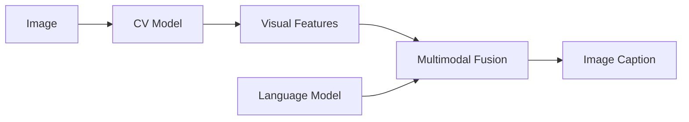
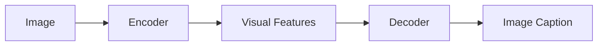

# Image Captioning原理与代码实例讲解

## 1. 背景介绍

在当今的数字时代,图像数据已经无处不在。随着社交媒体、在线购物和其他互联网服务的兴起,图像数据的数量正以前所未有的速度增长。然而,这些图像数据对于机器来说是无法理解的,因为它们是以像素的形式存储的。为了充分利用这些图像数据,我们需要一种方法来自动生成图像的文本描述,这就是图像字幕生成(Image Captioning)技术的用武之地。

图像字幕生成是计算机视觉和自然语言处理领域的一个交叉点,旨在自动生成对给定图像内容的自然语言描述。它可以应用于多个领域,例如辅助视障人士理解图像内容、自动标注图像以改善图像检索效率、为社交媒体图像生成有意义的描述等。

### 1.1 图像字幕生成的挑战

尽管图像字幕生成技术有着广阔的应用前景,但它也面临着一些挑战:

- **视觉理解**:准确识别和理解图像中的对象、场景和上下文关系是一个巨大的挑战。
- **语言生成**:根据视觉理解的结果生成流畅、准确和相关的自然语言描述也是一个艰巨的任务。
- **多模态融合**:有效地将视觉信息和语言信息融合在一起是图像字幕生成系统的关键。
- **数据集规模**:训练高质量的图像字幕生成模型需要大量的带描述的图像数据集,而手工标注这些数据集是一项昂贵且耗时的工作。

### 1.2 发展历程

早期的图像字幕生成系统主要基于规则和模板,它们使用计算机视觉技术检测图像中的对象,然后根据预定义的规则和模板生成描述。这些系统的性能受到了严重限制,因为它们无法很好地捕捉图像的语义信息和上下文关系。

近年来,benefiting from the rapid development of deep learning技术,基于深度神经网络的图像字幕生成模型取得了巨大的进展,显著提高了字幕质量。这些模型通常采用编码器-解码器架构,将图像信息和语言信息融合在一起,端到端地生成图像描述。

## 2. 核心概念与联系

图像字幕生成系统通常由两个关键组件组成:计算机视觉模型(CV Model)和自然语言处理模型(NLP Model)。这两个模型需要紧密协作,才能生成高质量的图像描述。

### 2.1 计算机视觉模型

计算机视觉模型负责从输入图像中提取视觉特征,例如对象、场景、属性和上下文关系等。常用的计算机视觉模型包括:

- **卷积神经网络(CNN)**: 如VGGNet、ResNet等,擅长从图像中提取低级和高级视觉特征。
- **区域卷积神经网络(R-CNN)**: 如Faster R-CNN、Mask R-CNN等,能够检测和定位图像中的对象。
- **视觉变换器(ViT)**: 基于自注意力机制的视觉模型,能够捕捉长程依赖关系。

这些模型通常在大型图像数据集(如ImageNet、COCO等)上预训练,然后在图像字幕生成任务上进行微调。

### 2.2 自然语言处理模型

自然语言处理模型负责根据视觉特征生成自然语言描述。常用的自然语言处理模型包括:

- **长短期记忆网络(LSTM)**: 一种循环神经网络,擅长处理序列数据,如自然语言。
- **变压器(Transformer)**: 基于自注意力机制的序列到序列模型,在机器翻译、文本生成等任务中表现出色。
- **BERT**: 一种预训练的变压器模型,能够捕捉上下文语义信息,在多种自然语言处理任务中表现优异。

这些模型通常在大型文本语料库上预训练,然后在图像字幕生成任务上进行微调。

### 2.3 多模态融合

图像字幕生成系统需要将视觉特征和语言特征有效地融合在一起。常用的多模态融合方法包括:

- **早期融合**: 将视觉特征和语言特征在较早的阶段进行拼接或级联,然后输入到后续的模型中。
- **晚期融合**: 分别对视觉特征和语言特征进行编码,然后在较晚的阶段进行融合。
- **注意力融合**: 使用注意力机制动态地融合视觉特征和语言特征,赋予不同的特征不同的权重。

## 3. 核心算法原理具体操作步骤

### 3.1 编码器-解码器架构

编码器-解码器架构是图像字幕生成系统中最常用的架构之一。它将整个系统分为两个部分:编码器和解码器。

**编码器**负责从输入图像中提取视觉特征,通常使用卷积神经网络或视觉变换器等计算机视觉模型。编码器的输出是一个固定长度的向量,表示图像的视觉特征。

**解码器**则负责根据编码器提供的视觉特征生成自然语言描述,通常使用循环神经网络或变压器等自然语言处理模型。解码器的输入是编码器的输出和前一个时间步的单词,输出是当前时间步的单词概率分布。

在训练阶段,编码器和解码器共同优化一个端到端的目标函数,例如最大化生成的描述与真实描述之间的相似度。在推理阶段,编码器首先从输入图像中提取视觉特征,然后解码器基于这些特征生成图像描述,通常使用束搜索或贪婪搜索等解码策略。

### 3.2 注意力机制

注意力机制是图像字幕生成系统中一种常用的技术,它允许模型动态地关注输入的不同部分,并根据上下文信息赋予不同的权重。在图像字幕生成任务中,注意力机制可以应用于以下几个方面:

1. **视觉注意力**: 在编码器中,使用注意力机制关注图像的不同区域,捕捉与生成描述相关的视觉信息。
2. **语言注意力**: 在解码器中,使用注意力机制关注已生成的单词序列,捕捉上下文语义信息。
3. **多模态注意力**: 在编码器和解码器之间,使用注意力机制融合视觉特征和语言特征,动态地分配不同模态的权重。

注意力机制的计算过程通常包括三个步骤:

1. **计算注意力分数**: 对于每个查询向量(query)和键向量(key)的对,计算它们之间的相似度分数,例如使用点积或缩放点积。
2. **归一化注意力分数**: 使用 Softmax 函数对注意力分数进行归一化,得到注意力权重。
3. **加权求和**: 使用注意力权重对值向量(value)进行加权求和,得到注意力输出。

通过注意力机制,模型可以动态地关注输入的不同部分,提高模型的表现力和解释性。

### 3.3 预训练与微调

为了提高图像字幕生成模型的性能,通常会采用预训练与微调的策略。预训练是在大型数据集上训练模型的初始参数,而微调则是在特定任务上进一步优化这些参数。

对于计算机视觉模型,通常会在ImageNet等大型图像数据集上进行预训练,学习通用的视觉特征表示。然后,在图像字幕生成任务上对这些模型进行微调,使其能够更好地捕捉与生成描述相关的视觉信息。

对于自然语言处理模型,通常会在大型文本语料库上进行预训练,学习通用的语言表示。例如,BERT等预训练语言模型就是在大量无监督文本数据上训练的。然后,在图像字幕生成任务上对这些模型进行微调,使其能够更好地生成与图像相关的自然语言描述。

预训练与微调的策略可以显著提高模型的性能,因为它利用了大量的无监督数据来初始化模型参数,并在特定任务上进行了进一步的优化。这种策略在计算机视觉、自然语言处理和多模态任务中都得到了广泛的应用。

## 4. 数学模型和公式详细讲解举例说明

### 4.1 编码器-解码器模型

编码器-解码器模型是图像字幕生成系统中最常用的架构之一。它将整个系统分为两个部分:编码器和解码器。编码器负责从输入图像中提取视觉特征,而解码器则根据这些特征生成自然语言描述。

在数学上,编码器-解码器模型可以表示为:

$$p(y|x) = \prod_{t=1}^{T} p(y_t|y_{<t}, c)$$

其中:

- $x$ 表示输入图像
- $y = (y_1, y_2, ..., y_T)$ 表示目标描述序列
- $c$ 表示编码器提取的视觉特征
- $p(y_t|y_{<t}, c)$ 表示在给定之前的单词 $y_{<t}$ 和视觉特征 $c$ 的条件下,生成当前单词 $y_t$ 的条件概率

编码器的目标是学习一个映射函数 $f_{enc}$,将输入图像 $x$ 映射到一个固定长度的视觉特征向量 $c$:

$$c = f_{enc}(x)$$

解码器的目标是学习一个条件概率模型 $f_{dec}$,根据视觉特征 $c$ 和之前生成的单词序列 $y_{<t}$ 预测当前单词 $y_t$:

$$p(y_t|y_{<t}, c) = f_{dec}(y_{<t}, c)$$

在训练阶段,编码器和解码器共同优化一个端到端的目标函数,例如最大化生成的描述与真实描述之间的相似度。在推理阶段,编码器首先从输入图像中提取视觉特征,然后解码器基于这些特征生成图像描述。

### 4.2 注意力机制

注意力机制是图像字幕生成系统中一种常用的技术,它允许模型动态地关注输入的不同部分,并根据上下文信息赋予不同的权重。

在数学上,注意力机制可以表示为:

$$\text{Attention}(Q, K, V) = \text{softmax}\left(\frac{QK^T}{\sqrt{d_k}}\right)V$$

其中:

- $Q$ 表示查询向量(query)
- $K$ 表示键向量(key)
- $V$ 表示值向量(value)
- $d_k$ 表示缩放因子,用于防止内积过大导致梯度消失或爆炸

注意力机制的计算过程包括三个步骤:

1. **计算注意力分数**: 对于每个查询向量 $q \in Q$ 和键向量 $k \in K$ 的对,计算它们之间的相似度分数 $e_{ij} = q_i^Tk_j$。
2. **归一化注意力分数**: 使用 Softmax 函数对注意力分数进行归一化,得到注意力权重 $\alpha_{ij} = \text{softmax}(e_{ij}) = \frac{\exp(e_{ij})}{\sum_k \exp(e_{ik})}$。
3. **加权求和**: 使用注意力权重对值向量进行加权求和,得到注意力输出 $o_i = \sum_j \alpha_{ij}v_j$。

通过注意力机制,模型可以动态地关注输入的不同部分,提高模型的表现力和解释性。在图像字幕生成任务中,注意力机制可以应用于视觉注意力、语言注意力和多模态注意力等多个方面。

### 4.3 交叉熵损失函数

在图像字幕生成系统的训练过程中,常用的损失函数是交叉熵损失函数。交叉熵损失函数用于测量模型预测的概率分布与真实标签之