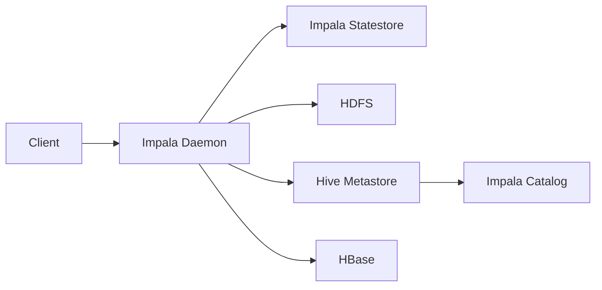

# Impala原理与代码实例讲解

## 1. 背景介绍

### 1.1 大数据查询引擎的发展历程
#### 1.1.1 传统关系型数据库的局限性
#### 1.1.2 Hadoop生态系统的兴起 
#### 1.1.3 交互式SQL查询引擎的需求

### 1.2 Impala的诞生
#### 1.2.1 Cloudera公司的创新
#### 1.2.2 Impala的设计理念
#### 1.2.3 Impala的发展历程

### 1.3 Impala在大数据领域的地位
#### 1.3.1 Impala与Hive、Spark SQL的对比
#### 1.3.2 Impala的优势与局限性
#### 1.3.3 Impala的应用现状

## 2. 核心概念与联系

### 2.1 Impala的架构设计
#### 2.1.1 Impala Daemon进程
#### 2.1.2 Impala Statestore进程
#### 2.1.3 Impala Catalog服务

### 2.2 查询处理流程
#### 2.2.1 查询解析与优化
#### 2.2.2 查询执行与调度
#### 2.2.3 结果返回与展示

### 2.3 数据存储与管理
#### 2.3.1 与HDFS的集成
#### 2.3.2 与Hive Metastore的集成
#### 2.3.3 与HBase的集成

### 2.4 内存管理与调优
#### 2.4.1 内存使用机制
#### 2.4.2 查询内存限制与预算
#### 2.4.3 Spill-to-disk机制



## 3. 核心算法原理具体操作步骤

### 3.1 查询执行计划生成
#### 3.1.1 语法解析与验证
#### 3.1.2 语义分析与查询重写
#### 3.1.3 查询优化与物理计划生成

### 3.2 查询执行引擎
#### 3.2.1 Volcano模型
#### 3.2.2 向量化执行
#### 3.2.3 代码生成技术

### 3.3 分布式查询调度
#### 3.3.1 查询分发与调度
#### 3.3.2 动态分区裁剪
#### 3.3.3 数据本地化优化

### 3.4 查询结果缓存
#### 3.4.1 结果集缓存机制
#### 3.4.2 缓存失效与更新策略
#### 3.4.3 缓存内存管理

## 4. 数学模型和公式详细讲解举例说明

### 4.1 基数估计模型
#### 4.1.1 直方图算法
$$ Selectivity(A\theta v)=\sum_{b\in B(A),b\theta v}\frac{|b|}{|A|} $$
#### 4.1.2 概率模型
$$ P(X=k)=\frac{1}{n}\sum_{i=1}^n I(x_i=k) $$
#### 4.1.3 抽样估计

### 4.2 代价估算模型  
#### 4.2.1 顺序扫描代价
$$ Cost_{TS}(R)=\frac{Pages(R)}{ScanRate} $$
#### 4.2.2 随机I/O代价
$$ Cost_{RIO}(R)=\frac{Tuples(R)}{TuplesPerPage}\times RandomPageCost $$
#### 4.2.3 CPU执行代价
$$ Cost_{CPU}(R)=Tuples(R)\times CostPerTuple $$

### 4.3 查询重写规则
#### 4.3.1 谓词下推 
$$ \sigma_{c1\wedge c2\wedge c3}(R)\Rightarrow\sigma_{c1}(\sigma_{c2}(\sigma_{c3}(R))) $$
#### 4.3.2 投影下推
$$ \prod_{a,b}(\sigma_{c}(R))\Rightarrow\prod_{a,b}(\sigma_{c}(\prod_{a,b,c}(R))) $$
#### 4.3.3 聚合下推
$$ \gamma_{a,sum(b)}(R\bowtie S)\Rightarrow\gamma_{a,sum(b)}(R)\bowtie S $$

## 5. 项目实践：代码实例和详细解释说明

### 5.1 Impala环境搭建
#### 5.1.1 前置条件与依赖安装
#### 5.1.2 Impala安装部署
#### 5.1.3 配置优化

### 5.2 创建Impala表
```sql
CREATE TABLE users (
  id INT,
  name STRING,
  age INT
) STORED AS PARQUET;
```
#### 5.2.1 内部表与外部表
#### 5.2.2 分区表
#### 5.2.3 Kudu表

### 5.3 数据导入
```sql
INSERT INTO users VALUES 
(1, 'Tom', 25),
(2, 'Jerry', 28),
(3, 'Alice', 31);  
```
#### 5.3.1 从HDFS导入
#### 5.3.2 从Hive表导入
#### 5.3.3 从HBase表导入

### 5.4 查询优化示例
```sql
SELECT u.name, o.amount 
FROM users u
JOIN orders o ON u.id = o.user_id
WHERE u.age > 30 AND o.status = 'PAID'
ORDER BY o.amount DESC
LIMIT 10;
```
#### 5.4.1 设置合适的文件格式
#### 5.4.2 使用分区裁剪
#### 5.4.3 利用索引
#### 5.4.4 调整查询参数

## 6. 实际应用场景

### 6.1 用户行为分析
#### 6.1.1 用户画像
#### 6.1.2 行为路径分析
#### 6.1.3 异常行为检测

### 6.2 海量日志分析
#### 6.2.1 PV/UV统计
#### 6.2.2 TopN统计
#### 6.2.3 异常日志挖掘

### 6.3 广告数据分析
#### 6.3.1 广告点击率预估
#### 6.3.2 广告收益统计
#### 6.3.3 广告投放优化

## 7. 工具和资源推荐

### 7.1 管理工具
#### 7.1.1 Cloudera Manager
#### 7.1.2 Apache Ambari 

### 7.2 开发工具
#### 7.2.1 Impala Shell
#### 7.2.2 Hue
#### 7.2.3 各语言客户端库

### 7.3 社区资源
#### 7.3.1 官方文档
#### 7.3.2 Cloudera社区
#### 7.3.3 Stack Overflow

## 8. 总结：未来发展趋势与挑战

### 8.1 Impala在OLAP领域的发展趋势
#### 8.1.1 与云平台的结合
#### 8.1.2 机器学习的支持
#### 8.1.3 实时数据处理能力提升

### 8.2 Impala面临的挑战
#### 8.2.1 性能优化难度加大
#### 8.2.2 资源隔离与管控
#### 8.2.3 数据安全与权限管理

### 8.3 Impala的未来展望
#### 8.3.1 融合OLTP与OLAP
#### 8.3.2 AI赋能的智能查询优化
#### 8.3.3 云原生架构重塑

## 9. 附录：常见问题与解答

### 9.1 Impala与Hive/SparkSQL的区别？
### 9.2 Impala的数据存储格式有哪些？
### 9.3 如何提高Impala的查询并发度？ 
### 9.4 Impala的查询是否支持事务？
### 9.5 Impala可以访问实时数据流吗？

作者：禅与计算机程序设计艺术 / Zen and the Art of Computer Programming