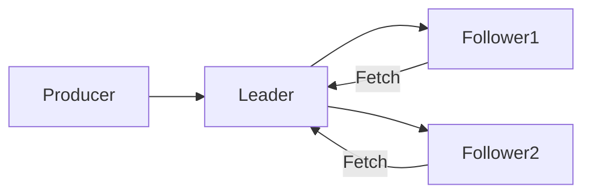

# Kafka Replication原理与代码实例讲解

## 1. 背景介绍
### 1.1 Kafka的应用场景
#### 1.1.1 消息队列
#### 1.1.2 实时数据处理
#### 1.1.3 日志收集

### 1.2 Kafka的基本概念
#### 1.2.1 消息
#### 1.2.2 主题(Topic)和分区(Partition)  
#### 1.2.3 生产者(Producer)和消费者(Consumer)
#### 1.2.4 Broker和集群

### 1.3 Kafka Replication的重要性
#### 1.3.1 提高可用性
#### 1.3.2 增强数据持久性
#### 1.3.3 负载均衡

## 2. 核心概念与联系
### 2.1 Replication的基本原理
#### 2.1.1 Leader和Follower
#### 2.1.2 In-Sync Replicas (ISR)
#### 2.1.3 Replication Factor

### 2.2 Replication的工作流程
#### 2.2.1 Producer写入数据
#### 2.2.2 Leader处理写请求
#### 2.2.3 Follower同步数据

### 2.3 Replication的一致性保证
#### 2.3.1 At-least-once delivery
#### 2.3.2 At-most-once delivery
#### 2.3.3 Exactly-once delivery

### 2.4 Replication的容错机制
#### 2.4.1 Leader选举
#### 2.4.2 Follower失效处理
#### 2.4.3 Broker失效处理

## 3. 核心算法原理具体操作步骤
### 3.1 Leader Election算法
#### 3.1.1 Controller的作用
#### 3.1.2 Leader Election的触发条件
#### 3.1.3 Leader Election的具体步骤

### 3.2 Follower Fetch算法
#### 3.2.1 Follower Fetch请求
#### 3.2.2 Leader处理Fetch请求
#### 3.3.3 Follower应用更新

### 3.3 Truncate算法
#### 3.3.1 Truncate的触发条件
#### 3.3.2 High Watermark的作用
#### 3.3.3 Truncate的具体步骤

## 4. 数学模型和公式详细讲解举例说明
### 4.1 Replication Factor的数学模型
#### 4.1.1 Replication Factor与可用性的关系
#### 4.1.2 Replication Factor与网络带宽的关系

### 4.2 ISR的数学模型 
#### 4.2.1 ISR的定义与作用
#### 4.2.2 ISR的大小与可用性的关系
#### 4.2.3 ISR的大小与一致性的关系

### 4.3 Exactly-once delivery的数学模型
#### 4.3.1 幂等性写入
#### 4.3.2 事务性写入
#### 4.3.3 端到端的Exactly-once语义

## 5. 项目实践：代码实例和详细解释说明
### 5.1 Kafka Producer的Replication相关配置
#### 5.1.1 acks参数
#### 5.1.2 max.in.flight.requests.per.connection参数
#### 5.1.3 retries参数

### 5.2 Kafka Consumer的Replication相关配置  
#### 5.2.1 isolation.level参数
#### 5.2.2 auto.offset.reset参数
#### 5.2.3 enable.auto.commit参数

### 5.3 Kafka Broker的Replication相关配置
#### 5.3.1 default.replication.factor参数
#### 5.3.2 min.insync.replicas参数
#### 5.3.3 unclean.leader.election.enable参数

### 5.4 Kafka Admin的Replication相关操作
#### 5.4.1 增加副本
#### 5.4.2 重新分配副本
#### 5.4.3 优先副本选举

## 6. 实际应用场景
### 6.1 金融领域的应用
#### 6.1.1 证券交易系统
#### 6.1.2 银行核心系统
#### 6.1.3 支付清算系统

### 6.2 电商领域的应用
#### 6.2.1 订单系统
#### 6.2.2 物流配送系统
#### 6.2.3 实时推荐系统

### 6.3 物联网领域的应用
#### 6.3.1 设备数据采集
#### 6.3.2 实时监控与告警
#### 6.3.3 设备控制与调度

## 7. 工具和资源推荐
### 7.1 Kafka官方文档
### 7.2 Kafka可视化管理工具
#### 7.2.1 Kafka Manager
#### 7.2.2 Kafka Tool
#### 7.2.3 Kafka Eagle
### 7.3 Kafka集群部署工具
#### 7.3.1 Ansible
#### 7.3.2 Docker
#### 7.3.3 Kubernetes

## 8. 总结：未来发展趋势与挑战
### 8.1 Kafka Replication的发展趋势
#### 8.1.1 多数据中心Replication
#### 8.1.2 Tiered Storage
#### 8.1.3 自适应Replication

### 8.2 Kafka Replication面临的挑战
#### 8.2.1 Replication的性能瓶颈
#### 8.2.2 Replication的一致性问题
#### 8.2.3 Replication的监控与运维

## 9. 附录：常见问题与解答
### 9.1 如何选择合适的Replication Factor？
### 9.2 如何处理Replication同步延迟问题？
### 9.3 如何应对Broker宕机导致的数据丢失？
### 9.4 如何实现跨机房的Kafka Replication？
### 9.5 如何监控Kafka Replication的健康状态？

Kafka Replication是Kafka实现高可用、高可靠的核心机制。它通过将每个分区的数据复制到多个Broker上，来保证即使部分Broker失效，数据也不会丢失。同时，Replication还能够提供负载均衡的能力，将读写请求分散到不同的Broker上处理。

Kafka Replication的基本原理是，每个分区都有一个Leader副本和多个Follower副本。所有的读写请求都由Leader处理，Follower通过从Leader拉取数据来与Leader保持同步。Kafka引入了In-Sync Replicas (ISR)的概念，只有处于ISR中的副本才有资格被选为Leader。Replication Factor则定义了每个分区的副本数量，通常设置为3或以上，以保证足够的容错能力。

下图展示了Kafka Replication的工作流程：



当Producer向Leader发送写请求时，Leader先将数据写入本地日志，然后等待ISR中的Follower同步完成。一旦ISR中的所有Follower都同步完成，Leader就向Producer发送ACK确认。Consumer只能从Leader读取数据，保证了数据的一致性。

Kafka Replication还提供了多种一致性保证的机制，包括At-least-once、At-most-once和Exactly-once。通过配置Producer的acks参数和Consumer的isolation.level参数，可以根据业务需求选择不同的一致性级别。

在Kafka的Replication实现中，有几个核心的算法：

1. Leader Election算法：当Leader失效时，从ISR中选举出新的Leader，保证分区的可用性。
2. Follower Fetch算法：Follower通过定期发送Fetch请求从Leader拉取数据，并将数据追加到本地日志中。
3. Truncate算法：当Follower与Leader的日志不一致时，Follower需要截断自己的日志，并从Leader同步缺失的数据。

下面是一个Kafka Producer配置Replication相关参数的示例：

```java
Properties props = new Properties();
props.put("bootstrap.servers", "localhost:9092");
props.put("acks", "all");
props.put("max.in.flight.requests.per.connection", 1);
props.put("retries", 3);

KafkaProducer<String, String> producer = new KafkaProducer<>(props);
```

其中，acks参数设置为"all"，表示Producer需要等待ISR中的所有副本都同步完成后才认为写入成功。max.in.flight.requests.per.connection参数设置为1，保证了Producer的顺序性。retries参数设置为3，允许Producer在发生临时错误时自动重试。

在Kafka的实际应用中，Replication发挥了至关重要的作用。例如在金融领域，Kafka常被用于证券交易、银行核心系统等对可靠性要求极高的场景。通过合理配置Replication Factor和ISR，可以最大限度地保证数据的安全性和可用性。

未来，Kafka Replication还将不断发展，支持多数据中心部署、Tiered Storage等新的特性。同时，如何突破Replication的性能瓶颈，提升Replication的效率，也是业界正在探索的重要课题。

总之，Kafka Replication是支撑Kafka成为高可靠、高性能分布式消息系统的核心机制。深入理解Kafka Replication的原理和实现，对于构建大规模数据处理平台至关重要。

作者：禅与计算机程序设计艺术 / Zen and the Art of Computer Programming