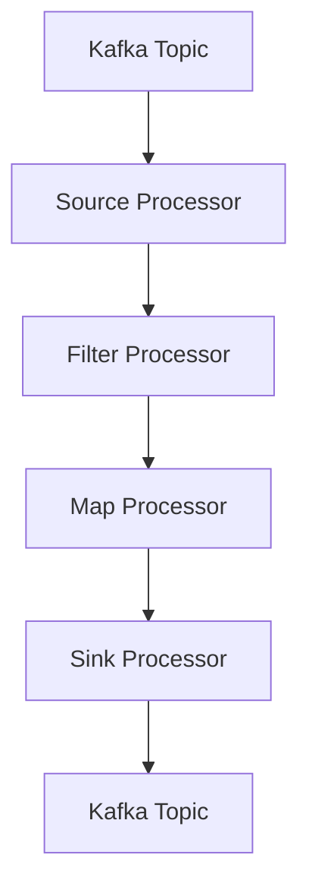

# Kafka Streams原理与代码实例讲解

## 1.背景介绍

在现代数据驱动的世界中，实时数据处理变得越来越重要。Kafka Streams作为Apache Kafka生态系统中的一个重要组件，提供了一种轻量级的、可扩展的流处理库。它允许开发者构建实时应用程序和微服务，以处理和分析流数据。Kafka Streams的设计目标是简化流处理的复杂性，同时提供高性能和容错能力。

## 2.核心概念与联系

### 2.1 Kafka Streams简介

Kafka Streams是一个客户端库，允许应用程序以流的方式处理和分析数据。它构建在Kafka之上，利用Kafka的分布式日志系统来提供高吞吐量和低延迟的数据处理能力。

### 2.2 核心概念

- **流（Stream）**：一个无界的数据序列，通常是从Kafka主题中读取的。
- **表（Table）**：一个有界的数据集合，通常表示某种状态。
- **拓扑（Topology）**：流处理逻辑的有向无环图（DAG），由多个流处理节点组成。
- **处理器（Processor）**：执行具体流处理操作的节点。
- **状态存储（State Store）**：用于存储流处理过程中产生的中间状态。

### 2.3 核心组件

- **KStream**：表示一个无界的流。
- **KTable**：表示一个有界的表。
- **GlobalKTable**：表示一个全局的表，适用于需要全局视图的场景。

### 2.4 核心联系

Kafka Streams通过将流和表的概念结合起来，提供了强大的数据处理能力。流可以转换为表，表也可以转换为流，这种灵活性使得Kafka Streams能够处理各种复杂的数据处理需求。

## 3.核心算法原理具体操作步骤

### 3.1 流处理拓扑

流处理拓扑是Kafka Streams应用程序的核心。它定义了数据从输入到输出的处理路径。一个简单的流处理拓扑可以包括以下步骤：

1. 从Kafka主题中读取数据流。
2. 对数据流进行过滤、转换、聚合等操作。
3. 将处理后的数据写回Kafka主题。

### 3.2 数据处理操作

Kafka Streams提供了丰富的数据处理操作，包括：

- **过滤（Filter）**：根据条件过滤数据。
- **映射（Map）**：将数据转换为另一种形式。
- **聚合（Aggregate）**：对数据进行聚合操作，如计数、求和等。
- **连接（Join）**：将两个流或表进行连接操作。

### 3.3 状态存储与容错

Kafka Streams通过状态存储来管理流处理过程中产生的中间状态。状态存储可以是内存中的，也可以是持久化到磁盘的。为了提供容错能力，Kafka Streams会定期将状态存储的快照写入Kafka主题，以便在故障恢复时重新加载。

### 3.4 流处理拓扑示例



## 4.数学模型和公式详细讲解举例说明

### 4.1 流处理的数学模型

流处理可以看作是对数据流的连续函数应用。假设有一个数据流 $S(t)$，表示在时间 $t$ 的数据。流处理操作可以表示为一个函数 $f$，将输入流 $S(t)$ 转换为输出流 $T(t)$：

$$
T(t) = f(S(t))
$$

### 4.2 过滤操作

过滤操作可以表示为一个布尔函数 $g$，只有当 $g(S(t))$ 为真时，数据才会被保留：

$$
T(t) = \{ S(t) \mid g(S(t)) = \text{true} \}
$$

### 4.3 映射操作

映射操作可以表示为一个转换函数 $h$，将输入数据 $S(t)$ 转换为输出数据 $T(t)$：

$$
T(t) = h(S(t))
$$

### 4.4 聚合操作

聚合操作可以表示为一个累积函数 $a$，将输入数据流 $S(t)$ 累积为一个聚合结果 $A(t)$：

$$
A(t) = \sum_{i=0}^{t} S(i)
$$

### 4.5 连接操作

连接操作可以表示为两个数据流 $S_1(t)$ 和 $S_2(t)$ 的连接函数 $j$：

$$
T(t) = j(S_1(t), S_2(t))
$$

## 5.项目实践：代码实例和详细解释说明

### 5.1 项目概述

我们将构建一个简单的Kafka Streams应用程序，从一个Kafka主题中读取数据，对数据进行处理，并将处理后的数据写回另一个Kafka主题。

### 5.2 环境准备

首先，确保你已经安装了Kafka和Kafka Streams库。你可以使用Maven或Gradle来管理依赖。

### 5.3 代码实例

以下是一个简单的Kafka Streams应用程序示例：

```java
import org.apache.kafka.common.serialization.Serdes;
import org.apache.kafka.streams.KafkaStreams;
import org.apache.kafka.streams.StreamsBuilder;
import org.apache.kafka.streams.StreamsConfig;
import org.apache.kafka.streams.kstream.KStream;

import java.util.Properties;

public class KafkaStreamsExample {
    public static void main(String[] args) {
        Properties props = new Properties();
        props.put(StreamsConfig.APPLICATION_ID_CONFIG, "streams-example");
        props.put(StreamsConfig.BOOTSTRAP_SERVERS_CONFIG, "localhost:9092");
        props.put(StreamsConfig.DEFAULT_KEY_SERDE_CLASS_CONFIG, Serdes.String().getClass());
        props.put(StreamsConfig.DEFAULT_VALUE_SERDE_CLASS_CONFIG, Serdes.String().getClass());

        StreamsBuilder builder = new StreamsBuilder();
        KStream<String, String> sourceStream = builder.stream("input-topic");

        KStream<String, String> filteredStream = sourceStream.filter((key, value) -> value.contains("important"));
        filteredStream.to("output-topic");

        KafkaStreams streams = new KafkaStreams(builder.build(), props);
        streams.start();

        Runtime.getRuntime().addShutdownHook(new Thread(streams::close));
    }
}
```

### 5.4 代码解释

1. **配置属性**：设置Kafka Streams应用程序的配置属性，包括应用程序ID、Kafka集群地址、默认的序列化和反序列化类。
2. **构建拓扑**：使用`StreamsBuilder`构建流处理拓扑，从`input-topic`读取数据流，对数据进行过滤操作，并将过滤后的数据写入`output-topic`。
3. **启动流处理**：创建`KafkaStreams`实例并启动流处理。

## 6.实际应用场景

### 6.1 实时数据分析

Kafka Streams可以用于实时数据分析，如监控系统日志、用户行为分析等。通过实时处理数据流，可以及时发现问题并采取相应措施。

### 6.2 实时推荐系统

在电商平台中，Kafka Streams可以用于构建实时推荐系统。通过分析用户的实时行为数据，生成个性化的推荐结果，提高用户体验和转化率。

### 6.3 实时数据清洗

Kafka Streams可以用于实时数据清洗，如过滤无效数据、格式转换等。通过实时清洗数据，可以提高数据质量，为后续的数据分析和处理提供可靠的数据基础。

## 7.工具和资源推荐

### 7.1 开发工具

- **IntelliJ IDEA**：一款强大的Java开发工具，支持Kafka Streams开发。
- **Confluent Platform**：提供Kafka和Kafka Streams的完整生态系统，包含开发、测试和运维工具。

### 7.2 学习资源

- **Kafka Streams官方文档**：详细介绍了Kafka Streams的使用方法和最佳实践。
- **《Kafka Streams in Action》**：一本深入讲解Kafka Streams的书籍，适合中高级开发者阅读。

## 8.总结：未来发展趋势与挑战

Kafka Streams作为一种强大的流处理工具，已经在许多领域得到了广泛应用。未来，随着数据量的不断增长和实时处理需求的增加，Kafka Streams将面临更多的挑战和机遇。如何进一步提高性能、扩展性和容错能力，将是未来发展的重要方向。

## 9.附录：常见问题与解答

### 9.1 Kafka Streams与其他流处理框架的区别

Kafka Streams与其他流处理框架（如Apache Flink、Apache Spark Streaming）相比，具有以下特点：

- **轻量级**：Kafka Streams是一个轻量级的库，不需要独立的集群，易于部署和管理。
- **紧密集成**：Kafka Streams与Kafka紧密集成，利用Kafka的分布式日志系统提供高性能和容错能力。
- **易用性**：Kafka Streams提供了简单易用的API，降低了流处理的复杂性。

### 9.2 如何处理Kafka Streams中的状态存储

Kafka Streams中的状态存储可以是内存中的，也可以是持久化到磁盘的。为了提供容错能力，Kafka Streams会定期将状态存储的快照写入Kafka主题，以便在故障恢复时重新加载。

### 9.3 如何优化Kafka Streams的性能

优化Kafka Streams性能的方法包括：

- **调整配置参数**：如增加线程数、调整缓存大小等。
- **优化数据处理逻辑**：如减少不必要的操作、使用高效的算法等。
- **监控和调优**：通过监控Kafka Streams的运行状态，及时发现和解决性能瓶颈。

---

作者：禅与计算机程序设计艺术 / Zen and the Art of Computer Programming