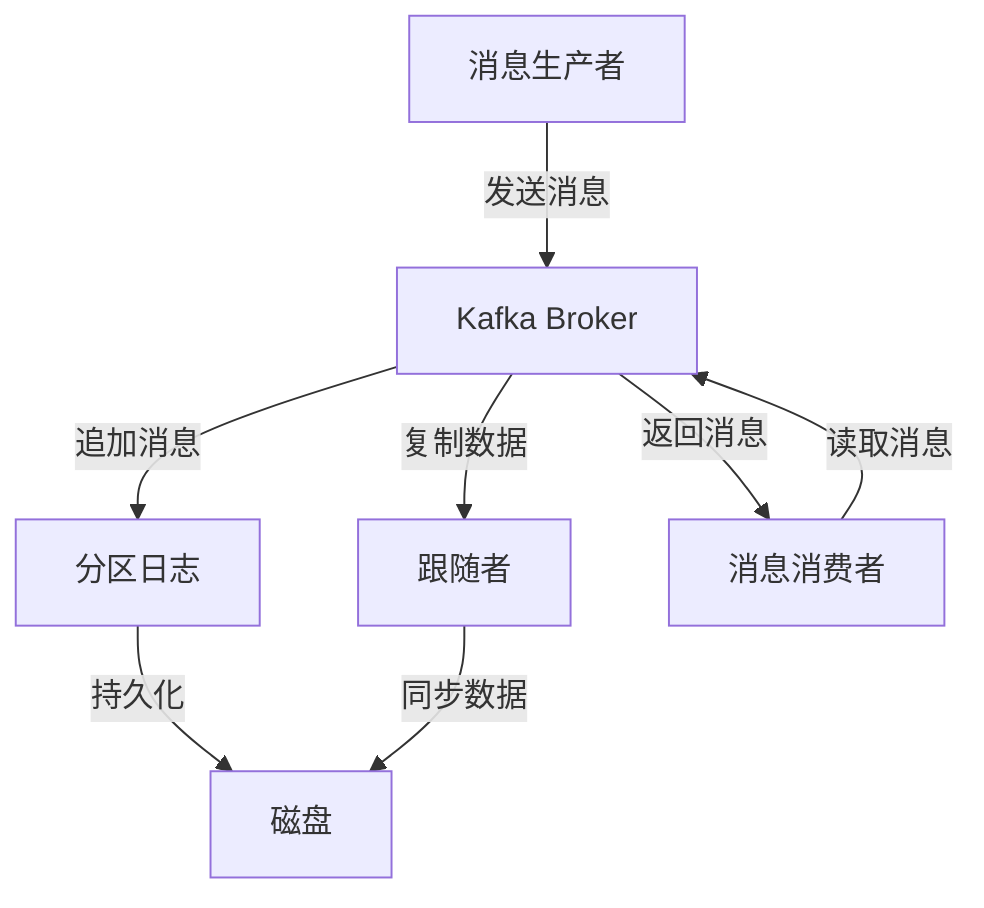

# Kafka Topic原理与代码实例讲解

## 1.背景介绍

Apache Kafka 是一个分布式流处理平台，最初由 LinkedIn 开发，并于 2011 年开源。Kafka 主要用于构建实时数据管道和流应用程序。它能够处理高吞吐量的消息流，并且具有高可用性和容错性。Kafka 的核心概念之一是 Topic，它是消息的逻辑分类单元。理解 Kafka Topic 的原理和实现对于有效使用 Kafka 至关重要。

## 2.核心概念与联系

### 2.1 Kafka Topic

Kafka Topic 是消息的逻辑分类单元。每个 Topic 可以看作是一个消息队列，生产者将消息发送到 Topic，消费者从 Topic 中读取消息。Topic 是分区的，每个分区是一个有序的、不可变的消息序列。

### 2.2 分区（Partition）

分区是 Kafka 中的基本并行单元。每个 Topic 可以有多个分区，分区内的消息是有序的，但分区之间的消息是无序的。分区的存在使得 Kafka 能够水平扩展，增加吞吐量。

### 2.3 副本（Replica）

为了保证高可用性，Kafka 中的每个分区都有多个副本。一个分区的所有副本组成一个副本集，其中一个副本被选为领导者（Leader），其余的副本为跟随者（Follower）。所有的读写操作都由领导者处理，跟随者从领导者复制数据。

### 2.4 消费者组（Consumer Group）

消费者组是 Kafka 中的一个重要概念。一个消费者组中的多个消费者可以共同消费一个 Topic 的消息，每个分区的消息只能被一个消费者消费。这样可以实现负载均衡和高效的消息处理。

## 3.核心算法原理具体操作步骤

### 3.1 消息生产

消息生产者将消息发送到 Kafka 的某个 Topic。生产者可以指定消息的分区，也可以由 Kafka 根据分区策略自动分配分区。消息被追加到分区的末尾，并被持久化到磁盘。

### 3.2 消息消费

消费者从 Kafka 的某个 Topic 中读取消息。消费者可以指定从哪个分区读取消息，也可以由 Kafka 根据负载均衡策略自动分配分区。消费者读取消息后，Kafka 会记录消息的偏移量（Offset），以便在故障恢复时能够继续消费。

### 3.3 数据复制

Kafka 使用一种称为“Leader-Follower”的复制机制。每个分区的领导者负责处理所有的读写请求，跟随者从领导者复制数据。Kafka 使用一种称为“ISR”（In-Sync Replica）的机制来跟踪与领导者保持同步的副本集。只有在 ISR 中的副本才被认为是可靠的。

### 3.4 数据持久化

Kafka 使用日志结构来存储消息。每个分区对应一个日志文件，消息被追加到日志文件的末尾。Kafka 使用零拷贝技术将消息从磁盘传输到网络，以提高性能。

### 3.5 数据清理

Kafka 使用两种策略来清理旧数据：基于时间的清理和基于大小的清理。用户可以配置保留时间或保留大小，超过保留时间或保留大小的消息将被删除。



## 4.数学模型和公式详细讲解举例说明

### 4.1 分区选择策略

假设一个 Topic 有 $P$ 个分区，生产者发送消息时可以指定分区，也可以由 Kafka 根据分区策略自动分配分区。常见的分区策略有轮询（Round-Robin）和哈希（Hashing）。

#### 轮询策略

轮询策略将消息均匀地分配到各个分区。假设当前分区索引为 $i$，总分区数为 $P$，则下一个分区索引为：

$$
i = (i + 1) \mod P
$$

#### 哈希策略

哈希策略根据消息的键（Key）计算哈希值，并将哈希值映射到分区。假设消息的键为 $k$，哈希函数为 $h$，总分区数为 $P$，则分区索引为：

$$
i = h(k) \mod P
$$

### 4.2 消费者偏移量

消费者读取消息时，Kafka 会记录消息的偏移量（Offset）。假设消费者读取到的最新消息偏移量为 $o$，则下一个消息的偏移量为：

$$
o = o + 1
$$

### 4.3 数据复制延迟

假设领导者的最新消息偏移量为 $l$，跟随者的最新消息偏移量为 $f$，则数据复制延迟为：

$$
\Delta = l - f
$$

## 5.项目实践：代码实例和详细解释说明

### 5.1 环境准备

首先，确保已经安装了 Kafka 和 Zookeeper。可以从 [Kafka 官方网站](https://kafka.apache.org/downloads) 下载并安装。

### 5.2 创建 Topic

使用 Kafka 提供的命令行工具创建一个 Topic：

```bash
bin/kafka-topics.sh --create --topic my-topic --bootstrap-server localhost:9092 --partitions 3 --replication-factor 2
```

### 5.3 生产者代码示例

使用 Kafka 提供的 Java API 实现一个简单的消息生产者：

```java
import org.apache.kafka.clients.producer.KafkaProducer;
import org.apache.kafka.clients.producer.ProducerRecord;
import java.util.Properties;

public class SimpleProducer {
    public static void main(String[] args) {
        Properties props = new Properties();
        props.put("bootstrap.servers", "localhost:9092");
        props.put("key.serializer", "org.apache.kafka.common.serialization.StringSerializer");
        props.put("value.serializer", "org.apache.kafka.common.serialization.StringSerializer");

        KafkaProducer<String, String> producer = new KafkaProducer<>(props);
        for (int i = 0; i < 10; i++) {
            producer.send(new ProducerRecord<>("my-topic", Integer.toString(i), "Message " + i));
        }
        producer.close();
    }
}
```

### 5.4 消费者代码示例

使用 Kafka 提供的 Java API 实现一个简单的消息消费者：

```java
import org.apache.kafka.clients.consumer.ConsumerRecord;
import org.apache.kafka.clients.consumer.ConsumerRecords;
import org.apache.kafka.clients.consumer.KafkaConsumer;
import java.util.Collections;
import java.util.Properties;

public class SimpleConsumer {
    public static void main(String[] args) {
        Properties props = new Properties();
        props.put("bootstrap.servers", "localhost:9092");
        props.put("group.id", "test-group");
        props.put("key.deserializer", "org.apache.kafka.common.serialization.StringDeserializer");
        props.put("value.deserializer", "org.apache.kafka.common.serialization.StringDeserializer");

        KafkaConsumer<String, String> consumer = new KafkaConsumer<>(props);
        consumer.subscribe(Collections.singletonList("my-topic"));

        while (true) {
            ConsumerRecords<String, String> records = consumer.poll(100);
            for (ConsumerRecord<String, String> record : records) {
                System.out.printf("offset = %d, key = %s, value = %s%n", record.offset(), record.key(), record.value());
            }
        }
    }
}
```

## 6.实际应用场景

### 6.1 日志收集

Kafka 常用于日志收集系统。应用程序将日志发送到 Kafka，日志处理系统从 Kafka 中读取日志并进行分析和存储。Kafka 的高吞吐量和持久化特性使其非常适合处理大量日志数据。

### 6.2 实时数据处理

Kafka 可以与流处理框架（如 Apache Flink 和 Apache Spark）集成，用于实时数据处理。数据流通过 Kafka 传输，流处理框架从 Kafka 中读取数据并进行实时计算和分析。

### 6.3 数据管道

Kafka 可以用作数据管道，将数据从一个系统传输到另一个系统。例如，可以将数据库的变更数据捕获（CDC）发送到 Kafka，再由 Kafka 传输到数据仓库或搜索引擎。

## 7.工具和资源推荐

### 7.1 Kafka 管理工具

- **Kafka Manager**：一个开源的 Kafka 集群管理工具，提供了集群监控、Topic 管理、消费者组管理等功能。
- **Confluent Control Center**：Confluent 提供的商业化 Kafka 管理工具，具有丰富的监控和管理功能。

### 7.2 Kafka 监控工具

- **Prometheus + Grafana**：Prometheus 是一个开源的监控系统，Grafana 是一个开源的可视化工具。可以使用 Prometheus 采集 Kafka 的指标数据，并使用 Grafana 进行可视化展示。
- **Burrow**：一个开源的 Kafka 消费者延迟监控工具，可以监控消费者组的延迟情况。

### 7.3 Kafka 资源

- **Kafka 官方文档**：Kafka 的官方文档提供了详细的使用指南和 API 参考。
- **Kafka: The Definitive Guide**：一本由 Kafka 开发者撰写的权威指南，详细介绍了 Kafka 的原理和使用方法。

## 8.总结：未来发展趋势与挑战

Kafka 作为一个高性能的分布式流处理平台，已经在许多领域得到了广泛应用。未来，随着数据量的不断增长和实时数据处理需求的增加，Kafka 的重要性将进一步提升。

### 8.1 发展趋势

- **云原生化**：随着云计算的普及，Kafka 的云原生化将成为一个重要趋势。云原生 Kafka 可以更好地利用云计算的弹性和高可用性。
- **流处理集成**：Kafka 与流处理框架的集成将更加紧密，提供更强大的实时数据处理能力。
- **安全性增强**：随着数据安全问题的日益突出，Kafka 的安全性将进一步增强，包括更强的认证和授权机制。

### 8.2 挑战

- **高可用性**：尽管 Kafka 已经具有较高的可用性，但在极端情况下（如网络分区）仍然可能出现问题。如何进一步提高 Kafka 的高可用性是一个重要挑战。
- **性能优化**：随着数据量的不断增长，如何进一步优化 Kafka 的性能以满足高吞吐量和低延迟的需求是一个重要挑战。
- **运维复杂性**：Kafka 的运维相对复杂，需要专业的运维团队。如何降低 Kafka 的运维复杂性，提高运维效率是一个重要挑战。

## 9.附录：常见问题与解答

### 9.1 Kafka 和传统消息队列的区别是什么？

Kafka 和传统消息队列（如 RabbitMQ 和 ActiveMQ）的主要区别在于 Kafka 设计用于高吞吐量和持久化存储。Kafka 使用分区和副本机制来实现高可用性和容错性，而传统消息队列通常侧重于消息的可靠传递和复杂的路由功能。

### 9.2 如何选择 Kafka 的分区数和副本数？

分区数和副本数的选择取决于具体的应用场景。一般来说，分区数越多，Kafka 的并行处理能力越强，但也会增加管理和维护的复杂性。副本数越多，Kafka 的高可用性越强，但也会增加存储和网络开销。通常建议分区数在 10-100 之间，副本数为 2 或 3。

### 9.3 如何处理 Kafka 的数据丢失问题？

Kafka 通过副本机制和 ISR 来保证数据的可靠性。为了进一步减少数据丢失的风险，可以配置生产者的 `acks` 参数为 `all`，确保消息被所有副本确认后才认为发送成功。同时，可以配置消费者的 `enable.auto.commit` 参数为 `false`，手动提交偏移量，确保消息被处理后才提交偏移量。

### 9.4 Kafka 的性能如何优化？

Kafka 的性能优化可以从以下几个方面入手：

- **硬件配置**：使用高性能的磁盘（如 SSD）和网络（如 10Gbps 网卡）。
- **参数调优**：调整 Kafka 的参数（如 `num.io.threads`、`num.network.threads`、`log.segment.bytes` 等）以提高性能。
- **批量处理**：生产者和消费者可以使用批量处理来提高吞吐量，减少网络开销。

### 9.5 Kafka 的监控和报警如何实现？

Kafka 的监控和报警可以使用 Prometheus 和 Grafana。Prometheus 采集 Kafka 的指标数据，Grafana 进行可视化展示和报警配置。可以监控的指标包括消息吞吐量、延迟、分区副本状态等。

---

作者：禅与计算机程序设计艺术 / Zen and the Art of Computer Programming