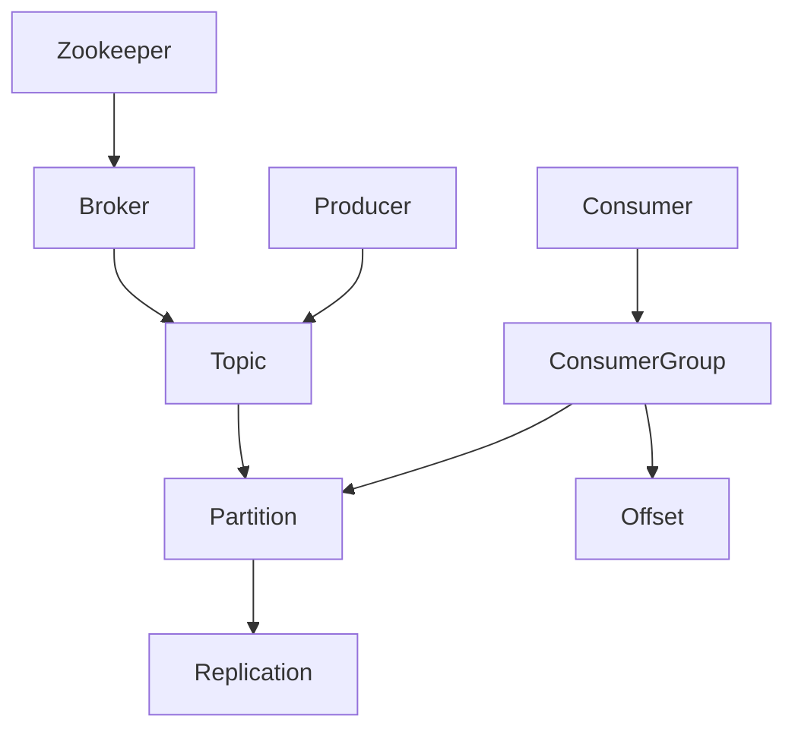

# Kafka原理与代码实例讲解

## 1.背景介绍

Apache Kafka是一个分布式流处理平台,它最初是由LinkedIn公司开发,后来捐献给了Apache软件基金会。Kafka被广泛用于构建实时数据管道和流应用程序,可以实现消息队列、跟踪日志、流处理等功能。它具有高吞吐量、低延迟、高可伸缩性、持久化、容错性等特点,已经成为大数据生态系统中不可或缺的一部分。

### 1.1 Kafka的设计目标

Kafka的设计目标主要包括以下几个方面:

1. **高吞吐量和低延迟**: Kafka能够以毫秒级的延迟处理数百万条消息。
2. **可靠性和容错性**: 通过复制和分区机制,Kafka能够保证数据的持久性和可靠性,即使部分节点出现故障也不会影响整体系统的运行。
3. **高可伸缩性**: Kafka可以轻松地扩展到数百台服务器,处理海量数据。
4. **分布式**: Kafka采用分布式架构,可以在多个节点之间分布数据和处理负载。
5. **实时处理**: Kafka支持实时数据处理,能够快速地将数据传输到其他系统进行下游处理。

### 1.2 Kafka的应用场景

Kafka的应用场景非常广泛,主要包括:

1. **消息队列**: Kafka可以作为一个高性能、可靠的消息队列系统,用于异步通信和解耦生产者和消费者。
2. **日志收集**: Kafka可以用于收集和存储大量的日志数据,如应用程序日志、服务器日志等。
3. **流处理**: Kafka可以用于构建实时流处理应用程序,如实时监控、实时分析等。
4. **事件源(Event Sourcing)**: Kafka可以作为事件存储,用于实现事件驱动架构。
5. **数据集成**: Kafka可以作为数据管道,将数据从各种来源传输到不同的目的地,实现数据集成。

## 2.核心概念与联系

### 2.1 核心概念

Kafka中有几个核心概念,理解这些概念对于掌握Kafka的原理非常重要。

1. **Topic(主题)**: Topic是Kafka中的一个逻辑概念,用于组织和存储消息。每个Topic由一个或多个Partition组成,每个Partition又由一系列有序的、不可变的消息组成。生产者向Topic发送消息,消费者从Topic订阅并消费消息。

2. **Partition(分区)**: Partition是Topic的一个物理分区,用于提高Kafka的并行度和容错性。每个Partition都有一个唯一的ID,并且在Kafka集群中的不同Broker上进行复制。消息在发送到Topic时会被均匀地分布到不同的Partition中。

3. **Broker**: Broker是Kafka集群中的一个节点,负责存储和处理消息。每个Broker可以处理多个Topic的多个Partition。Broker之间通过Zookeeper进行协调和管理。

4. **Producer(生产者)**: Producer是向Kafka发送消息的客户端应用程序。生产者可以选择将消息发送到特定的Topic和Partition中。

5. **Consumer(消费者)**: Consumer是从Kafka订阅并消费消息的客户端应用程序。消费者可以订阅一个或多个Topic,并从Topic的一个或多个Partition中消费消息。

6. **Consumer Group(消费者组)**: Consumer Group是一组消费者的逻辑概念,它们共享同一个消费进度。每个Consumer Group中的消费者只能消费Topic中特定Partition的消息,而不会重复消费其他消费者已经消费过的消息。

7. **Offset(偏移量)**: Offset是消息在Partition中的位置标识符。每个Partition中的消息都有一个连续的Offset值,用于标识消息在Partition中的位置。消费者通过维护Offset来跟踪消费进度。

8. **Replication(复制)**: Replication是Kafka中实现容错和高可用性的关键机制。每个Partition都会在多个Broker上进行复制,其中一个Broker作为Leader,其他Broker作为Follower。Leader负责读写操作,Follower只负责复制数据。如果Leader出现故障,其中一个Follower会被选举为新的Leader,从而保证系统的可用性。

9. **Zookeeper**: Zookeeper是Kafka集群中的协调者,负责管理和监控Broker、Topic、Partition等元数据信息。Kafka依赖Zookeeper来实现分布式协调和配置管理。

### 2.2 核心概念之间的关系

这些核心概念之间存在着密切的关系,它们共同构成了Kafka的整体架构和工作原理。

1. Topic由一个或多个Partition组成,每个Partition都会在多个Broker上进行复制。
2. Producer向Topic发送消息,消息会被均匀地分布到不同的Partition中。
3. Consumer从Topic订阅并消费消息,每个Consumer Group中的消费者只能消费特定Partition的消息。
4. Offset用于跟踪消费者在每个Partition中的消费进度。
5. Zookeeper负责管理和协调Broker、Topic、Partition等元数据信息,保证Kafka集群的正常运行。

这些概念之间的关系如下图所示:



## 3.核心算法原理具体操作步骤

### 3.1 生产者发送消息

当生产者向Kafka发送消息时,会经历以下步骤:

1. 生产者首先选择一个Topic,并根据配置的分区策略(如Round-Robin、Key哈希等)选择一个Partition。
2. 生产者向Leader Broker发送消息,Leader Broker会先将消息写入本地磁盘,然后返回一个OffsetMetadata给生产者,表示消息已经成功写入。
3. Leader Broker会将消息复制到所有的Follower Broker。
4. 当所有Follower Broker都成功复制了消息,Leader Broker会将消息标记为"committed"状态。

这个过程可以用以下伪代码表示:

```
send_message(topic, message):
    partition = choose_partition(topic)
    leader_broker = get_leader_broker(partition)
    offset = leader_broker.append_message(message)
    wait_for_replication(partition, offset)
    mark_message_committed(partition, offset)
    return offset
```

### 3.2 消费者消费消息

当消费者从Kafka消费消息时,会经历以下步骤:

1. 消费者向Zookeeper注册一个新的Consumer Group,并获取该Group在每个Partition上的当前Offset。
2. 消费者向Leader Broker发送FetchRequest请求,获取指定Partition从Offset开始的一批消息。
3. Leader Broker从本地磁盘读取消息,并返回给消费者。
4. 消费者处理消息,并将新的Offset提交给Kafka,表示已经成功消费了这些消息。

这个过程可以用以下伪代码表示:

```
consume_messages(topic, consumer_group):
    partitions = get_partitions(topic)
    offsets = get_offsets(consumer_group, partitions)
    messages = []
    for partition, offset in offsets.items():
        leader_broker = get_leader_broker(partition)
        batch = leader_broker.fetch_messages(partition, offset)
        messages.extend(batch)
        commit_offset(consumer_group, partition, offset + len(batch))
    return messages
```

### 3.3 复制和故障转移

Kafka通过复制和故障转移机制来保证数据的可靠性和高可用性。当Leader Broker出现故障时,会发生以下步骤:

1. Zookeeper检测到Leader Broker出现故障,并触发Leader选举过程。
2. Zookeeper从所有Follower Broker中选举一个新的Leader Broker,选举过程基于Follower Broker的复制进度。
3. Zookeeper将新的Leader Broker信息通知给所有的Producer和Consumer。
4. Producer和Consumer开始与新的Leader Broker进行通信,继续发送和消费消息。

这个过程可以用以下伪代码表示:

```
handle_leader_failure(partition):
    followers = get_followers(partition)
    new_leader = elect_new_leader(followers)
    update_metadata(partition, new_leader)
    notify_clients(partition, new_leader)
```

## 4.数学模型和公式详细讲解举例说明

在Kafka中,有一些数学模型和公式用于描述和优化系统的性能和可靠性。

### 4.1 分区策略

Kafka使用分区策略将消息均匀地分布到不同的Partition中,以提高并行度和吞吐量。常用的分区策略包括:

1. **Round-Robin策略**: 将消息按顺序均匀地分布到不同的Partition中。
2. **Key哈希策略**: 根据消息的Key计算哈希值,将具有相同Key的消息分配到同一个Partition中。

Key哈希策略可以用以下公式表示:

$$
Partition = hash(key) \% numPartitions
$$

其中,`hash(key)`是一个哈希函数,用于计算Key的哈希值,`numPartitions`是Topic中Partition的数量。

### 4.2 复制因子

Kafka使用复制因子(Replication Factor)来确定每个Partition应该在多少个Broker上进行复制。复制因子越高,数据的可靠性和容错性就越好,但同时也会增加存储和网络开销。

假设一个Topic有`N`个Partition,每个Partition复制`R`次,那么该Topic的总存储空间可以用以下公式表示:

$$
TotalStorage = N \times R \times PartitionSize
$$

其中,`PartitionSize`是每个Partition的大小。

### 4.3 吞吐量和延迟

Kafka的吞吐量和延迟受多个因素的影响,包括网络带宽、磁盘I/O性能、CPU性能等。在理想情况下,Kafka的吞吐量可以用以下公式近似表示:

$$
Throughput = min(NetworkBandwidth, DiskThroughput)
$$

延迟则主要取决于网络延迟、磁盘I/O延迟和消息队列长度。在理想情况下,Kafka的延迟可以用以下公式近似表示:

$$
Latency = NetworkLatency + DiskLatency + QueueingDelay
$$

其中,`QueueingDelay`是由于消息队列长度导致的延迟。

## 5.项目实践:代码实例和详细解释说明

在这一部分,我们将通过代码实例来展示如何使用Kafka进行消息的生产和消费。我们将使用Java语言和Kafka官方提供的客户端库。

### 5.1 创建Kafka环境

首先,我们需要创建一个Kafka环境,包括Zookeeper和Kafka Broker。可以使用Docker快速启动一个Kafka环境:

```bash
# 启动Zookeeper
docker run -d --name zookeeper -p 2181:2181 zookeeper

# 启动Kafka Broker
docker run -d --name kafka -p 9092:9092 \
    --link zookeeper:zookeeper \
    -e KAFKA_ZOOKEEPER_CONNECT=zookeeper:2181 \
    -e KAFKA_ADVERTISED_HOST_NAME=localhost \
    kafka
```

### 5.2 创建Topic

使用Kafka自带的命令行工具创建一个名为`my-topic`的Topic,该Topic包含3个Partition,每个Partition复制1次:

```bash
docker run --rm \
    --net=host \
    kafka \
    kafka-topics.sh --create \
        --topic my-topic \
        --bootstrap-server localhost:9092 \
        --partitions 3 \
        --replication-factor 1
```

### 5.3 生产者代码

下面是一个简单的Kafka生产者示例代码:

```java
import org.apache.kafka.clients.producer.KafkaProducer;
import org.apache.kafka.clients.producer.ProducerRecord;
import java.util.Properties;

public class KafkaProducer {
    public static void main(String[] args) {
        // 配置Kafka生产者属性
        Properties props = new Properties();
        props.put("bootstrap.servers", "localhost:9092");
        props.put("key.serializer", "org.apache.kafka.common.serialization.StringSerializer");
        props.put("value.serializer", "org.apache.kafka.common.serialization.StringSerializer");

        // 创建Kafka生产者实例
        org.apache.kafka.clients.producer.KafkaProducer<String, String> producer = new org.apache.kafka.clients.producer.KafkaProducer<>(props);

        // 发送消息
        for (int i = 0; i < 10; i++) {
            String message = "Message " + i;
            ProducerRecord<String, String> record = new ProducerRecord<>("my-topic", message);
            producer.send(record);
        }

        // 关闭生产者
        producer.close();
    }
}
```

这段代码首先配置了Kafka生产者的属性,包括`bootstrap.servers`(Kafka Broker地址)、`key.serializer`和`value.serializer`(序列化器)。然后,它创建了一个`KafkaProducer