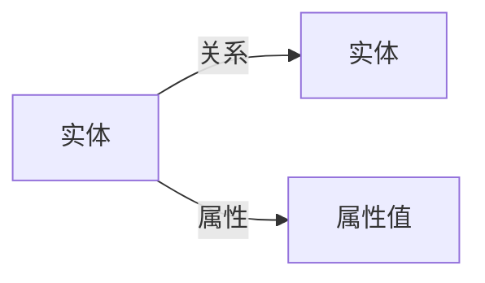
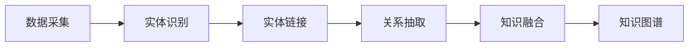

## 1.背景介绍

知识图谱(Knowledge Graphs)作为一种新兴的技术，近年来在众多领域都得到了广泛的应用。它的主要目标是将人类的知识以图谱的形式展现出来，使得计算机可以理解和处理这些知识。知识图谱的出现，使得我们可以通过计算机处理和分析大量的数据，从而得到有价值的信息和知识。

## 2.核心概念与联系

知识图谱的核心概念主要包括实体(Entity)、属性(Attribute)和关系(Relationship)。实体通常指的是现实世界中的对象，如人、地点、事件等。属性是描述实体的特性，如人的年龄、地点的位置等。而关系则是描述实体之间的联系，如人与地点之间的“位于”关系。



## 3.核心算法原理具体操作步骤

知识图谱的构建主要包括以下几个步骤：

1. 数据采集：这是构建知识图谱的第一步，需要从各种来源收集数据。这些数据可能来自于网络、数据库、文本等。

2. 实体识别：在收集到数据后，需要进行实体识别，将文本中的实体识别出来。

3. 实体链接：将识别出来的实体链接到已知的知识库中，这样就可以得到实体的更多信息。

4. 关系抽取：在实体链接的基础上，通过分析文本中的句子，抽取出实体之间的关系。

5. 知识融合：将抽取出来的知识进行融合，去除冗余和矛盾的知识，得到最终的知识图谱。



## 4.数学模型和公式详细讲解举例说明

在知识图谱的构建过程中，我们通常会使用一些数学模型和公式。例如，在实体识别中，我们可以使用条件随机场(CRF)模型。假设我们有一个句子，其中的每个词都对应一个标签，那么CRF模型可以表示为：

$$ P(y|x) = \frac{1}{Z(x)} \prod_{i=1}^{n} \psi_i(y_i-1, y_i, x, i) $$

其中，$y$是标签序列，$x$是输入的词序列，$Z(x)$是归一化因子，$\psi_i$是特征函数。

## 5.项目实践：代码实例和详细解释说明

在Python中，我们可以使用rdflib库来构建知识图谱。以下是一个简单的例子：

```python
from rdflib import Graph, Literal, BNode, Namespace, RDF, URIRef

g = Graph()

# 创建一个空的命名空间
n = Namespace("http://example.org/people/")

# 添加三元组
g.add((n.bob, RDF.type, n.Person))
g.add((n.bob, n.age, Literal(24)))

# 打印所有的三元组
for s, p, o in g:
    print(s, p, o)
```

## 6.实际应用场景

知识图谱在很多领域都有应用，例如：

- 搜索引擎：Google的知识图谱就是一个典型的例子，它可以提供更加丰富和准确的搜索结果。

- 推荐系统：通过分析用户的行为和兴趣，知识图谱可以提供更加个性化的推荐。

- 问答系统：知识图谱可以提供更加准确的答案，提高问答系统的效率。

## 7.工具和资源推荐

以下是一些构建知识图谱的工具和资源：

- 工具：rdflib、neo4j、OpenIE等。

- 资源：DBpedia、YAGO、Wikidata等。

## 8.总结：未来发展趋势与挑战

知识图谱作为一种新兴的技术，未来有着广阔的发展前景。然而，它也面临着一些挑战，如数据质量、知识融合、实时更新等。

## 9.附录：常见问题与解答

1. 什么是知识图谱？

知识图谱是一种以图谱形式表示知识的方法，它的主要目标是使计算机能理解和处理人类的知识。

2. 如何构建知识图谱？

构建知识图谱主要包括数据采集、实体识别、实体链接、关系抽取和知识融合等步骤。

3. 知识图谱有哪些应用？

知识图谱在搜索引擎、推荐系统、问答系统等领域都有应用。

作者：禅与计算机程序设计艺术 / Zen and the Art of Computer Programming
