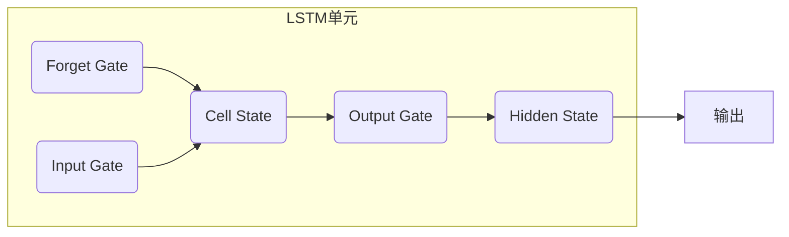

# LSTM的环境应用：保护地球的未来

## 1. 背景介绍

随着全球气候变化和环境污染问题日益严重,保护地球环境已经成为当务之急。人类活动对环境的影响是一个复杂的动态系统,需要采用先进的人工智能技术来预测和分析。长短期记忆(LSTM)神经网络作为一种强大的深度学习模型,在时间序列预测和建模方面表现出色,为环境保护提供了新的解决方案。

### 1.1 环境问题的严峻性

近年来,全球变暖、臭氧层破坏、生物多样性丧失等环境问题日益严重。这些问题不仅威胁着地球生态系统的平衡,也直接影响着人类的生存和发展。例如,极端天气事件的频发、空气和水污染、森林砍伐等,都对人类社会和自然环境造成了巨大的负面影响。

### 1.2 传统环境监测和预测的局限性

传统的环境监测和预测方法主要依赖于人工采集数据和建立统计模型。然而,这些方法存在以下局限性:

1. 数据采集成本高且覆盖范围有限
2. 统计模型无法很好地捕捉复杂的非线性关系
3. 难以及时预测和响应环境变化

因此,我们亟需采用更加智能化和自动化的方法来监测和预测环境变化,从而制定有效的环保策略。

### 1.3 LSTM在环境领域的应用前景

LSTM神经网络凭借其优异的时间序列建模能力,在环境领域展现出巨大的应用前景。它可以有效地捕捉环境数据中的长期依赖关系,并对未来的环境变化进行精准预测。同时,LSTM模型还能够处理多变量时间序列数据,综合考虑多种环境因素的影响。

LSTM在环境领域的应用包括但不限于:

- 气候变化预测
- 空气质量监测和预报
- 水资源管理
- 生态系统动态建模
- 自然灾害预警

通过利用LSTM技术,我们可以更好地了解和预测环境变化,从而制定出科学的环保政策和管理措施,为保护地球的未来贡献力量。

## 2. 核心概念与联系

### 2.1 LSTM神经网络

长短期记忆(LSTM)神经网络是一种特殊的循环神经网络(RNN),专门设计用于处理序列数据。与传统的RNN相比,LSTM引入了一种称为"门控机制"的结构,使其能够更好地捕捉长期依赖关系,避免了梯度消失或爆炸的问题。

LSTM的核心组件包括:

- 遗忘门(Forget Gate)
- 输入门(Input Gate)
- 输出门(Output Gate)
- 细胞状态(Cell State)

这些门控机制通过选择性地记住或遗忘信息,有效地控制了信息在时间步骤之间的流动。细胞状态则充当了一条"信息高速公路",允许信息在较长的时间序列中传播,从而捕捉长期依赖关系。

### 2.2 环境时间序列数据

环境数据通常呈现出明显的时间序列特征,例如气温、降水量、空气质量指数等随时间变化。这些数据往往存在以下特点:

- 周期性和季节性模式
- 长期趋势和短期波动
- 多变量相互影响

传统的统计模型很难有效地捕捉这些复杂的时间序列模式,而LSTM神经网络则具备这一优势。

### 2.3 LSTM与环境数据的契合

LSTM神经网络与环境时间序列数据有着天然的契合关系:

1. **长期依赖关系建模**:LSTM能够捕捉环境数据中的长期趋势和周期性模式,例如气候变化、季节性变化等。

2. **多变量处理能力**:LSTM可以同时处理多个环境变量的时间序列数据,并学习它们之间的相互影响关系。

3. **非线性关系建模**:LSTM具有强大的非线性建模能力,可以捕捉环境系统中复杂的非线性动态。

4. **序列预测**:LSTM擅长对时间序列数据进行预测,可以用于预测未来的环境变化趋势。

因此,LSTM神经网络为环境数据的分析和预测提供了一种高效的解决方案,有助于更好地理解和保护地球环境。

## 3. 核心算法原理具体操作步骤 

LSTM神经网络的核心算法原理包括以下几个关键步骤:

### 3.1 门控机制

LSTM通过门控机制来控制信息的流动,包括遗忘门、输入门和输出门。这些门控机制使用sigmoid激活函数,输出值介于0和1之间,决定了信息被保留或遗忘的程度。

1. **遗忘门**

遗忘门决定了上一时间步的细胞状态中有多少信息需要被遗忘或保留。它根据当前输入 $x_t$ 和上一隐藏状态 $h_{t-1}$ 计算一个介于0和1之间的权重向量 $f_t$:

$$f_t = \sigma(W_f \cdot [h_{t-1}, x_t] + b_f)$$

其中 $W_f$ 和 $b_f$ 分别是遗忘门的权重矩阵和偏置向量, $\sigma$ 是sigmoid激活函数。

2. **输入门**

输入门决定了当前时间步的新信息有多少需要被更新到细胞状态中。它包括两部分:一个sigmoid层决定更新的程度,另一个tanh层创建一个新的候选值向量。

$$i_t = \sigma(W_i \cdot [h_{t-1}, x_t] + b_i)$$
$$\tilde{C}_t = \tanh(W_C \cdot [h_{t-1}, x_t] + b_C)$$

其中 $i_t$ 是更新门的输出, $\tilde{C}_t$ 是新的候选值向量。

3. **更新细胞状态**

细胞状态 $C_t$ 通过将遗忘门的输出与上一时间步的细胞状态 $C_{t-1}$ 相乘,然后加上输入门的输出与新的候选值向量的乘积,从而实现对细胞状态的更新:

$$C_t = f_t \odot C_{t-1} + i_t \odot \tilde{C}_t$$

其中 $\odot$ 表示元素wise乘积运算。

4. **输出门**

输出门决定了细胞状态中有多少信息需要被输出到当前时间步的隐藏状态 $h_t$ 中。它首先通过sigmoid门控制细胞状态的输出程度,然后通过tanh函数对细胞状态进行处理,得到最终的隐藏状态输出:

$$o_t = \sigma(W_o \cdot [h_{t-1}, x_t] + b_o)$$
$$h_t = o_t \odot \tanh(C_t)$$

通过上述门控机制,LSTM能够有效地控制信息在时间步骤之间的流动,捕捉长期依赖关系。

### 3.2 前向传播

在LSTM的前向传播过程中,每个时间步骤的输出都依赖于当前输入和上一时间步的隐藏状态。具体步骤如下:

1. 初始化细胞状态 $C_0$ 和隐藏状态 $h_0$,通常将它们初始化为全0向量。

2. 对于每个时间步 $t$,执行以下操作:
   - 计算遗忘门 $f_t$、输入门 $i_t$、输出门 $o_t$ 和候选值向量 $\tilde{C}_t$。
   - 更新细胞状态 $C_t$。
   - 计算隐藏状态 $h_t$。

3. 重复步骤2,直到处理完整个序列。

4. 对于序列预测任务,可以使用最后一个隐藏状态 $h_T$ 或所有隐藏状态的组合作为输出。

### 3.3 反向传播

LSTM的反向传播过程与标准的反向传播算法类似,但需要考虑门控机制和细胞状态的影响。具体步骤如下:

1. 计算输出层的损失函数,例如对于序列预测任务,可以使用均方误差损失函数。

2. 计算隐藏状态 $h_T$ 相对于损失函数的梯度。

3. 从最后一个时间步 $T$ 开始,反向传播梯度到每个时间步的门控机制和细胞状态。

4. 更新LSTM的权重和偏置参数,通常使用优化算法如Adam或RMSProp。

5. 重复步骤2-4,直到模型收敛或达到最大迭代次数。

通过上述算法步骤,LSTM神经网络可以有效地学习时间序列数据中的长期依赖关系,并对未来的环境变化进行精准预测。

## 4. 数学模型和公式详细讲解举例说明

LSTM神经网络的数学模型涉及到多个门控机制和细胞状态的更新,下面我们将详细讲解相关公式及其含义。

### 4.1 遗忘门

遗忘门决定了上一时间步的细胞状态中有多少信息需要被遗忘或保留。它的公式如下:

$$f_t = \sigma(W_f \cdot [h_{t-1}, x_t] + b_f)$$

其中:

- $f_t$ 是遗忘门的输出,是一个介于0和1之间的向量。
- $W_f$ 是遗忘门的权重矩阵。
- $h_{t-1}$ 是上一时间步的隐藏状态。
- $x_t$ 是当前时间步的输入。
- $b_f$ 是遗忘门的偏置向量。
- $\sigma$ 是sigmoid激活函数,将输入值映射到0和1之间。

当 $f_t$ 接近0时,表示遗忘上一时间步的细胞状态;当 $f_t$ 接近1时,表示保留上一时间步的细胞状态。通过学习合适的权重矩阵 $W_f$ 和偏置向量 $b_f$,LSTM可以自动决定遗忘或保留哪些信息。

### 4.2 输入门和候选值向量

输入门决定了当前时间步的新信息有多少需要被更新到细胞状态中。它包括两部分:一个sigmoid层决定更新的程度,另一个tanh层创建一个新的候选值向量。公式如下:

$$i_t = \sigma(W_i \cdot [h_{t-1}, x_t] + b_i)$$
$$\tilde{C}_t = \tanh(W_C \cdot [h_{t-1}, x_t] + b_C)$$

其中:

- $i_t$ 是输入门的输出,决定了新信息被更新到细胞状态的程度。
- $W_i$ 和 $b_i$ 分别是输入门的权重矩阵和偏置向量。
- $\tilde{C}_t$ 是新的候选值向量,它包含了当前时间步的新信息。
- $W_C$ 和 $b_C$ 分别是候选值向量的权重矩阵和偏置向量。

通过学习合适的权重矩阵和偏置向量,LSTM可以自动决定保留或更新哪些信息到细胞状态中。

### 4.3 更新细胞状态

细胞状态 $C_t$ 通过将遗忘门的输出与上一时间步的细胞状态 $C_{t-1}$ 相乘,然后加上输入门的输出与新的候选值向量的乘积,从而实现对细胞状态的更新:

$$C_t = f_t \odot C_{t-1} + i_t \odot \tilde{C}_t$$

其中 $\odot$ 表示元素wise乘积运算。这一步骤可以理解为:

1. 使用遗忘门 $f_t$ 来决定保留上一时间步细胞状态 $C_{t-1}$ 中的哪些信息。
2. 使用输入门 $i_t$ 来决定将新的候选值向量 $\tilde{C}_t$ 中的哪些信息更新到当前细胞状态中。

通过