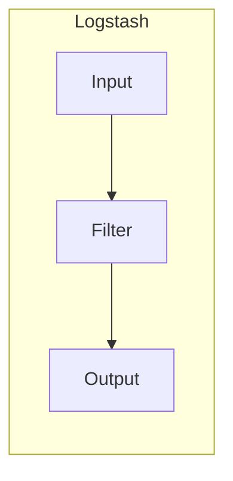
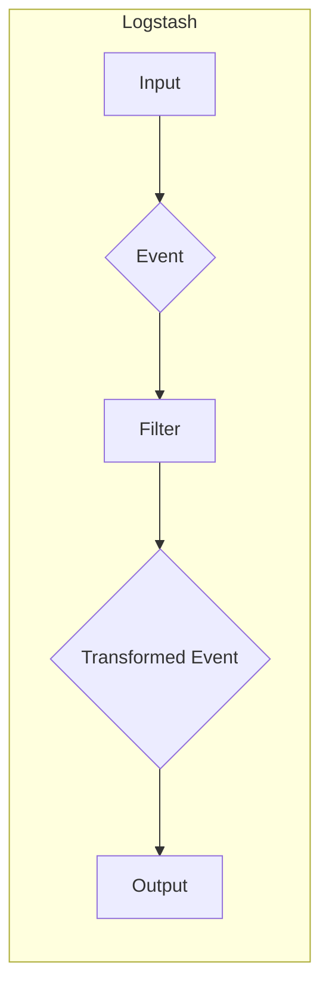
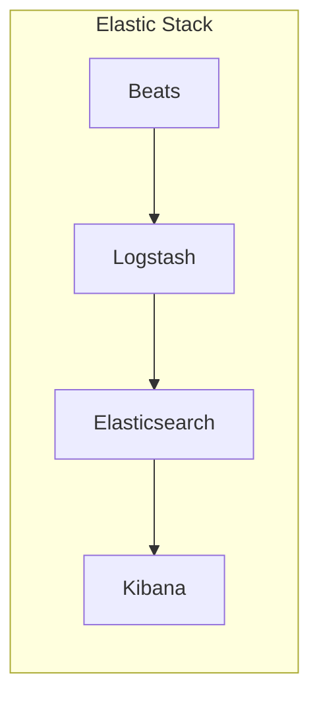
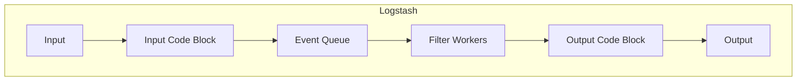

# Logstash原理与代码实例讲解

## 1. 背景介绍

在当今数据爆炸的时代,日志数据是一种非常重要的数据源。它不仅记录了系统运行时的各种信息,还能为故障排查、性能优化和业务分析提供宝贵的支持。然而,由于日志数据的多样性和庞大数量,如何高效地收集、传输、处理和存储日志数据成为了一个巨大的挑战。

Logstash就是一款强大的开源数据收集管道工具,它可以从各种来源动态地收集数据,并对数据进行过滤、转换和输出到指定的目的地。它是Elastic Stack(ELK)的一个重要组件,与Elasticsearch、Kibana等其他组件协同工作,构建了一个完整的日志管理和数据分析平台。

## 2. 核心概念与联系

### 2.1 Logstash架构

Logstash的核心架构由三个主要组件组成:输入(Input)、过滤器(Filter)和输出(Output)。



- **输入(Input)**: 从各种数据源(如文件、syslog、Redis等)收集数据。
- **过滤器(Filter)**: 对收集到的数据进行转换、过滤和丰富处理。
- **输出(Output)**: 将处理后的数据发送到指定的目的地,如Elasticsearch、文件、Kafka等。

### 2.2 Logstash事件处理流程

Logstash的工作流程如下:



1. 输入组件从数据源读取原始数据,生成一个事件(Event)对象。
2. 事件对象被传递给过滤器组件,经过一系列过滤器的处理,得到转换后的事件对象。
3. 转换后的事件对象被输出组件发送到指定的目的地。

### 2.3 Logstash与Elastic Stack的关系

Logstash是Elastic Stack的重要组成部分,与Elasticsearch、Kibana等其他组件协同工作,构建了一个完整的日志管理和数据分析平台。



- Logstash负责收集、过滤和传输数据到Elasticsearch。
- Elasticsearch负责存储和索引数据。
- Kibana提供了一个友好的Web界面,用于可视化和分析存储在Elasticsearch中的数据。
- Beats是一组轻量级的数据发送器,用于从边缘机器向Logstash或Elasticsearch发送数据。

## 3. 核心算法原理具体操作步骤

### 3.1 事件(Event)数据结构

在Logstash中,所有数据都被表示为事件(Event)对象。一个事件由以下几个部分组成:

- **数据(Data)**: 实际的数据负载,可以是任何形式的数据,如日志行、网络数据包等。
- **元数据(Metadata)**: 描述数据的元信息,如数据来源、时间戳等。
- **附加字段(Fields)**: 用户自定义的键值对,用于存储附加信息。

### 3.2 事件处理流程

Logstash的事件处理流程如下:



1. **输入(Input)**: 输入组件从数据源读取原始数据,并将其封装成事件对象,推送到输入代码块(Input Code Block)。
2. **输入代码块(Input Code Block)**: 输入代码块对事件进行初步处理,并将其推送到事件队列(Event Queue)。
3. **事件队列(Event Queue)**: 事件队列是一个内存缓冲区,用于临时存储待处理的事件。
4. **过滤器工作线程(Filter Workers)**: 过滤器工作线程从事件队列中取出事件,并依次应用配置的过滤器插件对事件进行处理。
5. **输出代码块(Output Code Block)**: 处理后的事件被推送到输出代码块,进行最后的处理。
6. **输出(Output)**: 输出组件将处理后的事件发送到指定的目的地。

### 3.3 过滤器(Filter)插件

过滤器插件是Logstash的核心组件之一,它们用于对事件进行各种转换和处理操作。Logstash提供了丰富的过滤器插件,包括但不限于:

- **Grok**: 使用正则表达式从非结构化数据中解析和结构化字段。
- **Mutate**: 对事件执行基本的转换操作,如重命名、删除、替换或修改字段。
- **Date**: 从字符串中解析出日期,并将其转换为Logstash时间戳格式。
- **Geoip**: 根据IP地址添加地理位置信息。
- **Ruby**: 使用Ruby代码对事件执行自定义操作。

### 3.4 插件开发

Logstash提供了一个插件开发框架,允许用户开发自定义的输入、过滤器和输出插件。插件使用Ruby语言编写,并遵循Logstash插件API规范。开发插件的基本步骤如下:

1. 创建插件项目目录结构。
2. 编写插件代码,实现插件的核心逻辑。
3. 编写插件规范文件,定义插件的配置选项和文档。
4. 构建和安装插件。
5. 在Logstash配置文件中使用插件。

## 4. 数学模型和公式详细讲解举例说明

在Logstash中,并没有直接使用复杂的数学模型或公式。但是,在某些特定场景下,可能需要使用一些简单的数学运算来处理事件数据。例如,在使用`ruby`过滤器插件时,可以使用Ruby语言的数学运算符和函数来执行计算。

此外,在处理日志数据时,可能需要对数值型字段进行一些统计分析,如计算平均值、中位数、标准差等。这些统计指标可以使用相应的数学公式来计算。

下面是一个使用Ruby过滤器插件对数值字段进行运算的示例:

```ruby
filter {
  ruby {
    code => "
      # 提取数值字段
      value = event.get('numeric_field')
      
      # 对数值进行平方运算
      squared_value = value ** 2
      
      # 将结果存储到新字段
      event.set('squared_field', squared_value)
    "
  }
}
```

在上面的示例中,我们首先从事件中提取出名为`numeric_field`的数值字段。然后,使用Ruby的幂运算符`**`对该数值进行平方计算,并将结果存储到一个新的字段`squared_field`中。

如果需要计算统计指标,可以使用Ruby的数学函数和第三方库,如`descriptive-statistics`。下面是一个计算平均值和标准差的示例:

```ruby
require 'descriptive-statistics'

filter {
  ruby {
    code => "
      # 收集所有数值
      values = []
      events.each do |event|
        value = event.get('numeric_field')
        values << value if value
      end
      
      # 计算平均值和标准差
      mean = values.mean
      stddev = values.standard_deviation
      
      # 将结果存储到新字段
      events.each do |event|
        event.set('mean_field', mean)
        event.set('stddev_field', stddev)
      end
    "
  }
}
```

在这个示例中,我们首先收集了所有事件中的`numeric_field`字段的数值。然后,使用`descriptive-statistics`库计算了这些数值的平均值和标准差。最后,将计算结果存储到每个事件的`mean_field`和`stddev_field`字段中。

需要注意的是,在实际应用中,应该根据具体需求选择合适的数学模型和公式,并结合Logstash的插件和Ruby代码来实现所需的功能。

## 5. 项目实践: 代码实例和详细解释说明

在本节中,我们将通过一个实际的示例项目来演示如何使用Logstash收集、处理和输出日志数据。

### 5.1 示例项目概述

我们将构建一个简单的日志处理管道,从一个本地文件中读取Apache访问日志,对日志进行解析和转换,并将处理后的数据输出到Elasticsearch。

### 5.2 环境准备

1. 安装Logstash和Elasticsearch。
2. 准备一个Apache访问日志文件,例如`access.log`。

### 5.3 Logstash配置文件

创建一个名为`logstash.conf`的配置文件,内容如下:

```ruby
# 输入插件
input {
  file {
    path => "/path/to/access.log"
    start_position => "beginning"
  }
}

# 过滤器插件
filter {
  grok {
    match => { "message" => "%{COMBINEDAPACHELOG}" }
  }
  date {
    match => [ "timestamp" , "dd/MMM/yyyy:HH:mm:ss Z" ]
  }
  geoip {
    source => "clientip"
  }
}

# 输出插件
output {
  elasticsearch {
    hosts => ["http://localhost:9200"]
    index => "apache-logs-%{+YYYY.MM.dd}"
  }
}
```

配置文件分为三个部分:

1. **输入(Input)**: 使用`file`输入插件从本地文件`/path/to/access.log`读取Apache访问日志。
2. **过滤器(Filter)**: 
   - 使用`grok`插件根据Apache日志格式从`message`字段中解析出各个字段,如`clientip`、`verb`、`response`等。
   - 使用`date`插件从`timestamp`字段中解析出日期时间,并将其转换为Logstash时间戳格式。
   - 使用`geoip`插件根据`clientip`字段添加地理位置信息,如`geoip.country_name`、`geoip.city_name`等。

3. **输出(Output)**: 使用`elasticsearch`输出插件将处理后的数据发送到Elasticsearch。索引名称为`apache-logs-%{+YYYY.MM.dd}`格式,表示每天创建一个新的索引。

### 5.4 运行Logstash

在终端中执行以下命令运行Logstash:

```
bin/logstash -f logstash.conf
```

Logstash将开始从文件中读取日志数据,并按照配置文件中的过滤器插件对数据进行处理,最终将处理后的数据输出到Elasticsearch。

### 5.5 查看结果

打开Kibana,创建一个新的索引模式,匹配`apache-logs-*`索引。你应该能够看到从Apache访问日志中解析出的各个字段,如`clientip`、`verb`、`response`、`geoip.country_name`等。

你还可以使用Kibana的可视化功能创建各种图表和仪表板,对日志数据进行分析和监控。

## 6. 实际应用场景

Logstash作为一款强大的数据收集管道工具,在各种场景下都有广泛的应用。以下是一些常见的应用场景:

1. **日志管理**: Logstash可以高效地收集来自不同来源的日志数据,如应用程序日志、系统日志、网络设备日志等。通过对日志数据进行解析、转换和丰富,可以为日志分析、故障排查和安全监控提供有价值的支持。

2. **数据集成**: Logstash可以从各种数据源(如数据库、消息队列、API等)收集数据,并将其转换为统一的格式,方便进一步处理和分析。这使得Logstash成为构建数据管道和集成不同系统的理想工具。

3. **安全监控**: Logstash可以用于收集和处理各种安全相关的日志和事件数据,如防火墙日志、入侵检测系统日志、Web应用程序日志等。通过对这些数据进行实时监控和分析,可以及时发现和响应安全威胁。

4. **物联网(IoT)数据处理**: 在物联网领域,Logstash可以收集来自各种传感器和设备的数据,并对这些数据进行预处理和转换,为后续的数据分析和可视化奠定基础。

5. **Web分析**: Logstash可以收集Web服务器日志、JavaScript错误日志等,并对这些数据进行处理和分析,帮助了解用户行为、优化网站性能和改进用户体验。

6. **业务智能(BI)**: Logstash可以作为数据管道的一部分,从各种来源收集