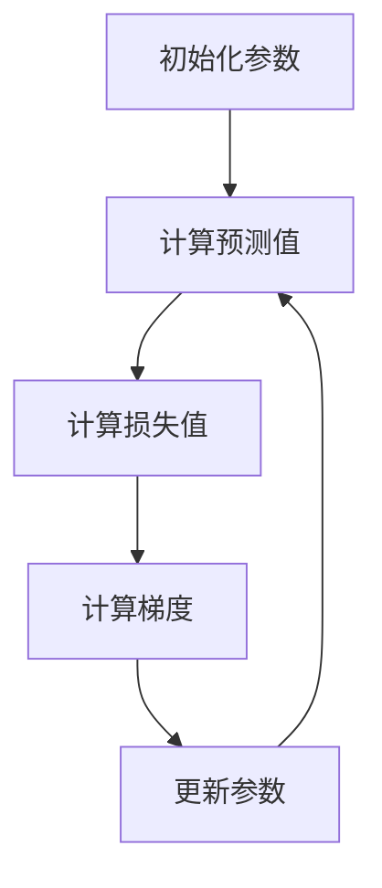

# Loss Functions 原理与代码实战案例讲解

## 1.背景介绍

在机器学习和深度学习领域，损失函数（Loss Function）是模型训练过程中至关重要的组成部分。它们用于衡量模型预测值与真实值之间的差异，从而指导模型参数的优化。无论是回归问题、分类问题还是其他复杂任务，选择合适的损失函数都直接影响模型的性能和收敛速度。

## 2.核心概念与联系

### 2.1 损失函数的定义

损失函数是一个函数，输入是模型的预测值和真实值，输出是一个非负实数，表示预测值与真实值之间的差异。常见的损失函数包括均方误差（MSE）、交叉熵损失（Cross-Entropy Loss）等。

### 2.2 损失函数与优化算法的关系

损失函数的输出值用于优化算法（如梯度下降）来更新模型参数。优化算法通过最小化损失函数的值来提高模型的预测准确性。

### 2.3 损失函数与模型性能的关系

损失函数的选择直接影响模型的性能。不同的任务需要不同的损失函数。例如，回归问题通常使用均方误差，而分类问题则常用交叉熵损失。

## 3.核心算法原理具体操作步骤

### 3.1 损失函数的计算

损失函数的计算通常包括以下步骤：

1. **预测值计算**：使用当前模型参数计算预测值。
2. **损失值计算**：将预测值和真实值输入损失函数，计算损失值。
3. **梯度计算**：计算损失函数对模型参数的梯度。
4. **参数更新**：使用优化算法更新模型参数。

### 3.2 梯度下降算法

梯度下降算法是最常用的优化算法之一，其基本步骤如下：

1. **初始化参数**：随机初始化模型参数。
2. **计算梯度**：计算损失函数对模型参数的梯度。
3. **更新参数**：使用梯度更新模型参数。
4. **迭代**：重复上述步骤，直到损失函数收敛。



## 4.数学模型和公式详细讲解举例说明

### 4.1 均方误差（MSE）

均方误差是回归问题中常用的损失函数，其公式为：

$$
MSE = \frac{1}{n} \sum_{i=1}^{n} (y_i - \hat{y}_i)^2
$$

其中，$y_i$ 是真实值，$\hat{y}_i$ 是预测值，$n$ 是样本数量。

### 4.2 交叉熵损失（Cross-Entropy Loss）

交叉熵损失是分类问题中常用的损失函数，其公式为：

$$
L = -\sum_{i=1}^{n} y_i \log(\hat{y}_i)
$$

其中，$y_i$ 是真实标签，$\hat{y}_i$ 是预测概率。

### 4.3 示例：线性回归中的MSE

假设我们有一个简单的线性回归模型，其预测值为：

$$
\hat{y} = wx + b
$$

则MSE的梯度计算为：

$$
\frac{\partial MSE}{\partial w} = \frac{2}{n} \sum_{i=1}^{n} (wx_i + b - y_i)x_i
$$

$$
\frac{\partial MSE}{\partial b} = \frac{2}{n} \sum_{i=1}^{n} (wx_i + b - y_i)
$$

## 5.项目实践：代码实例和详细解释说明

### 5.1 线性回归的实现

以下是一个使用Python和NumPy实现线性回归的示例：

```python
import numpy as np

# 生成数据
np.random.seed(0)
X = 2 * np.random.rand(100, 1)
y = 4 + 3 * X + np.random.randn(100, 1)

# 初始化参数
w = np.random.randn(1)
b = np.random.randn(1)
learning_rate = 0.01
n_iterations = 1000

# 梯度下降
for iteration in range(n_iterations):
    y_pred = w * X + b
    loss = (1 / len(X)) * np.sum((y_pred - y) ** 2)
    gradient_w = (2 / len(X)) * np.sum((y_pred - y) * X)
    gradient_b = (2 / len(X)) * np.sum(y_pred - y)
    w -= learning_rate * gradient_w
    b -= learning_rate * gradient_b

print(f"w: {w}, b: {b}")
```

### 5.2 交叉熵损失的实现

以下是一个使用Python和TensorFlow实现交叉熵损失的示例：

```python
import tensorflow as tf

# 生成数据
X = np.random.rand(100, 10)
y = np.random.randint(0, 2, size=(100, 1))

# 构建模型
model = tf.keras.Sequential([
    tf.keras.layers.Dense(10, activation='relu'),
    tf.keras.layers.Dense(1, activation='sigmoid')
])

# 编译模型
model.compile(optimizer='adam', loss='binary_crossentropy', metrics=['accuracy'])

# 训练模型
model.fit(X, y, epochs=10)
```

## 6.实际应用场景

### 6.1 回归问题

在回归问题中，常用的损失函数包括均方误差（MSE）、均方根误差（RMSE）等。这些损失函数用于衡量模型预测值与真实值之间的差异。

### 6.2 分类问题

在分类问题中，常用的损失函数包括交叉熵损失（Cross-Entropy Loss）、Hinge Loss等。这些损失函数用于衡量模型预测概率与真实标签之间的差异。

### 6.3 生成对抗网络（GAN）

在生成对抗网络中，损失函数用于衡量生成器和判别器的性能。常用的损失函数包括对抗性损失（Adversarial Loss）等。

## 7.工具和资源推荐

### 7.1 工具

- **TensorFlow**：一个开源的机器学习框架，支持多种损失函数的实现。
- **PyTorch**：另一个流行的开源机器学习框架，提供了丰富的损失函数库。
- **Scikit-Learn**：一个简单易用的机器学习库，适合初学者使用。

### 7.2 资源

- **《深度学习》**：由Ian Goodfellow等人编写的经典教材，详细介绍了各种损失函数及其应用。
- **Coursera和Udacity的在线课程**：提供了丰富的机器学习和深度学习课程，涵盖了损失函数的基本概念和高级应用。

## 8.总结：未来发展趋势与挑战

损失函数在机器学习和深度学习中扮演着重要角色。随着技术的发展，新的损失函数不断被提出，以解决特定问题或提高模型性能。例如，混合损失函数（Hybrid Loss）结合了多种损失函数的优点，适用于复杂任务。然而，选择合适的损失函数仍然是一个挑战，需要根据具体任务和数据特点进行调整。

## 9.附录：常见问题与解答

### 9.1 如何选择合适的损失函数？

选择损失函数时，需要考虑任务类型（回归或分类）、数据特点和模型性能。可以通过实验比较不同损失函数的效果，选择最优方案。

### 9.2 为什么我的模型训练过程中损失函数不收敛？

可能的原因包括学习率设置不当、模型复杂度不足或过拟合、数据质量问题等。可以通过调整学习率、增加模型复杂度或进行数据预处理来解决。

### 9.3 是否可以自定义损失函数？

是的，许多机器学习框架（如TensorFlow和PyTorch）支持自定义损失函数。可以根据具体需求编写自定义损失函数，以解决特定问题。

---

作者：禅与计算机程序设计艺术 / Zen and the Art of Computer Programming