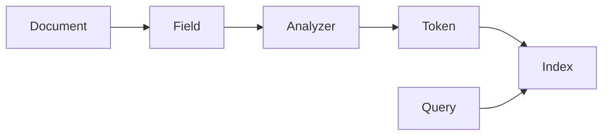

# Lucene社区资源：学习与交流平台

## 1. 背景介绍
### 1.1 Lucene简介
#### 1.1.1 Lucene的定义与特点
Lucene是一个高性能、可扩展的全文搜索引擎库，由Apache软件基金会开发和维护。它提供了一组Java API，可以方便地将全文检索功能集成到应用程序中。Lucene的主要特点包括：

- 高性能：Lucene采用了倒排索引、压缩算法等技术，能够快速地对大规模文本数据进行索引和搜索。
- 可扩展性：Lucene的架构设计支持插件式扩展，可以方便地添加新的分析器、查询解析器等组件。
- 跨平台：Lucene是用Java编写的，可以运行在任何支持Java的平台上。
- 灵活性：Lucene提供了丰富的API和配置选项，可以根据具体需求进行定制和优化。

#### 1.1.2 Lucene的发展历程
Lucene最初由Doug Cutting于1999年开发，2001年成为Apache软件基金会的一个开源项目。经过多年的发展和完善，Lucene已经成为全文搜索领域的领先解决方案，被广泛应用于各种规模和领域的搜索引擎中。

### 1.2 Lucene社区概况
#### 1.2.1 社区组成与规模
Lucene社区由来自全球的开发者、用户和贡献者组成，包括个人和企业。社区规模不断扩大，目前在Apache软件基金会的邮件列表、问答平台和代码仓库中都有活跃的参与者。

#### 1.2.2 社区的重要性
Lucene社区在项目的发展和推广中发挥着关键作用。社区成员通过贡献代码、文档、测试用例等方式，不断完善和扩展Lucene的功能。同时，社区也为Lucene用户提供了交流、学习和获取支持的平台。

## 2. 核心概念与联系
### 2.1 文档(Document)
在Lucene中，文档是索引和搜索的基本单位。一个文档由多个字段(Field)组成，每个字段包含一段文本内容和相关的元数据。文档可以表示各种类型的数据，如网页、电子邮件、文本文件等。

### 2.2 字段(Field)
字段是文档的组成部分，用于存储文档的不同属性或内容。常见的字段类型包括：

- TextField：用于存储需要进行全文搜索的文本内容。
- StringField：用于存储不需要分词的字符串值，如ID、URL等。
- NumericField：用于存储数值类型的数据，如整数、浮点数等。

### 2.3 分析器(Analyzer)
分析器负责将文本内容转换为一系列的词元(Token)，以便建立倒排索引。Lucene提供了多种内置的分析器，如StandardAnalyzer、WhitespaceAnalyzer等，也支持自定义分析器以满足特定的分词需求。

### 2.4 索引(Index)
索引是Lucene用于存储和检索文档的数据结构。它基于倒排索引(Inverted Index)的原理，将词元与包含它们的文档建立映射关系。通过索引，Lucene可以快速地找到包含指定词元的文档。

### 2.5 查询(Query)
查询是用户向Lucene提交的搜索请求，用于描述所需的文档特征。Lucene支持多种查询类型，如TermQuery、PhraseQuery、BooleanQuery等，可以组合使用以实现复杂的搜索条件。

### 2.6 核心概念之间的关系


上图展示了Lucene核心概念之间的关系。文档由多个字段组成，字段的文本内容经过分析器处理生成词元，词元与文档的映射关系存储在索引中。用户通过查询来检索匹配的文档。

## 3. 核心算法原理具体操作步骤
### 3.1 倒排索引构建
#### 3.1.1 文档解析
1. 将原始文档解析为Lucene的Document对象。
2. 提取文档的各个字段，如标题、正文、作者等。
3. 为每个字段创建对应的Field对象，设置字段的属性，如是否分词、是否存储等。
4. 将Field对象添加到Document对象中。

#### 3.1.2 分词和词元化
1. 选择合适的分析器(Analyzer)对字段的文本内容进行分词。
2. 分析器将文本内容转换为一系列的词元(Token)。
3. 对词元进行规范化处理，如小写转换、停用词过滤、词干提取等。

#### 3.1.3 倒排索引生成
1. 遍历每个文档的词元，构建词元与文档ID的映射关系。
2. 将映射关系存储在倒排索引的数据结构中，通常使用倒排列表(Posting List)。
3. 对倒排列表进行压缩和优化，以减少存储空间和提高检索效率。

### 3.2 查询处理
#### 3.2.1 查询解析
1. 将用户输入的查询字符串解析为Lucene的Query对象。
2. 根据查询语法和查询类型，构建相应的Query子类，如TermQuery、PhraseQuery等。
3. 对查询进行优化，如查询重写、查询扩展等。

#### 3.2.2 查询执行
1. 根据Query对象，在倒排索引中查找匹配的文档。
2. 对匹配的文档进行评分，根据相关性算法计算每个文档的得分。
3. 将匹配的文档按照得分排序，返回给用户。

#### 3.2.3 结果高亮
1. 对查询结果中的文档进行高亮处理，突出显示匹配的关键词。
2. 使用高亮器(Highlighter)对文档的相关字段进行高亮标记。
3. 将高亮后的文档内容返回给用户。

## 4. 数学模型和公式详细讲解举例说明
### 4.1 向量空间模型(Vector Space Model)
Lucene使用向量空间模型来表示文档和查询，并计算它们之间的相似度。在该模型中，文档和查询都被表示为多维向量，每个维度对应一个词元，维度的值表示词元在文档或查询中的权重。

假设有一个包含$n$个词元的词汇表，一个文档$d$可以表示为$n$维向量：

$$
\vec{d} = (w_{1,d}, w_{2,d}, \dots, w_{n,d})
$$

其中，$w_{i,d}$表示词元$i$在文档$d$中的权重。

类似地，一个查询$q$也可以表示为$n$维向量：

$$
\vec{q} = (w_{1,q}, w_{2,q}, \dots, w_{n,q})
$$

文档$d$和查询$q$之间的相似度可以通过计算它们的向量夹角余弦值来衡量：

$$
\text{sim}(d,q) = \cos(\theta) = \frac{\vec{d} \cdot \vec{q}}{\|\vec{d}\| \|\vec{q}\|} = \frac{\sum_{i=1}^n w_{i,d} \times w_{i,q}}{\sqrt{\sum_{i=1}^n w_{i,d}^2} \times \sqrt{\sum_{i=1}^n w_{i,q}^2}}
$$

相似度的取值范围为$[0,1]$，值越大表示文档与查询的相关性越高。

### 4.2 TF-IDF权重计算
Lucene使用TF-IDF(Term Frequency-Inverse Document Frequency)模型来计算词元在文档中的权重。TF表示词元在文档中出现的频率，IDF表示词元在整个文档集合中的稀有程度。

对于词元$i$在文档$d$中的权重$w_{i,d}$，可以使用以下公式计算：

$$
w_{i,d} = \text{tf}_{i,d} \times \text{idf}_i
$$

其中，$\text{tf}_{i,d}$表示词元$i$在文档$d$中的频率，可以使用以下公式计算：

$$
\text{tf}_{i,d} = \frac{f_{i,d}}{\max_j f_{j,d}}
$$

$f_{i,d}$表示词元$i$在文档$d$中出现的次数，$\max_j f_{j,d}$表示文档$d$中出现次数最多的词元的频率。

$\text{idf}_i$表示词元$i$的逆文档频率，可以使用以下公式计算：

$$
\text{idf}_i = \log \frac{N}{n_i}
$$

$N$表示文档集合中的总文档数，$n_i$表示包含词元$i$的文档数。

通过TF-IDF权重计算，可以突出那些在特定文档中出现频率高，但在整个文档集合中出现频率较低的词元，从而提高文档与查询的匹配精度。

## 5. 项目实践：代码实例和详细解释说明
下面通过一个简单的示例来演示如何使用Lucene进行文档索引和搜索。

### 5.1 创建索引
```java
// 创建索引写入器配置
IndexWriterConfig config = new IndexWriterConfig(new StandardAnalyzer());
// 创建索引写入器
IndexWriter writer = new IndexWriter(FSDirectory.open(Paths.get("index_dir")), config);

// 创建文档对象
Document doc = new Document();
// 添加字段
doc.add(new TextField("title", "Lucene Tutorial", Field.Store.YES));
doc.add(new TextField("content", "This is a tutorial about Apache Lucene.", Field.Store.YES));
// 将文档写入索引
writer.addDocument(doc);

// 提交并关闭索引写入器
writer.close();
```

上述代码中，我们首先创建了一个`IndexWriterConfig`对象，指定使用`StandardAnalyzer`作为分析器。然后，创建一个`IndexWriter`对象，用于将文档写入索引。

接下来，我们创建一个`Document`对象，并添加两个`TextField`字段，分别表示文档的标题和内容。`Field.Store.YES`表示将字段的内容存储在索引中，以便在搜索结果中返回。

最后，我们将文档添加到索引写入器中，并提交并关闭写入器。

### 5.2 搜索索引
```java
// 创建索引读取器
IndexReader reader = DirectoryReader.open(FSDirectory.open(Paths.get("index_dir")));
// 创建索引搜索器
IndexSearcher searcher = new IndexSearcher(reader);

// 创建查询解析器
QueryParser parser = new QueryParser("content", new StandardAnalyzer());
// 解析查询字符串
Query query = parser.parse("Lucene");

// 执行搜索
TopDocs topDocs = searcher.search(query, 10);

// 处理搜索结果
for (ScoreDoc scoreDoc : topDocs.scoreDocs) {
    Document doc = searcher.doc(scoreDoc.doc);
    System.out.println("Title: " + doc.get("title"));
    System.out.println("Content: " + doc.get("content"));
}

// 关闭索引读取器
reader.close();
```

在搜索索引时，我们首先创建一个`IndexReader`对象，用于读取之前创建的索引。然后，创建一个`IndexSearcher`对象，用于执行搜索操作。

接下来，我们创建一个`QueryParser`对象，指定使用`StandardAnalyzer`作为分析器，并将查询字段设置为`"content"`。然后，使用`QueryParser`解析用户输入的查询字符串，生成一个`Query`对象。

最后，我们使用`IndexSearcher`的`search`方法执行查询，并指定返回前10个匹配的文档。对于每个匹配的文档，我们通过`IndexSearcher`的`doc`方法获取对应的`Document`对象，并打印出其中的`"title"`和`"content"`字段的值。

## 6. 实际应用场景
Lucene作为一个强大的全文搜索引擎库，在各种应用场景中得到广泛应用，包括：

### 6.1 网站搜索
Lucene可以为网站提供高效的全文搜索功能，让用户能够快速找到感兴趣的内容。许多知名网站，如Wikipedia、LinkedIn等，都使用Lucene作为其搜索引擎的核心组件。

### 6.2 企业内部搜索
在企业内部，Lucene可以用于搜索各种文档、邮件、知识库等资源，提高员工的工作效率。例如，IBM的内部搜索系统就是基于Lucene构建的。

### 6.3 电子商务搜索
电子商务网站可以使用Lucene为商品目录提供搜索功能，帮助用户快速找到所