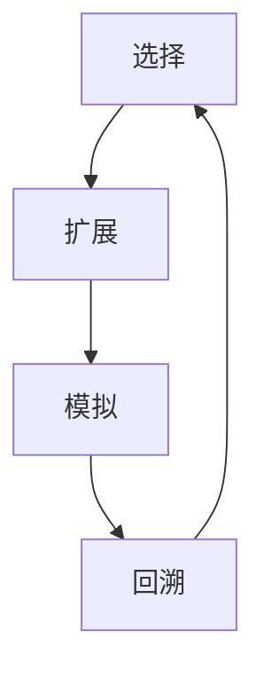

# MCTS解决车辆路由问题的思路

## 1. 背景介绍
### 1.1 车辆路由问题(VRP)概述
车辆路由问题(Vehicle Routing Problem, VRP)是一类经典的组合优化问题,在物流配送、运输调度等领域有广泛的应用。VRP的目标是设计一组车辆路线,以最小的成本(如距离、时间等)访问一组客户点并满足各种约束条件(如车辆容量、时间窗口等)。

### 1.2 VRP问题的复杂性
VRP是一个NP-hard问题,当问题规模较大时,很难在多项式时间内找到最优解。因此,启发式和近似算法在求解VRP问题时得到广泛应用。

### 1.3 蒙特卡洛树搜索(MCTS)算法概述  
蒙特卡洛树搜索(Monte Carlo Tree Search, MCTS)是一种启发式搜索算法,近年来在许多领域取得了优异的表现,如围棋、国际象棋等。MCTS通过大量的随机模拟来估计每个决策的长期收益,并不断更新搜索树来指导搜索方向。

## 2. 核心概念与联系
### 2.1 VRP问题建模
- 图模型:VRP可以表示为一个完全图$G=(V,E)$,其中$V$为节点集合,$E$为边集合。
- 决策变量:$x_{ij}^k \in \{0,1\}$表示车辆$k$是否从节点$i$到节点$j$。
- 目标函数:最小化总成本,如$\min \sum_{k \in K} \sum_{(i,j) \in E} c_{ij} x_{ij}^k$。
- 约束条件:如车辆容量限制、时间窗口约束、车辆数量限制等。

### 2.2 MCTS算法与VRP的结合
- 状态空间:每个VRP解对应MCTS树中的一个节点。
- 行动空间:在当前状态下,每个未服务的客户点都是一个可能的行动。
- 模拟:从当前节点开始,随机选择行动直到得到一个完整的VRP解。
- 回溯:根据模拟结果更新树节点的统计信息,如访问次数、平均成本等。

### 2.3 MCTS算法的四个步骤
- 选择:从根节点开始,基于UCB等策略选择最有潜力的子节点,直到达到叶节点。
- 扩展:如果叶节点不是终止状态,则创建一个或多个子节点。  
- 模拟:从新扩展的节点开始,随机选择行动直到得到一个完整的解。
- 回溯:将模拟结果回溯到根节点,更新沿途节点的统计信息。



## 3. 核心算法原理具体操作步骤
### 3.1 VRP问题的MCTS求解框架
1. 初始化根节点,表示空的解。
2. 重复执行以下步骤,直到达到预设的迭代次数或时间限制:
   a. 选择:从根节点开始选择最佳子节点,直到叶节点。
   b. 扩展:如果叶节点不完整,随机选择一个未服务的客户点作为新的子节点。
   c. 模拟:从新节点开始,随机选择行动直到得到完整解。 
   d. 回溯:更新路径上各节点的访问次数和平均成本。
3. 返回访问次数最多的子节点对应的解作为最终结果。

### 3.2 选择阶段的实现
- UCB1算法:平衡探索和利用,选择最大UCB值的子节点。

$$UCB1_i = \frac{w_i}{n_i} + C \sqrt{\frac{\ln N}{n_i}}$$

其中,$w_i$为节点$i$的累积成本,$n_i$为节点$i$的访问次数,$N$为父节点的访问次数,$C$为探索常数。

- 加权递归方法:考虑从根节点到当前节点的路径成本。

$$score_i = \frac{w_i}{n_i} + \frac{c_i}{L_i}$$

其中,$c_i$为从根节点到节点$i$的路径成本,$L_i$为路径长度。

### 3.3 扩展阶段的实现
- 随机扩展:从未服务的客户点中随机选择一个作为新的子节点。
- 启发式扩展:根据某种启发式规则(如最近插入、最远插入等)选择客户点。

### 3.4 模拟阶段的实现
- 纯随机:每次随机选择一个未服务的客户点,直到得到完整解。
- 贪婪随机:以一定概率选择最近的客户点,否则随机选择。
- 元启发式:在多个启发式规则中随机选择一个来指导模拟过程。

### 3.5 回溯阶段的实现  
- 简单更新:直接累加访问次数和成本,计算平均值。

$$n_i = n_i + 1, w_i = w_i + \Delta w_i$$

- 加权更新:对不同深度的节点给予不同的权重。

$$n_i = n_i + \gamma^{d_i}, w_i = w_i + \gamma^{d_i} \Delta w_i$$

其中,$d_i$为节点$i$的深度,$\gamma \in (0,1]$为衰减因子。

## 4. 数学模型和公式详细讲解举例说明
### 4.1 VRP的数学模型
- 记号说明:
  - $V=\{0,1,\dots,n\}$:节点集合,0表示车场。
  - $K=\{1,\dots,m\}$:车辆集合。
  - $q_i$:节点$i$的需求量。
  - $Q_k$:车辆$k$的容量。
  - $c_{ij}$:从节点$i$到$j$的成本。
  - $x_{ij}^k$:车辆$k$是否从节点$i$到$j$,取值为0或1。

- 目标函数:

$$\min \sum_{k \in K} \sum_{(i,j) \in E} c_{ij} x_{ij}^k$$

- 约束条件:
  - 每个客户点只能被一辆车访问一次:
  
  $$\sum_{k \in K} \sum_{j \in V, j \neq i} x_{ij}^k = 1, \forall i \in V \setminus \{0\}$$
  
  - 车辆容量限制:
  
  $$\sum_{i \in V} q_i \sum_{j \in V, j \neq i} x_{ij}^k \leq Q_k, \forall k \in K$$
  
  - 流平衡约束:
  
  $$\sum_{j \in V, j \neq i} x_{ij}^k - \sum_{j \in V, j \neq i} x_{ji}^k = 0, \forall i \in V, \forall k \in K$$
  
  - 子路径消除约束:
  
  $$\sum_{i,j \in S, i \neq j} x_{ij}^k \leq |S| - 1, \forall S \subseteq V \setminus \{0\}, \forall k \in K$$

### 4.2 MCTS算法的UCB公式解释
- UCB1算法的思想是平衡探索(exploration)和利用(exploitation)。公式中的两项分别表示:
  - $\frac{w_i}{n_i}$:节点$i$的平均成本,反映了利用已有信息。
  - $C \sqrt{\frac{\ln N}{n_i}}$:探索奖励,鼓励访问次数较少的节点。

- 参数$C$控制探索的程度:
  - $C$较大时,更倾向于探索新的节点。
  - $C$较小时,更倾向于利用已有的最优节点。
  
- 举例说明:
  - 假设有两个节点A和B,访问次数分别为10和100,平均成本分别为2和1.5。
  - 取$C=\sqrt{2}$,则UCB值分别为:
    - $UCB_A = 2 + \sqrt{2} \sqrt{\frac{\ln 110}{10}} \approx 3.05$
    - $UCB_B = 1.5 + \sqrt{2} \sqrt{\frac{\ln 110}{100}} \approx 1.92$
  - 虽然节点B的平均成本更低,但由于A的访问次数较少,因此选择A进行探索。

## 5. 项目实践:代码实例和详细解释说明
下面是用Python实现的MCTS算法解决VRP问题的核心代码:

```python
import numpy as np

class VRPNode:
    def __init__(self, state, parent=None, action=None):
        self.state = state  # 当前状态(已访问的客户点)
        self.parent = parent  # 父节点
        self.action = action  # 到达此节点的动作(选择的客户点)
        self.children = []  # 子节点列表
        self.visits = 0  # 访问次数
        self.total_cost = 0  # 累积成本
        
    def expand(self, action):
        # 扩展子节点
        next_state = self.state + [action]
        child_node = VRPNode(next_state, self, action)
        self.children.append(child_node)
        return child_node
        
    def select_best_child(self, c_param=1.0):
        # 选择最佳子节点(UCB1算法)
        choices_weights = [(c.total_cost / c.visits) + c_param * np.sqrt((2 * np.log(self.visits) / c.visits)) for c in self.children]
        return self.children[np.argmin(choices_weights)]
        
    def update(self, cost):
        # 更新节点统计信息
        self.visits += 1
        self.total_cost += cost
        
def mcts(root, num_iterations):
    for _ in range(num_iterations):
        node = root
        
        # 选择
        while node.children:
            node = node.select_best_child()
            
        # 扩展
        if len(node.state) < num_customers:
            action = random.choice([c for c in range(num_customers) if c not in node.state])
            node = node.expand(action)
        
        # 模拟
        state = node.state[:]
        while len(state) < num_customers:
            action = random.choice([c for c in range(num_customers) if c not in state])
            state.append(action)
        cost = calculate_cost(state)  # 计算VRP解的成本
        
        # 回溯
        while node:
            node.update(cost)
            node = node.parent
            
    # 返回最佳解
    best_node = max(root.children, key=lambda c: c.visits)
    return best_node.state
    
# 主程序
num_customers = 10
num_iterations = 1000
root = VRPNode([])
best_solution = mcts(root, num_iterations)
```

代码解释:
- `VRPNode`类表示MCTS树中的节点,包含当前状态、父节点、子节点、访问次数、累积成本等信息。
- `expand`方法用于扩展子节点,根据选择的客户点生成新的状态。
- `select_best_child`方法使用UCB1算法选择最佳子节点进行扩展。
- `update`方法用于更新节点的统计信息,包括访问次数和累积成本。
- `mcts`函数实现了完整的MCTS算法,包括选择、扩展、模拟、回溯四个步骤。
- 在主程序中,设置客户点数量和迭代次数,创建根节点,调用`mcts`函数进行搜索,返回最佳解。

## 6. 实际应用场景
MCTS算法可以应用于以下VRP相关的实际场景:

### 6.1 物流配送
- 快递、外卖等行业需要合理规划车辆路线,提高配送效率。
- MCTS算法可以根据客户点的地理位置、时间窗口等因素,优化车辆的行驶路径。

### 6.2 旅行商问题(TSP)
- TSP是VRP的一个特例,要求一个旅行者以最短路径访问所有城市并返回起点。
- MCTS算法可以用于求解大规模TSP问题,为旅行路线规划提供参考。

### 6.3 车队调度
- 货运、客运等行业需要合理分配车辆和驾驶员,满足运输任务。
- MCTS算法可以考虑车辆类型、载重量、驾驶员工作时长等因素,优化车队调度方案。

### 6.4 生产调度
- 在生产车间中,需要合理安排AGV小车的运输路线,提高生产效率。  
- MCTS算法可以根据任务优先级、设备位置等因素,实时规划AGV小车的行驶路径。

## 7. 工具和资源推荐
### 7.1 开源库
-