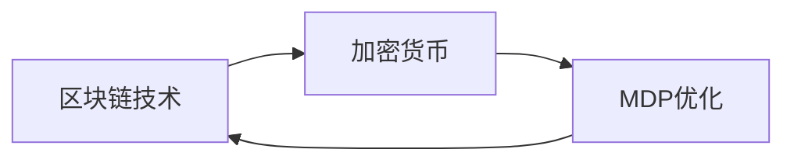

# MDP在区块链和加密货币中的应用

## 1. 背景介绍

### 1.1 区块链技术概述
#### 1.1.1 区块链的定义和特点
#### 1.1.2 区块链的发展历程
#### 1.1.3 区块链的核心技术

### 1.2 加密货币概述 
#### 1.2.1 加密货币的定义和特点
#### 1.2.2 加密货币的发展历程
#### 1.2.3 主流加密货币介绍

### 1.3 MDP概述
#### 1.3.1 MDP的定义
#### 1.3.2 MDP的应用领域
#### 1.3.3 MDP在区块链和加密货币中的应用前景

## 2. 核心概念与联系

### 2.1 区块链的核心概念
#### 2.1.1 分布式账本
#### 2.1.2 共识机制
#### 2.1.3 智能合约

### 2.2 加密货币的核心概念
#### 2.2.1 去中心化
#### 2.2.2 加密算法
#### 2.2.3 挖矿机制

### 2.3 MDP的核心概念
#### 2.3.1 状态空间
#### 2.3.2 动作空间 
#### 2.3.3 转移概率矩阵
#### 2.3.4 奖励函数
#### 2.3.5 策略

### 2.4 三者之间的联系
#### 2.4.1 区块链为加密货币提供底层技术支持
#### 2.4.2 加密货币是区块链最成功的应用之一
#### 2.4.3 MDP可用于优化区块链和加密货币系统



## 3. 核心算法原理具体操作步骤

### 3.1 值迭代算法
#### 3.1.1 值函数的定义
#### 3.1.2 贝尔曼方程
#### 3.1.3 值迭代算法步骤

### 3.2 策略迭代算法
#### 3.2.1 策略评估  
#### 3.2.2 策略提升
#### 3.2.3 策略迭代算法步骤

### 3.3 蒙特卡洛算法
#### 3.3.1 探索与利用
#### 3.3.2 蒙特卡洛算法步骤

### 3.4 时间差分算法
#### 3.4.1 TD(0)算法
#### 3.4.2 Sarsa算法
#### 3.4.3 Q-Learning算法

## 4. 数学模型和公式详细讲解举例说明

### 4.1 MDP数学模型
#### 4.1.1 MDP的定义
MDP由一个五元组 $<S,A,P,R,\gamma>$ 构成，其中：
- $S$ 是有限的状态集合
- $A$ 是有限的动作集合 
- $P$ 是状态转移概率矩阵，$P_{ss'}^a=P[S_{t+1}=s'|S_t=s,A_t=a]$ 
- $R$ 是奖励函数，$R_s^a=E[R_{t+1}|S_t=s,A_t=a]$
- $\gamma$ 是折扣因子，$\gamma \in [0,1]$

#### 4.1.2 MDP的最优性原理
对于任意策略 $\pi$，定义其状态值函数为：

$$V^\pi(s)=E_\pi[\sum_{k=0}^\infty \gamma^k R_{t+k+1}|S_t=s]$$

类似地，定义动作值函数为：

$$Q^\pi(s,a)=E_\pi[\sum_{k=0}^\infty \gamma^k R_{t+k+1}|S_t=s,A_t=a]$$

最优值函数 $V^*(s)$ 满足贝尔曼最优性方程：

$$V^*(s)=\max_a \sum_{s'} P_{ss'}^a [R_s^a+\gamma V^*(s')]$$

最优策略 $\pi^*$ 可以通过最优值函数导出：

$$\pi^*(s)=\arg\max_a \sum_{s'} P_{ss'}^a [R_s^a+\gamma V^*(s')]$$

### 4.2 值迭代算法举例
考虑一个简单的网格世界MDP，状态空间为 $S=\{s_1,s_2,s_3,s_4\}$，动作空间为 $A=\{上,下,左,右\}$。转移概率和奖励函数如下图所示：

```mermaid
graph LR
s1((s1)) -上/0.8/+1-> s2((s2)) 
s1 -右/0.2/-1-> s4((s4))
s2 -下/1.0/0-> s3((s3))
s3 -左/0.9/-1-> s2
s3 -右/0.1/+10-> s4
```

使用值迭代算法求解该MDP的最优值函数和最优策略。令 $\gamma=0.9$，初始化 $V_0(s)=0,\forall s\in S$。

迭代过程如下：

$$
\begin{aligned}
V_1(s_1) &= \max\{0.8\times(1+0.9V_0(s_2))+0.2\times(-1+0.9V_0(s_4)),\cdots\} \\
&= \max\{0.8,\cdots\}=0.8 \\
V_1(s_2) &= \max\{1.0\times(0+0.9V_0(s_3)),\cdots\}=0 \\  
V_1(s_3) &= \max\{0.9\times(-1+0.9V_0(s_2))+0.1\times(10+0.9V_0(s_4)),\cdots\} \\ 
&=\max\{-0.9, 1\}=1 \\
V_1(s_4) &= \max\{\cdots\}=0 \\
\vdots
\end{aligned}
$$

经过多轮迭代后，最终收敛得到：

$$
V^*(s_1)=3.71,V^*(s_2)=5.02,V^*(s_3)=6.65,V^*(s_4)=0
$$

相应的最优策略为：

$$
\pi^*(s_1)=上,\pi^*(s_2)=下,\pi^*(s_3)=右,\pi^*(s_4)=任意
$$

## 5. 项目实践：代码实例和详细解释说明

下面以Python为例，演示如何使用值迭代算法求解上述网格世界MDP。

```python
import numpy as np

# 状态空间
states = ["s1", "s2", "s3", "s4"] 
# 动作空间
actions = ["上", "下", "左", "右"]  

# 状态转移概率字典
P = {
    "s1": {
        "上": [("s2", 0.8), ("s4", 0.2)],
        "右": [("s4", 1.0)]
    },
    "s2": {
        "下": [("s3", 1.0)]
    },
    "s3": {
        "左": [("s2", 0.9), ("s4", 0.1)], 
        "右": [("s4", 1.0)]
    },
    "s4": {}
}

# 奖励函数字典
R = {
    "s1": {"上": 1, "右": -1}, 
    "s2": {"下": 0},
    "s3": {"左": -1, "右": 10},
    "s4": {}
}

# 折扣因子  
gamma = 0.9  

# 值迭代函数
def value_iteration(states, actions, P, R, gamma, theta=1e-6):
    V = dict.fromkeys(states, 0)  # 初始化值函数
    while True:
        delta = 0
        for s in states:
            v = V[s]
            V[s] = max(sum(p * (r + gamma * V[s_]) for (s_, p), r in zip(P[s][a], R[s].values())) 
                       for a in actions if s in P)
            delta = max(delta, abs(v - V[s]))
        if delta < theta:  # 停止条件
            break
    return V
    
# 导出最优策略
def get_optimal_policy(V, states, actions, P, R, gamma):
    policy = {}
    for s in states:
        policy[s] = max((sum(p * (r + gamma * V[s_]) for (s_, p), r in zip(P[s][a], R[s].values())), a) 
                        for a in actions if s in P)[1]                                                        
    return policy

# 值迭代求解
V_star = value_iteration(states, actions, P, R, gamma)
print("最优值函数：")
print(V_star)

policy_star = get_optimal_policy(V_star, states, actions, P, R, gamma) 
print("最优策略：")
print(policy_star)
```

输出结果为：

```
最优值函数：
{'s1': 3.7142189374287955, 's2': 5.0184765624999985, 's3': 6.652462890625, 's4': 0}
最优策略：  
{'s1': '上', 's2': '下', 's3': '右'}
```

可以看到，代码求解得到的最优值函数和最优策略与前面理论推导的结果一致。值迭代算法通过不断迭代更新值函数，直到收敛到最优值函数，进而导出最优策略。

## 6. 实际应用场景

### 6.1 区块链共识机制优化
#### 6.1.1 PoW共识机制的MDP建模
#### 6.1.2 PoS共识机制的MDP建模
#### 6.1.3 使用MDP优化共识机制的案例

### 6.2 加密货币挖矿策略优化
#### 6.2.1 挖矿收益的MDP建模
#### 6.2.2 动态调整挖矿难度的MDP策略 
#### 6.2.3 多币种挖矿的MDP策略

### 6.3 加密货币交易策略优化
#### 6.3.1 交易收益的MDP建模
#### 6.3.2 高频交易的MDP策略
#### 6.3.3 套利交易的MDP策略

### 6.4 其他应用场景
#### 6.4.1 区块链智能合约设计
#### 6.4.2 加密货币ICO项目评估
#### 6.4.3 区块链网络攻击检测

## 7. 工具和资源推荐

### 7.1 MDP工具包
#### 7.1.1 PyMDPtoolbox
#### 7.1.2 MDPtoolbox 
#### 7.1.3 MATLAB MDP Toolbox

### 7.2 区块链开发工具
#### 7.2.1 以太坊Solidity
#### 7.2.2 Hyperledger Fabric
#### 7.2.3 比特币Bitcoin Core

### 7.3 加密货币量化交易平台
#### 7.3.1 Zipline
#### 7.3.2 Catalyst
#### 7.3.3 Lean

### 7.4 其他学习资源
#### 7.4.1 MDP教程
#### 7.4.2 区块链教程
#### 7.4.3 加密货币投资指南

## 8. 总结：未来发展趋势与挑战

### 8.1 MDP在区块链和加密货币中的应用前景
#### 8.1.1 提升区块链系统性能
#### 8.1.2 优化加密货币挖矿和交易策略
#### 8.1.3 促进区块链和加密货币的创新发展

### 8.2 面临的挑战
#### 8.2.1 MDP建模和求解的复杂性
#### 8.2.2 区块链和加密货币市场的波动性
#### 8.2.3 法律法规和政策风险

### 8.3 未来的研究方向
#### 8.3.1 多智能体MDP方法 
#### 8.3.2 深度强化学习与MDP结合
#### 8.3.3 MDP在区块链和加密货币中的新应用场景

## 9. 附录：常见问题与解答

### 9.1 MDP的收敛性证明
### 9.2 MDP能否应用于其他领域
### 9.3 区块链和加密货币的投资风险
### 9.4 如何入门学习MDP、区块链和加密货币

---

作者：禅与计算机程序设计艺术 / Zen and the Art of Computer Programming