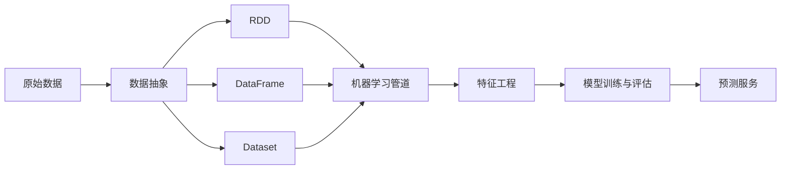

# MLlib 原理与代码实例讲解

## 1. 背景介绍
### 1.1 大数据时代的机器学习需求
#### 1.1.1 海量数据的价值挖掘
#### 1.1.2 传统机器学习方法的局限性
#### 1.1.3 分布式机器学习的必要性
### 1.2 Apache Spark 生态系统
#### 1.2.1 Spark Core
#### 1.2.2 Spark SQL
#### 1.2.3 Spark Streaming
#### 1.2.4 GraphX
### 1.3 MLlib 概述  
#### 1.3.1 MLlib 的定位和特点
#### 1.3.2 MLlib 支持的机器学习算法
#### 1.3.3 MLlib 的发展历程

## 2. 核心概念与联系
### 2.1 数据抽象：RDD、DataFrame 和 Dataset
#### 2.1.1 RDD 的概念和操作
#### 2.1.2 DataFrame 的概念和操作  
#### 2.1.3 Dataset 的概念和操作
### 2.2 机器学习管道 Pipeline
#### 2.2.1 Transformer 和 Estimator
#### 2.2.2 Pipeline 的构建和运行
#### 2.2.3 参数调优：ParamMap 和 CrossValidator
### 2.3 特征工程
#### 2.3.1 特征提取：TF-IDF、Word2Vec 等
#### 2.3.2 特征转换：StandardScaler、MinMaxScaler 等 
#### 2.3.3 特征选择：ChiSqSelector、VectorSlicer 等

## 3. 核心算法原理具体操作步骤
### 3.1 分类算法
#### 3.1.1 逻辑回归 
#### 3.1.2 决策树
#### 3.1.3 随机森林
#### 3.1.4 梯度提升树 
#### 3.1.5 朴素贝叶斯
#### 3.1.6 支持向量机
### 3.2 回归算法 
#### 3.2.1 线性回归
#### 3.2.2 广义线性回归
#### 3.2.3 决策树回归
#### 3.2.4 随机森林回归 
#### 3.2.5 梯度提升树回归
### 3.3 聚类算法
#### 3.3.1 K-Means
#### 3.3.2 高斯混合模型
#### 3.3.3 幂迭代聚类
#### 3.3.4 隐含狄利克雷分布
### 3.4 协同过滤
#### 3.4.1 交替最小二乘法
#### 3.4.2 隐语义模型  

## 4. 数学模型和公式详细讲解举例说明
### 4.1 逻辑回归的数学模型
### 4.2 支持向量机的数学模型
### 4.3 决策树的数学模型  
### 4.4 随机森林的数学模型
### 4.5 梯度提升树的数学模型
### 4.6 线性回归的数学模型
### 4.7 K-Means 的数学模型
### 4.8 高斯混合模型的数学模型
### 4.9 交替最小二乘法的数学模型

## 5. 项目实践：代码实例和详细解释说明 
### 5.1 分类问题实例：使用决策树预测员工离职
#### 5.1.1 数据集介绍与加载
#### 5.1.2 数据预处理与特征工程
#### 5.1.3 构建决策树管道
#### 5.1.4 模型训练与评估
#### 5.1.5 参数调优 
#### 5.1.6 模型预测
### 5.2 回归问题实例：使用梯度提升树预测房价
#### 5.2.1 数据集介绍与加载
#### 5.2.2 数据预处理与特征工程
#### 5.2.3 构建梯度提升树管道
#### 5.2.4 模型训练与评估
#### 5.2.5 参数调优
#### 5.2.6 模型预测
### 5.3 聚类问题实例：使用 K-Means 聚类鸢尾花数据集
#### 5.3.1 数据集介绍与加载
#### 5.3.2 数据预处理与特征工程
#### 5.3.3 构建 K-Means 管道
#### 5.3.4 模型训练与评估
#### 5.3.5 聚类结果可视化
### 5.4 协同过滤实例：使用 ALS 进行电影推荐
#### 5.4.1 数据集介绍与加载
#### 5.4.2 数据预处理
#### 5.4.3 构建 ALS 管道
#### 5.4.4 模型训练与评估
#### 5.4.5 生成推荐结果

## 6. 实际应用场景
### 6.1 电商领域
#### 6.1.1 用户购买行为预测
#### 6.1.2 商品推荐
#### 6.1.3 客户流失预警
### 6.2 金融领域 
#### 6.2.1 信用评分
#### 6.2.2 反欺诈
#### 6.2.3 股票趋势预测
### 6.3 医疗健康领域
#### 6.3.1 疾病诊断
#### 6.3.2 药物研发
#### 6.3.3 基因表达数据分析
### 6.4 社交网络领域
#### 6.4.1 社交关系挖掘
#### 6.4.2 社交影响力分析
#### 6.4.3 社交网络异常检测

## 7. 工具和资源推荐
### 7.1 Spark 官方文档
### 7.2 Spark 社区资源
### 7.3 MLlib 官方示例
### 7.4 第三方工具和库
### 7.5 相关书籍推荐
### 7.6 在线课程和教程

## 8. 总结：未来发展趋势与挑战
### 8.1 MLlib 的优势和局限性
### 8.2 与其他分布式机器学习框架的比较
### 8.3 未来发展趋势
#### 8.3.1 深度学习的支持
#### 8.3.2 实时机器学习
#### 8.3.3 自动化机器学习
### 8.4 面临的挑战
#### 8.4.1 数据安全与隐私
#### 8.4.2 模型解释性
#### 8.4.3 机器学习工程化

## 9. 附录：常见问题与解答
### 9.1 如何选择合适的机器学习算法？
### 9.2 如何进行特征工程？
### 9.3 如何调优模型参数？
### 9.4 如何处理不平衡数据集？
### 9.5 如何评估模型性能？
### 9.6 如何部署训练好的模型？

作者：禅与计算机程序设计艺术 / Zen and the Art of Computer Programming