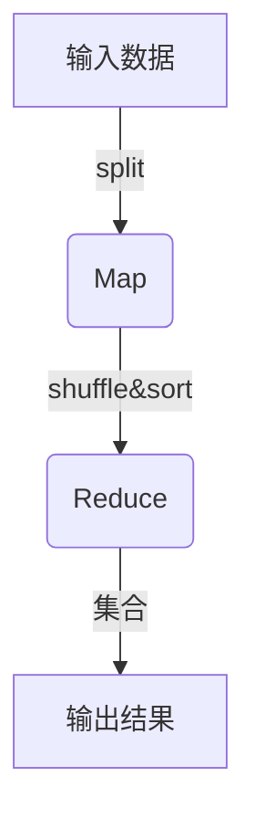
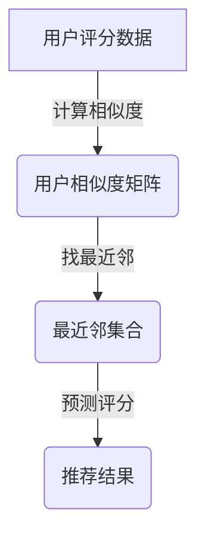
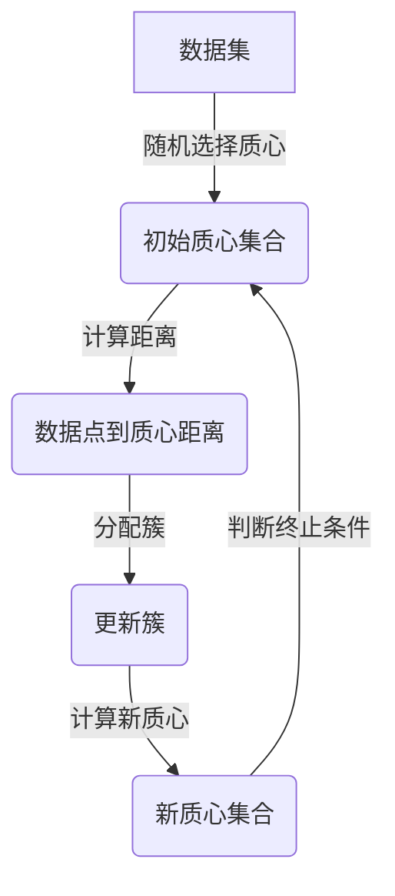
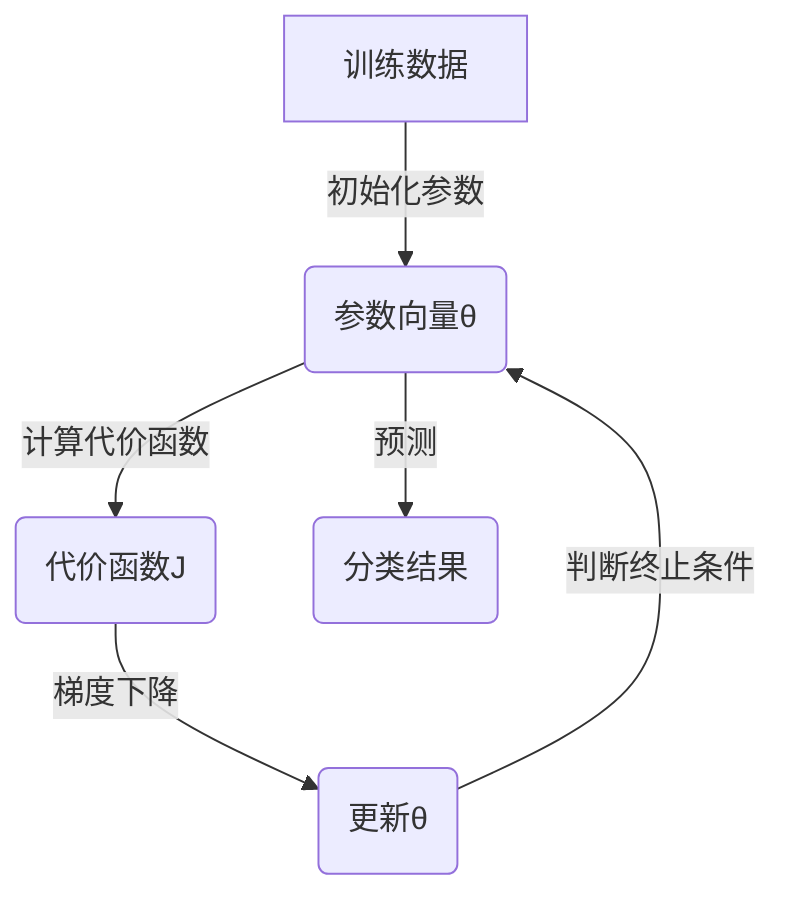

# Mahout原理与代码实例讲解

## 1.背景介绍

在当今大数据时代,海量数据的存储、处理和分析已成为许多企业和组织面临的重大挑战。Apache Mahout作为一个可扩展的机器学习和数据挖掘库,为解决这些挑战提供了强大的工具和算法。它基于Apache Hadoop构建,能够高效地在分布式计算环境中执行各种机器学习算法,从而挖掘出隐藏在大规模数据集中的有价值模式和见解。

Mahout项目最初于2008年启动,旨在构建一些可扩展的机器学习库。随着时间的推移,它已发展成为一个成熟的开源项目,拥有活跃的社区和丰富的算法库。Mahout支持多种机器学习技术,包括协同过滤、聚类、分类、回归等,可广泛应用于推荐系统、垃圾邮件检测、文本挖掘等领域。

## 2.核心概念与联系

### 2.1 MapReduce编程模型

Mahout的核心是基于MapReduce编程模型的,MapReduce是一种用于大规模数据处理的编程范式。它将计算过程分为两个阶段:Map阶段和Reduce阶段。

在Map阶段,输入数据被分割成多个块,并行处理由map函数完成。每个map函数会产生一系列中间键值对。

在Reduce阶段,MapReduce框架会对所有中间数据进行排序和分组,将具有相同键的值集合传递给reduce函数进行处理,最终生成最终输出结果。



MapReduce编程模型使得Mahout能够在分布式环境中高效执行机器学习算法,处理大规模数据集。

### 2.2 矩阵运算

在机器学习算法中,矩阵运算扮演着重要角色。Mahout提供了分布式矩阵运算的实现,支持各种矩阵操作,如矩阵乘法、矩阵分解等。这些操作构成了许多机器学习算法的基础。

### 2.3 向量空间模型

向量空间模型是信息检索和自然语言处理中常用的技术。在Mahout中,文档被表示为向量,每个维度对应一个特征(如单词)。通过计算文档向量之间的相似度,可以实现文本聚类、分类等任务。

## 3.核心算法原理具体操作步骤

### 3.1 协同过滤算法

协同过滤是推荐系统中常用的技术,通过分析用户对项目的评分数据,为用户推荐感兴趣的项目。Mahout实现了多种协同过滤算法,包括基于用户的算法和基于项目的算法。

1. **基于用户的协同过滤算法步骤**:

   $$
   similarity(x,y) = \frac{\sum_{i \in I_{xy}}(r_{xi} - \overline{r_x})(r_{yi} - \overline{r_y})}{\sqrt{\sum_{i \in I_{xy}}(r_{xi} - \overline{r_x})^2}\sqrt{\sum_{i \in I_{xy}}(r_{yi} - \overline{r_y})^2}}
   $$

   - 计算每对用户之间的相似度,常用的相似度度量有皮尔逊相关系数、余弦相似度等。
   - 对于目标用户,找到与其最相似的k个用户,称为最近邻。
   - 基于最近邻的评分数据,为目标用户预测感兴趣项目的评分。

2. **基于项目的协同过滤算法步骤**:

   - 计算每对项目之间的相似度。
   - 对于目标用户,找到其已评分的项目集合。
   - 基于这些项目的最相似项目及其评分,为目标用户预测感兴趣项目的评分。



### 3.2 K-means聚类算法

K-means是一种常用的聚类算法,目标是将n个数据点分成k个聚类,使得聚类内部数据点相似度高,聚类之间相似度低。算法步骤如下:

1. 随机选取k个初始质心。
2. 对每个数据点,计算它与每个质心的距离,将其分配到最近的质心所在的簇。
3. 重新计算每个簇的质心。
4. 重复步骤2和3,直到质心不再发生变化或达到最大迭代次数。

$$
J = \sum_{i=1}^{k}\sum_{x \in C_i}||x - \mu_i||^2
$$

其中,J是目标函数,表示所有数据点到所属簇质心的平方距离之和。算法的目标是最小化J。



### 3.3 逻辑回归分类算法

逻辑回归是一种常用的分类算法,通过拟合数据,学习一个逻辑函数,将实例映射到0或1的类别。算法步骤如下:

1. 初始化模型参数向量$\theta$。
2. 计算代价函数J:

   $$
   J(\theta) = -\frac{1}{m}\sum_{i=1}^{m}[y^{(i)}\log(h_\theta(x^{(i)})) + (1-y^{(i)})\log(1-h_\theta(x^{(i)}))]
   $$

   其中,m是训练样本数,$h_\theta(x)$是模型的预测函数。
3. 使用梯度下降法更新$\theta$:

   $$
   \theta_j := \theta_j - \alpha\frac{\partial}{\partial\theta_j}J(\theta)
   $$

   其中,$\alpha$是学习率。
4. 重复步骤2和3,直到收敛或达到最大迭代次数。



## 4.数学模型和公式详细讲解举例说明

在上一节中,我们介绍了几种核心算法的原理和步骤。现在,让我们深入探讨其中涉及的一些关键数学模型和公式。

### 4.1 相似度度量

相似度度量在协同过滤等算法中扮演着重要角色。常用的相似度度量包括:

1. **皮尔逊相关系数**:

   $$
   sim(x,y) = \frac{\sum_{i \in I}(r_{xi} - \overline{r_x})(r_{yi} - \overline{r_y})}{\sqrt{\sum_{i \in I}(r_{xi} - \overline{r_x})^2}\sqrt{\sum_{i \in I}(r_{yi} - \overline{r_y})^2}}
   $$

   其中,$r_{xi}$和$r_{yi}$分别表示x和y对第i个项目的评分,$\overline{r_x}$和$\overline{r_y}$是x和y的平均评分。皮尔逊相关系数范围在[-1,1]之间,值越接近1,表示两个向量越相似。

2. **余弦相似度**:

   $$
   sim(x,y) = \frac{x \cdot y}{||x||\,||y||}
   $$

   余弦相似度测量两个向量之间的夹角余弦值。值越接近1,表示两个向量越相似。

让我们用一个简单的例子来说明皮尔逊相关系数的计算过程。假设有两个用户x和y,他们对三部电影的评分如下:

| 电影 | 用户x | 用户y |
|------|-------|-------|
| A    | 5     | 4     |
| B    | 3     | 2     |
| C    | 4     | 5     |

首先,我们计算每个用户的平均评分:

$$
\overline{r_x} = \frac{5 + 3 + 4}{3} = 4\\
\overline{r_y} = \frac{4 + 2 + 5}{3} = 3.67
$$

然后,根据公式计算皮尔逊相关系数:

$$
sim(x,y) = \frac{(5-4)(4-3.67) + (3-4)(2-3.67) + (4-4)(5-3.67)}{\sqrt{(5-4)^2 + (3-4)^2 + (4-4)^2}\sqrt{(4-3.67)^2 + (2-3.67)^2 + (5-3.67)^2}} \\
         = \frac{0.33 + 1.33 + 1.33}{\sqrt{1 + 1 + 0}\sqrt{0.33 + 1.33 + 1.33}} \\
         = \frac{2.99}{\sqrt{2}\sqrt{2.99}} \\
         \approx 0.95
$$

可以看出,用户x和y的评分模式非常相似,皮尔逊相关系数接近1。

### 4.2 K-means目标函数

在K-means聚类算法中,我们需要最小化目标函数J:

$$
J = \sum_{i=1}^{k}\sum_{x \in C_i}||x - \mu_i||^2
$$

其中,k是簇的数量,$C_i$是第i个簇,$\mu_i$是第i个簇的质心,||x - $\mu_i$||是数据点x到质心$\mu_i$的欧几里得距离。

目标函数J反映了所有数据点到所属簇质心的平方距离之和。算法的目标是找到一组质心,使得J最小化。

让我们用一个简单的二维数据集来说明目标函数的计算过程。假设有5个数据点,分为两个簇:

```
Cluster 1: (1, 1), (1.5, 2)
Cluster 2: (5, 5), (6, 5), (5, 6)
```

首先,我们计算每个簇的质心:

$$
\mu_1 = \frac{1 + 1 + 1.5 + 2}{2} = (1.25, 1.5)\\
\mu_2 = \frac{5 + 6 + 5 + 5 + 6}{5} = (5.4, 5.4)
$$

然后,根据公式计算目标函数J:

$$
\begin{aligned}
J &= \sum_{x \in C_1}||x - \mu_1||^2 + \sum_{x \in C_2}||x - \mu_2||^2\\
  &= ||(1, 1) - (1.25, 1.5)||^2 + ||(1.5, 2) - (1.25, 1.5)||^2\\
  &\quad + ||(5, 5) - (5.4, 5.4)||^2 + ||(6, 5) - (5.4, 5.4)||^2 + ||(5, 6) - (5.4, 5.4)||^2\\
  &= 0.25^2 + 0.5^2 + 0.4^2 + 0.4^2 + 0.4^2\\
  &= 0.0625 + 0.25 + 0.16 + 0.16 + 0.16\\
  &= 0.7925
\end{aligned}
$$

可以看出,目标函数J的值反映了数据点与质心之间的总体差异程度。K-means算法旨在通过迭代优化质心位置,使得J最小化。

### 4.3 逻辑回归代价函数

在逻辑回归算法中,我们使用代价函数J来评估模型的拟合程度:

$$
J(\theta) = -\frac{1}{m}\sum_{i=1}^{m}[y^{(i)}\log(h_\theta(x^{(i)})) + (1-y^{(i)})\log(1-h_\theta(x^{(i)}))]
$$

其中,m是训练样本数,$y^{(i)}$是第i个样本的真实标签(0或1),$h_\theta(x^{(i)})$是模型对第i个样本的预测概率。

代价函数J反映了模型预测与真实标签之间的差异。当J的值越小,表示模型的拟合程度越好。

让我们用一个简单的二元分类问题来说明代价函数的计算过程。假设有4个训练样本:

```
x^(1) = (1, 0), y^(1) = 1
x^(2