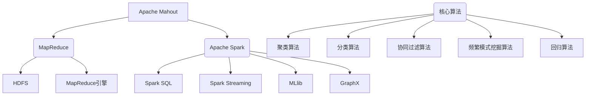

# Mahout常见问题与解决方案

## 1.背景介绍

Apache Mahout是一个可扩展的机器学习和数据挖掘库,最初由Apache软件基金会的开源社区于2008年创建。它的主要目标是构建一个环境,使得数据科学家和统计分析人员可以更轻松地创建可扩展的分布式机器学习应用程序。Mahout包含许多不同的机器学习算法实现,如聚类、分类、协同过滤、频繁模式挖掘和回归。

Mahout的核心是基于Apache Hadoop构建的,利用了MapReduce编程模型的并行处理能力,使其能够有效地处理大规模数据集。它还支持Apache Spark,这使得Mahout能够在内存中执行迭代计算,从而提高性能。

尽管Mahout提供了强大的功能,但在使用过程中也会遇到各种问题和挑战。本文将探讨Mahout常见问题及其解决方案,帮助开发人员更好地利用这个强大的机器学习库。

## 2.核心概念与联系

在深入探讨Mahout常见问题之前,让我们先了解一些核心概念和它们之间的联系。

### 2.1 MapReduce

MapReduce是一种编程模型,用于在大型集群上并行处理和生成大型数据集。它将计算过程分为两个阶段:Map阶段和Reduce阶段。

在Map阶段,输入数据被分割成多个块,并在集群的多个节点上并行处理。每个Map任务会生成一系列中间键/值对。

在Reduce阶段,MapReduce库会对所有中间值进行合并,并对具有相同键的值进行排序。然后,Reduce函数会对每个键的值集进行处理,生成最终的输出结果。

### 2.2 Apache Hadoop

Apache Hadoop是一个开源的分布式计算框架,它实现了MapReduce编程模型,并提供了可靠的数据存储。Hadoop由两个核心组件组成:HDFS(Hadoop分布式文件系统)和MapReduce引擎。

HDFS是一个分布式文件系统,设计用于在廉价的商用硬件上运行。它提供了高容错性和高吞吐量的数据访问。MapReduce引擎则负责在集群上并行执行MapReduce作业。

### 2.3 Apache Spark

Apache Spark是一种快速、通用的集群计算系统。与Hadoop的MapReduce相比,Spark更侧重于内存计算,能够显著提高迭代计算的性能。

Spark提供了多种高级API,如Spark SQL用于结构化数据处理,Spark Streaming用于流处理,MLlib用于机器学习,以及GraphX用于图形处理。Mahout从0.10版本开始,就已经支持使用Spark作为底层执行引擎。

### 2.4 Mahout核心算法

Mahout包含了多种核心算法,涵盖了机器学习和数据挖掘的多个领域,例如:

- 聚类算法:K-Means、Fuzzy K-Means、Mean Shift等
- 分类算法:Naive Bayes、Logistic Regression、随机森林等
- 协同过滤算法:基于用户的协同过滤、基于物品的协同过滤等
- 频繁模式挖掘算法:FPGrowth等
- 回归算法:逻辑回归、线性回归等

这些算法都是在MapReduce或Spark框架之上实现的,能够有效地处理大规模数据集。



上图展示了Mahout及其核心概念之间的关系。Mahout建立在MapReduce和Apache Spark之上,利用它们的分布式计算能力。它包含了多种核心算法,如聚类、分类、协同过滤、频繁模式挖掘和回归算法。这些算法都是在MapReduce或Spark框架之上实现的。

## 3.核心算法原理具体操作步骤

在本节中,我们将探讨Mahout中一些核心算法的原理及其具体操作步骤。

### 3.1 K-Means聚类算法

K-Means是一种广泛使用的聚类算法,它将数据集划分为k个簇,使得每个数据点都属于离它最近的簇的质心。算法的目标是最小化所有数据点到其所属簇质心的距离之和。

K-Means算法的具体步骤如下:

1. 初始化k个随机质心。
2. 对于每个数据点,计算它与每个质心的距离,并将其分配给最近的质心所对应的簇。
3. 重新计算每个簇的质心,作为该簇中所有数据点的均值。
4. 重复步骤2和3,直到质心不再发生变化或达到最大迭代次数。

在Mahout中,可以使用以下代码来执行K-Means聚类:

```java
// 加载数据
Path input = new Path("data/samples/kmeans/random-clusters");
Path output = new Path("output/kmeans");

// 创建K-Means聚类作业配置
Configuration conf = new Configuration();
conf.set(MahoutConfigKeys.MAX_JOB_NAME_LENGTH, "120");

// 运行K-Means聚类作业
KMeansDriver.run(conf, input, output, 0.01, 10, 10, true, false);
```

在上面的代码中,我们首先加载输入数据,然后创建一个K-Means聚类作业配置。接下来,我们调用`KMeansDriver.run()`方法来执行K-Means聚类作业。该方法的参数包括:配置对象、输入路径、输出路径、convergence delta(收敛阈值)、最大迭代次数、期望的聚类数量、是否运行聚类验证步骤以及是否保留最佳聚类路径。

### 3.2 Naive Bayes分类算法

Naive Bayes是一种基于贝叶斯定理的简单而有效的监督学习算法,常用于文本分类、垃圾邮件检测等任务。它基于特征之间相互独立的假设,计算每个类别对于给定实例的概率,并选择概率最大的类别作为预测结果。

Naive Bayes算法的具体步骤如下:

1. 从训练数据中计算每个类别的先验概率。
2. 对于每个特征,计算该特征在每个类别下的条件概率。
3. 对于给定的实例,计算该实例属于每个类别的后验概率。
4. 选择后验概率最大的类别作为预测结果。

在Mahout中,可以使用以下代码来训练和应用Naive Bayes分类器:

```java
// 加载数据
Path input = new Path("data/samples/naive-bayes/weather.csv");
Path output = new Path("output/naive-bayes");

// 创建Naive Bayes分类器配置
Configuration conf = new Configuration();
conf.set(MahoutConfigKeys.MAX_JOB_NAME_LENGTH, "120");

// 训练Naive Bayes分类器
NaiveBayesDriver.train(conf, input, output, "weather", "play", "outlook,temperature,humidity,windy");

// 应用Naive Bayes分类器
Path testData = new Path("data/samples/naive-bayes/weather-test.csv");
NaiveBayesDriver.classify(conf, testData, output, "weather", "play", "outlook,temperature,humidity,windy");
```

在上面的代码中,我们首先加载训练数据和测试数据。然后,我们创建一个Naive Bayes分类器配置对象。接下来,我们调用`NaiveBayesDriver.train()`方法来训练Naive Bayes分类器。该方法的参数包括:配置对象、输入路径、输出路径、数据集名称、标签名称以及特征名称列表。

训练完成后,我们可以使用`NaiveBayesDriver.classify()`方法来应用训练好的Naive Bayes分类器对测试数据进行分类。该方法的参数包括:配置对象、测试数据路径、模型路径、数据集名称、标签名称以及特征名称列表。

### 3.3 其他算法

除了K-Means聚类算法和Naive Bayes分类算法之外,Mahout还提供了许多其他算法的实现,如逻辑回归、随机森林、协同过滤等。这些算法的原理和操作步骤类似,都是通过配置相应的驱动程序并设置必要的参数来执行。由于篇幅有限,本文不再一一赘述。读者可以参考Mahout官方文档或其他资源来了解更多算法的细节。

## 4.数学模型和公式详细讲解举例说明

在本节中,我们将详细讲解一些常用的机器学习算法的数学模型和公式,并给出具体的例子说明。

### 4.1 K-Means聚类算法

K-Means聚类算法的目标是将数据集划分为k个簇,使得每个数据点都属于离它最近的簇的质心,并且所有数据点到其所属簇质心的距离之和最小。

设有n个数据点$\{x_1, x_2, \ldots, x_n\}$,将它们划分为k个簇$\{C_1, C_2, \ldots, C_k\}$。定义簇内平方和$J$为:

$$J = \sum_{i=1}^{k} \sum_{x \in C_i} \left\Vert x - \mu_i \right\Vert^2$$

其中$\mu_i$是簇$C_i$的质心,定义为:

$$\mu_i = \frac{1}{|C_i|} \sum_{x \in C_i} x$$

K-Means算法的目标是找到一种簇划分,使得簇内平方和$J$最小化。

例如,假设我们有一个二维数据集,包含以下6个数据点:

```
(2, 3), (5, 8), (1, 2), (8, 7), (7, 6), (3, 4)
```

我们希望将这些数据点划分为2个簇。初始时,我们随机选择两个质心,比如$(2, 3)$和$(8, 7)$。然后,我们计算每个数据点到两个质心的距离,并将它们分配给最近的质心所对应的簇。接下来,我们重新计算每个簇的质心,作为该簇中所有数据点的均值。重复这个过程,直到质心不再发生变化或达到最大迭代次数。

最终,我们可能得到以下两个簇:

- 簇1: $(1, 2)$, $(2, 3)$, $(3, 4)$
- 簇2: $(5, 8)$, $(7, 6)$, $(8, 7)$

这种划分使得簇内平方和$J$最小化。

### 4.2 Naive Bayes分类算法

Naive Bayes分类算法基于贝叶斯定理,计算给定实例属于每个类别的后验概率,并选择概率最大的类别作为预测结果。

设有k个类别$\{c_1, c_2, \ldots, c_k\}$,给定一个实例$x$,我们需要计算$x$属于每个类别的后验概率$P(c_i|x)$。根据贝叶斯定理,我们有:

$$P(c_i|x) = \frac{P(x|c_i)P(c_i)}{P(x)}$$

其中$P(c_i)$是类别$c_i$的先验概率,$P(x|c_i)$是实例$x$在已知类别$c_i$的条件下出现的概率,而$P(x)$是实例$x$的边缘概率。

由于$P(x)$对于所有类别是相同的,因此我们可以忽略它,只需要比较$P(x|c_i)P(c_i)$的值。根据特征独立性假设,我们可以将$P(x|c_i)$分解为:

$$P(x|c_i) = \prod_{j=1}^{n} P(x_j|c_i)$$

其中$x_j$是实例$x$的第$j$个特征,$n$是特征的总数。

因此,我们可以计算每个类别的后验概率为:

$$P(c_i|x) \propto P(c_i) \prod_{j=1}^{n} P(x_j|c_i)$$

然后,选择后验概率最大的类别作为预测结果。

例如,假设我们有一个天气数据集,包含以下特征:outlook(阳光、阴天、雨天)、temperature(热、温和、冷)、humidity(高、正常)和windy(是、否)