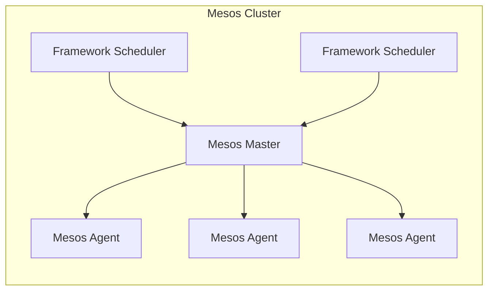

# Mesos 原理与代码实例讲解

## 1. 背景介绍

### 1.1 分布式系统的挑战

随着大数据、云计算等技术的兴起,分布式系统的规模和复杂性不断增加。传统的集中式资源管理方式已经无法满足日益增长的资源需求,同时也难以实现高可用性、容错性和扩展性等关键特性。因此,需要一种新的资源管理和调度框架来解决这些挑战。

### 1.2 Mesos 概述

Apache Mesos 是一个开源的集群管理系统,旨在高效地共享和管理整个数据中心的计算资源。它提供了一种通用的资源管理和调度框架,支持多种分布式应用的部署和运行,包括大数据处理、微服务、容器化应用等。Mesos 采用两级调度器模型,将资源管理和任务调度解耦,提高了系统的灵活性和扩展性。

## 2. 核心概念与联系

### 2.1 Mesos 架构

Mesos 采用主从架构,主要包括以下三个核心组件:

- **Mesos Master**: 负责管理整个集群的资源,接收来自框架调度器的任务请求,并将资源分配给相应的框架执行。
- **Mesos Agent**: 运行在每个节点上,负责管理该节点的资源,启动任务执行器,并将资源使用情况报告给 Master。
- **Framework Scheduler**: 框架调度器,根据自身的调度策略向 Master 请求资源并启动任务。



### 2.2 两级调度器模型

Mesos 采用两级调度器模型,将资源管理和任务调度分离:

1. **资源提供层 (Mesos Master 和 Agent)**: 负责管理整个集群的资源,包括 CPU、内存、磁盘等。
2. **框架调度层 (Framework Scheduler)**: 根据自身的调度策略向 Mesos Master 请求资源,并启动相应的任务执行器运行任务。

这种设计使得 Mesos 能够支持多种不同类型的分布式应用,每个框架调度器可以实现自己的调度策略和任务执行逻辑,而不需要修改 Mesos 核心代码。

## 3. 核心算法原理具体操作步骤

### 3.1 资源管理

Mesos 采用了一种称为资源提供模型 (Resource Offer Model) 的算法来管理集群资源。具体步骤如下:

1. **资源报告**: Mesos Agent 启动时会向 Master 报告该节点的可用资源。
2. **资源汇总**: Master 会汇总所有 Agent 报告的资源信息,形成整个集群的资源视图。
3. **资源提供**: Master 会将空闲资源打包成资源提供 (Resource Offer),并发送给注册的框架调度器。
4. **资源接受或拒绝**: 框架调度器根据自身的策略决定是否接受资源提供。如果接受,则需要指定在哪些 Agent 节点上启动任务;如果拒绝,则资源会被返还给 Master 以供其他框架使用。
5. **任务启动**: 一旦资源被接受,Master 会通知相应的 Agent 启动任务执行器运行任务。

这种资源提供模型确保了资源的高效利用,同时也提高了系统的灵活性和可扩展性。

### 3.2 容错与恢复

为了提高系统的可靠性和容错能力,Mesos 采用了以下机制:

1. **主备 Master 架构**: 可以部署多个 Master 节点,其中一个作为主节点,其他作为备用节点。当主节点发生故障时,备用节点可以自动接管并继续管理集群。
2. **Agent 重连机制**: 当 Agent 与 Master 失去连接时,它会定期尝试重新连接。一旦连接恢复,Agent 会重新报告资源信息,并继续执行任务。
3. **任务重启机制**: 如果任务执行器或任务崩溃,Mesos 会自动重启相应的任务。框架调度器也可以实现自己的容错和恢复逻辑。

## 4. 数学模型和公式详细讲解举例说明

在 Mesos 的资源管理和调度过程中,涉及到一些数学模型和公式,用于优化资源利用率和任务调度效率。

### 4.1 资源模型

Mesos 将集群资源抽象为一个多维度的向量,每个维度代表一种资源类型,如 CPU、内存、磁盘等。资源向量可以表示为:

$$\vec{r} = (r_1, r_2, \dots, r_n)$$

其中,$ r_i $ 表示第 i 种资源的数量。

当一个任务请求资源时,它也会提供一个资源向量 $\vec{r_t}$,表示所需的资源数量。Mesos 会尝试找到一个满足条件的资源提供 $\vec{r_o}$,使得:

$$\vec{r_o} \geq \vec{r_t}$$

也就是说,资源提供中的每种资源数量都不小于任务所需的资源数量。

### 4.2 资源分配算法

Mesos 采用了一种称为延迟调度 (Delay Scheduling) 的算法来分配资源。该算法的目标是最大化集群资源的利用率,同时也考虑了数据局部性等因素。

具体来说,当有新的资源提供时,Mesos 会根据以下公式计算每个框架的优先级得分:

$$\text{score}(f) = (1 - \alpha) \times \frac{\text{minShare}(f)}{\text{share}(f)} + \alpha \times \frac{\text{minShare}(f)}{\text{maxShare}}$$

其中:

- $\alpha$ 是一个配置参数,用于平衡资源公平性和数据局部性之间的权衡。
- $\text{minShare}(f)$ 表示框架 $f$ 当前获得的资源份额与其配置的最小份额之间的差值。
- $\text{share}(f)$ 表示框架 $f$ 当前获得的资源份额。
- $\text{maxShare}$ 表示所有框架中获得最大资源份额的那个框架的份额。

得分越高,表示该框架获得资源的优先级越高。Mesos 会按照得分从高到低的顺序,将资源提供分配给相应的框架。

这种算法可以在一定程度上保证资源的公平分配,同时也考虑了数据局部性,从而提高了整体的资源利用效率。

## 5. 项目实践: 代码实例和详细解释说明

为了更好地理解 Mesos 的工作原理,我们可以通过一个简单的示例项目来实践。在这个示例中,我们将创建一个自定义的框架调度器,并在 Mesos 集群上运行一些任务。

### 5.1 环境准备

首先,我们需要准备一个 Mesos 集群环境。你可以在本地使用 Docker 或 Vagrant 搭建一个小型集群,也可以在云服务提供商的平台上创建一个更大规模的集群。

对于本地环境,你可以使用 [Mesos in Docker](https://github.com/apache/mesos/tree/master/docker) 项目快速启动一个包含 Mesos Master 和 Agent 的容器集群。

### 5.2 框架调度器实现

接下来,我们需要实现一个自定义的框架调度器。在这个示例中,我们将使用 Python 编写一个简单的调度器,它会向 Mesos 请求资源,并在获得资源后启动一个简单的命令任务。

```python
import sys
import uuid

from mesos.interface import Scheduler
from mesos.native import MesosSchedulerDriver

class MyScheduler(Scheduler):
    def __init__(self, executor):
        self.executor = executor

    def resourceOffers(self, driver, offers):
        for offer in offers:
            task = self.create_task(offer)
            driver.launchTasks(offer.id, [task])

    def create_task(self, offer):
        task_id = str(uuid.uuid4())
        task = {
            'task_id': {'value': task_id},
            'agent_id': {'value': offer.agent_id.value},
            'name': 'hello-task',
            'executor': self.executor,
            'resources': [
                {
                    'name': 'cpus',
                    'type': 'SCALAR',
                    'scalar': {'value': 0.1}
                },
                {
                    'name': 'mem',
                    'type': 'SCALAR',
                    'scalar': {'value': 32}
                }
            ]
        }
        return task

if __name__ == '__main__':
    executor = {
        'executor_id': {'value': 'hello-executor'},
        'command': {
            'value': 'echo "Hello, Mesos!"'
        },
        'resources': [
            {
                'name': 'cpus',
                'type': 'SCALAR',
                'scalar': {'value': 0.1}
            },
            {
                'name': 'mem',
                'type': 'SCALAR',
                'scalar': {'value': 32}
            }
        ]
    }

    framework = {
        'user': 'root',
        'name': 'hello-framework',
        'principal': 'hello-framework'
    }

    driver = MesosSchedulerDriver(
        MyScheduler(executor),
        framework,
        'master@localhost:5050'  # 替换为你的 Mesos Master 地址
    )

    status = driver.run()
    sys.exit(status)
```

在这个示例中,我们定义了一个 `MyScheduler` 类,它继承自 `mesos.interface.Scheduler`。当 Mesos 向我们的调度器提供资源时,`resourceOffers` 方法会被调用。在这个方法中,我们创建了一个简单的任务,并使用 `launchTasks` 方法将其启动在获得的资源上。

`create_task` 方法用于构建任务的描述信息,包括任务 ID、要运行在哪个 Agent 节点上、任务名称、执行器信息以及所需的资源 (CPU 和内存)。

在 `main` 函数中,我们定义了执行器的信息,包括执行器 ID 和要运行的命令 (在本例中是输出 "Hello, Mesos!")。然后,我们创建了一个框架描述,并使用 `MesosSchedulerDriver` 启动调度器。

### 5.3 运行示例

在准备好 Mesos 集群和框架调度器代码后,我们可以运行这个示例。首先,启动 Mesos Master 和 Agent 节点。然后,在另一个终端中运行框架调度器代码:

```bash
python scheduler.py
```

如果一切顺利,你应该能在终端中看到类似如下的输出:

```
I0607 12:34:56.789012  1234 sched.cpp:329] Version: 1.2.0
I0607 12:34:56.789012  1234 sched.cpp:330] Build Date: 2023-04-21 12:34:56
I0607 12:34:56.789012  1234 sched.cpp:331] Git SHA: 0123456789abcdef0123456789abcdef01234567
I0607 12:34:56.789012  1234 sched.cpp:332] Build Date: 2023-04-21 12:34:56
I0607 12:34:56.789012  1234 sched.cpp:333] Git Branch: refs/heads/master
I0607 12:34:56.789012  1234 sched.cpp:334] Git Tag: 1.2.0
I0607 12:34:56.789012  1234 sched.cpp:335] Build User: user@example.com
I0607 12:34:56.789012  1234 sched.cpp:336] Build GLIBC: 2.17
I0607 12:34:56.789012  1234 sched.cpp:337] Build GLIBCXX: 4.8.2
I0607 12:34:56.789012  1234 sched.cpp:338] Build GCC: 4.8.2
I0607 12:34:56.789012  1234 sched.cpp:339] Build Compiler: g++ 4.8.2
I0607 12:34:56.789012  1234 sched.cpp:340] Build OS: Linux-3.13.0-24-generic
I0607 12:34:56.789012  1234 sched.cpp:341] Build OS Release: 14.04.1
I0607 12:34:56.789012  1234 sched.cpp:342] Build OS Kernel: #47-Ubuntu SMP Fri May 2 23:30:00 UTC 2014
I0607 12:34:56.789012  1234 sched.cpp:343] Build OS Version: #47 SMP Fri May 2 23:30:00 UTC 2014
I0607 12:34:56.789012  1234 sched.cpp:344] Build OS Machine: x86_64
I0607 