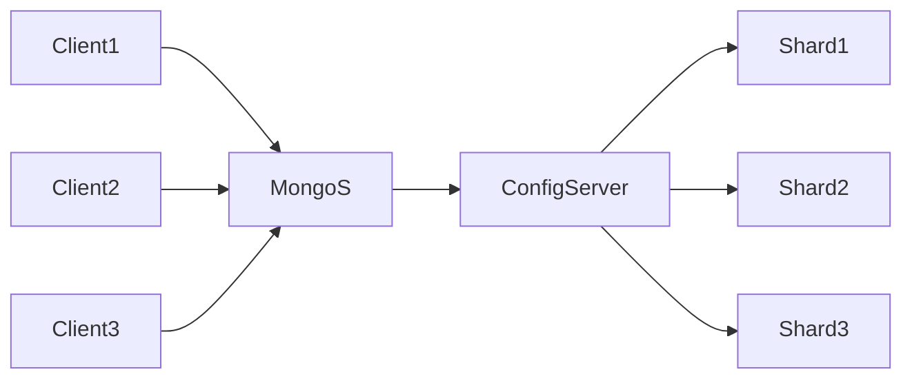

# MongoDB原理与代码实例讲解

## 1.背景介绍

### 1.1 MongoDB的诞生与发展历程
MongoDB是一个开源的、高性能的、无模式的文档型数据库,使用C++语言编写。它是NoSQL数据库产品中的一种,其特点是高性能、易部署、易使用,存储数据非常方便。MongoDB由10gen团队于2007年10月开发,2009年2月首度推出。

### 1.2 MongoDB在当前大数据时代的重要地位
在当前大数据时代,MongoDB凭借其突出的性能优势和灵活的数据模型,已经成为了NoSQL数据库的代表性产品。许多知名互联网公司如谷歌、Facebook、亚马逊等都采用了MongoDB作为其后端数据库。

### 1.3 学习MongoDB的意义
对于开发人员来说,掌握MongoDB的原理和使用,可以开发出高性能的、可扩展的现代Web应用。同时,MongoDB丰富的查询语言和索引支持,也让开发人员能够更高效地开发数据驱动的应用程序。

## 2.核心概念与联系

### 2.1 MongoDB的数据模型 
MongoDB是一个面向文档的数据库管理系统。数据以类JSON(BSON)文档的形式存储。一个集合中可以存储多个不同模式的文档。

#### 2.1.1 文档(Document)
文档是MongoDB中数据的基本单元,类似于关系型数据库中的一行记录。多个键及其关联的值有序地放置在一起就构成了文档。

#### 2.1.2 集合(Collection)  
集合类似于关系数据库中的表。一个数据库中可以有多个集合,一个集合中可以有多个文档。集合是无模式的,意味着一个集合中的文档可以有不同的字段。

#### 2.1.3 数据库(Database)
数据库是一个集合的物理容器。一个MongoDB实例可以承载多个数据库,每个数据库都有自己的集合。

### 2.2 MongoDB的数据类型
MongoDB支持多种数据类型,主要包括:
- null: 表示空值或不存在的字段
- 布尔型(Boolean):true或false
- 数值型:支持整型、浮点型等
- 字符串:UTF-8字符串
- 日期:存储当前日期或时间的UNIX时间格式
- 数组:值的集合或列表可以包含多种数据类型
- 内嵌文档:文档可以作为文档中某个key的值 
- 对象ID(ObjectId):文档的12字节唯一ID
- 二进制数据:用于存储二进制数据
- 代码:JavaScript代码

### 2.3 MongoDB的体系结构



- Shard:用于存储实际的数据块,实际生产环境中一个shard server角色可由几台机器组个一个replica set承担,防止主机单点故障
- ConfigServer:mongod实例,存储了整个 ClusterMetadata,其中包括 chunk信息。
- Query Routers:前端路由,客户端由此接入,且让整个集群看上去像单一数据库,前端应用可以透明使用。

## 3.核心算法原理具体操作步骤

### 3.1 创建/删除数据库
- 创建数据库:如果数据库不存在,MongoDB会在您第一次存储数据时创建它。`use myDB`
- 删除当前数据库:`db.dropDatabase()`

### 3.2 创建/删除集合
- 创建集合:如果集合不存在,MongoDB会在您第一次存储数据时创建它。`db.myCollection.insertOne( { x: 1 } )`
- 显式创建:`db.createCollection("myCollection")`  
- 删除集合:`db.myCollection.drop()`

### 3.3 文档的CRUD操作
- Create:
  - `db.collection.insertOne()` 插入单个文档
  - `db.collection.insertMany()` 插入多个文档
- Read: 
  - `db.collection.find()` 查询文档
- Update:
  - `db.collection.updateOne()` 更新单个文档 
  - `db.collection.updateMany()` 更新多个文档
  - `db.collection.replaceOne()` 替换单个文档
- Delete:
  - `db.collection.deleteOne()` 删除单个文档
  - `db.collection.deleteMany()` 删除多个文档

### 3.4 查询文档
- `db.collection.find()` 方法用于从集合中查询文档。可以传入各种查询运算符:
  - 比较运算符: `$eq`, `$gt`, `$gte`, `$in`, `$lt`, `$lte`, `$ne`, `$nin`
  - 逻辑运算符: `$and`, `$not`, `$nor`, `$or` 
  - 元素运算符: `$exists`, `$type`
  - 评估运算符: `$expr`, `$jsonSchema`, `$mod`, `$regex`, `$text`, `$where`
  - 地理空间运算符: `$geoIntersects`, `$geoWithin`, `$near`, `$nearSphere`
  - 数组运算符: `$all`, `$elemMatch`, `$size`
  - 按字段指定查询条件: `$`, `$elemMatch`, `$meta`, `$slice`
- 查询嵌套文档: 使用点表示法 `"field1.nestedField"`
- 查询数组: 
  - 精确匹配数组: `{ field: [ <value1>, <value2>, ... ] }`
  - 匹配数组中任意值: `{ field: <value> }` 
  - 指定多个条件: `{ <array field>: { <operator1>: <value1>, ... } }`
  - 通过数组下标查询: `{ "field.0": <value> }`

### 3.5 文档更新操作
- `$set`: 设置字段值。如果字段不存在则创建它。
- `$unset`: 删除指定字段。 
- `$rename`: 重命名字段。
- `$inc`: 将字段值增加指定数量。
- `$mul`: 将字段值乘以指定数量。
- `$min`: 只有当指定值小于现有字段值时才更新字段。
- `$max`: 只有当指定值大于现有字段值时才更新字段。
- 数组修改器: 
  - `$addToSet`: 如果元素不存在则添加到数组中。
  - `$pop`: 删除数组的第一个或最后一个元素。
  - `$pull`: 删除与指定条件匹配的所有数组元素。
  - `$push`: 将元素添加到数组。
  - `$pullAll`: 删除与任何指定值匹配的所有数组元素。

### 3.6 聚合操作
MongoDB中聚合(Aggregation)是基于数据处理的聚合管道,每个文档通过一个由多个阶段(stage)组成的管道,可以对每个阶段的管道进行分组、过滤等功能,然后经过一系列的处理,输出相应的结果。

常用的聚合管道操作符:
- `$match`: 根据条件过滤文档,返回符合条件的文档。
- `$project`: 指定输出文档中的字段,可以重命名、增加和删除字段。
- `$group`: 将文档按指定的字段分组,可以用于统计结果。
- `$sort`: 将文档按指定的字段进行排序。
- `$limit`: 限制聚合管道返回的文档数。
- `$skip`: 跳过指定数量的文档,返回剩余的文档。
- `$unwind`: 将文档中某一个数组类型字段拆分成多条,每条包含数组中的一个值。
- `$lookup`: 对同一数据库中另一个集合执行左连接。

聚合管道的基本语法:
```js
db.collection.aggregate([
   { $stage1 },
   { $stage2 },
   ...
])
```

### 3.7 索引
索引是一种特殊的数据结构,可以提高MongoDB的查询速度。
- 创建索引:`db.collection.createIndex(keys, options)`
  - `keys`文档指定了构成索引的字段及其排序方向。1表示升序,-1表示降序。
  - `options`文档指定了一些可选参数,如名称、唯一性等。
- 查看集合索引:`db.collection.getIndexes()`
- 删除索引:
  - 删除指定索引:`db.collection.dropIndex(index)`
  - 删除所有索引:`db.collection.dropIndexes()`

常见索引类型:
- 单字段索引:在集合的单个字段上创建升序/降序索引。
- 复合索引:在多个字段上创建索引。
- 多key索引:当被索引的字段是数组时,MongoDB会为数组的每个元素建立一个索引键。
- 地理空间索引:为了支持对地理空间坐标数据的高效查询。
- 文本索引:对字符串内容创建全文搜索索引。
- 哈希索引:为了支持基于散列的分片。

## 4.数学模型和公式详细讲解举例说明

### 4.1 MongoDB的数据模型与关系模型的对比
MongoDB的数据模型是面向文档的,一个文档可以表示复杂的层次关系。而传统的关系型数据库则需要多个表来表示复杂的关系,查询时需要进行表连接操作。

举例来说,考虑一个博客应用。在关系模型中,需要 `user`、`post`、`comment` 三个表来存储数据,每个 comment 需要关联到一个 post,每个 post 需要关联到一个 user。而在MongoDB中,一个 post 文档可以内嵌 comments 数组和 user 文档:

```js
{
   _id: POST_ID
   title: TITLE_OF_POST, 
   author: {
      name: NAME_OF_AUTHOR,
      email: EMAIL_OF_AUTHOR
   },
   body: POST_CONTENT, 
   comments: [
      {
         user:'COMMENT_BY', 
         message: TEXT,
         dateCreated: DATE_TIME
      },
      {
         user:'COMMENT_BY', 
         message: TEXT,
         dateCreated: DATE_TIME
      }
   ],
   tags: [ <tag1>, <tag2>, ... ] 
}
```

这种数据模型的优点是:
1. 文档结构清晰,直观。
2. 一个文档可以包含应用所需的所有信息,查询时无需进行多表连接。
3. 架构灵活,可以随时增加新的字段。

当然,这种嵌套结构的缺点是更新嵌套的文档时,需要更新整个文档。而在关系模型中,只需要更新对应字段即可。

### 4.2 MongoDB的数据分布算法
MongoDB使用分片(sharding)来支持数据的水平扩展。每个分片存储数据的一个子集。MongoDB使用一个称为 chunk 的数据块作为数据分布和平衡的基本单位。

默认情况下,MongoDB使用基于范围的分片策略,按分片键(shard key)的值将数据划分到不同的chunk。分片键的选择需要考虑数据的分布情况和应用的查询模式,以确保数据在各个分片之间的均匀分布。

MongoDB还支持基于哈希的分片策略。该策略使用分片键的哈希值来划分chunk,保证了数据的随机分布。哈希策略适用于基数很大的分片键,如用户ID等。

分片集群中有两个重要的角色:
- mongos:数据库集群的查询路由器,为应用提供了一个统一的接口。它负责将查询和写操作路由到对应的分片。
- config server:存储集群的元数据,包括分片信息、数据块信息等。

当插入一个新文档时,mongos会根据分片键计算文档属于哪个chunk,然后将其路由到对应的分片。当一个chunk增长到指定大小(默认64MB)时,MongoDB会自动对其进行拆分,确保chunk大小的均衡。

同时,MongoDB会定期运行balancer进程,根据各个分片的数据量,在分片之间迁移chunk,确保数据的均匀分布。

### 4.3 MongoDB的复制模型
MongoDB使用复制集(Replica Set)来确保数据的高可用和数据冗余。复制集是一组mongod实例,包含一个Primary节点和多个Secondary节点。

客户端的所有写操作都发送到Primary节点。Primary节点记录所有的写操作到自己的oplog中,Secondary节点异步地从Primary节点复制oplog并应用到自己的数据集上,以保持与Primary节点的数据一致性。

当Primary节点不可用时(如宕机),复制集会自动选举一个Secondary节点成为新的Primary。这个过程称为故障转移(failover),通常可以在1-2秒内完成,确保了服务的高可用性。

复制集的另一个重要功能是"读写分离"。由于Secondary节点的数据与Primary是同步的,因此应用可以将读请求发送到Secondary节