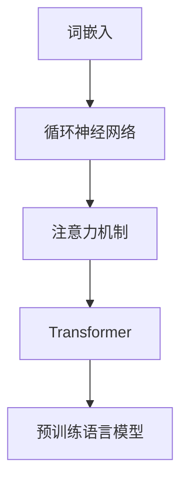

# Natural Language Processing (NLP) 原理与代码实战案例讲解

## 1.背景介绍

自然语言处理（NLP）是人工智能和计算语言学的一个重要分支，旨在实现计算机对人类语言的理解、生成和处理。随着大数据和深度学习技术的发展，NLP在各个领域的应用越来越广泛，如机器翻译、情感分析、文本生成和信息检索等。

NLP的研究始于20世纪50年代，最初的目标是通过规则和统计方法来处理语言数据。近年来，深度学习模型，特别是基于神经网络的模型，如Transformer和BERT，极大地提升了NLP的性能和应用范围。

## 2.核心概念与联系

### 2.1 自然语言处理的基本任务

NLP的基本任务可以分为以下几类：

- **文本分类**：将文本分为预定义的类别，如垃圾邮件检测。
- **命名实体识别（NER）**：识别文本中的实体，如人名、地名等。
- **情感分析**：判断文本的情感倾向，如正面、负面或中性。
- **机器翻译**：将一种语言的文本翻译成另一种语言。
- **文本生成**：生成与输入文本相关的自然语言文本，如自动摘要和对话生成。

### 2.2 关键技术与模型

NLP的关键技术和模型包括：

- **词嵌入（Word Embedding）**：将词语表示为向量，如Word2Vec和GloVe。
- **循环神经网络（RNN）**：处理序列数据的神经网络，如LSTM和GRU。
- **注意力机制（Attention Mechanism）**：提升模型对长距离依赖的处理能力。
- **Transformer**：基于注意力机制的模型，广泛应用于各种NLP任务。
- **预训练语言模型**：如BERT、GPT等，通过大规模语料库预训练，然后在特定任务上微调。

### 2.3 关键概念之间的联系

这些技术和模型之间的联系可以通过以下Mermaid图示来展示：



## 3.核心算法原理具体操作步骤

### 3.1 词嵌入

词嵌入是将词语表示为低维向量的技术，常用的方法有Word2Vec和GloVe。其基本步骤如下：

1. **构建词汇表**：从语料库中提取所有独特的词语。
2. **训练模型**：使用Skip-gram或CBOW模型训练词嵌入。
3. **生成词向量**：将词语映射到向量空间。

### 3.2 循环神经网络

RNN用于处理序列数据，其基本步骤如下：

1. **输入序列**：将输入序列分成时间步。
2. **隐藏状态更新**：在每个时间步更新隐藏状态。
3. **输出生成**：根据隐藏状态生成输出。

### 3.3 注意力机制

注意力机制用于提升模型对长距离依赖的处理能力，其基本步骤如下：

1. **计算注意力权重**：根据查询、键和值计算注意力权重。
2. **加权求和**：根据注意力权重对值进行加权求和。
3. **生成输出**：将加权求和结果作为输出。

### 3.4 Transformer

Transformer是基于注意力机制的模型，其基本步骤如下：

1. **输入嵌入**：将输入序列嵌入到向量空间。
2. **多头注意力**：使用多头注意力机制处理输入。
3. **前馈神经网络**：通过前馈神经网络生成输出。
4. **堆叠层**：重复上述步骤多次。

### 3.5 预训练语言模型

预训练语言模型通过大规模语料库预训练，然后在特定任务上微调，其基本步骤如下：

1. **预训练**：在大规模语料库上训练模型。
2. **微调**：在特定任务上微调模型。

## 4.数学模型和公式详细讲解举例说明

### 4.1 词嵌入

词嵌入的数学模型可以表示为：

$$
\text{Word2Vec:} \quad P(w_O | w_I) = \frac{\exp(v_{w_O} \cdot v_{w_I})}{\sum_{w \in V} \exp(v_w \cdot v_{w_I})}
$$

其中，$w_O$ 是目标词，$w_I$ 是上下文词，$v_{w_O}$ 和 $v_{w_I}$ 是对应的词向量，$V$ 是词汇表。

### 4.2 循环神经网络

RNN的数学模型可以表示为：

$$
h_t = \sigma(W_h \cdot h_{t-1} + W_x \cdot x_t + b_h)
$$

其中，$h_t$ 是时间步 $t$ 的隐藏状态，$x_t$ 是输入，$W_h$ 和 $W_x$ 是权重矩阵，$b_h$ 是偏置，$\sigma$ 是激活函数。

### 4.3 注意力机制

注意力机制的数学模型可以表示为：

$$
\text{Attention}(Q, K, V) = \text{softmax}\left(\frac{QK^T}{\sqrt{d_k}}\right) V
$$

其中，$Q$ 是查询矩阵，$K$ 是键矩阵，$V$ 是值矩阵，$d_k$ 是键的维度。

### 4.4 Transformer

Transformer的数学模型可以表示为：

$$
\text{MultiHead}(Q, K, V) = \text{Concat}(\text{head}_1, \ldots, \text{head}_h) W^O
$$

其中，$\text{head}_i = \text{Attention}(QW_i^Q, KW_i^K, VW_i^V)$，$W_i^Q$、$W_i^K$、$W_i^V$ 和 $W^O$ 是权重矩阵。

### 4.5 预训练语言模型

预训练语言模型的数学模型可以表示为：

$$
L = -\sum_{i=1}^N \log P(w_i | w_{i-k}, \ldots, w_{i-1})
$$

其中，$L$ 是损失函数，$N$ 是词语数量，$w_i$ 是第 $i$ 个词，$k$ 是上下文窗口大小。

## 5.项目实践：代码实例和详细解释说明

### 5.1 词嵌入

以下是使用Gensim库训练Word2Vec模型的示例代码：

```python
from gensim.models import Word2Vec

# 训练数据
sentences = [["I", "love", "natural", "language", "processing"],
             ["NLP", "is", "fun", "and", "exciting"]]

# 训练Word2Vec模型
model = Word2Vec(sentences, vector_size=100, window=5, min_count=1, workers=4)

# 获取词向量
vector = model.wv['natural']
print(vector)
```

### 5.2 循环神经网络

以下是使用TensorFlow实现简单RNN的示例代码：

```python
import tensorflow as tf

# 输入数据
inputs = tf.random.normal([32, 10, 8])  # batch_size, time_steps, input_dim

# RNN层
rnn = tf.keras.layers.SimpleRNN(16)  # units

# 获取输出
output = rnn(inputs)
print(output)
```

### 5.3 注意力机制

以下是实现简单注意力机制的示例代码：

```python
import tensorflow as tf

# 输入数据
query = tf.random.normal([32, 10, 8])  # batch_size, query_len, dim
key = tf.random.normal([32, 15, 8])    # batch_size, key_len, dim
value = tf.random.normal([32, 15, 8])  # batch_size, value_len, dim

# 计算注意力权重
score = tf.matmul(query, key, transpose_b=True)  # [batch_size, query_len, key_len]
weights = tf.nn.softmax(score, axis=-1)  # [batch_size, query_len, key_len]

# 加权求和
output = tf.matmul(weights, value)  # [batch_size, query_len, dim]
print(output)
```

### 5.4 Transformer

以下是使用TensorFlow实现Transformer的示例代码：

```python
import tensorflow as tf
from tensorflow.keras.layers import Dense, LayerNormalization, MultiHeadAttention

class TransformerBlock(tf.keras.layers.Layer):
    def __init__(self, embed_dim, num_heads, ff_dim):
        super(TransformerBlock, self).__init__()
        self.att = MultiHeadAttention(num_heads=num_heads, key_dim=embed_dim)
        self.ffn = tf.keras.Sequential(
            [Dense(ff_dim, activation="relu"), Dense(embed_dim),]
        )
        self.layernorm1 = LayerNormalization(epsilon=1e-6)
        self.layernorm2 = LayerNormalization(epsilon=1e-6)

    def call(self, inputs, training):
        attn_output = self.att(inputs, inputs)
        out1 = self.layernorm1(inputs + attn_output)
        ffn_output = self.ffn(out1)
        return self.layernorm2(out1 + ffn_output)

# 输入数据
inputs = tf.random.normal([32, 10, 64])  # batch_size, time_steps, embed_dim

# Transformer层
transformer_block = TransformerBlock(embed_dim=64, num_heads=8, ff_dim=128)

# 获取输出
output = transformer_block(inputs)
print(output)
```

### 5.5 预训练语言模型

以下是使用Hugging Face的Transformers库加载预训练BERT模型的示例代码：

```python
from transformers import BertTokenizer, TFBertModel

# 加载预训练模型和分词器
tokenizer = BertTokenizer.from_pretrained('bert-base-uncased')
model = TFBertModel.from_pretrained('bert-base-uncased')

# 输入文本
text = "Natural language processing is fascinating."
inputs = tokenizer(text, return_tensors="tf")

# 获取输出
outputs = model(inputs)
print(outputs)
```

## 6.实际应用场景

### 6.1 机器翻译

机器翻译是NLP的一个重要应用，通过将一种语言的文本翻译成另一种语言。常用的模型有基于RNN的Seq2Seq模型和基于Transformer的模型，如Google的Transformer和OpenAI的GPT。

### 6.2 情感分析

情感分析用于判断文本的情感倾向，广泛应用于社交媒体监控、市场调研和客户反馈分析。常用的方法有基于词典的方法和基于机器学习的方法，如SVM和深度学习模型。

### 6.3 命名实体识别

命名实体识别用于识别文本中的实体，如人名、地名和组织名。常用的方法有条件随机场（CRF）和基于神经网络的方法，如BiLSTM-CRF和BERT。

### 6.4 文本生成

文本生成用于生成与输入文本相关的自然语言文本，广泛应用于自动摘要、对话生成和内容创作。常用的模型有基于RNN的Seq2Seq模型和基于Transformer的模型，如GPT。

### 6.5 信息检索

信息检索用于从大量文本数据中检索相关信息，广泛应用于搜索引擎和问答系统。常用的方法有基于倒排索引的方法和基于深度学习的方法，如DSSM和BERT。

## 7.工具和资源推荐

### 7.1 开源工具

- **NLTK**：一个用于处理自然语言文本的Python库，提供了丰富的工具和数据集。
- **spaCy**：一个高效的自然语言处理库，支持多种语言和任务。
- **Gensim**：一个用于训练词嵌入和主题模型的Python库。
- **Transformers**：Hugging Face提供的一个用于加载和微调预训练语言模型的库。

### 7.2 数据集

- **IMDB**：一个用于情感分析的电影评论数据集。
- **CoNLL-2003**：一个用于命名实体识别的标准数据集。
- **SQuAD**：一个用于问答系统的阅读理解数据集。
- **WMT**：一个用于机器翻译的多语言平行语料库。

### 7.3 在线资源

- **Kaggle**：一个数据科学竞赛平台，提供丰富的数据集和代码示例。
- **Coursera**：提供多种NLP相关的在线课程，如斯坦福大学的《自然语言处理》课程。
- **arXiv**：一个开放获取的学术论文预印本平台，提供最新的NLP研究论文。

## 8.总结：未来发展趋势与挑战

### 8.1 未来发展趋势

- **多模态学习**：结合文本、图像和音频等多种模态的数据，提升模型的理解和生成能力。
- **自监督学习**：通过大规模无标签数据进行预训练，减少对标注数据的依赖。
- **可解释性**：提升模型的可解释性，使其决策过程更加透明和可理解。
- **低资源语言处理**：提升对低资源语言的处理能力，促进语言的多样性和公平性。

### 8.2 挑战

- **数据隐私和安全**：在处理敏感数据时，如何保护用户隐私和数据安全。
- **模型偏见**：如何减少模型在性别、种族等方面的偏见，提升公平性。
- **计算资源**：大规模预训练模型需要大量的计算资源，如何提升计算效率和降低成本。
- **跨领域迁移**：如何提升模型在不同领域和任务之间的迁移能力，增强通用性。

## 9.附录：常见问题与解答

### 9.1 什么是词嵌入？

词嵌入是将词语表示为低维向量的技术，常用的方法有Word2Vec和GloVe。词嵌入可以捕捉词语之间的语义关系，提升模型的性能。

### 9.2 什么是循环神经网络？

循环神经网络（RNN）是一种处理序列数据的神经网络，常用于时间序列预测和自然语言处理。RNN通过隐藏状态在时间步之间传递信息，能够捕捉序列中的依赖关系。

### 9.3 什么是注意力机制？

注意力机制是一种提升模型对长距离依赖处理能力的技术，广泛应用于机器翻译和文本生成等任务。注意力机制通过计算注意力权重，对输入序列中的重要部分进行加权求和。

### 9.4 什么是Transformer？

Transformer是一种基于注意力机制的模型，广泛应用于各种NLP任务。Transformer通过多头注意力机制和前馈神经网络处理输入序列，具有较高的并行计算能力和性能。

### 9.5 什么是预训练语言模型？

预训练语言模型通过大规模语料库进行预训练，然后在特定任务上进行微调，提升模型的性能和泛化能力。常用的预训练语言模型有BERT、GPT和RoBERTa等。

---

作者：禅与计算机程序设计艺术 / Zen and the Art of Computer Programming