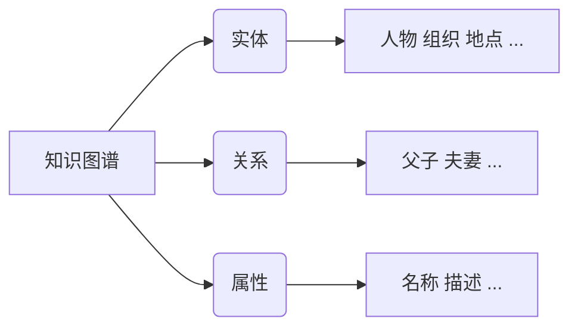
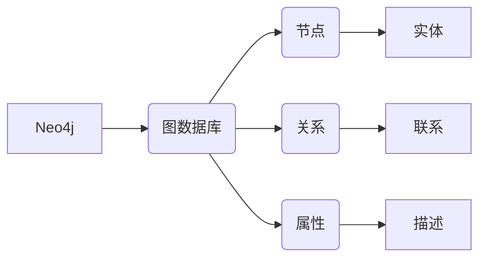
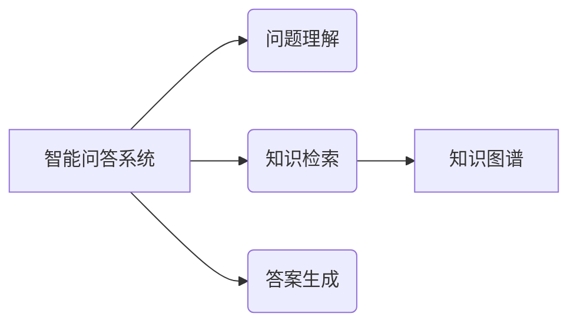
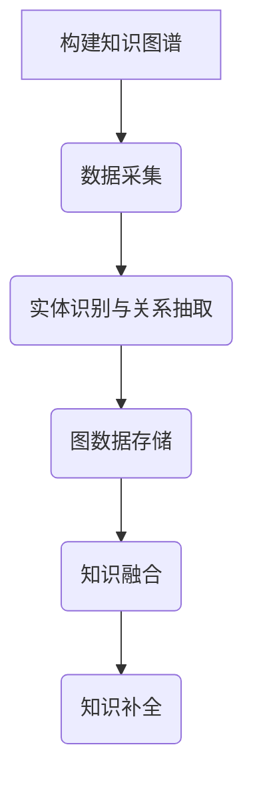
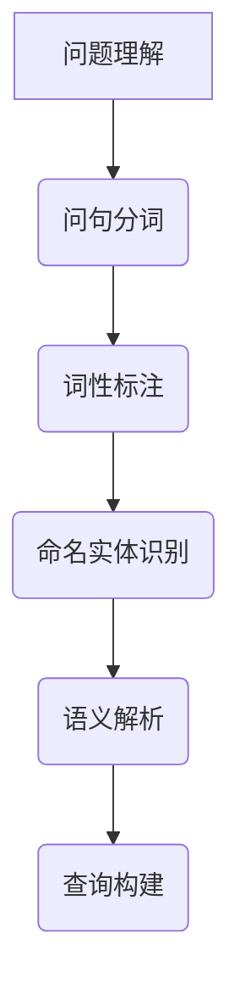
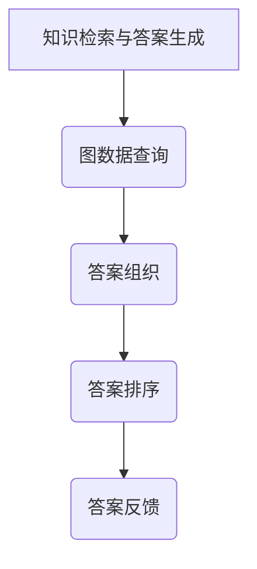

# Neo4j在智能客服领域的应用:知识图谱驱动的智能问答

## 1.背景介绍

### 1.1 智能客服的重要性

随着互联网技术的快速发展,客户服务已经成为企业保持竞争力和提高客户满意度的关键因素。传统的客服模式已经无法满足现代客户的需求,他们期望获得更加智能化、个性化和高效的服务体验。因此,智能客服应运而生,它利用人工智能、自然语言处理等先进技术,旨在提供更加智能化和人性化的客户服务。

### 1.2 知识图谱在智能问答中的作用

知识图谱是一种结构化的知识表示形式,它将知识以实体、关系和属性的形式组织起来,形成一个语义网络。在智能问答系统中,知识图谱可以提供丰富的背景知识,帮助系统更好地理解问题,并生成更加准确和相关的答案。

### 1.3 Neo4j简介

Neo4j是一种流行的图形数据库,它以图形的形式存储和管理数据。由于知识图谱本质上就是一个图形结构,因此Neo4j非常适合构建和管理知识图谱。它提供了丰富的图形查询语言和算法,可以高效地处理图形数据。

## 2.核心概念与联系

### 2.1 知识图谱

知识图谱是一种以图形形式组织的知识库,由实体(节点)、关系(边)和属性(节点/边的属性)组成。它能够有效地表示结构化和非结构化数据之间的语义关联。在智能问答系统中,知识图谱可以提供丰富的背景知识,帮助系统更好地理解问题并生成相关答案。



### 2.2 图数据库Neo4j

Neo4j是一种开源的图形数据库,它以图形的形式存储和管理数据。图形数据库非常适合表示和查询高度连接的数据,如社交网络、推荐系统和知识图谱等。Neo4j提供了声明式的图形查询语言Cypher,可以高效地执行图形查询和遍历操作。



### 2.3 智能问答系统

智能问答系统是一种利用自然语言处理、知识图谱等技术,能够自动回答用户提出的自然语言问题的系统。它通常包括问题理解、知识检索、答案生成等模块。知识图谱在智能问答系统中扮演着关键角色,为系统提供丰富的背景知识,帮助更好地理解问题并生成相关答案。



## 3.核心算法原理具体操作步骤

### 3.1 构建知识图谱

构建知识图谱是智能问答系统的基础,主要包括以下步骤:

1. **数据采集**:从各种结构化和非结构化数据源(如维基百科、新闻报道、企业知识库等)采集相关数据。
2. **实体识别与关系抽取**:利用自然语言处理技术,从采集的数据中识别出实体(如人物、组织、地点等)和它们之间的关系。
3. **图数据存储**:将识别出的实体、关系和属性数据存储到Neo4j图数据库中,形成知识图谱。
4. **知识融合**:将来自不同数据源的知识进行融合,消除冲突和重复,形成一致的知识图谱。
5. **知识补全**:利用知识推理、embedding等技术,对知识图谱进行补全和扩充。



### 3.2 问题理解

问题理解是智能问答系统的核心环节,主要包括以下步骤:

1. **问句分词**:将自然语言问句分解成一个个单词或词组。
2. **词性标注**:为每个单词或词组标注其词性(名词、动词、形容词等)。
3. **命名实体识别**:识别出问句中的命名实体,如人物、地点、组织等。
4. **语义解析**:分析问句的语义结构,确定问题类型(如定义、列举、因果等)和关键词。
5. **查询构建**:根据问句的语义信息,构建对应的查询语句(如Cypher查询语句)。



### 3.3 知识检索与答案生成

知识检索与答案生成是智能问答系统的另一个关键环节,主要包括以下步骤:

1. **图数据查询**:利用构建的查询语句在Neo4j知识图谱中进行查询,获取相关的实体、关系和属性数据。
2. **答案组织**:对查询结果进行处理和组织,形成自然语言的答案文本。
3. **答案排序**:如果有多个候选答案,则根据相关性打分,选择最佳答案。
4. **答案反馈**:将生成的答案反馈给用户,并根据用户反馈进行持续学习和改进。



## 4.数学模型和公式详细讲解举例说明

在智能问答系统中,常常需要利用一些数学模型和算法来提高系统的性能和准确性。下面介绍一些常用的模型和公式:

### 4.1 文本相似度计算

文本相似度计算是自然语言处理中一个重要的任务,在问题理解和答案匹配等环节都会用到。常用的文本相似度计算方法包括:

1. **编辑距离(Edit Distance)**

编辑距离是计算两个字符串之间的相似度的一种方法,它表示将一个字符串转换为另一个字符串所需的最小编辑操作次数(插入、删除或替换)。编辑距离越小,两个字符串越相似。

$$
ED(s_1, s_2) = \begin{cases}
0 & \text{if } s_1 = s_2 = \empty \\
|s_2| & \text{if } s_1 = \empty \\
|s_1| & \text{if } s_2 = \empty \\
\min\begin{cases}
ED(s_1[:-1], s_2) + 1 \\
ED(s_1, s_2[:-1]) + 1 \\
ED(s_1[:-1], s_2[:-1]) + 1_{(s_1[-1] \neq s_2[-1])}
\end{cases} & \text{otherwise}
\end{cases}
$$

其中 $s_1$ 和 $s_2$ 表示两个字符串, $|s|$ 表示字符串 $s$ 的长度, $1_{(s_1[-1] \neq s_2[-1])}$ 是指示函数,当 $s_1$ 的最后一个字符与 $s_2$ 的最后一个字符不同时取值为 1,否则为 0。

2. **余弦相似度(Cosine Similarity)**

余弦相似度是一种常用的文本相似度计算方法,它基于将文本表示为向量,然后计算两个向量之间的夹角余弦值。余弦值越接近 1,表示两个文本越相似。

$$
\text{sim}(X, Y) = \cos(\theta) = \frac{X \cdot Y}{\|X\|\|Y\|} = \frac{\sum_{i=1}^{n}X_iY_i}{\sqrt{\sum_{i=1}^{n}X_i^2}\sqrt{\sum_{i=1}^{n}Y_i^2}}
$$

其中 $X$ 和 $Y$ 表示两个文本的向量表示, $n$ 是向量的维度, $X_i$ 和 $Y_i$ 分别表示向量 $X$ 和 $Y$ 在第 $i$ 个维度上的值。

### 4.2 知识图谱embedding

知识图谱embedding是将实体和关系映射到低维连续向量空间的技术,它可以捕捉实体和关系之间的语义信息,并支持对知识图谱进行各种机器学习任务,如链接预测、三元组完成等。常用的知识图谱embedding模型包括TransE、DistMult等。

以TransE模型为例,它将每个实体和关系映射到低维向量空间中,并假设对于一个有效的三元组 $(h, r, t)$,它们之间应该满足:

$$
\vec{h} + \vec{r} \approx \vec{t}
$$

其中 $\vec{h}$、$\vec{r}$ 和 $\vec{t}$ 分别表示头实体 $h$、关系 $r$ 和尾实体 $t$ 的向量表示。模型的目标是学习这些向量表示,使得所有有效三元组的scored函数值最小化,而无效三元组的scored函数值最大化。scored函数定义如下:

$$
f_r(h, t) = -\|\vec{h} + \vec{r} - \vec{t}\|_{1/2}
$$

通过优化该目标函数,TransE可以学习出实体和关系的embedding向量表示。

## 5.项目实践:代码实例和详细解释说明

在本节中,我们将通过一个实际的项目案例,展示如何使用Neo4j构建知识图谱,并基于该知识图谱开发一个智能问答系统。

### 5.1 项目概述

我们将构建一个基于维基百科数据的知识图谱,并开发一个智能问答系统,能够回答关于历史人物、地理位置等方面的问题。

### 5.2 构建知识图谱

首先,我们需要从维基百科采集相关数据,并将其存储到Neo4j图数据库中,形成知识图谱。以下是构建知识图谱的Python代码示例:

```python
from neo4j import GraphDatabase

# 连接Neo4j数据库
driver = GraphDatabase.driver("bolt://localhost:7687", auth=("neo4j", "password"))

# 创建节点和关系
with driver.session() as session:
    # 创建人物节点
    session.run("CREATE (:Person {name: '牛顿', description: '著名物理学家和数学家'})")
    session.run("CREATE (:Person {name: '爱因斯坦', description: '著名物理学家'})")

    # 创建地点节点
    session.run("CREATE (:Place {name: '英国', description: '欧洲国家'})")
    session.run("CREATE (:Place {name: '德国', description: '欧洲国家'})")

    # 创建人物与地点之间的关系
    session.run("MATCH (p:Person), (c:Place) WHERE p.name = '牛顿' AND c.name = '英国' CREATE (p)-[:FROM]->(c)")
    session.run("MATCH (p:Person), (c:Place) WHERE p.name = '爱因斯坦' AND c.name = '德国' CREATE (p)-[:FROM]->(c)")

# 关闭数据库连接
driver.close()
```

上述代码首先连接到本地Neo4j数据库,然后创建了几个人物节点和地点节点,并使用`FROM`关系将人物与出生地点连接起来。

### 5.3 智能问答系统

接下来,我们将开发一个简单的智能问答系统,能够回答关于人物出生地的问题。以下是Python代码示例:

```python
from neo4j import GraphDatabase

# 连接Neo4j数据库
driver = GraphDatabase.driver("bolt://localhost:7687", auth=("neo4j", "password"))

# 问题理解和查询构建
def parse_question(question):
    tokens = question.split()
    if tokens[0] == "谁" and tokens[-1] == "出生":
        person_name = " ".join(tokens[1:-1])
        query = f"MATCH (p:Person)-[:FROM]->(c:Place) WHERE p.name = '{person_name}' RETURN c.name"
        return query
    else: