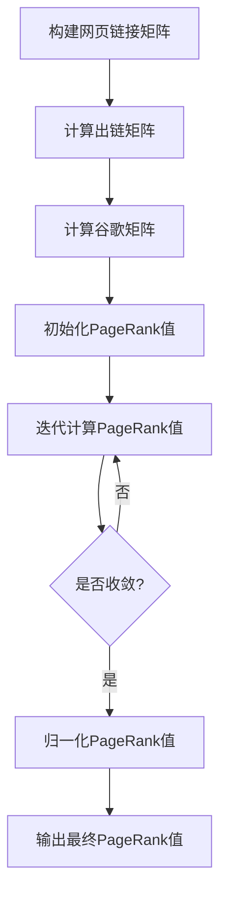
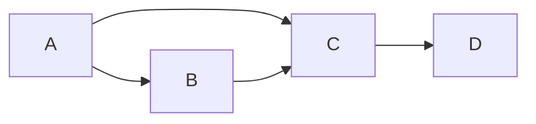

# PageRank 原理与代码实例讲解

## 1.背景介绍

### 1.1 PageRank算法的重要性

在当今信息时代,网络已经成为人们获取知识和信息的主要渠道之一。然而,由于网络上信息量的爆炸式增长,如何从海量的网页中快速找到高质量、相关性强的网页,成为了一个亟待解决的问题。这就催生了PageRank算法的诞生。

PageRank是谷歌公司创始人拉里·佩奇(Larry Page)和谢尔盖·布林(Sergey Brin)在20世纪90年代后期提出的一种重要的网页排名算法。它通过对网页的重要性进行评估和排名,为搜索引擎提供了一种行之有效的网页排序方法,从而大大提高了搜索结果的质量和相关性。自从被应用于谷歌搜索引擎以来,PageRank算法就产生了深远的影响,成为网络信息检索领域的经典算法之一。

### 1.2 PageRank算法的本质

PageRank算法的核心思想是通过网页之间的链接结构来评估一个网页的重要程度。算法认为,一个高质量的网页往往会受到其他重要网页的多次链接,而链接到这个网页的网页也同样重要。因此,PageRank算法将网页重要性的概念与网页之间的超链接紧密结合,构建了一个迭代的链接分析模型。

在这个模型中,PageRank算法假设,每个网页都是一个节点,网页之间的链接就是节点之间的边。一个网页的PageRank值会通过链接被传递到其他网页,同时也会从链接到该网页的其他网页处获得一定的PageRank值。通过不断迭代,直到PageRank值收敛,最终每个网页都会获得一个全局的重要性评分,这个评分就是该网页的PageRank值。

## 2.核心概念与联系

### 2.1 PageRank算法的核心概念

为了更好地理解PageRank算法,我们需要先掌握以下几个核心概念:

1. **网页重要性(Page Importance)**: PageRank算法认为,一个网页的重要性取决于链接到该网页的其他网页的重要性及其数量。

2. **链接投票(Link Voting)**: 每个链接到某个网页的其他网页,都可以被看作是对该网页重要性的一种"投票"。一个网页获得的"投票"越多,它的重要性就越高。

3. **PageRank值(PageRank Value)**: 每个网页都会被赋予一个PageRank值,用于衡量该网页的重要程度。PageRank值越高,网页的重要性就越大。

4. **随机浏览(Random Surfing)**: PageRank算法假设,网络浏览者在浏览网页时会以一定的概率随机跳转到其他网页,而不是仅沿着链接前进。这种随机行为被称为"随机浏览"。

5. **迭代计算(Iterative Calculation)**: PageRank算法通过不断迭代计算,直到每个网页的PageRank值收敛为一个稳定值。

6. **阻尼因子(Damping Factor)**: 在PageRank算法中,引入了一个阻尼因子,用于控制"随机浏览"的概率。通常,阻尼因子的取值范围在0.8到0.9之间。

### 2.2 PageRank算法与其他算法的联系

PageRank算法与其他一些著名的算法存在着密切的联系,例如:

1. **随机游走(Random Walk)**: PageRank算法的"随机浏览"过程实际上可以看作是一个随机游走过程,网络浏览者在网页之间随机游走。

2. **马尔可夫链(Markov Chain)**: PageRank算法可以被视为一个马尔可夫链模型,其中网页是状态,链接是状态之间的转移概率。

3. **特征向量(Eigenvector)**: PageRank算法的数学模型可以表示为一个特征向量问题,PageRank值就是该特征向量的元素。

4. **PageRank算法与HITS算法**: HITS算法也是一种基于链接分析的网页排名算法,但它将网页分为"中心(Hub)"和"权威(Authority)"两种角色。PageRank算法可以看作是HITS算法的一个特例。

5. **PageRank算法与社会网络分析**: PageRank算法的思想也被应用于社会网络分析领域,用于评估个体在社会网络中的重要性和影响力。

通过上述概念和联系,我们可以看出,PageRank算法不仅在网页排名领域有重要应用,同时也与图论、概率论、线性代数等多个数学领域紧密相关,具有深刻的理论基础。

## 3.核心算法原理具体操作步骤 

### 3.1 PageRank算法原理

PageRank算法的核心思想是通过网页之间的链接结构来评估一个网页的重要程度。具体来说,PageRank算法认为:

1. 一个高质量的网页往往会受到其他重要网页的多次链接。
2. 链接到这个网页的网页也同样重要。

因此,PageRank算法将网页重要性的概念与网页之间的超链接紧密结合,构建了一个迭代的链接分析模型。

在这个模型中,PageRank算法假设网络是一个有向图,每个网页都是一个节点,网页之间的链接就是节点之间的边。一个网页的PageRank值会通过链接被传递到其他网页,同时也会从链接到该网页的其他网页处获得一定的PageRank值。

### 3.2 PageRank算法具体操作步骤

PageRank算法的具体操作步骤如下:

1. **构建网页链接矩阵**

首先,我们需要将网络中所有网页及其链接关系表示为一个矩阵,称为链接矩阵(Link Matrix)。链接矩阵是一个 $n \times n$ 的矩阵,其中 $n$ 是网络中网页的总数。如果网页 $i$ 链接到网页 $j$,则链接矩阵中的元素 $L_{ij} = 1$,否则 $L_{ij} = 0$。

2. **计算出链矩阵**

接下来,我们需要计算出链矩阵(Outlink Matrix),它是链接矩阵的转置矩阵。出链矩阵 $O$ 的元素 $O_{ij}$ 表示从网页 $i$ 链接到网页 $j$ 的链接数量。

3. **计算谷歌矩阵**

谷歌矩阵(Google Matrix) $G$ 是一个 $n \times n$ 的矩阵,它的元素 $G_{ij}$ 表示网页 $j$ 将其 PageRank 值的多少部分传递给网页 $i$。谷歌矩阵可以通过以下公式计算:

$$G_{ij} = \alpha \frac{O_{ji}}{\sum_{k=1}^{n}O_{jk}} + (1 - \alpha)\frac{1}{n}$$

其中,α是一个阻尼因子(Damping Factor),通常取值在0.8到0.9之间。第一项表示网页 $j$ 将其 PageRank 值的一部分传递给链接到它的网页 $i$,传递的比例取决于网页 $j$ 的出链数量。第二项表示网页 $j$ 将其剩余的 PageRank 值平均分配给所有网页,这是为了解决环路和孤立节点的问题。

4. **迭代计算 PageRank 值**

有了谷歌矩阵,我们就可以通过迭代的方式计算每个网页的 PageRank 值了。具体步骤如下:

(1) 初始化所有网页的 PageRank 值为 $1/n$,构成一个 $n$ 维列向量 $\vec{p}^{(0)}$。

(2) 计算 $\vec{p}^{(t+1)} = G \vec{p}^{(t)}$,得到下一次迭代的 PageRank 值向量。

(3) 重复步骤(2),直到 $\vec{p}^{(t+1)}$ 和 $\vec{p}^{(t)}$ 之间的差值小于预设的阈值,即 $\left\|\vec{p}^{(t+1)} - \vec{p}^{(t)}\right\| < \epsilon$,此时算法收敛。

(4) 将最终收敛的 PageRank 值向量 $\vec{p}$ 归一化,使其元素之和为 1。

通过上述步骤,我们就可以得到每个网页的最终 PageRank 值,并根据这些值对网页进行排名。

### 3.3 PageRank算法流程图

为了更直观地理解 PageRank 算法的工作流程,我们使用 Mermaid 绘制了一个流程图:

该流程图清晰地展示了 PageRank 算法的各个步骤,从构建链接矩阵开始,经过出链矩阵、谷歌矩阵的计算,进入迭代计算 PageRank 值的循环,直到算法收敛并输出最终的 PageRank 值。

## 4.数学模型和公式详细讲解举例说明

### 4.1 PageRank算法的数学模型

PageRank算法的数学模型可以用一个方程来表示:

$$PR(p_i) = (1 - d) + d \sum_{p_j \in B(p_i)} \frac{PR(p_j)}{L(p_j)}$$

其中:

- $PR(p_i)$ 表示网页 $p_i$ 的 PageRank 值
- $B(p_i)$ 是一个集合,包含所有链接到网页 $p_i$ 的网页
- $L(p_j)$ 表示网页 $p_j$ 的出链数量,即从 $p_j$ 链接出去的链接数
- $d$ 是一个阻尼因子(Damping Factor),通常取值在 0.8 到 0.9 之间,用于控制"随机浏览"的概率

这个方程可以解释为:一个网页的 PageRank 值由两部分组成。第一部分是 $(1 - d)$,表示网络浏览者有 $(1 - d)$ 的概率随机浏览到该网页,而不是沿着链接前进。第二部分是 $d \sum_{p_j \in B(p_i)} \frac{PR(p_j)}{L(p_j)}$,表示该网页从链接到它的其他网页处获得的 PageRank 值的总和。每个链接到该网页的网页 $p_j$ 将其 PageRank 值的 $\frac{1}{L(p_j)}$ 部分平均分配给它所链接的所有网页。

我们可以将上述方程写成矩阵形式:

$$\vec{PR} = (1 - d) \vec{e} + d M \vec{PR}$$

其中:

- $\vec{PR}$ 是一个列向量,表示所有网页的 PageRank 值
- $\vec{e}$ 是一个全 1 列向量,表示随机浏览的概率分布
- $M$ 是一个列归一化的转移矩阵(Transition Matrix),其元素 $M_{ij} = \frac{1}{L(p_j)}$ 如果网页 $p_j$ 链接到网页 $p_i$,否则为 0

通过迭代计算,我们可以得到 PageRank 值向量 $\vec{PR}$ 的稳定解。

### 4.2 PageRank算法公式详解和举例

为了更好地理解 PageRank 算法的数学模型,我们来看一个具体的例子。

假设我们有一个小型网络,包含 4 个网页 A、B、C 和 D,它们之间的链接关系如下图所示:

我们可以构建出这个网络的链接矩阵 $L$:

$$L = \begin{bmatrix}
0 & 1 & 1 & 0\\
0 & 0 & 1 & 0\\
0 & 0 & 0 & 1\\
0 & 0 & 0 & 0
\end{bmatrix}$$

接下来,我们计算出链矩阵 $O$,它是链接矩阵的转置:

$$O = \begin{bmatrix}
0 & 0 & 0 & 0\\
1 & 0 