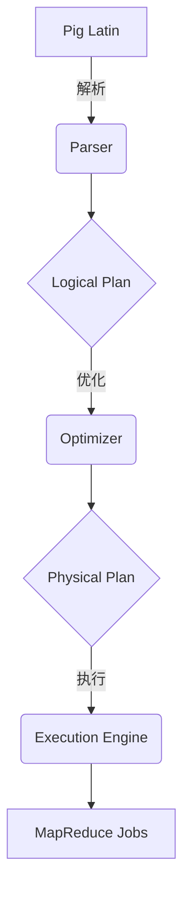

# Pig大规模数据分析平台原理与代码实例讲解

## 1.背景介绍

在当今大数据时代，企业和组织面临着海量数据的挑战。传统的数据处理方式已无法满足现代数据分析的需求。Apache Pig作为一种高级数据流语言,旨在简化大规模数据集的ETL(提取、转换和加载)过程。它提供了一种类似SQL的语言,使开发人员能够轻松地表达复杂的数据分析任务,而无需深入了解底层MapReduce框架的细节。

Pig的出现解决了以下几个关键问题:

1. **简化大数据处理**: Pig抽象出了MapReduce的复杂性,使用户可以专注于数据分析逻辑,而不必关注底层的实现细节。
2. **提高开发效率**: Pig提供了类似SQL的数据流语言,使得数据分析任务可以更加简洁、高效地表达。
3. **优化执行效率**: Pig的优化器能够自动优化数据流程序,提高执行效率。
4. **扩展性强**: Pig支持用户自定义函数(UDF),可以根据需求扩展功能。

Pig已经广泛应用于各个行业的大数据分析场景,如网络日志分析、用户行为分析、推荐系统等,成为大数据处理的重要工具之一。

## 2.核心概念与联系

### 2.1 Pig架构

Pig的架构主要包括以下几个核心组件:



1. **Pig Latin**: 类似SQL的数据流语言,用于表达数据分析任务。
2. **Parser**: 将Pig Latin脚本解析为逻辑执行计划(Logical Plan)。
3. **Optimizer**: 对逻辑执行计划进行优化,生成物理执行计划(Physical Plan)。
4. **Execution Engine**: 执行物理执行计划,生成MapReduce作业提交到Hadoop集群运行。

### 2.2 数据模型

Pig的数据模型包括以下几个核心概念:

- **Relation**: 类似于关系数据库中的表,由元组(Tuple)组成。
- **Tuple**: 一个有序的数据集合,类似于关系数据库中的行。
- **Field**: 元组中的单个数据项,类似于关系数据库中的列。
- **Bag**: 一个元组集合,类似于关系数据库中的表。

这些概念与关系数据库类似,但更加灵活,可以处理半结构化和非结构化数据。

### 2.3 数据流

Pig Latin脚本描述了一个数据流,它定义了一系列的数据转换操作。每个操作都接收一个或多个关系作为输入,并产生一个新的关系作为输出。这种数据流编程模型使得数据分析任务可以更加清晰、模块化地表达。

## 3.核心算法原理具体操作步骤  

Pig在执行数据分析任务时,主要经历以下几个步骤:

1. **解析(Parsing)**: 将Pig Latin脚本解析为逻辑执行计划(Logical Plan)。

2. **逻辑优化(Logical Optimization)**: 对逻辑执行计划进行优化,如投影列裁剪、过滤器下推等,以提高执行效率。

3. **规划(Planning)**: 将优化后的逻辑执行计划映射为物理执行计划(Physical Plan),包括选择合适的算子实现、确定分区策略等。

4. **物理优化(Physical Optimization)**: 对物理执行计划进行进一步优化,如并行化、合并作业等。

5. **执行(Execution)**: 将物理执行计划转换为一个或多个MapReduce作业,并提交到Hadoop集群执行。

以下是一个简单的WordCount示例,展示了Pig Latin语言的基本用法:

```pig
-- 加载数据
lines = LOAD 'input.txt' AS (line:chararray);

-- 将每行拆分为单词
words = FOREACH lines GENERATE FLATTEN(TOKENIZE(line)) AS word;

-- 计算每个单词出现的次数
grouped = GROUP words BY word;
wordcount = FOREACH grouped GENERATE group, COUNT(words);

-- 存储结果
STORE wordcount INTO 'output' USING PigStorage();
```

在这个示例中:

1. 首先使用`LOAD`操作加载输入数据。
2. 然后使用`FOREACH ... GENERATE`操作将每行拆分为单词。
3. 使用`GROUP`操作按单词分组。
4. 使用`FOREACH ... GENERATE`操作计算每个组(即每个单词)的计数。
5. 最后使用`STORE`操作将结果存储到输出目录。

## 4.数学模型和公式详细讲解举例说明

在大数据分析中,常常需要使用一些数学模型和公式来描述和解决问题。Pig支持使用用户自定义函数(UDF)来扩展功能,因此可以在Pig Latin脚本中使用自定义的数学模型和公式。

以下是一个使用线性回归模型进行预测的示例:

假设我们有一个包含多个特征和目标值的数据集,我们希望使用线性回归模型对目标值进行预测。线性回归模型的数学表达式如下:

$$y = \theta_0 + \theta_1x_1 + \theta_2x_2 + ... + \theta_nx_n$$

其中:

- $y$是目标值
- $x_1, x_2, ..., x_n$是特征值
- $\theta_0, \theta_1, ..., \theta_n$是模型参数

我们可以使用梯度下降算法来学习模型参数$\theta$,梯度下降的更新规则如下:

$$\theta_j := \theta_j - \alpha \frac{1}{m} \sum_{i=1}^m (h_\theta(x^{(i)}) - y^{(i)})x_j^{(i)}$$

其中:

- $\alpha$是学习率
- $m$是训练样本数量
- $h_\theta(x)$是模型的预测值,即$\theta_0 + \theta_1x_1 + \theta_2x_2 + ... + \theta_nx_n$

我们可以在Pig中实现一个LineaRegression的UDF,包含以下几个步骤:

1. 加载训练数据
2. 初始化模型参数$\theta$
3. 使用梯度下降算法迭代更新$\theta$
4. 返回学习到的模型参数$\theta$

然后,我们可以使用这个UDF对新的数据进行预测:

```pig
-- 加载测试数据
test_data = LOAD 'test_data.txt' AS (x1:double, x2:double, ..., xn:double);

-- 使用LineaRegression UDF进行预测
predictions = FOREACH test_data GENERATE
    com.mycompany.LinearRegression($0, $1, ..., $n);

-- 存储预测结果
STORE predictions INTO 'predictions.txt';
```

在这个示例中,我们首先加载测试数据,然后使用`LinearRegression`UDF对每个样本进行预测,最后将预测结果存储到输出文件中。

通过在Pig中使用自定义的数学模型和公式,我们可以解决更加复杂的数据分析问题,扩展Pig的功能。

## 5.项目实践:代码实例和详细解释说明

为了更好地理解Pig的使用,我们来看一个实际项目的代码示例。假设我们有一个网站日志数据集,需要对用户访问行为进行分析。

### 5.1 数据准备

首先,我们需要将原始日志数据加载到Pig中。假设日志文件的格式如下:

```
192.168.1.1 - - [24/May/2023:10:22:12 +0800] "GET /index.html HTTP/1.1" 200 4856
```

我们可以使用以下Pig Latin语句加载数据:

```pig
-- 定义日志数据的schema
define LogSchema DATA_SCHEMA('ip:chararray, client:chararray, user:chararray, time:chararray, request:chararray, status:int, bytes:long');

-- 加载日志数据
logs = LOAD 'access_log.txt' USING PigStorage('\\s+') AS (log:chararray);
parsed_logs = FOREACH logs GENERATE FLATTEN(STRSPLIT(log, ' ', LogSchema));
```

在这个示例中,我们首先定义了一个`LogSchema`来描述日志数据的结构。然后使用`LOAD`操作加载原始日志文件,并使用`FOREACH ... GENERATE`操作将每行日志拆分为多个字段。

### 5.2 数据处理

接下来,我们可以对加载的日志数据进行各种处理和分析。例如,统计每个IP访问的页面数量:

```pig
-- 按IP和请求路径分组
grouped = GROUP parsed_logs BY (ip, request);

-- 计算每个组的计数
ip_request_counts = FOREACH grouped GENERATE group, COUNT(parsed_logs);

-- 按IP分组,并合并每个IP的请求计数
ip_counts = GROUP ip_request_counts BY group.ip;
final_counts = FOREACH ip_counts {
    ip = group;
    counts = FOREACH parsed_logs GENERATE FLATTEN(group.request), COUNT(ip_request_counts);
    GENERATE ip, TOBAG(counts) AS page_counts;
}

-- 存储结果
STORE final_counts INTO 'ip_page_counts';
```

在这个示例中,我们首先按IP和请求路径分组,然后计算每个组的计数。接着,我们按IP再次分组,并合并每个IP的请求计数,生成一个Bag,其中包含了每个IP访问的页面及对应的计数。最后,我们将结果存储到输出文件中。

### 5.3 代码解释

以上代码示例中使用了以下几个关键操作:

- `GROUP ... BY`: 按指定的键(key)对数据进行分组。
- `FOREACH ... GENERATE`: 对每个元组执行指定的操作,生成新的元组。
- `FLATTEN`: 将一个Bag中的元组展平为单个元组。
- `TOBAG`: 将一个元组集合转换为一个Bag。

这些操作组合在一起,可以实现各种复杂的数据处理和分析任务。Pig的强大之处在于,它提供了一种声明式的编程模型,使得开发人员可以专注于描述数据转换逻辑,而无需关注底层的实现细节。

## 6.实际应用场景

Pig作为一种高级数据流语言,在各种大数据分析场景中都有广泛的应用。以下是一些典型的应用场景:

1. **网络日志分析**: 分析网站访问日志,了解用户行为、流量模式等,为网站优化和营销决策提供支持。

2. **用户行为分析**: 分析用户在网站、移动应用或其他系统中的行为数据,了解用户偏好和使用习惯,为个性化推荐、运营优化等提供依据。

3. **推荐系统**: 基于用户的历史行为数据,构建协同过滤或内容推荐算法,为用户推荐感兴趣的商品、内容等。

4. **数据清洗和转换**: 对原始数据进行清洗、转换和规范化,为后续的数据分析和建模做准备。

5. **机器学习和数据挖掘**: 将Pig与其他大数据工具(如Mahout、Spark MLlib等)结合,进行机器学习建模和数据挖掘任务。

6. **数据集成**: 从多个异构数据源提取、转换和加载数据,实现数据集成和数据仓库构建。

7. **Ad-hoc分析**: 利用Pig的交互式Shell,进行临时性的数据探索和分析。

总的来说,Pig的优势在于简化了大规模数据处理的复杂性,使得开发人员可以更加专注于数据分析逻辑本身,提高了开发效率和生产力。

## 7.工具和资源推荐

在使用Pig进行大数据分析时,以下工具和资源可能会对您有所帮助:

1. **Apache Pig官方文档**: https://pig.apache.org/docs/latest/
   官方文档提供了详细的语法参考、操作手册和示例,是学习和使用Pig的重要资源。

2. **Pig Book**: https://github.com/aw-altiscale/pig-book
   一本免费的Pig入门书籍,涵盖了Pig的基础知识、高级用法和最佳实践。

3. **Pig脚本编辑器和IDE**: 
   - Pig Grunt Shell: Pig自带的交互式Shell,适合快速原型开发和测试。
   - Pig Eclipse插件: 在Eclipse IDE中编写和调试Pig脚本。
   - IntelliJ IDEA Pig插件: 在IntelliJ IDEA中编写和调试Pig脚本。

4. **Pig性能优化工具**:
   - Pig Stats: 收集Pig作业的执行统计信息,帮助