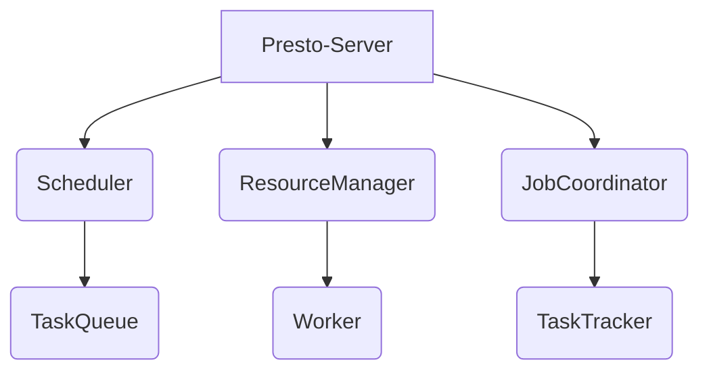
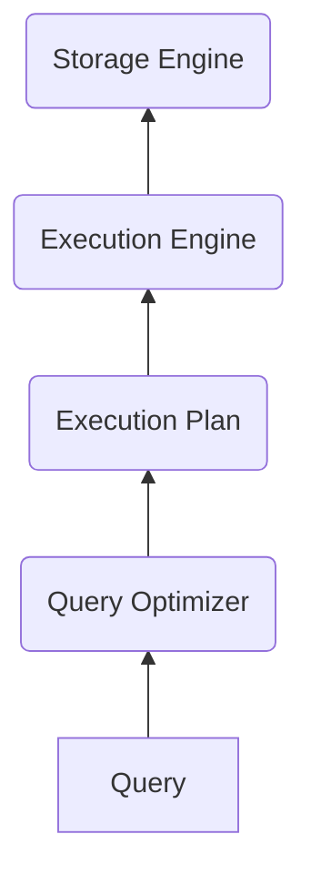

# Presto调度器：高效协调，任务调度游刃有余

## 1.背景介绍

### 1.1 任务调度的重要性

在当今快节奏的商业环境中，高效的任务调度对于确保业务流程的顺利运行至关重要。无论是数据处理、系统维护还是批量作业执行,及时准确地协调和管理各种任务对于提高生产效率、减少资源浪费和确保整体运营的稳定性都至关重要。

### 1.2 传统任务调度器的局限性

传统的任务调度器通常存在一些固有的局限性,例如:

- 可扩展性差:无法轻松应对大规模任务和高并发场景
- 可靠性低:单点故障风险高,缺乏有效的故障恢复机制
- 配置复杂:调度策略和规则配置繁琐,缺乏灵活性
- 监控不足:缺乏全面的监控和报警机制,难以及时发现和处理异常

### 1.3 Presto调度器的优势

为了解决传统任务调度器的这些痛点,Presto应运而生。作为一款高性能、分布式的任务调度框架,Presto具有以下显著优势:

- 高可扩展性:基于分布式架构,可轻松应对大规模任务和高并发场景
- 高可靠性:多副本机制,故障自动切换,数据持久化,确保系统高可用
- 配置灵活:支持多种调度策略,易于配置和管理
- 监控全面:提供全方位的监控和报警功能,实时掌握系统运行状态
- 生态丰富:与主流大数据框架天然集成,部署运维简单高效

## 2.核心概念与联系

### 2.1 Presto架构概览

Presto采用了典型的主从架构,主要由以下几个核心组件组成:

- **Presto-Server**: 作为整个系统的入口,负责接收用户的任务请求,并将其分发给下游组件进行处理。
- **Scheduler**: 调度器,负责制定任务调度策略,并将任务分发到TaskQueue中等待执行。
- **ResourceManager**: 资源管理器,负责管理和分配集群资源,为任务执行提供所需的计算资源。
- **JobCoordinator**: 作业协调器,负责监控和协调整个作业的执行过程,包括任务分发、失败重试、结果收集等。
- **TaskQueue**: 任务队列,用于临时存储等待执行的任务。
- **Worker**: 工作节点,负责实际执行分配到的任务,并将结果返回给JobCoordinator。
- **TaskTracker**: 任务跟踪器,负责监控任务的执行状态,并将信息上报给JobCoordinator。

### 2.2 核心流程

1. 用户提交任务到Presto-Server
2. Presto-Server将任务交给Scheduler进行调度
3. Scheduler根据调度策略,将任务分发到TaskQueue
4. ResourceManager分配所需资源给Worker
5. Worker从TaskQueue获取任务并执行
6. TaskTracker跟踪任务状态,并将信息汇报给JobCoordinator
7. JobCoordinator协调整个作业,处理失败重试等
8. 作业完成后,JobCoordinator收集并返回最终结果

## 3.核心算法原理具体操作步骤  

### 3.1 调度算法

Presto的调度算法是其核心竞争力所在,主要包括以下几个方面:

#### 3.1.1 资源分配算法

Presto采用了基于资源容器的动态资源分配策略。每个Worker都有一个资源容器,用于隔离和限制任务的资源使用。ResourceManager会根据集群的资源使用情况,动态地调整每个容器的资源配额。

具体步骤如下:

1. 收集集群资源使用情况
2. 计算资源剩余量
3. 根据调度策略计算每个容器的资源配额
4. 通知Worker调整容器资源限制

通过这种动态分配策略,Presto可以充分利用集群资源,提高资源利用率。

#### 3.1.2 任务调度算法

Presto的任务调度算法采用了多队列优先级调度和公平调度相结合的策略,具体包括:

**多队列优先级调度**

1. 将任务根据优先级划分到不同队列
2. 高优先级队列的任务优先获得资源和执行

**公平调度**

1. 在同一优先级队列内,按照先来先服务(FIFO)原则调度
2. 通过权重控制不同队列资源分配的公平性

该算法可以在保证高优先级任务优先执行的同时,也避免了资源长期被某些任务独占的情况。

#### 3.1.3 容错与恢复

为了提高系统的可靠性和容错能力,Presto采用了以下策略:

**任务重试**

1. TaskTracker监控到任务执行失败时,会立即通知JobCoordinator
2. JobCoordinator会根据重试策略,将失败任务重新加入TaskQueue等待重试

**数据持久化**

1. 关键数据如作业状态、任务信息等会持久化存储
2. 一旦发生故障,可从持久化数据恢复现场,避免数据丢失

**主备冗余**

1. 为关键组件如Scheduler、JobCoordinator配置多个副本
2. 主节点故障时,备节点自动接管,确保服务的高可用性

通过以上策略,Presto可以在发生故障时自动恢复,大大提高了系统的稳定性和可靠性。

### 3.2 执行引擎

Presto的执行引擎采用了基于Volcano模型的查询执行架构,具有优秀的查询性能。

#### 3.2.1 Volcano模型

Volcano模型是一种经典的查询执行模型,由下至上分为以下几个层次:

1. **查询层(Query)**: 接收用户的SQL查询语句
2. **查询优化器(Query Optimizer)**: 根据数据统计信息,生成高效的执行计划
3. **执行计划(Execution Plan)**: 查询被翻译成一系列可执行的操作树
4. **执行引擎(Execution Engine)**: 执行操作树中的各个操作
5. **存储引擎(Storage Engine)**: 从底层存储系统读取数据

#### 3.2.2 查询优化

Presto的查询优化器会对SQL查询进行一系列优化,以生成高效的执行计划:

1. **语法解析**: 将SQL语句解析成抽象语法树(AST)
2. **逻辑优化**: 对AST进行一些等价变换,如谓词下推、列剪裁等
3. **代数优化**: 基于代数规则对逻辑计划树进行重写,如连接重排等
4. **物理优化**: 选择高效的执行算法,生成最终的物理执行计划

#### 3.2.3 向量化执行

Presto采用了向量化的执行模型,可以充分利用CPU的SIMD指令,大幅提升查询性能。

1. 数据被组织成向量批次(vector batches)
2. 算子对向量批次执行SIMD指令,实现数据的批量处理
3. 减少CPU核心与内存之间的数据交换,降低内存带宽压力

通过向量化执行,Presto可以更高效地利用现代CPU的并行计算能力,从而显著提升查询吞吐量。

## 4.数学模型和公式详细讲解举例说明

在任务调度和资源分配过程中,往往需要借助一些数学模型和公式来指导决策。下面我们就来具体介绍Presto中使用的一些核心数学模型。

### 4.1 资源分配模型

Presto采用了一种基于多维资源的分配模型,用于在Worker节点之间公平分配多种资源(如CPU、内存等)。该模型的核心思想是将多维资源映射到单个标量值,然后基于该标量值进行资源分配。

具体来说,假设有$m$种不同的资源,对于Worker $i$,它在每种资源$j$上的使用量为$r_{ij}$,其对应的资源容量为$R_j$。我们定义Worker $i$的负载$L_i$为:

$$L_i = \max_{1 \le j \le m} \frac{r_{ij}}{R_j}$$

也就是说,Worker $i$的负载等于它在所有资源维度上的最大使用比例。我们的目标是最小化所有Worker的最大负载,即:

$$\min \max_{1 \le i \le n} L_i$$

其中$n$是Worker的总数。

该优化问题可以通过经典的逐次填充(Succssive Filling)算法来求解近似解。算法的基本思路是:

1. 按照非递增顺序排列所有Worker的负载
2. 依次为负载最高的Worker分配增量资源,直到它不再是最高负载
3. 重复步骤2,直到所有Worker的负载接近

该算法可以保证在给定的资源约束下,所有Worker的负载值被尽可能均衡化。

### 4.2 任务调度模型

Presto的任务调度模型旨在为不同优先级的任务合理分配资源,并确保高优先级任务能够被优先执行。该模型基于一种加权公平队列(Weighted Fair Queueing)机制。

具体来说,假设有$n$个优先级队列,每个队列$i$被分配了权重$w_i$,满足$\sum_{i=1}^n w_i = 1$。我们定义队列$i$在时间段$[t_1, t_2]$内的normalized service $S_i$为:

$$S_i = \frac{1}{w_i} \int_{t_1}^{t_2} \frac{r_i(t)}{r(t)} dt$$

其中$r_i(t)$是队列$i$在时间$t$的服务率,$r(t) = \sum_{i=1}^n r_i(t)$是系统的总服务率。

理想情况下,我们希望所有队列的normalized service值相等,即:

$$S_1 = S_2 = \cdots = S_n$$

基于此,Presto的调度器会动态调整每个队列的服务率$r_i(t)$,使得上述等式满足。具体来说,如果某个队列$i$的normalized service值落后于其他队列,则会适当提高它的服务率$r_i(t)$,以确保它能够"赶上"其他队列。

该模型可以确保高优先级队列获得更多的资源,同时也避免了低优先级队列被长期饿死的情况,从而实现了工作负载的合理分配。

### 4.3 容错恢复模型

为了提高系统的容错能力,Presto采用了基于备份的容错恢复模型。该模型的核心思想是为关键组件维护多个副本,一旦主副本发生故障,就立即切换到备用副本,从而确保服务的连续性。

假设某个关键组件有$k$个副本,我们用$p_i$表示第$i$个副本在单位时间内发生故障的概率。那么,该组件在单位时间内发生不可恢复故障(所有副本同时故障)的概率为:

$$P = \prod_{i=1}^k p_i$$

我们的目标是最小化$P$,即最大程度降低不可恢复故障的风险。根据概率乘法原理,我们可以得到:

$$P = p_1 \cdot p_2 \cdots p_k = \left(\prod_{i=1}^k p_i\right)^{1/k}$$

由于$p_i$是一个很小的概率值,因此$P$会随着$k$的增大而快速减小。也就是说,增加副本数量可以有效降低不可恢复故障的风险。

不过,副本数量的增加也会带来额外的资源开销。因此,Presto在确定副本数量时,需要权衡可靠性和资源开销,选择一个合适的值。通常情况下,Presto会为关键组件维护2~3个副本,以获得较好的容错能力。

## 5.项目实践:代码实例和详细解释说明

为了更好地理解Presto的工作原理,我们来看一个简单的示例项目。该项目包含一个基于Presto的批处理作业,用于从MySQL数据库中抽取数据并导入到Hive表中。

### 5.1 环境准备

首先,我