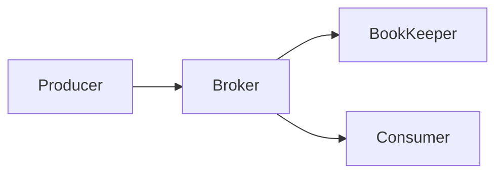

# Pulsar Producer原理与代码实例讲解

## 1. 背景介绍

### 1.1 消息队列与流处理平台的兴起

在现代分布式系统中,消息队列(Message Queue)和流处理(Stream Processing)平台扮演着越来越重要的角色。它们为系统架构提供了灵活性、可扩展性和容错能力,使得构建大规模实时数据处理应用成为可能。

### 1.2 Apache Pulsar的崛起

Apache Pulsar作为一个云原生的分布式消息流平台,凭借其独特的架构设计和强大的特性,在业界得到了广泛的关注和采用。Pulsar既可以作为传统的消息队列使用,又支持流式计算,为企业提供了一站式的数据处理解决方案。

### 1.3 Producer在Pulsar中的重要性

在Pulsar生态系统中,Producer(生产者)负责将消息发送到Pulsar的主题(Topic)中,是数据写入的关键组件。深入理解Pulsar Producer的工作原理和最佳实践,对于构建高效可靠的Pulsar应用至关重要。

## 2. 核心概念与关系

### 2.1 Pulsar的核心概念

- Topic主题:Pulsar中的消息存储和路由单元
- Producer生产者:向主题发送消息的客户端
- Consumer消费者:从主题接收消息的客户端 
- Broker:Pulsar集群的核心节点,负责消息存储和转发
- BookKeeper:分布式日志存储系统,用于持久化消息

### 2.2 Producer与其他组件的关系

Producer通过Pulsar的二进制协议与Broker通信,将消息发送到指定的Topic。Broker将收到的消息持久化到BookKeeper中,并将消息转发给订阅该Topic的Consumer。

下面是Producer与Pulsar其他组件交互的简化Mermaid流程图:



## 3. 核心算法原理与具体操作步骤

### 3.1 Producer消息发送的基本流程

1. 创建Producer实例,指定Topic和配置参数
2. 构造消息对象,设置消息属性和内容
3. 调用send方法发送消息
4. 处理发送结果,重试或记录失败

### 3.2 消息分区(Partitioning)与路由

Pulsar支持将一个Topic划分为多个分区(Partition),以提高并行度和吞吐量。Producer在发送消息时,可以指定分区键(Partition Key),Pulsar根据分区键的哈希值将消息路由到对应的分区。

分区路由的算法可以简化为:

$partition = hash(partitionKey) \bmod numPartitions$

其中,$hash$函数可以是一致性哈希等算法。

### 3.3 批量发送(Batching)优化

为了提高发送效率和降低开销,Pulsar Producer支持批量发送多条消息。将多条消息打包在一起发送,可以减少网络往返次数和序列化开销。

批量发送的基本步骤如下:

1. 创建Producer时启用batching特性
2. 设置最大批次大小和最大等待时间
3. Producer将消息暂存在内存缓冲区中
4. 当批次满或达到最大等待时间时,将批次中的消息打包发送

### 3.4 压缩(Compression)优化

Pulsar支持对消息进行压缩,以减小网络传输和存储开销。常见的压缩算法有:

- LZ4:轻量级高速压缩算法,压缩率较低但CPU开销小
- ZLIB:基于Deflate算法,压缩率高但CPU开销较大
- ZSTD:新一代高性能压缩算法,在压缩率和CPU开销之间取得了较好平衡

Producer可以在创建时指定压缩算法,Pulsar会自动对消息进行压缩和解压缩。

## 4. 数学模型与公式详解

### 4.1 指数退避(Exponential Backoff)重试模型

当Producer发送消息失败时,Pulsar采用指数退避算法进行重试,以避免瞬时故障导致的大量重试。

假设初始重试间隔为$t_0$,最大重试次数为$n$,则第$i$次重试的等待时间为:

$t_i = t_0 \times 2^i, i=0,1,2,...,n-1$

例如,若$t_0=1s$,$n=5$,则重试等待时间序列为:

$1s, 2s, 4s, 8s, 16s$

### 4.2 生产者限流(Rate Limiting)模型

为了避免Producer突发流量对Broker造成压力,Pulsar支持对Producer进行限流。常见的限流算法有:

- 令牌桶算法(Token Bucket):以恒定速率生成令牌,发送消息时需要获取令牌
- 漏桶算法(Leaky Bucket):以恒定速率消耗请求,超出的请求被缓存或丢弃

令牌桶算法的数学模型如下:

令$r$为令牌生成速率,$b$为令牌桶容量,则在时间$t$时可用的令牌数为:

$tokens(t) = \min(b, rt)$

若当前令牌数$tokens(t) \geq 1$,则允许发送消息,否则需要等待令牌。

## 5. 项目实践:代码实例与详解

下面通过Java代码演示如何使用Pulsar Producer发送消息。

### 5.1 同步发送示例

```java
PulsarClient client = PulsarClient.builder()
        .serviceUrl("pulsar://localhost:6650")
        .build();

Producer<byte[]> producer = client.newProducer()
        .topic("my-topic")
        .create();

for (int i = 0; i < 10; i++) {
    String message = "message-" + i;
    MessageId msgId = producer.send(message.getBytes());
    System.out.println("Published message: " + message);
}

producer.close();
client.close();
```

这个例子创建了一个Producer,连接到本地Pulsar服务器,然后向名为"my-topic"的主题同步发送10条消息。

### 5.2 异步发送示例

```java
Producer<byte[]> producer = client.newProducer()
        .topic("my-topic")
        .create();

CompletableFuture<MessageId> future = producer.sendAsync("my-async-message".getBytes());

future.whenComplete((msgId, exception) -> {
    if (exception != null) {
        // 处理异常
    } else {
        System.out.println("Published message with ID: " + msgId);
    }
});
```

异步发送可以提高发送吞吐量,Pulsar使用CompletableFuture处理异步结果。

### 5.3 带回调的异步发送示例

```java
producer.sendAsync("my-async-message".getBytes()).thenAccept(msgId -> {
    System.out.println("Published message with ID: " + msgId);
}).exceptionally(exception -> {
    // 处理异常
    return null;
});
```

使用Java 8的Lambda表达式可以更优雅地处理异步发送结果。

## 6. 实际应用场景

Pulsar Producer在实际项目中有广泛的应用,下面列举几个典型场景:

### 6.1 日志收集与处理

分布式系统中的各个服务节点将日志数据发送到Pulsar的日志主题中,后续的日志处理服务(如Logstash)从Pulsar消费日志数据,进行解析、过滤、转换和持久化等操作。

### 6.2 事件驱动架构

在微服务或无服务架构中,服务之间通过发布和订阅事件进行解耦合通信。服务将事件发送到Pulsar的事件主题中,感兴趣的服务订阅主题并消费事件,触发相应的处理逻辑。

### 6.3 实时数据处理管道

Pulsar可以作为实时数据处理管道的数据源。数据生产者(如IoT设备、监控系统)将数据发送到Pulsar主题,下游的流处理引擎(如Apache Flink、Spark Streaming)从Pulsar实时消费数据,进行实时计算、聚合和分析。

## 7. 工具与资源推荐

### 7.1 官方文档与示例

- [Pulsar官网](https://pulsar.apache.org/)
- [Pulsar Java客户端文档](https://pulsar.apache.org/docs/en/client-libraries-java/)
- [Pulsar Java示例代码](https://github.com/apache/pulsar/tree/master/examples/java)

### 7.2 社区与生态

- [Pulsar Github仓库](https://github.com/apache/pulsar)
- [Pulsar邮件列表](https://pulsar.apache.org/community/)
- [Pulsar Summit会议](https://pulsar-summit.org/)

### 7.3 相关书籍

- 《Mastering Apache Pulsar》- Jowanza Joseph
- 《Pulsar in Action》- David Kjerrumgaard

## 8. 总结:未来发展与挑战

### 8.1 Pulsar的发展前景

随着云原生架构和实时数据处理需求的不断增长,Pulsar有望成为下一代主流的消息流平台。Pulsar独特的架构优势和丰富的功能特性,使其在性能、灵活性和易用性方面都有突出表现。

### 8.2 Producer面临的挑战

- 如何在海量数据写入场景下保持高吞吐和低延迟?
- 如何确保消息的可靠性和一致性?
- 如何实现更细粒度和动态的生产者管控?

这些都是Pulsar Producer在未来需要持续优化和突破的方向。

### 8.3 生态系统的完善

目前Pulsar的生态系统还在快速发展中,期待未来有更多的工具、框架和解决方案围绕Pulsar构建,形成完整的企业级消息流平台。

## 9. 附录:常见问题与解答

### 9.1 Producer如何处理发送失败?

Producer发送消息失败时,可以根据失败原因进行重试或异常处理。对于瞬时故障(如网络抖动),可以采用指数退避算法自动重试;对于持久故障(如权限错误),可以记录日志或发送告警通知。

### 9.2 如何提高Producer的吞吐量?

可以采取以下优化措施:

- 启用批量发送,减少网络往返
- 增大Producer的并发度,充分利用多核CPU
- 使用异步发送,避免同步等待
- 调整Producer的内存缓冲区大小,平衡内存占用和批次大小
- 选择合适的压缩算法,在CPU和网络之间权衡

### 9.3 如何保证消息的顺序性?

Pulsar默认保证同一个主题分区内的消息顺序。如果需要全局顺序,可以使用单分区主题,或者在业务层面实现排序逻辑。

### 9.4 Producer如何实现事务性语义?

Pulsar支持幂等性和事务性语义。通过启用幂等性,可以避免消息重复;通过使用事务性Producer,可以实现跨主题和分区的原子写入。具体可以参考Pulsar的事务文档。

作者: 禅与计算机程序设计艺术 / Zen and the Art of Computer Programming