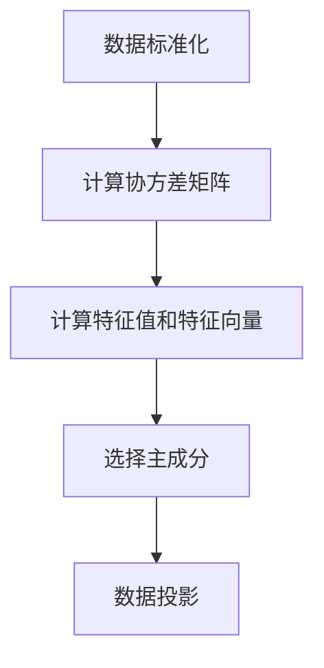

# Python机器学习实战：主成分分析(PCA)的原理和实战操作

## 1.背景介绍

在数据科学和机器学习领域，数据的维度通常非常高，这不仅增加了计算复杂度，还可能导致模型的过拟合。主成分分析（Principal Component Analysis, PCA）作为一种降维技术，能够有效地减少数据的维度，同时保留数据的主要信息。PCA在图像处理、金融分析、生物信息学等多个领域都有广泛应用。

## 2.核心概念与联系

### 2.1 什么是PCA

PCA是一种统计技术，用于将高维数据投影到低维空间中。其目标是通过线性变换，将原始数据转换为一组新的变量，这些变量称为主成分。主成分是数据中方差最大的方向，且彼此正交。

### 2.2 为什么需要PCA

- **降维**：减少特征数量，降低计算复杂度。
- **去噪**：去除数据中的噪声，提高模型的泛化能力。
- **可视化**：将高维数据投影到2D或3D空间，便于可视化分析。

### 2.3 PCA与其他降维技术的联系

PCA与其他降维技术如线性判别分析（LDA）、独立成分分析（ICA）等有相似之处，但PCA的独特之处在于它关注的是数据的方差，而不是类别信息或独立性。

## 3.核心算法原理具体操作步骤

### 3.1 数据标准化

在进行PCA之前，首先需要对数据进行标准化处理，使得每个特征的均值为0，方差为1。

### 3.2 计算协方差矩阵

协方差矩阵用于衡量特征之间的线性相关性。

### 3.3 计算特征值和特征向量

通过对协方差矩阵进行特征值分解，得到特征值和特征向量。特征值表示主成分的方差，特征向量表示主成分的方向。

### 3.4 选择主成分

根据特征值的大小选择前k个主成分，构建投影矩阵。

### 3.5 数据投影

将原始数据投影到选定的主成分上，得到降维后的数据。

以下是PCA的流程图：



## 4.数学模型和公式详细讲解举例说明

### 4.1 数据标准化

假设原始数据矩阵为 $X$，其形状为 $n \times p$，其中 $n$ 是样本数量，$p$ 是特征数量。标准化后的数据矩阵为 $Z$，其计算公式为：

$$
Z_{ij} = \frac{X_{ij} - \mu_j}{\sigma_j}
$$

其中，$\mu_j$ 是第 $j$ 个特征的均值，$\sigma_j$ 是第 $j$ 个特征的标准差。

### 4.2 计算协方差矩阵

标准化后的数据矩阵 $Z$ 的协方差矩阵 $C$ 计算公式为：

$$
C = \frac{1}{n-1} Z^T Z
$$

### 4.3 计算特征值和特征向量

对协方差矩阵 $C$ 进行特征值分解，得到特征值 $\lambda_i$ 和特征向量 $v_i$，满足：

$$
C v_i = \lambda_i v_i
$$

### 4.4 选择主成分

选择前 $k$ 个最大的特征值对应的特征向量，构成投影矩阵 $W$：

$$
W = [v_1, v_2, \ldots, v_k]
$$

### 4.5 数据投影

将原始数据 $X$ 投影到主成分上，得到降维后的数据 $Y$：

$$
Y = X W
$$

## 5.项目实践：代码实例和详细解释说明

### 5.1 数据准备

我们将使用Python的`sklearn`库进行PCA操作。首先，导入必要的库并加载数据。

```python
import numpy as np
import pandas as pd
from sklearn.preprocessing import StandardScaler
from sklearn.decomposition import PCA
import matplotlib.pyplot as plt

# 加载数据
data = pd.read_csv('data.csv')
```

### 5.2 数据标准化

使用`StandardScaler`对数据进行标准化处理。

```python
scaler = StandardScaler()
scaled_data = scaler.fit_transform(data)
```

### 5.3 计算PCA

使用`PCA`类进行主成分分析。

```python
pca = PCA(n_components=2)  # 选择前两个主成分
principal_components = pca.fit_transform(scaled_data)
```

### 5.4 可视化结果

将降维后的数据进行可视化。

```python
plt.figure(figsize=(8,6))
plt.scatter(principal_components[:,0], principal_components[:,1], c='blue')
plt.xlabel('Principal Component 1')
plt.ylabel('Principal Component 2')
plt.title('PCA Result')
plt.show()
```

### 5.5 解释结果

通过查看主成分的方差解释比例，可以了解每个主成分的重要性。

```python
explained_variance = pca.explained_variance_ratio_
print(f'Explained variance by each component: {explained_variance}')
```

## 6.实际应用场景

### 6.1 图像处理

在图像处理中，PCA可以用于图像压缩和去噪。例如，将高维的图像数据降维到低维空间，可以显著减少存储空间，同时保留图像的主要特征。

### 6.2 金融分析

在金融分析中，PCA可以用于风险管理和投资组合优化。通过降维，可以识别出影响资产价格的主要因素，从而进行更有效的风险控制。

### 6.3 生物信息学

在生物信息学中，PCA可以用于基因表达数据的分析。通过降维，可以识别出基因表达模式，从而揭示生物学过程的潜在机制。

## 7.工具和资源推荐

### 7.1 Python库

- `scikit-learn`：提供了PCA的实现和其他机器学习算法。
- `numpy`：用于数值计算。
- `pandas`：用于数据处理和分析。
- `matplotlib`：用于数据可视化。

### 7.2 在线资源

- [scikit-learn官方文档](https://scikit-learn.org/stable/modules/generated/sklearn.decomposition.PCA.html)
- [Coursera机器学习课程](https://www.coursera.org/learn/machine-learning)
- [Kaggle数据科学竞赛平台](https://www.kaggle.com/)

## 8.总结：未来发展趋势与挑战

PCA作为一种经典的降维技术，已经在多个领域得到了广泛应用。然而，随着数据规模的不断增长和复杂性的增加，PCA也面临着一些挑战。例如，PCA假设数据是线性可分的，而在实际应用中，数据往往是非线性的。为了解决这一问题，核PCA（Kernel PCA）等非线性降维技术应运而生。

未来，随着计算能力的提升和算法的改进，PCA及其变种将在更多领域发挥重要作用。同时，如何在大规模数据集上高效地进行PCA计算，也是一个值得研究的方向。

## 9.附录：常见问题与解答

### 9.1 PCA是否适用于所有数据集？

PCA主要适用于线性可分的数据集。如果数据具有非线性结构，可以考虑使用核PCA或其他非线性降维技术。

### 9.2 如何选择主成分的数量？

可以通过查看累计方差解释比例来选择主成分的数量。通常选择累计方差解释比例达到90%以上的主成分。

### 9.3 PCA是否会丢失信息？

PCA会丢失一些信息，但通过选择方差解释比例较高的主成分，可以尽量保留数据的主要信息。

### 9.4 PCA与LDA的区别是什么？

PCA关注的是数据的方差，而LDA关注的是类别信息。PCA用于无监督学习，LDA用于有监督学习。

### 9.5 如何处理缺失值？

在进行PCA之前，需要对数据中的缺失值进行处理。可以使用均值填充、插值等方法处理缺失值。

---

作者：禅与计算机程序设计艺术 / Zen and the Art of Computer Programming