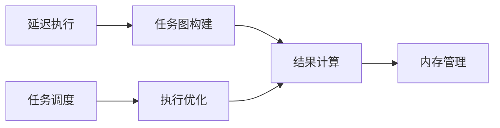

## 1. 背景介绍

在数据科学和机器学习的领域中，数据规模的不断增长对计算资源提出了更高的要求。传统的单机处理方式已经难以满足大规模数据处理的需求。为了解决这一问题，分布式计算框架应运而生。Apache Spark是其中的佼佼者，但它的复杂性和资源消耗使得一些中小规模的数据处理任务显得笨重。在这样的背景下，Dask应运而生，它是一个轻量级的分布式计算框架，旨在使得并行计算变得简单易用。

Dask支持多种并行工作负载，包括数据帧操作、数组计算和自定义任务。它能够无缝地集成到现有的Python生态中，与NumPy、Pandas等库紧密结合，为Python在大规模数据处理方面提供了新的解决方案。

## 2. 核心概念与联系

Dask的设计哲学是基于几个核心概念：延迟执行、任务调度和内存管理。延迟执行允许Dask构建一个任务图，其中包含了所有的计算步骤，而这些计算步骤只有在需要结果时才会执行。任务调度器负责决定哪些任务应该在哪里执行，以及何时执行它们。内存管理则确保数据在不同的工作节点间高效传输，同时避免内存溢出。



## 3. 核心算法原理具体操作步骤

Dask的核心算法原理是将大型计算任务分解为许多小的、相互独立的任务，然后在一个或多个计算节点上并行执行这些任务。具体操作步骤如下：

1. 定义计算任务：用户通过Dask提供的接口定义计算任务，如数组操作或数据帧操作。
2. 构建任务图：Dask根据用户定义的计算任务构建一个有向无环图（DAG），其中节点代表计算任务，边代表任务间的依赖关系。
3. 优化任务图：Dask对任务图进行优化，合并可以合并的任务，减少不必要的计算和内存使用。
4. 执行计算：Dask调度器根据任务图和当前的资源情况，将任务分配到不同的工作节点上执行。
5. 收集结果：计算完成后，Dask将结果收集起来，返回给用户。

## 4. 数学模型和公式详细讲解举例说明

以Dask数组的分块矩阵乘法为例，我们可以将大型矩阵分解为小块，然后并行计算每一块的乘法，最后合并结果。假设有两个大型矩阵 $A$ 和 $B$，它们可以分别分解为小块 $A_{ij}$ 和 $B_{jk}$，那么矩阵乘法 $C = AB$ 可以表示为：

$$
C_{ik} = \sum_j A_{ij} B_{jk}
$$

在Dask中，这个过程会被转化为多个小任务，每个任务计算一个 $C_{ik}$ 的块。

## 5. 项目实践：代码实例和详细解释说明

让我们通过一个简单的例子来看看如何使用Dask进行并行计算。假设我们需要对一个非常大的数组进行求和运算：

```python
import dask.array as da

# 创建一个大型的随机数组
x = da.random.random(size=(10000, 10000), chunks=(1000, 1000))

# 使用Dask进行并行求和
sum_x = x.sum()

# 计算结果
result = sum_x.compute()
```

在这个例子中，`da.random.random` 创建了一个大型的Dask数组，`chunks` 参数指定了数组应该如何分块。`x.sum()` 创建了一个求和的任务，而 `sum_x.compute()` 则触发了实际的计算过程。

## 6. 实际应用场景

Dask在多个领域都有实际的应用，包括但不限于：

- 大规模数据集的处理和分析
- 机器学习模型的训练和预测
- 实时数据流的处理
- 生物信息学和基因组学数据分析

## 7. 工具和资源推荐

为了更好地使用Dask，以下是一些推荐的工具和资源：

- Dask官方文档：提供了详细的安装指南、教程和API参考。
- Dask-ML：一个用于机器学习的Dask扩展库。
- Dask-Distributed：Dask的分布式计算支持库。
- Dask-Hub：一个预配置的Dask环境，可以在Kubernetes上运行。

## 8. 总结：未来发展趋势与挑战

Dask作为一个年轻的分布式计算框架，它的未来发展趋势是积极的。随着Python在数据科学领域的流行，Dask的易用性和灵活性将吸引更多的用户。然而，Dask也面临着挑战，包括提高稳定性、扩展性和与其他系统的集成。

## 9. 附录：常见问题与解答

Q1: Dask是否可以替代Apache Spark？
A1: Dask和Spark各有优势，Dask在处理中小规模数据集时更加灵活和轻量级，而Spark在处理非常大规模的数据集时更加成熟。

Q2: Dask是否支持GPU计算？
A2: 是的，Dask支持通过CuPy和其他库进行GPU加速计算。

Q3: 如何监控Dask集群的性能？
A3: Dask提供了一个Web界面，可以实时监控任务的执行情况和集群的资源使用情况。

作者：禅与计算机程序设计艺术 / Zen and the Art of Computer Programming