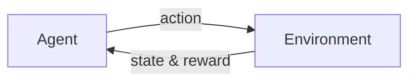
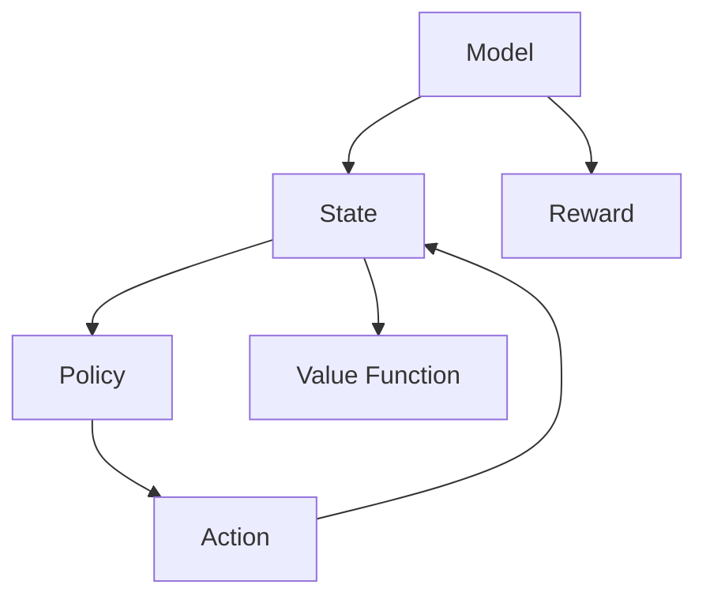

# Python机器学习实战：强化学习(Reinforcement Learning)基础介绍

## 1. 背景介绍

### 1.1 强化学习的起源与发展
强化学习(Reinforcement Learning, RL)起源于20世纪50年代,是机器学习的一个重要分支。它源于心理学中的"操作性条件反射"理论,即生物通过与环境的交互来学习最优行为策略以获得最大累积奖励。近年来,随着深度学习的发展,深度强化学习(Deep Reinforcement Learning,DRL)得到了广泛关注,并在围棋、视频游戏、机器人控制等领域取得了重大突破。

### 1.2 强化学习的定义与特点
强化学习是一种让智能体(agent)通过与环境(environment)的交互来学习最优行为策略(policy)以最大化累积奖励(reward)的机器学习范式。与监督学习和无监督学习不同,强化学习没有预先给定的标签数据,而是通过探索(exploration)和利用(exploitation)来不断试错,根据环境的反馈来调整行为。

强化学习的主要特点包括:
- 通过与环境的交互来学习
- 根据延迟奖励来优化行为策略  
- 存在探索和利用的权衡
- 面临部分可观察马尔可夫决策过程(POMDP)问题

### 1.3 强化学习的应用场景
强化学习在很多领域都有广泛应用,例如:
- 游戏AI:国际象棋、围棋、雅达利游戏等
- 机器人控制:机械臂操作、四足机器人、无人驾驶等  
- 推荐系统:电商推荐、广告投放、新闻推荐等
- 网络优化:路由选择、流量调度、资源分配等
- 智能电网:需求响应、能源管理等

## 2. 核心概念与联系

### 2.1 智能体(Agent)与环境(Environment)
强化学习中的两个核心概念是智能体(Agent)和环境(Environment):
- 智能体:可以感知环境状态并采取行动的决策主体,目标是学习最优策略以获得最大累积奖励。
- 环境:智能体所处的外部环境,接收智能体的行为并反馈下一个状态和即时奖励。

智能体与环境不断交互的过程可以用下图表示:



### 2.2 状态(State)、行为(Action)和奖励(Reward)
在强化学习中,智能体与环境交互涉及三个关键要素:
- 状态(State):环境的状态表示,通常是高维向量或图像。
- 行为(Action):智能体采取的动作,可以是离散的或连续的。
- 奖励(Reward):环境对智能体行为的即时反馈,通常是标量值。智能体的目标就是最大化累积奖励。

### 2.3 策略(Policy)、价值函数(Value Function)和模型(Model)
强化学习的目标是学习最优策略以获得最大累积奖励。三个重要概念:
- 策略(Policy):将状态映射为行为的函数,表示智能体的行为决策。分为确定性策略和随机性策略。
- 价值函数(Value Function):估计状态或状态-行为对的长期累积奖励期望。分为状态价值函数和行为价值函数。 
- 模型(Model):对环境的转移概率和奖励函数的建模。模型分为已知的和未知的。

它们之间的关系可以用下图表示:



### 2.4 探索(Exploration)与利用(Exploitation)
强化学习面临探索和利用的权衡问题:
- 探索:尝试新的行为来发现可能更优的策略。
- 利用:采用当前已知的最优策略来最大化奖励。

需要在探索和利用之间找到平衡,常用的方法有ε-贪心(ε-greedy)和上置信限(UCB)等。

## 3. 核心算法原理具体操作步骤

### 3.1 马尔可夫决策过程(MDP)
马尔可夫决策过程是强化学习的理论基础,由状态集S、行为集A、转移概率P、奖励函数R和折扣因子γ组成。

MDP的最优策略满足贝尔曼最优方程:

$$v_*(s)=\max_{a} \sum_{s',r} p(s',r|s,a)[r+\gamma v_*(s')]$$

求解最优策略的方法主要有动态规划、蒙特卡洛和时序差分学习。

### 3.2 动态规划(Dynamic Programming)
动态规划适用于已知MDP模型的情况,通过迭代计算最优价值函数来得到最优策略。

主要算法:
- 策略评估(Policy Evaluation):计算给定策略的状态价值函数。
- 策略改进(Policy Improvement):根据价值函数提升策略。
- 策略迭代(Policy Iteration):交替进行评估和提升直到策略收敛。 
- 价值迭代(Value Iteration):直接迭代最优贝尔曼方程求解最优价值函数。

### 3.3 蒙特卡洛方法(Monte Carlo Methods)
蒙特卡洛方法适用于未知MDP模型但可以采样的情况,通过采样完整的状态-行为序列来更新价值函数。

主要算法:
- 蒙特卡洛预测(Monte Carlo Prediction):估计给定策略的价值函数。
- 蒙特卡洛控制(Monte Carlo Control):通过蒙特卡洛采样来优化策略。

常用的采样策略有ε-软策略和重要性采样等。

### 3.4 时序差分学习(Temporal Difference Learning) 
时序差分学习结合了动态规划和蒙特卡洛方法的思想,通过自举(bootstrap)的增量更新来估计价值函数。

主要算法:
- Sarsa:同策略的时序差分控制,根据当前的状态-行为对更新行为价值函数。
- Q-learning:异策略的时序差分控制,根据下一状态的最大行为价值来更新当前状态-行为对的价值。
- TD(λ):引入资格迹(eligibility trace)的时序差分算法,权衡了单步更新和蒙特卡洛更新。

### 3.5 深度强化学习(Deep Reinforcement Learning)
深度强化学习将深度神经网络作为价值函数或策略的近似函数,可以处理高维状态空间。

主要算法:
- DQN(Deep Q-Network):将Q学习与卷积神经网络相结合,实现端到端的控制。
- DDPG(Deep Deterministic Policy Gradient):适用于连续动作空间的确定性策略梯度算法。
- A3C(Asynchronous Advantage Actor-Critic):异步优势行动者-评论家算法,并行训练多个智能体。

## 4. 数学模型和公式详细讲解举例说明

### 4.1 马尔可夫决策过程(MDP)的数学定义
一个MDP由五元组$(S,A,P,R,\gamma)$定义:
- 状态集$S$:有限状态集合。
- 行为集$A$:有限行为集合。
- 转移概率$P$:状态-行为对$(s,a)$转移到下一状态$s'$的概率。
$$p(s'|s,a)=P(S_{t+1}=s'|S_t=s,A_t=a)$$
- 奖励函数$R$:状态-行为对$(s,a)$得到的即时奖励期望。
$$r(s,a)=\mathbb{E}[R_{t+1}|S_t=s,A_t=a]$$  
- 折扣因子$\gamma$:未来奖励的衰减率,$\gamma \in [0,1]$。

MDP满足马尔可夫性:下一状态仅依赖于当前状态和行为,与历史状态无关。

### 4.2 贝尔曼方程(Bellman Equation)
贝尔曼方程是MDP中价值函数满足的递归关系。

状态价值函数$v_{\pi}(s)$表示从状态$s$开始,遵循策略$\pi$得到的累积期望奖励:

$$v_{\pi}(s)=\mathbb{E}_{\pi}[\sum_{k=0}^{\infty}\gamma^k R_{t+k+1}|S_t=s]$$

对应的贝尔曼方程为:

$$v_{\pi}(s)=\sum_{a}\pi(a|s)\sum_{s',r}p(s',r|s,a)[r+\gamma v_{\pi}(s')]$$

行为价值函数$q_{\pi}(s,a)$表示在状态$s$下采取行为$a$,遵循策略$\pi$得到的累积期望奖励:

$$q_{\pi}(s,a)=\mathbb{E}_{\pi}[\sum_{k=0}^{\infty}\gamma^k R_{t+k+1}|S_t=s,A_t=a]$$

对应的贝尔曼方程为:

$$q_{\pi}(s,a)=\sum_{s',r}p(s',r|s,a)[r+\gamma\sum_{a'}\pi(a'|s')q_{\pi}(s',a')]$$

### 4.3 时序差分(TD)算法
时序差分算法通过自举来更新价值函数估计。以Sarsa算法为例,其更新公式为:

$$Q(S_t,A_t) \leftarrow Q(S_t,A_t)+\alpha[R_{t+1}+\gamma Q(S_{t+1},A_{t+1})-Q(S_t,A_t)]$$

其中$\alpha$是学习率,$\gamma$是折扣因子。TD误差为:

$$\delta_t=R_{t+1}+\gamma Q(S_{t+1},A_{t+1})-Q(S_t,A_t)$$

表示估计值和真实值之间的差异,用于更新价值函数。

### 4.4 策略梯度(Policy Gradient)定理
策略梯度定理给出了期望累积奖励对策略参数的梯度:

$$\nabla_{\theta}J(\theta)=\mathbb{E}_{\tau\sim p_{\theta}(\tau)}[\sum_{t=0}^{T}\nabla_{\theta}\log\pi_{\theta}(a_t|s_t)Q^{\pi_{\theta}}(s_t,a_t)]$$

其中$\tau$表示状态-行为轨迹,$p_{\theta}(\tau)$是轨迹的概率分布。

常见的策略梯度算法有REINFORCE和Actor-Critic等。Actor-Critic结合了价值函数和策略梯度,critic估计价值函数,actor根据梯度更新策略。

## 5. 项目实践：代码实例和详细解释说明

下面以一个简单的网格世界环境为例,演示如何用Python实现Q-learning算法。

### 5.1 定义网格世界环境类

```python
import numpy as np

class GridWorld:
    def __init__(self, n_rows, n_cols, start, goal, obstacles):
        self.n_rows = n_rows
        self.n_cols = n_cols
        self.start = start
        self.goal = goal
        self.obstacles = obstacles
        self.state = start
        
    def reset(self):
        self.state = self.start
        return self.state
    
    def step(self, action):
        if action == 0:  # 上
            next_state = (self.state[0] - 1, self.state[1])
        elif action == 1:  # 下
            next_state = (self.state[0] + 1, self.state[1]) 
        elif action == 2:  # 左
            next_state = (self.state[0], self.state[1] - 1)
        else:  # 右
            next_state = (self.state[0], self.state[1] + 1)
            
        if next_state[0] < 0 or next_state[0] >= self.n_rows or next_state[1] < 0 or next_state[1] >= self.n_cols or next_state in self.obstacles:
            next_state = self.state
            
        self.state = next_state
        
        if next_state == self.goal:
            reward = 1
            done = True
        else:
            reward = 0
            done = False
        
        return next_state, reward, done
```

网格世界环境由起点、目标和障碍组成,智能体可以执行上下左右四个动作。`reset`函数将智能体重置到起点,`step`函数根据动作计算下一状态和奖励。

### 5.2 Q-learning算法实现

```python
def q_learning(env, n_episodes, alpha, gamma, epsilon):
    n_actions = 4
    q_table = np.zeros((env.n_rows, env.n_cols, n_actions))
    
    for episode in range(n_episodes):
        state = env.reset()
        done = False
        
        while not done:
            if np.random.uniform() < epsilon:
                action = np.random.choice(n_actions