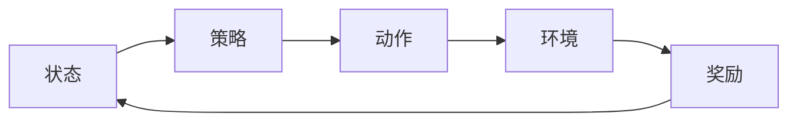

## 1.背景介绍

在当今的技术世界中，人工智能（AI）已经成为了一个热门话题。其中，强化学习（Reinforcement Learning）作为AI的一个重要分支，已经在许多领域取得了显著的成果，特别是在游戏AI中，强化学习的应用已经取得了突破性的进展。

强化学习是一种机器学习的方法，它通过让机器与环境进行交互，学习如何在给定的情境中实现目标。在游戏中，这个环境就是游戏世界，机器的目标就是取得游戏的胜利。

Python作为一种强大且易于学习的编程语言，已经成为了机器学习，特别是强化学习的首选语言。本文将以Python为工具，深入探讨强化学习在游戏AI中的实际应用。

## 2.核心概念与联系

在深入讨论强化学习在游戏AI中的应用之前，我们首先需要理解一些核心概念：

- **状态（State）**：在强化学习中，状态代表了环境在某一时刻的情况。在游戏中，状态可能包括角色的位置、生命值、得分等信息。

- **动作（Action）**：动作是AI可以在某一状态下进行的操作。在游戏中，动作可能包括移动、攻击、防御等。

- **奖励（Reward）**：奖励是AI在执行某一动作后获得的反馈。在游戏中，奖励可能是增加的分数、获得的物品等。

- **策略（Policy）**：策略是AI决定在某一状态下执行哪一动作的规则。在强化学习中，策略是通过学习得到的。

这些概念之间的关系可以通过下面的Mermaid流程图进行表示：



## 3.核心算法原理具体操作步骤

强化学习的核心算法包括了Q-Learning、Deep Q Network（DQN）等。这里我们以Q-Learning为例，介绍其在游戏AI中的应用。

Q-Learning的主要思想是通过学习一个叫做Q值的量，来决定AI在某一状态下应该执行哪一动作。Q值代表了在某一状态下执行某一动作能带来的预期奖励。

Q-Learning的操作步骤如下：

1. 初始化Q值表，通常可以将所有的Q值都设置为0。

2. 在每一步中，AI根据当前的状态和Q值表，选择一个动作。

3. AI执行这个动作，得到环境的反馈，包括新的状态和奖励。

4. 根据环境的反馈，更新Q值表。

5. 重复步骤2-4，直到满足停止条件。

在游戏中，我们可以将每一局游戏看作是一次强化学习的过程，AI通过不断地玩游戏，学习如何取得胜利。

## 4.数学模型和公式详细讲解举例说明

我们现在来看一下Q-Learning的数学模型。在Q-Learning中，我们使用Q值表来存储每一个状态-动作对的Q值。Q值的更新公式为：

$$Q(s_t, a_t) = Q(s_t, a_t) + \alpha [r_{t+1} + \gamma \max_{a} Q(s_{t+1}, a) - Q(s_t, a_t)]$$

其中，$s_t$和$a_t$分别代表当前的状态和动作，$r_{t+1}$是执行动作$a_t$后得到的奖励，$\alpha$是学习率，$\gamma$是折扣因子，$\max_{a} Q(s_{t+1}, a)$是在新的状态$s_{t+1}$下所有可能动作的最大Q值。

这个公式的意思是，我们将Q值往执行动作后能得到的预期奖励的方向进行更新。其中，学习率$\alpha$决定了我们更新Q值的速度，折扣因子$\gamma$决定了我们更关注当前的奖励还是未来的奖励。

## 5.项目实践：代码实例和详细解释说明

下面我们来看一个使用Python和Q-Learning实现游戏AI的简单例子。在这个例子中，我们将使用一个叫做OpenAI Gym的库，这个库提供了很多预先定义好的环境，我们可以在这些环境中训练我们的AI。

首先，我们需要导入必要的库：

```python
import numpy as np
import gym
```

然后，我们可以创建一个环境：

```python
env = gym.make('FrozenLake-v0')
```

在这个环境中，AI需要在一个冰冻的湖面上移动，目标是从起点移动到终点，而不是掉入湖中。

接下来，我们可以初始化我们的Q值表：

```python
Q = np.zeros([env.observation_space.n, env.action_space.n])
```

然后，我们可以开始我们的训练过程：

```python
for i_episode in range(5000):
    # 初始化状态
    state = env.reset()
    for t in range(100):
        # 选择动作
        action = np.argmax(Q[state, :] + np.random.randn(1, env.action_space.n) * (1. / (i_episode + 1)))
        # 执行动作
        next_state, reward, done, _ = env.step(action)
        # 更新Q值
        Q[state, action] = Q[state, action] + 0.8 * (reward + 0.95 * np.max(Q[next_state, :]) - Q[state, action])
        state = next_state
        if done:
            break
```

在这段代码中，我们首先初始化状态，然后在每一步中，我们选择一个动作，执行这个动作，然后根据环境的反馈更新我们的Q值。

## 6.实际应用场景

强化学习在游戏AI中的应用非常广泛。例如，DeepMind的AlphaGo就是通过强化学习，成为了世界围棋的冠军。此外，强化学习也被用于许多其他类型的游戏，如马里奥、星际争霸等。

除了游戏，强化学习还被用于许多其他领域，如自动驾驶、机器人控制、推荐系统等。

## 7.工具和资源推荐

如果你对强化学习感兴趣，下面是一些可以帮助你进一步学习的工具和资源：

- **Python**：Python是一种强大且易于学习的编程语言，是进行机器学习的首选语言。

- **OpenAI Gym**：OpenAI Gym是一个提供预先定义好的环境的库，你可以在这些环境中训练你的AI。

- **TensorFlow**：TensorFlow是一个由Google开发的开源机器学习框架，它提供了许多强化学习的算法。

- **DeepMind**：DeepMind是一个由Google拥有的人工智能研究机构，他们的网站上有许多关于强化学习的资源。

## 8.总结：未来发展趋势与挑战

强化学习是一个非常有前景的领域，它已经在许多领域取得了显著的成果。然而，强化学习还面临着许多挑战，如稳定性和鲁棒性问题、样本效率问题等。

尽管如此，我相信随着科技的发展，这些问题都会得到解决。而强化学习将在未来的AI领域发挥更大的作用。

## 9.附录：常见问题与解答

1. **Q：强化学习和监督学习有什么区别？**

   A：监督学习是一种机器学习的方法，它通过训练数据来学习一个模型，这个模型可以对新的数据进行预测。而强化学习则是通过让机器与环境进行交互，学习如何在给定的情境中实现目标。

2. **Q：强化学习有哪些应用？**

   A：强化学习在许多领域都有应用，如游戏、自动驾驶、机器人控制、推荐系统等。

3. **Q：如何选择强化学习的参数，如学习率和折扣因子？**

   A：这些参数的选择通常需要通过实验来确定。一般来说，学习率决定了我们更新Q值的速度，折扣因子决定了我们更关注当前的奖励还是未来的奖励。

作者：禅与计算机程序设计艺术 / Zen and the Art of Computer Programming