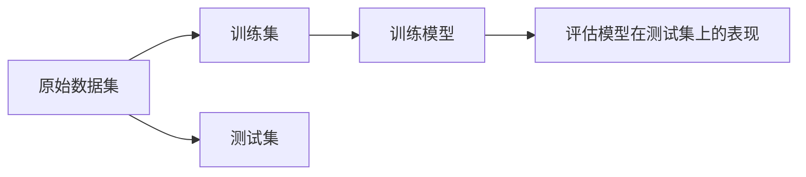
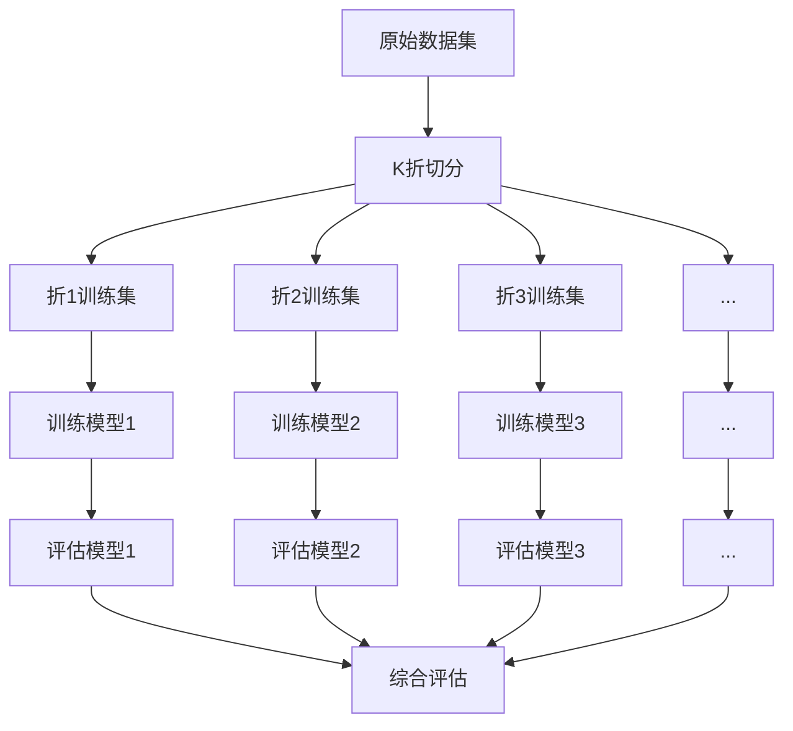
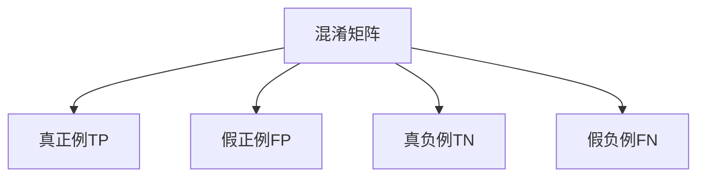
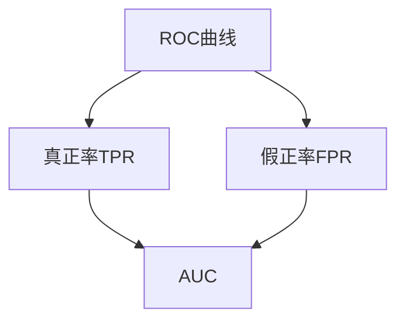

# Python机器学习实战：模型评估与验证的最佳策略

## 1.背景介绍

在机器学习项目中，模型评估和验证是确保模型性能和可靠性的关键步骤。无论是监督学习还是无监督学习任务,正确评估模型在训练数据和新数据上的表现都至关重要。合理的评估策略不仅可以帮助选择最佳模型,还能发现模型的局限性并指导后续的改进方向。

本文将介绍Python机器学习中常用的模型评估和验证技术,包括训练集/测试集划分、交叉验证、混淆矩阵、ROC曲线等,并结合实际案例分析其优缺点和应用场景。我们将探讨如何根据具体问题选择合适的评估指标,如何有效利用评估结果诊断和改进模型,以及一些常见的陷阱和注意事项。

## 2.核心概念与联系 

### 2.1 训练集/测试集划分



训练集/测试集划分是模型评估的基础。我们将原始数据集分为两部分:

- **训练集(Training Set)**: 用于训练模型,模型在这个数据集上"学习"
- **测试集(Test Set)**: 用于评估训练好的模型在看不见的新数据上的表现

通常我们会保留20%~30%的数据作为测试集。划分时需要确保训练集和测试集的数据分布相近,避免数据集之间存在系统性差异。

### 2.2 交叉验证



交叉验证(Cross-Validation)是一种评估模型的统计学方法。它将原始数据集分为K个子集,轮流使用K-1个子集训练模型,剩下的一个子集评估模型,重复K次。最终将K次评估结果取平均值作为模型的评估指标。

常见的交叉验证方法有:

- K折交叉验证(K-Fold CV)
- 留一交叉验证(Leave-One-Out CV)
- 重复随机交叉验证(Repeated Random CV)

交叉验证可以更全面评价模型,减少评估结果的偏差和方差。但计算开销较大,尤其是在数据集很大或者模型训练时间很长的情况下。

### 2.3 混淆矩阵



混淆矩阵(Confusion Matrix)是一种直观的矩阵形式,用于总结分类模型在测试数据集上的预测结果。它的行表示实际类别,列表示预测类别。

通过混淆矩阵,我们可以计算出许多常用的评估指标,如:

- 准确率(Accuracy) = (TP + TN) / (TP + TN + FP + FN)
- 精确率(Precision) = TP / (TP + FP)  
- 召回率(Recall) = TP / (TP + FN)
- F1分数 = 2 * (Precision * Recall) / (Precision + Recall)

不同的指标适用于不同的场景,如精确率更重要还是召回率更重要。通过分析混淆矩阵,我们可以发现模型的具体错误类型,为后续改进提供依据。

### 2.4 ROC曲线和AUC



ROC曲线(Receiver Operating Characteristic Curve)和AUC(Area Under the Curve)常用于评估二分类模型。

- ROC曲线是以假正率(FPR)为横坐标,真正率(TPR)为纵坐标绘制的曲线
- AUC是ROC曲线下的面积,介于0和1之间。AUC越接近1,模型性能越好

ROC曲线能够很好地展示模型对正负例样本的分类能力。我们可以根据具体需求,在ROC曲线上选择合适的分类阈值,权衡假正率和真正率。AUC则提供了一个总体的模型评估指标。

## 3.核心算法原理具体操作步骤

### 3.1 训练集/测试集划分算法

```python
from sklearn.model_selection import train_test_split

# 划分训练集和测试集
X_train, X_test, y_train, y_test = train_test_split(X, y, test_size=0.2, random_state=42)
```

1. 导入`train_test_split`函数
2. 传入原始数据集`X`和标签`y`
3. `test_size`参数设置测试集占比,通常0.2~0.3
4. `random_state`参数设置随机种子,确保可重复性
5. 函数返回训练集`X_train, y_train`和测试集`X_test, y_test`

### 3.2 K折交叉验证算法

```python
from sklearn.model_selection import KFold, cross_val_score

# 创建K折交叉验证迭代器
kf = KFold(n_splits=5, shuffle=True, random_state=42)

# 在K折上评估模型
scores = cross_val_score(model, X, y, cv=kf)
print(f"K折交叉验证分数: {scores}")
print(f"平均分数: {scores.mean():.3f}")
```

1. 导入`KFold`和`cross_val_score`
2. 创建`KFold`实例,`n_splits`设置折数,`shuffle`是否打乱数据
3. 使用`cross_val_score`函数,传入模型实例`model`、数据`X`、标签`y`和交叉验证迭代器`cv=kf`
4. 函数返回K次评估分数列表`scores`
5. 计算并输出平均分数

### 3.3 混淆矩阵算法

```python
from sklearn.metrics import confusion_matrix, accuracy_score, precision_score, recall_score, f1_score

# 计算混淆矩阵
tn, fp, fn, tp = confusion_matrix(y_test, y_pred).ravel()

# 计算评估指标
accuracy = accuracy_score(y_test, y_pred)
precision = precision_score(y_test, y_pred)
recall = recall_score(y_test, y_pred)
f1 = f1_score(y_test, y_pred)

print(f"真负例(TN): {tn}, 假正例(FP): {fp}")
print(f"假负例(FN): {fn}, 真正例(TP): {tp}")
print(f"准确率: {accuracy:.3f}, 精确率: {precision:.3f}, 召回率: {recall:.3f}, F1: {f1:.3f}")
```

1. 导入`confusion_matrix`和评估指标函数
2. 使用`confusion_matrix`计算混淆矩阵,传入真实标签`y_test`和预测标签`y_pred`
3. 从混淆矩阵解包出TP、TN、FP、FN值
4. 使用`accuracy_score`等函数计算准确率、精确率、召回率、F1分数
5. 输出混淆矩阵值和评估指标

### 3.4 ROC曲线和AUC算法

```python
from sklearn.metrics import roc_curve, roc_auc_score
import matplotlib.pyplot as plt

# 计算ROC曲线和AUC
fpr, tpr, thresholds = roc_curve(y_test, y_pred_proba[:, 1])
auc = roc_auc_score(y_test, y_pred_proba[:, 1])

# 绘制ROC曲线
plt.figure(figsize=(8, 6))
plt.plot(fpr, tpr, label=f'ROC curve (AUC = {auc:.3f})')
plt.plot([0, 1], [0, 1], 'k--')
plt.xlabel('False Positive Rate')
plt.ylabel('True Positive Rate')
plt.title('Receiver Operating Characteristic (ROC) Curve')
plt.legend()
plt.show()
```

1. 导入`roc_curve`、`roc_auc_score`和`matplotlib`
2. 使用`roc_curve`计算假正率`fpr`、真正率`tpr`和阈值`thresholds`
3. 使用`roc_auc_score`计算AUC值
4. 使用`matplotlib`绘制ROC曲线,以`fpr`为横坐标,`tpr`为纵坐标
5. 绘制对角线,表示随机猜测的ROC曲线
6. 添加图例、标题和坐标轴标签
7. 显示ROC曲线图像

## 4.数学模型和公式详细讲解举例说明

### 4.1 混淆矩阵指标公式

假设我们有一个二分类问题,正例(Positive)和负例(Negative)。根据模型预测结果和真实标签,我们可以将样本划分为以下四种情况:

- 真正例(TP): 样本实际为正例,且被正确预测为正例
- 假正例(FP): 样本实际为负例,但被错误预测为正例 
- 真负例(TN): 样本实际为负例,且被正确预测为负例
- 假负例(FN): 样本实际为正例,但被错误预测为负例

基于这四种情况,我们可以定义以下评估指标:

**准确率(Accuracy)**: 正确预测的样本数占总样本数的比例

$$Accuracy = \frac{TP + TN}{TP + TN + FP + FN}$$

**精确率(Precision)**: 被预测为正例的样本中实际为正例的比例 

$$Precision = \frac{TP}{TP + FP}$$

**召回率(Recall)**: 实际为正例的样本中被正确预测为正例的比例

$$Recall = \frac{TP}{TP + FN}$$

**F1分数**: 精确率和召回率的调和平均数

$$F1 = 2 \times \frac{Precision \times Recall}{Precision + Recall}$$

通过分析这些指标,我们可以全面评估模型在不同方面的表现。例如,在异常检测任务中,我们更关注召回率以减少漏报;而在垃圾邮件过滤中,精确率更为重要以减少误报。

### 4.2 ROC曲线和AUC公式

ROC曲线展示了分类模型在不同阈值下,真正率(TPR)和假正率(FPR)的变化趋势。其中:

$$TPR = \frac{TP}{TP + FN}$$
$$FPR = \frac{FP}{FP + TN}$$

理想情况下,我们希望TPR尽可能高,FPR尽可能低。ROC曲线越靠近左上角,模型性能越好。

AUC(Area Under the Curve)是ROC曲线下的面积,介于0和1之间。AUC越接近1,模型性能越好。对于二分类问题:

- AUC=1,是一个完美的分类器
- AUC=0.5,相当于随机猜测

我们可以使用梯形法则近似计算AUC:

$$AUC = \sum_{i=1}^{n-1} \frac{(x_{i+1} - x_i) \times (y_i + y_{i+1})}{2}$$

其中$x_i$和$y_i$分别表示第i个点的FPR和TPR值。

例如,假设我们有一个分类器的ROC曲线经过点(0, 0)、(0.2, 0.4)、(0.6, 0.8)和(1, 1),那么它的AUC约为:

$$\begin{aligned}
AUC &= \frac{(0.2 - 0) \times (0 + 0.4)}{2} + \frac{(0.6 - 0.2) \times (0.4 + 0.8)}{2} + \frac{(1 - 0.6) \times (0.8 + 1)}{2} \\
    &= 0.04 + 0.36 + 0.54 \\
    &= 0.94
\end{aligned}$$

AUC值0.94表明这个分类器的性能非常好。

## 5.项目实践：代码实例和详细解释说明

让我们通过一个实际的机器学习案例,应用上述评估和验证技术。我们将使用著名的"泰坦尼克号"乘客存活预测数据集,并利