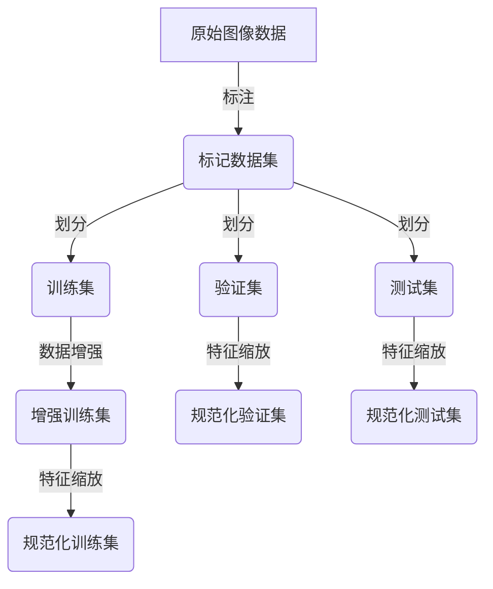
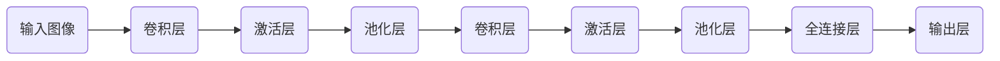
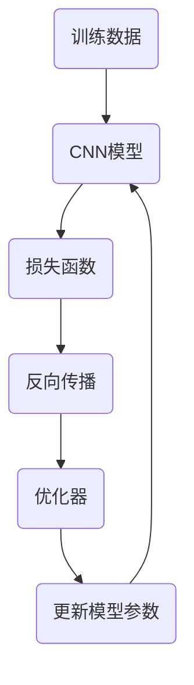

# Python深度学习实践：如何构建你的图像分类器

## 1.背景介绍

在当今数字时代，图像数据无处不在。从社交媒体照片到医疗影像、卫星图像等,图像数据在各个领域扮演着越来越重要的角色。然而,手动分析和理解大量图像数据是一项艰巨的任务。这就是为什么图像分类这一深度学习应用变得如此重要和受欢迎。

图像分类是计算机视觉和深度学习领域的一个核心任务,旨在自动识别和标记图像中的对象或场景。通过训练深度神经网络模型,我们可以从大量标记数据中学习图像的特征模式,并将新图像归类到正确的类别。这种能力在多个行业都有广泛的应用,例如:

- **社交媒体**: 自动标记和组织照片
- **零售**: 识别产品图像以改善在线购物体验
- **医疗**: 检测X光或CT扫描中的异常
- **农业**: 识别作物病虫害
- **自动驾驶**: 识别交通标志、行人和其他障碍物

通过利用Python生态系统中强大的深度学习框架,我们可以构建自己的图像分类模型,并将其应用于各种实际场景。本文将带你逐步了解图像分类的核心概念、算法原理、实践技巧,并探讨其未来发展趋势和挑战。

## 2.核心概念与联系

在深入了解图像分类的细节之前,让我们先理解一些核心概念和它们之间的联系。

### 2.1 计算机视觉与深度学习

计算机视觉是一个旨在使计算机能够"看到"和理解数字图像或视频的领域。它涉及图像处理、模式识别和机器学习等多个子领域。深度学习则是机器学习的一个分支,它使用神经网络模型从大量数据中自动学习特征模式。

图像分类正是计算机视觉和深度学习的交叉点。我们利用深度学习模型(如卷积神经网络)从图像数据中学习特征,并将其应用于计算机视觉任务(如对象识别和场景分类)。

### 2.2 监督学习与分类任务

图像分类属于监督学习的范畴。在监督学习中,我们使用带有正确标签的训练数据集来训练模型,使其能够对新的未标记数据进行预测和分类。

分类任务旨在将输入数据(如图像)划分到两个或多个预定义的类别中。根据类别数量,我们可以将其分为二分类(如猫/狗)或多分类(如交通标志识别)任务。

### 2.3 特征提取与卷积神经网络

在传统的计算机视觉方法中,我们需要手动设计和提取图像特征(如边缘、纹理等)。而在深度学习中,卷积神经网络(CNN)能够自动从原始图像数据中学习层次化的特征表示。

CNN由多个卷积层和池化层组成,用于提取不同级别的特征。较浅层提取低级特征(如边缘和纹理),而较深层则捕获高级语义特征(如物体部件和形状)。通过端到端的训练,CNN能够自动优化这些特征的提取和组合,从而实现高精度的图像分类。

### 2.4 迁移学习与模型微调

在许多情况下,我们无需从头开始训练一个全新的CNN模型。相反,我们可以利用迁移学习的思想,将在大型数据集(如ImageNet)上预训练的模型作为起点,然后在我们的特定数据集上进行微调(fine-tuning)。

这种方法可以显著减少训练时间和计算资源需求,同时利用预训练模型中学习到的通用图像特征,从而获得更好的分类性能。

## 3.核心算法原理具体操作步骤

构建图像分类器的核心步骤包括数据准备、模型构建、模型训练和模型评估。让我们逐一探讨每个步骤的具体操作。

### 3.1 数据准备

1. **数据采集和标注**: 从各种来源(如网络、现场采集等)获取原始图像数据,并由人工或其他方式对图像进行标注,生成带有类别标签的数据集。

2. **数据划分**: 将标记数据集划分为训练集、验证集和测试集。通常采用80%训练集、10%验证集和10%测试集的比例划分。

3. **数据增强(Data Augmentation)**: 在训练集上应用一系列随机变换(如旋转、翻转、缩放等),以生成更多的训练样本,增加数据多样性,提高模型的泛化能力。

4. **特征缩放(Feature Scaling)**: 将图像像素值缩放到一个较小的范围(如0-1或-1到1),以避免数值不稳定性,并加速模型收敛。

### 3.2 模型构建

在构建图像分类模型时,我们通常会选择卷积神经网络(CNN)架构。CNN由多个卷积层、池化层和全连接层组成,能够自动从图像数据中学习层次化的特征表示。

1. **卷积层(Convolutional Layer)**: 通过应用一组可学习的滤波器(也称为卷积核)在输入图像上滑动,提取局部特征(如边缘、纹理等)。

2. **激活层(Activation Layer)**: 应用非线性激活函数(如ReLU)于卷积层的输出,增加模型的表达能力。

3. **池化层(Pooling Layer)**: 对激活图进行下采样,减小特征图的空间维度,提高模型的计算效率和空间不变性。

4. **全连接层(Fully Connected Layer)**: 将前面层的特征图展平,并与一组全连接的神经元相连,用于进一步提取高级语义特征。

5. **输出层(Output Layer)**: 根据分类任务的类别数,输出对应数量的节点,每个节点对应一个类别的概率分数。

通过堆叠多个这样的卷积块,CNN能够逐层提取从低级到高级的特征表示,最终实现对输入图像的分类。

### 3.3 模型训练

在训练CNN模型时,我们需要定义损失函数、优化器和评估指标,并使用反向传播算法更新模型参数,使其能够最小化损失函数。

1. **损失函数(Loss Function)**: 衡量模型预测与真实标签之间的差异,常用的损失函数包括交叉熵损失(Cross-Entropy Loss)和焦点损失(Focal Loss)等。

2. **优化器(Optimizer)**: 根据损失函数的梯度,更新模型参数以最小化损失。常用的优化器包括随机梯度下降(SGD)、Adam等。

3. **评估指标(Evaluation Metrics)**: 用于评估模型性能,常用的指标包括准确率(Accuracy)、精确率(Precision)、召回率(Recall)和F1分数等。

4. **反向传播(Backpropagation)**: 计算损失函数相对于模型参数的梯度,并通过优化器更新参数,使损失函数最小化。

在训练过程中,我们将模型在训练集上进行多次迭代,并使用验证集监控模型的泛化性能,防止过拟合。训练完成后,我们可以在保留的测试集上评估最终模型的性能。

### 3.4 模型评估和调优

评估模型性能是构建图像分类器的关键步骤之一。我们需要分析模型在测试集上的表现,并根据评估指标和可视化工具(如混淆矩阵)来诊断模型的优缺点。

如果模型性能不理想,我们可以尝试以下调优策略:

- **超参数调整**: 调整模型的超参数,如学习率、批量大小、正则化强度等,以提高模型性能。
- **数据增强**: 应用更多数据增强技术,如高斯噪声、颜色抖动等,以增加训练数据的多样性。
- **模型架构调整**: 尝试不同的CNN架构,如ResNet、Inception等,或者调整层数和滤波器数量。
- **迁移学习**: 尝试从不同的预训练模型进行迁移学习和微调。
- **集成学习**: 组合多个模型的预测结果,以提高整体性能。

通过反复的评估和调优,我们可以不断改进模型性能,直到达到满意的结果。

## 4.数学模型和公式详细讲解举例说明

在图像分类任务中,我们经常会遇到一些数学模型和公式。让我们详细讲解其中的几个关键概念。

### 4.1 卷积运算

卷积运算是CNN中最核心的操作之一。它通过在输入特征图上滑动卷积核,计算局部区域的加权和,从而提取局部特征。

对于二维卷积,给定输入特征图 $X$ 和卷积核 $K$,卷积运算可以表示为:

$$
(X * K)(i, j) = \sum_{m} \sum_{n} X(i + m, j + n) \cdot K(m, n)
$$

其中 $i$ 和 $j$ 表示输出特征图的空间坐标,而 $m$ 和 $n$ 则表示卷积核的空间坐标。通过在整个输入特征图上滑动卷积核,我们可以获得一个新的特征图,捕获输入图像的局部模式。

### 4.2 池化运算

池化运算是CNN中另一个重要的操作,它用于降低特征图的空间维度,从而减少计算量并提高模型的空间不变性。

最常见的池化方法是最大池化(Max Pooling),它通过在输入特征图上滑动一个窗口,并选取窗口内的最大值作为输出特征图的对应元素。

对于二维最大池化,给定输入特征图 $X$ 和池化窗口大小 $f$,最大池化运算可以表示为:

$$
(X \circledast f)(i, j) = \max_{(m, n) \in R_{ij}} X(i + m, j + n)
$$

其中 $R_{ij}$ 表示以 $(i, j)$ 为中心的池化窗口区域,而 $\circledast$ 表示最大池化操作符。通过这种下采样操作,我们可以获得一个更加紧凑且具有平移不变性的特征表示。

### 4.3 softmax函数和交叉熵损失

在分类任务中,我们通常使用softmax函数将模型的输出转换为概率分布,然后使用交叉熵损失函数衡量预测与真实标签之间的差异。

对于 $K$ 个类别,给定模型输出 $\vec{z} = (z_1, z_2, \ldots, z_K)$,softmax函数将其转换为概率分布 $\vec{p} = (p_1, p_2, \ldots, p_K)$,其中:

$$
p_i = \frac{e^{z_i}}{\sum_{j=1}^K e^{z_j}}
$$

对于真实标签 $\vec{y} = (y_1, y_2, \ldots, y_K)$,其中只有一个元素为1(表示正确类别),其余均为0,交叉熵损失函数可以表示为:

$$
\mathcal{L}(\vec{y}, \vec{p}) = -\sum_{i=1}^K y_i \log p_i
$$

在训练过程中,我们旨在最小化这个损失函数,使模型的预测概率分布尽可能接近真实标签。

### 4.4 正则化技术

为了防止模型过拟合,