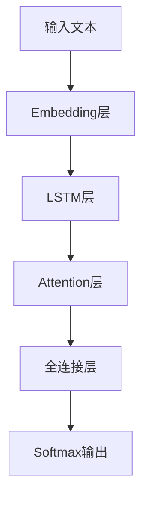

# Python深度学习实践：文本情感分类的深度学习方法

## 1.背景介绍

### 1.1 情感分析的重要性

在当今信息时代,文本数据的爆炸性增长使得自然语言处理(NLP)技术变得越来越重要。情感分析作为NLP的一个重要分支,旨在自动检测、识别和提取主观信息,如观点、情绪、评价等。它在许多领域都有广泛的应用,例如社交媒体监测、品牌形象管理、客户服务优化等。

### 1.2 传统方法的局限性

传统的基于规则或词典的情感分析方法存在一些固有的局限性。首先,它们依赖于手工构建的规则集或情感词典,这是一个费时费力的过程,且难以覆盖所有领域。其次,这些方法无法很好地处理上下文信息、词义消歧等语义层面的问题。因此,传统方法在准确率和泛化能力上都有待提高。

### 1.3 深度学习方法的优势

近年来,深度学习技术在NLP领域取得了巨大的进展,为情感分析任务提供了新的解决方案。与传统方法相比,深度学习模型能够自动学习文本的深层次语义表示,从而更好地捕捉情感信息。此外,深度学习模型具有端到端的优势,无需复杂的特征工程,且可以通过大规模数据来提高泛化能力。

## 2.核心概念与联系

### 2.1 文本表示

将文本数据转换为机器可以理解的数值向量表示是深度学习模型的基础。常见的文本表示方法包括:

1. **One-Hot表示**: 将每个单词表示为一个高维稀疏向量,缺点是无法捕捉单词之间的语义关系。
2. **Word Embedding**: 通过神经网络模型将单词映射到低维稠密向量空间,能够很好地捕捉语义信息。常用的预训练词向量包括Word2Vec、GloVe等。
3. **序列建模**: 使用RNN、LSTM等序列模型对文本进行建模,能够很好地捕捉上下文信息。

### 2.2 深度学习模型

常用于文本情感分类任务的深度学习模型包括:

1. **CNN(卷积神经网络)**: 擅长捕捉局部特征模式,适用于较短文本。
2. **RNN/LSTM(循环神经网络)**: 擅长捕捉长期依赖关系,适用于较长文本。
3. **Attention机制**: 通过自动分配注意力权重,使模型能够更好地关注重要信息。
4. **Transformer**: 基于Self-Attention的序列建模架构,在长文本任务上表现优异。
5. **迁移学习**: 利用在大规模语料上预训练的模型(如BERT、GPT等)进行微调,能够显著提升性能。

### 2.3 损失函数和优化

对于情感分类任务,常用的损失函数包括交叉熵损失、focal loss等。优化算法则有SGD、Adam等。此外,还可以使用正则化技术(如L1/L2正则、Dropout等)来防止过拟合。

## 3.核心算法原理具体操作步骤

在本节中,我们将介绍一种基于LSTM和Attention机制的文本情感分类模型,并详细讲解其算法原理和具体操作步骤。

### 3.1 模型架构

该模型的整体架构如下所示的Mermaid流程图:



首先,将输入文本通过Embedding层转换为词向量序列。然后,将词向量序列输入到LSTM层进行序列建模,获得每个时间步的隐藏状态向量。接下来,通过Attention机制自动分配注意力权重,对隐藏状态向量进行加权求和,得到文本的向量表示。最后,将向量表示输入到全连接层和Softmax层,得到情感类别的预测概率。

### 3.2 LSTM原理

LSTM是一种特殊的RNN结构,旨在解决传统RNN在长序列建模时的梯度消失/爆炸问题。它通过引入门控机制和记忆细胞状态,使得信息可以在时间步之间有效传递。

LSTM的核心计算过程如下:

$$
\begin{aligned}
f_t &= \sigma(W_f \cdot [h_{t-1}, x_t] + b_f) & \text{遗忘门} \\
i_t &= \sigma(W_i \cdot [h_{t-1}, x_t] + b_i) & \text{输入门} \\
\tilde{C}_t &= \tanh(W_C \cdot [h_{t-1}, x_t] + b_C) & \text{候选记忆细胞} \\
C_t &= f_t \odot C_{t-1} + i_t \odot \tilde{C}_t & \text{记忆细胞状态} \\
o_t &= \sigma(W_o \cdot [h_{t-1}, x_t] + b_o) & \text{输出门} \\
h_t &= o_t \odot \tanh(C_t) & \text{隐藏状态}
\end{aligned}
$$

其中,$\sigma$是sigmoid激活函数,$\odot$表示元素乘积。通过门控机制,LSTM可以灵活控制信息的流动,从而更好地建模长期依赖关系。

### 3.3 Attention机制

Attention机制的核心思想是自动分配注意力权重,使模型能够更多地关注重要的信息。对于文本情感分类任务,我们可以使用基于注意力的向量表示,它是隐藏状态向量的加权和:

$$\mathbf{v} = \sum_{t=1}^{T} \alpha_t \mathbf{h}_t$$

其中,$\alpha_t$是第t个时间步的注意力权重,可以通过以下方式计算:

$$\alpha_t = \frac{\exp(e_t)}{\sum_{k=1}^{T} \exp(e_k)}$$
$$e_t = \mathbf{v}_a^\top \tanh(W_a \mathbf{h}_t + \mathbf{b}_a)$$

$\mathbf{v}_a$、$W_a$和$\mathbf{b}_a$是可学习的参数。通过注意力机制,模型可以自动分配权重,突出对情感判断至关重要的词语或短语。

### 3.4 模型训练

模型的训练过程可以概括为以下步骤:

1. **准备数据**:构建情感分类数据集,将文本和标签进行适当的预处理和编码。
2. **定义模型**:使用Keras等深度学习框架定义LSTM+Attention模型的架构。
3. **编译模型**:选择合适的损失函数(如交叉熵)、优化器(如Adam)和评估指标(如准确率)。
4. **训练模型**:将数据输入模型,通过小批量梯度下降等优化算法迭代训练模型参数。
5. **评估模型**:在验证集或测试集上评估模型的性能表现。
6. **模型微调**:根据评估结果,调整超参数或模型架构,重复训练直至满意为止。

在训练过程中,还可以采用一些常用技巧,如正则化、早停、学习率调度等,以提高模型的泛化能力。

## 4.数学模型和公式详细讲解举例说明

在上一节中,我们介绍了LSTM和Attention机制的核心公式。现在,我们将通过一个具体的例子,进一步说明这些公式的含义和计算过程。

假设我们有一个长度为4的句子"I love this movie"。首先,我们将每个单词映射到词向量,得到一个词向量序列$\mathbf{X} = [\mathbf{x}_1, \mathbf{x}_2, \mathbf{x}_3, \mathbf{x}_4]$。

### 4.1 LSTM计算过程

我们将词向量序列$\mathbf{X}$输入到LSTM层,按照前面给出的公式计算每个时间步的隐藏状态向量$\mathbf{h}_t$。以第3个时间步为例,计算过程如下:

1. 计算遗忘门$f_3$:
   $$f_3 = \sigma(W_f \cdot [\mathbf{h}_2, \mathbf{x}_3] + \mathbf{b}_f)$$
   遗忘门控制了上一时间步的记忆细胞状态$C_{2}$中有多少信息将被遗忘。

2. 计算输入门$i_3$和候选记忆细胞$\tilde{C}_3$:
   $$i_3 = \sigma(W_i \cdot [\mathbf{h}_2, \mathbf{x}_3] + \mathbf{b}_i)$$
   $$\tilde{C}_3 = \tanh(W_C \cdot [\mathbf{h}_2, \mathbf{x}_3] + \mathbf{b}_C)$$
   输入门控制了当前时间步的输入$\mathbf{x}_3$中有多少信息将被记录到记忆细胞中。

3. 更新记忆细胞状态$C_3$:
   $$C_3 = f_3 \odot C_2 + i_3 \odot \tilde{C}_3$$
   记忆细胞状态$C_3$是上一时间步的记忆细胞状态$C_2$与遗忘门$f_3$的乘积,加上当前时间步的输入$\tilde{C}_3$与输入门$i_3$的乘积。

4. 计算输出门$o_3$和隐藏状态$\mathbf{h}_3$:
   $$o_3 = \sigma(W_o \cdot [\mathbf{h}_2, \mathbf{x}_3] + \mathbf{b}_o)$$
   $$\mathbf{h}_3 = o_3 \odot \tanh(C_3)$$
   输出门控制了记忆细胞状态$C_3$中有多少信息将被输出到隐藏状态$\mathbf{h}_3$中。

通过上述计算,我们可以得到第3个时间步的隐藏状态向量$\mathbf{h}_3$。对于其他时间步,计算过程类似。

### 4.2 Attention计算过程

接下来,我们将使用Attention机制对隐藏状态向量序列$\mathbf{H} = [\mathbf{h}_1, \mathbf{h}_2, \mathbf{h}_3, \mathbf{h}_4]$进行加权求和,得到句子的向量表示$\mathbf{v}$。

1. 计算每个时间步的注意力分数$e_t$:
   $$e_t = \mathbf{v}_a^\top \tanh(W_a \mathbf{h}_t + \mathbf{b}_a)$$
   例如,对于第2个时间步,我们有:
   $$e_2 = \mathbf{v}_a^\top \tanh(W_a \mathbf{h}_2 + \mathbf{b}_a)$$

2. 计算每个时间步的注意力权重$\alpha_t$:
   $$\alpha_t = \frac{\exp(e_t)}{\sum_{k=1}^{4} \exp(e_k)}$$
   注意力权重$\alpha_t$反映了第t个时间步对整个句子的重要程度。

3. 计算句子的向量表示$\mathbf{v}$:
   $$\mathbf{v} = \sum_{t=1}^{4} \alpha_t \mathbf{h}_t$$
   $\mathbf{v}$是所有隐藏状态向量的加权和,其中权重由注意力机制自动分配。

通过上述计算,我们可以得到句子"I love this movie"的向量表示$\mathbf{v}$,它融合了LSTM捕捉的序列信息和Attention机制分配的注意力权重。这个向量表示可以被输入到后续的全连接层和Softmax层,进行情感分类预测。

## 5.项目实践:代码实例和详细解释说明

在本节中,我们将使用Python和Keras深度学习框架,实现一个基于LSTM和Attention的文本情感分类模型。

### 5.1 数据准备

首先,我们需要准备情感分类数据集。这里以一个简单的IMDB电影评论数据集为例,它包含25,000条带标签的电影评论文本。我们将数据集划分为训练集和测试集。

```python
from keras.datasets import imdb
import numpy as np

# 加载IMDB数据集
(X_train, y_train), (X_test, y_test) = imdb.load_data(num_words=10000)

# 将整数序列转换为one-hot向量
X_train = [np.bincount(x, minlength