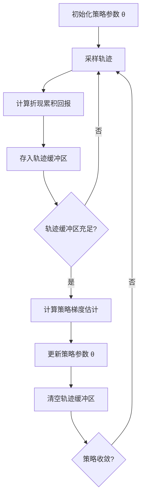

# REINFORCE：蒙特卡洛策略梯度算法

## 1.背景介绍

在强化学习领域中，策略梯度方法是一种广泛使用的算法类型。这些算法直接优化策略函数,使其能够产生最大化期望回报的行为序列。与基于值函数的方法不同,策略梯度算法不需要学习值函数,而是直接从经验数据中学习映射状态到行为的策略。

REINFORCE算法是最早提出的基于蒙特卡洛策略梯度的强化学习算法之一。它使用完整的回报序列来估计策略梯度,从而优化策略参数。尽管简单直接,但REINFORCE算法在处理连续动作空间和高维状态空间时往往会遇到挑战。

## 2.核心概念与联系

### 2.1 策略梯度方法

策略梯度方法的核心思想是直接对策略函数进行参数化,并根据累积的回报最大化策略的期望回报。具体来说,我们定义一个参数化的策略 $\pi_\theta(a|s)$,它表示在状态 $s$ 下选择行为 $a$ 的概率,其中 $\theta$ 是策略的参数。目标是找到一组最优参数 $\theta^*$,使得期望回报 $J(\theta)$ 最大化:

$$J(\theta) = \mathbb{E}_{\tau \sim \pi_\theta} \left[ \sum_{t=0}^{T} \gamma^t r(s_t, a_t) \right]$$

其中 $\tau = (s_0, a_0, s_1, a_1, \dots, s_T)$ 是一个由策略 $\pi_\theta$ 生成的状态-行为序列,也称为一条轨迹(trajectory)。$r(s_t, a_t)$ 是在状态 $s_t$ 执行行为 $a_t$ 后获得的即时回报,而 $\gamma \in [0, 1]$ 是折现因子,用于权衡即时回报和长期回报的重要性。

为了最大化 $J(\theta)$,我们可以使用策略梯度定理,它给出了 $J(\theta)$ 关于 $\theta$ 的梯度:

$$\nabla_\theta J(\theta) = \mathbb{E}_{\tau \sim \pi_\theta} \left[ \sum_{t=0}^{T} \nabla_\theta \log \pi_\theta(a_t|s_t) Q^{\pi_\theta}(s_t, a_t) \right]$$

其中 $Q^{\pi_\theta}(s_t, a_t)$ 是在状态 $s_t$ 执行行为 $a_t$ 后按照策略 $\pi_\theta$ 可获得的期望回报。根据这一梯度估计,我们可以使用梯度上升法来优化策略参数 $\theta$。

### 2.2 REINFORCE算法

REINFORCE算法是一种基于蒙特卡洛策略梯度的强化学习算法。它的核心思想是使用完整的回报序列来估计策略梯度,而不是像时序差分方法那样使用增量回报。具体来说,REINFORCE算法使用以下估计量来近似策略梯度:

$$\nabla_\theta J(\theta) \approx \frac{1}{N} \sum_{n=1}^{N} \sum_{t=0}^{T} \nabla_\theta \log \pi_\theta(a_t^{(n)}|s_t^{(n)}) R_t^{(n)}$$

其中 $N$ 是轨迹的数量, $(s_t^{(n)}, a_t^{(n)})$ 是第 $n$ 条轨迹中的状态-行为对,而 $R_t^{(n)}$ 是从时间步 $t$ 开始的折现累积回报:

$$R_t^{(n)} = \sum_{k=t}^{T} \gamma^{k-t} r(s_k^{(n)}, a_k^{(n)})$$

通过对上述梯度估计进行采样,我们可以更新策略参数 $\theta$,使策略 $\pi_\theta$ 朝着最大化期望回报的方向优化。

## 3.核心算法原理具体操作步骤

REINFORCE算法的具体操作步骤如下:

1. 初始化策略参数 $\theta$,以及一个空的轨迹缓冲区。

2. 对于每个回合:
    a. 从环境初始状态 $s_0$ 开始,根据当前策略 $\pi_\theta$ 采样行为序列 $\{a_t\}_{t=0}^T$,生成一条完整轨迹 $\tau = (s_0, a_0, r_0, s_1, a_1, r_1, \dots, s_T)$。
    b. 计算每个时间步的折现累积回报 $R_t = \sum_{k=t}^{T} \gamma^{k-t} r_k$。
    c. 将轨迹 $\tau$ 及其对应的折现累积回报 $\{R_t\}_{t=0}^T$ 存入轨迹缓冲区。

3. 当轨迹缓冲区充足时,计算策略梯度估计:

   $$\nabla_\theta J(\theta) \approx \frac{1}{N} \sum_{\tau} \sum_{t=0}^{T} \nabla_\theta \log \pi_\theta(a_t|s_t) R_t$$

   其中 $N$ 是轨迹数量。

4. 使用梯度上升法更新策略参数 $\theta$:

   $$\theta \leftarrow \theta + \alpha \nabla_\theta J(\theta)$$

   其中 $\alpha$ 是学习率。

5. 清空轨迹缓冲区,返回步骤2继续训练,直到策略收敛。

需要注意的是,REINFORCE算法的策略梯度估计存在高方差的问题,这可能导致训练过程不稳定。为了减小方差,我们可以使用基线(baseline)技术,将 $R_t$ 替换为 $R_t - b(s_t)$,其中 $b(s_t)$ 是一个只依赖于状态 $s_t$ 的基线函数。一种常见的基线是状态值函数 $V^{\pi_\theta}(s_t)$。



## 4.数学模型和公式详细讲解举例说明

在REINFORCE算法中,我们需要估计策略梯度 $\nabla_\theta J(\theta)$,其中 $J(\theta)$ 是期望回报:

$$J(\theta) = \mathbb{E}_{\tau \sim \pi_\theta} \left[ \sum_{t=0}^{T} \gamma^t r(s_t, a_t) \right]$$

根据策略梯度定理,我们有:

$$\nabla_\theta J(\theta) = \mathbb{E}_{\tau \sim \pi_\theta} \left[ \sum_{t=0}^{T} \nabla_\theta \log \pi_\theta(a_t|s_t) Q^{\pi_\theta}(s_t, a_t) \right]$$

其中 $Q^{\pi_\theta}(s_t, a_t)$ 是在状态 $s_t$ 执行行为 $a_t$ 后按照策略 $\pi_\theta$ 可获得的期望回报。

在REINFORCE算法中,我们使用蒙特卡洛方法来估计 $Q^{\pi_\theta}(s_t, a_t)$,即使用从时间步 $t$ 开始的折现累积回报 $R_t$ 作为估计量:

$$R_t = \sum_{k=t}^{T} \gamma^{k-t} r(s_k, a_k)$$

将其代入策略梯度公式,我们得到:

$$\nabla_\theta J(\theta) \approx \mathbb{E}_{\tau \sim \pi_\theta} \left[ \sum_{t=0}^{T} \nabla_\theta \log \pi_\theta(a_t|s_t) R_t \right]$$

由于我们无法精确计算上式的期望值,因此我们使用蒙特卡洛采样来近似估计梯度:

$$\nabla_\theta J(\theta) \approx \frac{1}{N} \sum_{n=1}^{N} \sum_{t=0}^{T} \nabla_\theta \log \pi_\theta(a_t^{(n)}|s_t^{(n)}) R_t^{(n)}$$

其中 $N$ 是轨迹的数量, $(s_t^{(n)}, a_t^{(n)})$ 是第 $n$ 条轨迹中的状态-行为对,而 $R_t^{(n)}$ 是从时间步 $t$ 开始的折现累积回报。

让我们通过一个具体例子来说明上述公式。假设我们有一个简单的环境,其中智能体可以选择向左或向右移动。如果向左移动,智能体会获得 -1 的回报;如果向右移动,智能体会获得 +1 的回报。我们的目标是训练一个策略,使智能体尽可能向右移动。

假设在某一个回合中,智能体生成了如下轨迹:

```
s_0 -> a_0 (向右) -> r_0 = +1 -> s_1 -> a_1 (向左) -> r_1 = -1 -> s_2 -> a_2 (向右) -> r_2 = +1
```

我们可以计算每个时间步的折现累积回报:

- $R_0 = r_0 + \gamma r_1 + \gamma^2 r_2 = 1 + 0.9 \times (-1) + 0.9^2 \times 1 = 0.19$
- $R_1 = r_1 + \gamma r_2 = -1 + 0.9 \times 1 = -0.1$
- $R_2 = r_2 = 1$

假设我们使用softmax策略,即 $\pi_\theta(a|s) = \frac{e^{\theta_a^{\top} \phi(s)}}{\sum_{a'} e^{\theta_{a'}^{\top} \phi(s)}}$,其中 $\phi(s)$ 是状态特征向量,而 $\theta_a$ 是与行为 $a$ 相关的参数向量。那么,对于时间步 $t=0$,我们有:

$$\nabla_\theta \log \pi_\theta(a_0|s_0) = \phi(s_0) - \sum_{a'} \pi_\theta(a'|s_0) \phi(s_0)$$

将其与 $R_0$ 相乘,我们得到该时间步的梯度估计项:

$$\nabla_\theta \log \pi_\theta(a_0|s_0) R_0 = 0.19 \left( \phi(s_0) - \sum_{a'} \pi_\theta(a'|s_0) \phi(s_0) \right)$$

对于其他时间步,我们可以类似地计算梯度估计项。将所有时间步的梯度估计项求和,就得到了策略梯度的蒙特卡洛估计。通过多次采样并平均,我们可以获得更加准确的梯度估计,并用于优化策略参数 $\theta$。

## 5.项目实践：代码实例和详细解释说明

下面是一个使用PyTorch实现REINFORCE算法的示例代码,用于解决经典的CartPole环境。

```python
import gym
import torch
import torch.nn as nn
import torch.optim as optim
import numpy as np

# 定义策略网络
class PolicyNetwork(nn.Module):
    def __init__(self, state_dim, action_dim):
        super(PolicyNetwork, self).__init__()
        self.fc1 = nn.Linear(state_dim, 128)
        self.fc2 = nn.Linear(128, action_dim)

    def forward(self, state):
        x = torch.relu(self.fc1(state))
        action_probs = torch.softmax(self.fc2(x), dim=-1)
        return action_probs

# REINFORCE算法
def reinforce(env, policy_net, num_episodes, gamma=0.99, lr=0.01):
    optimizer = optim.Adam(policy_net.parameters(), lr=lr)
    
    for episode in range(num_episodes):
        log_probs = []
        rewards = []
        state = env.reset()
        state = torch.from_numpy(state).float().unsqueeze(0)
        
        for t in range(1000):
            action_probs = policy_net(state)
            action_dist = torch.distributions.Categorical(action_probs)
            action = action_dist.sample()
            
            log_prob = action_dist.log_prob(action)
            log_probs.append(log_prob)
            
            next_state, reward, done, _ = env.step(action.item())
            next_state = torch.from_numpy(next_state).float().unsqueeze(0)
            rewards.append(reward)
            
            state = next_state
            
            if done:
                break
        