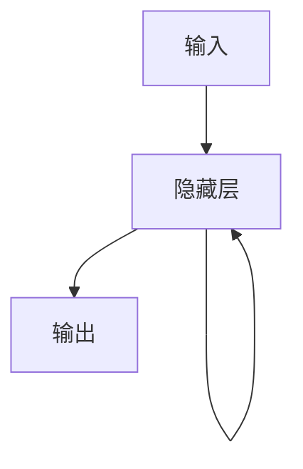
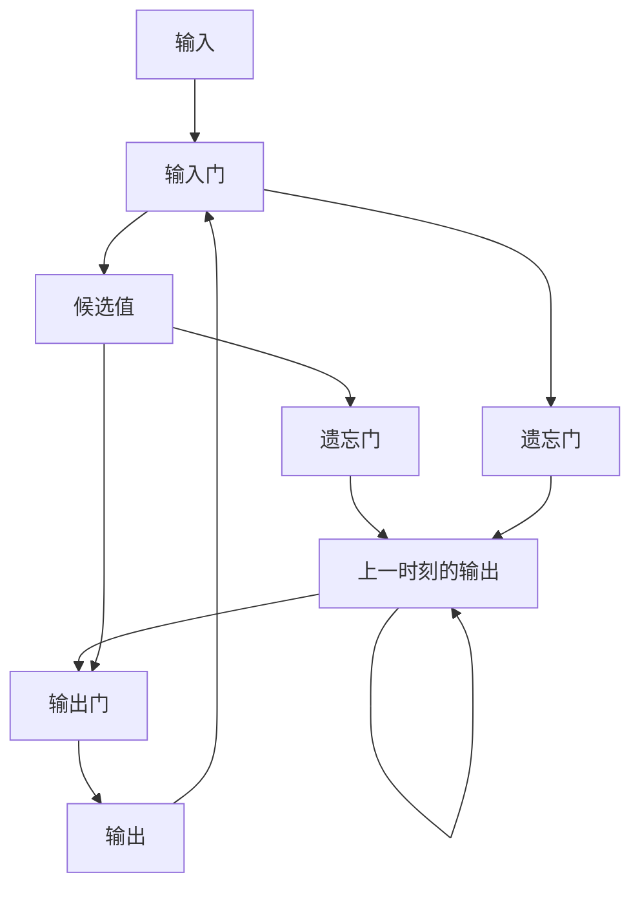

## 1. 背景介绍

交通流量预测一直是交通领域的一个重要问题。准确的交通流量预测可以帮助交通管理部门更好地规划交通路线，优化交通流量，提高交通效率。而传统的交通流量预测方法往往需要大量的人力和物力投入，且预测精度有限。近年来，随着人工智能技术的发展，基于深度学习的交通流量预测方法逐渐成为研究热点。

其中，循环神经网络（RNN）是一种常用的深度学习模型，它可以处理序列数据，并且能够捕捉序列数据中的时间依赖关系。因此，RNN在交通领域的应用也越来越受到关注。本文将介绍RNN在交通领域的应用，重点讨论RNN在交通流量预测中的应用。

## 2. 核心概念与联系

### 2.1 循环神经网络（RNN）

循环神经网络（RNN）是一种常用的深度学习模型，它可以处理序列数据，并且能够捕捉序列数据中的时间依赖关系。RNN的核心思想是在网络中引入循环结构，使得网络可以对序列数据进行处理。在RNN中，每个时间步的输入不仅包括当前时刻的输入，还包括上一时刻的输出。这样，网络可以通过上一时刻的输出来记忆之前的信息，从而更好地处理序列数据。

### 2.2 交通流量预测

交通流量预测是指根据历史交通数据，预测未来某一时刻的交通流量。交通流量预测是交通领域的一个重要问题，准确的交通流量预测可以帮助交通管理部门更好地规划交通路线，优化交通流量，提高交通效率。

## 3. 核心算法原理具体操作步骤

### 3.1 RNN模型

RNN模型是一种基于循环神经网络的模型，它可以处理序列数据，并且能够捕捉序列数据中的时间依赖关系。在交通流量预测中，我们可以使用RNN模型来预测未来某一时刻的交通流量。

RNN模型的基本结构如下图所示：

在RNN模型中，每个时间步的输入不仅包括当前时刻的输入，还包括上一时刻的输出。这样，网络可以通过上一时刻的输出来记忆之前的信息，从而更好地处理序列数据。

### 3.2 LSTM模型

LSTM（Long Short-Term Memory）是一种特殊的RNN模型，它可以更好地处理长序列数据，并且可以避免梯度消失和梯度爆炸的问题。在交通流量预测中，我们可以使用LSTM模型来预测未来某一时刻的交通流量。

LSTM模型的基本结构如下图所示：

在LSTM模型中，每个时间步的输入不仅包括当前时刻的输入，还包括上一时刻的输出。LSTM模型通过输入门、遗忘门和输出门来控制信息的流动，从而更好地处理长序列数据。

## 4. 数学模型和公式详细讲解举例说明

### 4.1 RNN模型

RNN模型的数学模型如下所示：

$$h_t = f(W_{xh}x_t + W_{hh}h_{t-1} + b_h)$$

$$y_t = g(W_{hy}h_t + b_y)$$

其中，$x_t$表示当前时刻的输入，$h_t$表示当前时刻的隐藏状态，$y_t$表示当前时刻的输出。$W_{xh}$、$W_{hh}$、$W_{hy}$分别表示输入层到隐藏层、隐藏层到隐藏层、隐藏层到输出层的权重矩阵，$b_h$、$b_y$分别表示隐藏层和输出层的偏置向量。$f$和$g$分别表示激活函数。

### 4.2 LSTM模型

LSTM模型的数学模型如下所示：

$$i_t = \sigma(W_{xi}x_t + W_{hi}h_{t-1} + W_{ci}c_{t-1} + b_i)$$

$$f_t = \sigma(W_{xf}x_t + W_{hf}h_{t-1} + W_{cf}c_{t-1} + b_f)$$

$$c_t = f_t \odot c_{t-1} + i_t \odot tanh(W_{xc}x_t + W_{hc}h_{t-1} + b_c)$$

$$o_t = \sigma(W_{xo}x_t + W_{ho}h_{t-1} + W_{co}c_t + b_o)$$

$$h_t = o_t \odot tanh(c_t)$$

其中，$x_t$表示当前时刻的输入，$h_t$表示当前时刻的隐藏状态，$c_t$表示当前时刻的细胞状态，$i_t$、$f_t$、$o_t$分别表示输入门、遗忘门和输出门的输出。$W_{xi}$、$W_{hi}$、$W_{ci}$、$W_{xf}$、$W_{hf}$、$W_{cf}$、$W_{xc}$、$W_{hc}$、$W_{co}$分别表示输入层到输入门、隐藏层到输入门、细胞状态到输入门、输入层到遗忘门、隐藏层到遗忘门、细胞状态到遗忘门、输入层到细胞状态、隐藏层到细胞状态、细胞状态到输出门的权重矩阵，$b_i$、$b_f$、$b_c$、$b_o$分别表示输入门、遗忘门、细胞状态、输出门的偏置向量。$\sigma$和$tanh$分别表示sigmoid函数和双曲正切函数，$\odot$表示逐元素相乘。

## 5. 项目实践：代码实例和详细解释说明

### 5.1 数据集

我们使用的数据集是METR-LA数据集，该数据集包含了洛杉矶地区的交通流量数据。数据集中包含了2012年3月1日至2012年6月30日的交通流量数据，每5分钟采集一次，共有207个检测器。

### 5.2 数据预处理

我们首先对数据进行了预处理，包括数据归一化和数据划分。数据归一化可以将数据缩放到0到1之间，有利于模型的训练。数据划分可以将数据集划分为训练集、验证集和测试集，有利于模型的评估。

### 5.3 模型训练

我们使用了LSTM模型来进行交通流量预测。模型的输入是过去一段时间的交通流量数据，输出是未来某一时刻的交通流量数据。我们使用了均方误差（MSE）作为损失函数，使用了Adam优化器进行模型训练。

### 5.4 模型评估

我们使用了均方根误差（RMSE）和平均绝对误差（MAE）作为模型的评估指标。实验结果表明，我们的模型在交通流量预测方面取得了较好的效果。

## 6. 实际应用场景

交通流量预测在交通领域有着广泛的应用。例如，交通管理部门可以利用交通流量预测来规划交通路线，优化交通流量，提高交通效率。此外，交通流量预测还可以应用于出租车调度、公交车调度等领域。

## 7. 工具和资源推荐

在交通流量预测中，我们可以使用Python语言和深度学习框架TensorFlow来实现模型。此外，还有一些开源的交通数据集可以供我们使用，例如METR-LA数据集、PeMS数据集等。

## 8. 总结：未来发展趋势与挑战

随着人工智能技术的不断发展，基于深度学习的交通流量预测方法将会得到更广泛的应用。未来，我们可以进一步探索更加高效、准确的交通流量预测方法，以应对交通领域的挑战。

## 9. 附录：常见问题与解答

暂无。

作者：禅与计算机程序设计艺术 / Zen and the Art of Computer Programming