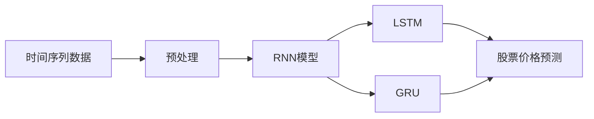

# RNN在金融领域的应用：预测股票价格

## 1. 背景介绍
### 1.1 金融领域中的时间序列预测问题
#### 1.1.1 股票价格预测的重要性
#### 1.1.2 传统预测方法的局限性
#### 1.1.3 深度学习在金融领域的应用前景

### 1.2 循环神经网络(RNN)简介  
#### 1.2.1 RNN的基本原理
#### 1.2.2 RNN在时间序列预测中的优势
#### 1.2.3 RNN的变体：LSTM和GRU

## 2. 核心概念与联系
### 2.1 时间序列数据
#### 2.1.1 时间序列数据的特点
#### 2.1.2 股票价格数据的时间序列特性
#### 2.1.3 时间序列数据的预处理

### 2.2 RNN的核心概念
#### 2.2.1 循环神经元
#### 2.2.2 隐藏状态和记忆机制
#### 2.2.3 梯度消失和梯度爆炸问题

### 2.3 LSTM和GRU
#### 2.3.1 LSTM的门控机制
#### 2.3.2 GRU的简化结构
#### 2.3.3 LSTM和GRU在时间序列预测中的应用



## 3. 核心算法原理具体操作步骤
### 3.1 数据预处理
#### 3.1.1 数据清洗和归一化
#### 3.1.2 时间序列数据的滑动窗口划分
#### 3.1.3 构建训练集和测试集

### 3.2 RNN模型构建
#### 3.2.1 定义RNN层
#### 3.2.2 设置超参数
#### 3.2.3 模型编译和训练

### 3.3 模型评估与优化
#### 3.3.1 评估指标选择
#### 3.3.2 交叉验证
#### 3.3.3 超参数调优

## 4. 数学模型和公式详细讲解举例说明
### 4.1 RNN的数学表示
#### 4.1.1 循环神经元的前向传播
$$h_t = \tanh(W_{hh}h_{t-1} + W_{xh}x_t + b_h)$$
$$y_t = W_{hy}h_t + b_y$$

#### 4.1.2 BPTT算法和梯度计算
#### 4.1.3 梯度消失和梯度爆炸问题的数学分析

### 4.2 LSTM的数学模型
#### 4.2.1 遗忘门、输入门和输出门
$$f_t = \sigma(W_f \cdot [h_{t-1}, x_t] + b_f)$$
$$i_t = \sigma(W_i \cdot [h_{t-1}, x_t] + b_i)$$ 
$$o_t = \sigma(W_o \cdot [h_{t-1}, x_t] + b_o)$$

#### 4.2.2 细胞状态更新
$$\tilde{C}_t = \tanh(W_C \cdot [h_{t-1}, x_t] + b_C)$$
$$C_t = f_t * C_{t-1} + i_t * \tilde{C}_t$$

#### 4.2.3 隐藏状态更新
$$h_t = o_t * \tanh(C_t)$$

### 4.3 GRU的数学模型
#### 4.3.1 更新门和重置门
$$z_t = \sigma(W_z \cdot [h_{t-1}, x_t])$$
$$r_t = \sigma(W_r \cdot [h_{t-1}, x_t])$$

#### 4.3.2 候选隐藏状态计算
$$\tilde{h}_t = \tanh(W \cdot [r_t * h_{t-1}, x_t])$$

#### 4.3.3 隐藏状态更新
$$h_t = (1 - z_t) * h_{t-1} + z_t * \tilde{h}_t$$

## 5. 项目实践：代码实例和详细解释说明
### 5.1 开发环境搭建
#### 5.1.1 Python和深度学习框架选择
#### 5.1.2 数据集准备

### 5.2 数据预处理代码实现
#### 5.2.1 数据清洗和归一化
```python
import pandas as pd
from sklearn.preprocessing import MinMaxScaler

# 读取股票数据
data = pd.read_csv('stock_data.csv')

# 数据归一化
scaler = MinMaxScaler(feature_range=(0, 1)) 
scaled_data = scaler.fit_transform(data['Close'].values.reshape(-1,1))
```

#### 5.2.2 时间序列数据划分
```python
def create_dataset(dataset, look_back=60):
    dataX, dataY = [], []
    for i in range(len(dataset)-look_back):
        a = dataset[i:(i+look_back), 0]
        dataX.append(a)
        dataY.append(dataset[i + look_back, 0])
    return np.array(dataX), np.array(dataY)
    
# 划分训练集和测试集
train_size = int(len(scaled_data) * 0.8)
train, test = scaled_data[0:train_size,:], scaled_data[train_size:len(scaled_data),:]

# 创建时间序列数据集
look_back = 60
trainX, trainY = create_dataset(train, look_back)
testX, testY = create_dataset(test, look_back)
```

### 5.3 RNN模型构建与训练
#### 5.3.1 定义RNN模型
```python
from keras.models import Sequential
from keras.layers import Dense, LSTM

# 创建RNN模型
model = Sequential()
model.add(LSTM(50, input_shape=(look_back, 1)))
model.add(Dense(1))
model.compile(loss='mean_squared_error', optimizer='adam')
```

#### 5.3.2 模型训练
```python
# 训练模型
model.fit(trainX, trainY, epochs=100, batch_size=1, verbose=2)
```

#### 5.3.3 模型预测与评估
```python
# 对测试集进行预测
trainPredict = model.predict(trainX)
testPredict = model.predict(testX)

# 对预测结果进行反归一化
trainPredict = scaler.inverse_transform(trainPredict)
trainY = scaler.inverse_transform([trainY])
testPredict = scaler.inverse_transform(testPredict)
testY = scaler.inverse_transform([testY])

# 计算RMSE
trainScore = math.sqrt(mean_squared_error(trainY[0], trainPredict[:,0]))
print('Train Score: %.2f RMSE' % (trainScore))
testScore = math.sqrt(mean_squared_error(testY[0], testPredict[:,0]))
print('Test Score: %.2f RMSE' % (testScore))
```

## 6. 实际应用场景
### 6.1 股票交易策略
#### 6.1.1 基于RNN预测的买卖信号生成
#### 6.1.2 风险控制与资金管理

### 6.2 投资组合优化
#### 6.2.1 多股票价格预测
#### 6.2.2 基于预测结果的投资组合构建

### 6.3 衍生品定价
#### 6.3.1 期权定价中的隐含波动率预测
#### 6.3.2 基于RNN的期权定价模型改进

## 7. 工具和资源推荐
### 7.1 深度学习框架
#### 7.1.1 TensorFlow
#### 7.1.2 PyTorch
#### 7.1.3 Keras

### 7.2 金融数据源
#### 7.2.1 Yahoo Finance
#### 7.2.2 Quandl
#### 7.2.3 Tushare

### 7.3 相关论文和书籍
#### 7.3.1 《Deep Learning for Time Series Forecasting》
#### 7.3.2 《Advances in Financial Machine Learning》
#### 7.3.3 《Machine Learning for Asset Managers》

## 8. 总结：未来发展趋势与挑战
### 8.1 RNN在金融领域的应用前景
#### 8.1.1 更精准的金融时间序列预测
#### 8.1.2 个性化的投资决策支持
#### 8.1.3 金融风险管理的智能化

### 8.2 面临的挑战
#### 8.2.1 金融市场的不确定性和非线性
#### 8.2.2 数据质量和可解释性问题
#### 8.2.3 模型的鲁棒性和适应性

### 8.3 未来的研究方向
#### 8.3.1 融合其他深度学习模型
#### 8.3.2 引入强化学习和迁移学习
#### 8.3.3 探索知识图谱和因果推理

## 9. 附录：常见问题与解答
### 9.1 RNN相比传统时间序列模型的优势是什么？
RNN能够捕捉时间序列数据中的长期依赖关系，对非线性和非平稳时间序列有更好的建模能力。传统的时间序列模型如ARIMA，对数据的假设较为严格，难以刻画复杂的时间序列模式。

### 9.2 如何处理金融时间序列数据中的噪声和异常值？
可以采用移动平均、小波变换等方法对数据进行平滑和去噪。对于异常值，可以通过设置阈值或使用隔离森林等异常检测算法进行识别和处理。

### 9.3 如何选择RNN模型的超参数？
可以通过网格搜索或贝叶斯优化等方法对超参数进行调优。需要关注的超参数包括隐藏层数量、隐藏单元数、学习率、批量大小等。通过交叉验证来评估不同超参数组合的性能，选择表现最优的超参数设置。

### 9.4 如何解释RNN模型的预测结果？
RNN模型的可解释性相对较弱，可以通过特征重要性分析、敏感性分析等方法来解释模型的预测结果。另外，可以使用注意力机制或可视化技术来理解模型关注的重要时间步和特征。

### 9.5 RNN模型在实际应用中需要注意哪些问题？
在实际应用中，需要关注数据的质量和代表性，定期更新模型以适应市场变化。同时，要合理设置预测的时间跨度，过长的预测可能引入更大的不确定性。在做出投资决策时，还需要考虑交易成本、市场流动性等因素，不能完全依赖模型的预测结果。

作者：禅与计算机程序设计艺术 / Zen and the Art of Computer Programming