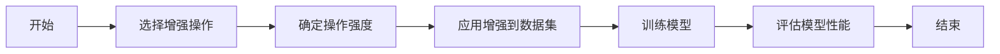

## 1. 背景介绍

在深度学习领域，数据增强是一种常用的技术，用于提高模型的泛化能力。RandAugment是一种新型的数据增强方法，它通过随机选择图像变换操作和变换强度来增强数据集，从而减少了超参数的调整需求。云计算作为一种强大的计算资源，为大规模数据处理和深度学习模型的训练提供了可能。本文将探讨RandAugment在云计算环境下的应用，以及如何利用云计算资源优化RandAugment的效率和性能。

## 2. 核心概念与联系

### 2.1 数据增强的意义
数据增强可以视为一种正则化手段，通过在训练过程中引入噪声，使模型对输入数据的小变化更加鲁棒。

### 2.2 RandAugment的创新点
RandAugment的核心在于其简化了数据增强的流程，通过减少需要调整的超参数数量，使得模型训练更加高效。

### 2.3 云计算与深度学习
云计算提供了按需分配的计算资源，使得深度学习模型能够在更大规模的数据集上进行训练，同时降低了硬件成本。

## 3. 核心算法原理具体操作步骤



### 3.1 选择增强操作
RandAugment随机选择一组预定义的图像变换操作，如旋转、剪切等。

### 3.2 确定操作强度
对于每个选定的操作，RandAugment还会随机选择一个强度级别。

### 3.3 应用增强到数据集
将选定的操作和强度应用到训练数据集的图像上。

### 3.4 训练模型
使用增强后的数据集训练深度学习模型。

### 3.5 评估模型性能
在验证集或测试集上评估模型的性能，以确定RandAugment的效果。

## 4. 数学模型和公式详细讲解举例说明

RandAugment的数学模型可以表示为：

$$
\text{Augmented Image} = \text{RandAugment}(\text{Image}, N, M)
$$

其中，$N$ 表示选择的变换操作数量，$M$ 表示变换强度。具体的变换操作可以通过以下公式表示：

$$
\text{Transformed Image} = \text{Op}(\text{Image}, \text{Intensity})
$$

举例来说，如果选择的操作是旋转（Rotate），强度为 $M$，则变换后的图像可以通过以下公式获得：

$$
\text{Rotated Image} = \text{Rotate}(\text{Image}, \theta)
$$

其中，$\theta$ 是根据强度 $M$ 确定的旋转角度。

## 5. 项目实践：代码实例和详细解释说明

以下是一个简单的RandAugment实现示例：

```python
import numpy as np
import PIL.ImageOps, PIL.ImageEnhance, PIL.ImageDraw

def randaugment(image, N, M):
    ops = [
        ("Rotate", lambda img, magnitude: img.rotate(magnitude)),
        ("ShearX", lambda img, magnitude: img.transform(img.size, PIL.Image.AFFINE, (1, magnitude, 0, 0, 1, 0))),
        # ... 其他操作
    ]
    for _ in range(N):
        op, func = random.choice(ops)
        magnitude = random.uniform(-M, M)
        image = func(image, magnitude)
    return image
```

在这个代码示例中，我们定义了一个 `randaugment` 函数，它接受一个图像、操作数量 `N` 和强度 `M` 作为输入，并返回增强后的图像。

## 6. 实际应用场景

RandAugment可以应用于各种图像识别任务，如物体检测、图像分类和语义分割。在云计算环境中，可以利用分布式计算资源来并行处理大量图像的增强，从而加速模型的训练过程。

## 7. 工具和资源推荐

- TensorFlow和PyTorch：两个流行的深度学习框架，都支持自定义数据增强方法。
- Google Cloud Platform和Amazon Web Services：提供强大的云计算资源，适合进行大规模深度学习训练。

## 8. 总结：未来发展趋势与挑战

RandAugment作为一种有效的数据增强方法，其简化的操作和参数设置在未来可能会成为标准的数据增强流程。然而，随着数据量的增加和模型复杂度的提高，如何进一步优化云计算资源的使用效率，以及如何保证数据增强的多样性和有效性，将是未来研究的重点。

## 9. 附录：常见问题与解答

Q1: RandAugment如何选择最佳的N和M值？
A1: 通常通过实验来确定最佳的N和M值，可以使用网格搜索或贝叶斯优化等方法。

Q2: 在云计算环境中使用RandAugment有什么优势？
A2: 云计算环境提供了大量的计算资源，可以在短时间内处理大量数据，加速模型训练和验证过程。

作者：禅与计算机程序设计艺术 / Zen and the Art of Computer Programming