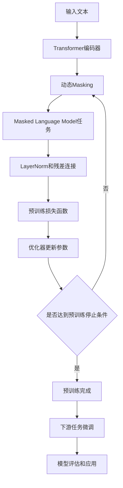

# RoBERTa原理与代码实例讲解

## 1. 背景介绍
### 1.1 自然语言处理的发展历程
#### 1.1.1 早期的词袋模型和n-gram模型
#### 1.1.2 词向量的出现和发展
#### 1.1.3 基于深度学习的自然语言处理技术

### 1.2 Transformer模型的革新
#### 1.2.1 Transformer的核心思想
#### 1.2.2 自注意力机制
#### 1.2.3 Transformer在NLP领域的应用

### 1.3 BERT模型的诞生
#### 1.3.1 BERT的创新点
#### 1.3.2 预训练和微调范式
#### 1.3.3 BERT在下游任务上的卓越表现

### 1.4 RoBERTa的提出
#### 1.4.1 RoBERTa对BERT的改进
#### 1.4.2 RoBERTa的特点
#### 1.4.3 RoBERTa在学术界和工业界的影响力

## 2. 核心概念与联系
### 2.1 RoBERTa的核心思想
#### 2.1.1 动态Masking
#### 2.1.2 更大的批量大小
#### 2.1.3 更多的训练数据和训练步数
#### 2.1.4 去除Next Sentence Prediction任务

### 2.2 RoBERTa与BERT的异同
#### 2.2.1 编码器结构的相似性
#### 2.2.2 预训练任务的差异
#### 2.2.3 训练策略的优化

### 2.3 RoBERTa与其他预训练模型的比较
#### 2.3.1 与BERT的性能对比
#### 2.3.2 与XLNet、ALBERT等模型的优劣势分析
#### 2.3.3 RoBERTa在下游任务上的表现

## 3. 核心算法原理具体操作步骤
### 3.1 RoBERTa的模型架构
#### 3.1.1 Transformer编码器
#### 3.1.2 位置编码
#### 3.1.3 LayerNorm和残差连接

### 3.2 预训练阶段
#### 3.2.1 动态Masking的实现
#### 3.2.2 Masked Language Model任务
#### 3.2.3 优化器和损失函数

### 3.3 微调阶段
#### 3.3.1 下游任务的数据准备
#### 3.3.2 微调的训练过程
#### 3.3.3 超参数选择和调优策略

## 4. 数学模型和公式详细讲解举例说明
### 4.1 自注意力机制的数学原理
#### 4.1.1 查询、键、值的计算
#### 4.1.2 缩放点积注意力
#### 4.1.3 多头注意力机制

### 4.2 LayerNorm的数学公式
#### 4.2.1 均值和方差的计算
#### 4.2.2 归一化和缩放平移
#### 4.2.3 LayerNorm的作用和优势

### 4.3 损失函数的数学表达
#### 4.3.1 Masked Language Model的损失函数
#### 4.3.2 交叉熵损失
#### 4.3.3 损失函数的优化和收敛

## 5. 项目实践：代码实例和详细解释说明
### 5.1 环境配置和依赖安装
#### 5.1.1 PyTorch的安装
#### 5.1.2 Transformers库的安装
#### 5.1.3 其他必要的依赖包

### 5.2 数据准备和预处理
#### 5.2.1 数据集的下载和格式转换
#### 5.2.2 文本的tokenization和编码
#### 5.2.3 数据集的划分和BatchSampler

### 5.3 RoBERTa模型的实现
#### 5.3.1 RoBERTa编码器的PyTorch实现
#### 5.3.2 动态Masking的实现
#### 5.3.3 预训练和微调的代码流程

### 5.4 训练和评估
#### 5.4.1 模型的训练循环
#### 5.4.2 评估指标的计算
#### 5.4.3 模型的保存和加载

### 5.5 实验结果分析
#### 5.5.1 不同超参数设置下的性能比较
#### 5.5.2 RoBERTa在下游任务上的表现
#### 5.5.3 实验结果的可视化和分析

## 6. 实际应用场景
### 6.1 情感分析
#### 6.1.1 情感分析任务介绍
#### 6.1.2 RoBERTa在情感分析中的应用
#### 6.1.3 情感分析的实际案例

### 6.2 命名实体识别
#### 6.2.1 命名实体识别任务介绍
#### 6.2.2 RoBERTa在命名实体识别中的应用
#### 6.2.3 命名实体识别的实际案例

### 6.3 问答系统
#### 6.3.1 问答系统任务介绍
#### 6.3.2 RoBERTa在问答系统中的应用
#### 6.3.3 问答系统的实际案例

### 6.4 文本分类
#### 6.4.1 文本分类任务介绍
#### 6.4.2 RoBERTa在文本分类中的应用
#### 6.4.3 文本分类的实际案例

## 7. 工具和资源推荐
### 7.1 RoBERTa的开源实现
#### 7.1.1 Hugging Face的Transformers库
#### 7.1.2 Fairseq工具包
#### 7.1.3 PyTorch官方实现

### 7.2 预训练模型的获取
#### 7.2.1 Hugging Face的模型库
#### 7.2.2 Google的TensorFlow Hub
#### 7.2.3 微软的ONNX模型库

### 7.3 数据集资源
#### 7.3.1 GLUE基准测试集
#### 7.3.2 SQuAD问答数据集
#### 7.3.3 其他常用的NLP数据集

### 7.4 学习资料和社区
#### 7.4.1 RoBERTa论文和源码
#### 7.4.2 相关的博客和教程
#### 7.4.3 NLP研究者社区和论坛

## 8. 总结：未来发展趋势与挑战
### 8.1 RoBERTa的优势和局限性
#### 8.1.1 RoBERTa在NLP任务上的优异表现
#### 8.1.2 RoBERTa的计算资源需求和训练成本
#### 8.1.3 RoBERTa在特定领域的适用性

### 8.2 预训练模型的发展方向
#### 8.2.1 模型架构的改进和创新
#### 8.2.2 预训练任务的设计和优化
#### 8.2.3 模型压缩和加速技术

### 8.3 RoBERTa在实际应用中的挑战
#### 8.3.1 模型的可解释性和可信性
#### 8.3.2 数据隐私和安全问题
#### 8.3.3 模型的公平性和偏见问题

### 8.4 未来的研究方向和机遇
#### 8.4.1 多模态预训练模型
#### 8.4.2 领域自适应和迁移学习
#### 8.4.3 预训练模型的理论基础研究

## 9. 附录：常见问题与解答
### 9.1 RoBERTa和BERT的区别是什么？
### 9.2 RoBERTa在哪些任务上表现最好？
### 9.3 如何微调RoBERTa模型用于特定任务？
### 9.4 RoBERTa的训练需要多少计算资源？
### 9.5 RoBERTa是否支持多语言？
### 9.6 RoBERTa能否用于生成任务？
### 9.7 RoBERTa的可解释性如何？
### 9.8 如何处理RoBERTa的过拟合问题？
### 9.9 RoBERTa在实际应用中需要注意哪些问题？
### 9.10 RoBERTa未来的研究方向有哪些？

RoBERTa（Robustly Optimized BERT Pretraining Approach）是一种基于BERT的预训练语言模型，由Facebook AI Research（FAIR）团队提出。RoBERTa在BERT的基础上进行了一系列的改进和优化，在多个自然语言处理任务上取得了state-of-the-art的表现。

RoBERTa的核心思想是通过动态Masking、更大的批量大小、更多的训练数据和训练步数，以及去除Next Sentence Prediction（NSP）任务等策略，来增强模型的泛化能力和鲁棒性。与BERT相比，RoBERTa在编码器结构上保持一致，但在预训练任务和训练策略上进行了优化。

在模型架构方面，RoBERTa采用了Transformer编码器作为基本组件，通过自注意力机制和前馈神经网络来学习文本的上下文表示。模型中还引入了位置编码、LayerNorm和残差连接等技术，以增强模型的表达能力和训练稳定性。

RoBERTa的预训练阶段主要包括动态Masking和Masked Language Model（MLM）任务。动态Masking是指在每个训练批次中随机选择一部分词元进行掩码，而不是像BERT那样在整个语料库上静态地确定掩码位置。MLM任务则是根据上下文预测被掩码的词元，通过最小化交叉熵损失来学习语言的统计规律。

在微调阶段，RoBERTa可以根据具体的下游任务进行fine-tuning。通过在预训练模型的基础上添加任务特定的输出层，并使用任务相关的数据集进行训练，RoBERTa可以快速适应不同的NLP任务，如文本分类、命名实体识别、问答系统等。

RoBERTa在多个基准测试中展现了优异的性能，在GLUE、SQuAD、RACE等数据集上均取得了显著的提升。这些结果证明了RoBERTa在捕捉语言特征和理解语义方面的强大能力。

在实际应用中，RoBERTa已经被广泛用于各种NLP场景，如情感分析、命名实体识别、问答系统、文本分类等。通过在特定领域的数据上微调RoBERTa，可以构建高效、准确的自然语言处理模型，为实际问题提供有效的解决方案。

尽管RoBERTa在NLP领域取得了显著的进展，但仍然存在一些挑战和局限性。模型的可解释性和可信性仍然是一个亟待解决的问题，特别是在涉及敏感决策的场景中。此外，RoBERTa的训练需要大量的计算资源和时间，对于资源有限的研究者和开发者来说可能是一个障碍。

未来，预训练语言模型的研究方向可能会集中在模型架构的改进、预训练任务的设计优化、模型压缩和加速技术等方面。此外，多模态预训练模型、领域自适应和迁移学习、预训练模型的理论基础研究等也是值得关注的研究方向。

总的来说，RoBERTa作为BERT的改进版本，在自然语言处理领域取得了显著的进展。它的出现推动了预训练语言模型的发展，为NLP任务提供了更加强大和通用的基础模型。随着研究的不断深入和技术的进一步发展，RoBERTa和其他预训练模型必将在实际应用中发挥更大的作用，为人机交互和知识挖掘开辟新的可能性。

作者：禅与计算机程序设计艺术 / Zen and the Art of Computer Programming