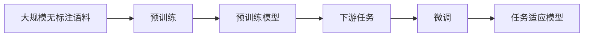

# RoBERTa的论文解读:从理论到实践的系统梳理

## 1. 背景介绍
### 1.1 自然语言处理的发展历程
#### 1.1.1 早期的规则与统计方法
#### 1.1.2 深度学习的崛起 
#### 1.1.3 预训练语言模型的诞生
### 1.2 Transformer与BERT模型
#### 1.2.1 Transformer的核心思想
#### 1.2.2 BERT的预训练与微调
#### 1.2.3 BERT的局限性
### 1.3 RoBERTa的提出
#### 1.3.1 对BERT的改进
#### 1.3.2 RoBERTa的创新点

## 2. 核心概念与联系
### 2.1 预训练
#### 2.1.1 无监督学习
#### 2.1.2 自监督学习
#### 2.1.3 迁移学习
### 2.2 微调
#### 2.2.1 监督学习
#### 2.2.2 任务适应
#### 2.2.3 参数初始化
### 2.3 Masked Language Model(MLM)
#### 2.3.1 动态遮挡
#### 2.3.2 双向编码
#### 2.3.3 次字级别的Tokenization
### 2.4 Mermaid流程图


## 3. 核心算法原理具体操作步骤
### 3.1 数据预处理
#### 3.1.1 文本清洗与标准化
#### 3.1.2 Byte Pair Encoding(BPE)
#### 3.1.3 动态遮挡
### 3.2 模型结构
#### 3.2.1 Transformer Encoder
#### 3.2.2 Position Embedding
#### 3.2.3 Segment Embedding
### 3.3 预训练目标
#### 3.3.1 MLM
#### 3.3.2 Next Sentence Prediction(NSP)
#### 3.3.3 Sentence Order Prediction(SOP)
### 3.4 优化策略
#### 3.4.1 AdamW优化器
#### 3.4.2 Learning Rate Decay
#### 3.4.3 梯度裁剪与累积

## 4. 数学模型和公式详细讲解举例说明
### 4.1 Self-Attention
$$Attention(Q,K,V) = softmax(\frac{QK^T}{\sqrt{d_k}})V$$
其中，$Q$,$K$,$V$分别表示Query,Key,Value矩阵，$d_k$为Key的维度。
### 4.2 Layer Normalization
$$\mu=\frac{1}{H}\sum_{i=1}^{H}a_i$$
$$\sigma=\sqrt{\frac{1}{H}\sum_{i=1}^{H}(a_i-\mu)^2}$$
$$LN(a)=\frac{a-\mu}{\sigma}$$
其中，$a$为输入向量，$H$为隐藏层维度，$\mu$和$\sigma$分别为均值和标准差。
### 4.3 GeLU激活函数
$$GeLU(x)=xP(X\leq x)=x\cdot\frac{1}{2}[1+erf(\frac{x}{\sqrt{2}})]$$
其中，$P(X)$为高斯分布的累积分布函数，$erf$为高斯误差函数。

## 5. 项目实践：代码实例和详细解释说明
### 5.1 环境配置
#### 5.1.1 PyTorch安装
#### 5.1.2 Transformers库安装
#### 5.1.3 数据集下载
### 5.2 数据预处理
```python
from transformers import RobertaTokenizer
tokenizer = RobertaTokenizer.from_pretrained('roberta-base')
train_encodings = tokenizer(train_texts, truncation=True, padding=True)
```
### 5.3 模型定义与初始化
```python
from transformers import RobertaForSequenceClassification
model = RobertaForSequenceClassification.from_pretrained('roberta-base', num_labels=2)
```
### 5.4 模型训练
```python
from transformers import Trainer, TrainingArguments

training_args = TrainingArguments(
    output_dir='./results',
    num_train_epochs=3,
    per_device_train_batch_size=16,
    per_device_eval_batch_size=64,
    warmup_steps=500,
    weight_decay=0.01,
    logging_dir='./logs',
)

trainer = Trainer(
    model=model,
    args=training_args,
    train_dataset=train_dataset,
    eval_dataset=val_dataset
)

trainer.train()
```
### 5.5 模型推理
```python
from transformers import pipeline
classifier = pipeline('sentiment-analysis', model=model, tokenizer=tokenizer)
results = classifier(test_texts)
```

## 6. 实际应用场景
### 6.1 文本分类
#### 6.1.1 情感分析
#### 6.1.2 主题分类
#### 6.1.3 意图识别
### 6.2 序列标注
#### 6.2.1 命名实体识别
#### 6.2.2 词性标注
#### 6.2.3 语义角色标注
### 6.3 阅读理解
#### 6.3.1 片段抽取
#### 6.3.2 多项选择
### 6.4 自然语言推理
#### 6.4.1 蕴含关系识别
#### 6.4.2 相似度计算

## 7. 工具和资源推荐
### 7.1 数据集
#### 7.1.1 GLUE
#### 7.1.2 SQuAD
#### 7.1.3 RACE
### 7.2 开源实现
#### 7.2.1 Transformers
#### 7.2.2 Fairseq
#### 7.2.3 Flair
### 7.3 预训练模型
#### 7.3.1 RoBERTa
#### 7.3.2 XLM-RoBERTa
#### 7.3.3 RoBERTa-wwm

## 8. 总结：未来发展趋势与挑战
### 8.1 更大规模的预训练模型
#### 8.1.1 参数量的增长
#### 8.1.2 计算资源的需求
### 8.2 更多样化的预训练任务
#### 8.2.1 对比学习
#### 8.2.2 增量学习
### 8.3 跨模态学习
#### 8.3.1 图像-文本
#### 8.3.2 语音-文本
### 8.4 模型压缩与加速
#### 8.4.1 知识蒸馏
#### 8.4.2 量化与剪枝
#### 8.4.3 模型并行

## 9. 附录：常见问题与解答
### 9.1 RoBERTa与BERT的区别？
RoBERTa在BERT的基础上主要做了以下改进：
1. 更多的训练数据和更大的batch size
2. 去掉了NSP任务
3. 动态调整Masking Pattern
4. 使用Byte-level BPE
### 9.2 RoBERTa适用于哪些任务？
RoBERTa作为一个强大的通用语言模型，可以适用于几乎所有的NLP任务，如文本分类、序列标注、阅读理解、自然语言推理等。通过简单的微调，就可以在下游任务上取得很好的效果。
### 9.3 在实际项目中如何选择RoBERTa的模型规模？
这取决于具体任务的复杂度和可用的计算资源。一般来说，参数量越大的模型效果越好，但训练和推理的开销也越大。对于一般的任务，可以先尝试使用`roberta-base`等基础版本。如果效果不够理想，再考虑使用`roberta-large`等大模型。
### 9.4 RoBERTa对于中文任务的效果如何？
RoBERTa本身是在英文语料上训练的，对于中文任务可能效果不够理想。好在研究者们提供了多种面向中文任务的RoBERTa变体，如中文RoBERTa-wwm系列，它们使用了中文文本数据进行训练，能够很好地处理中文任务。

作者：禅与计算机程序设计艺术 / Zen and the Art of Computer Programming