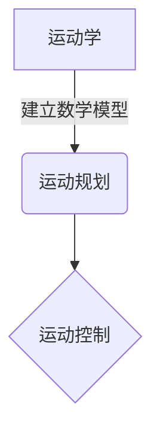
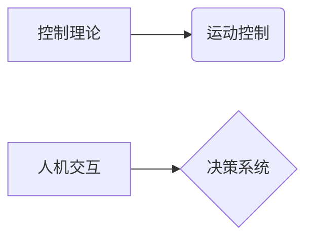
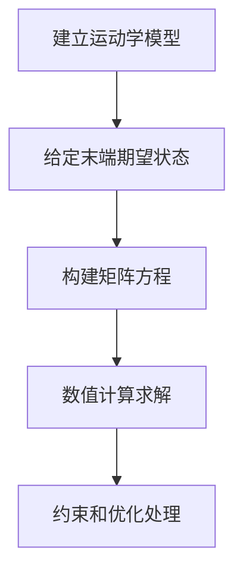
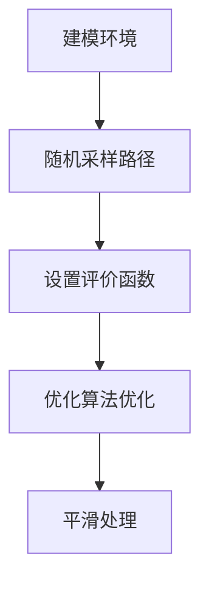

# Robotics 原理与代码实战案例讲解

## 1.背景介绍

机器人技术是一个跨学科的领域,融合了计算机科学、机械工程、电子工程、控制理论、人工智能等多个学科。随着科技的不断进步,机器人已经广泛应用于工业制造、医疗康复、家庭服务、航空航天等诸多领域。

机器人系统通常由机械部分、电子部分和软件部分组成。机械部分决定了机器人的运动形式和工作空间;电子部分负责感知环境信息和执行控制指令;软件部分则负责规划运动轨迹、处理感知数据和作出决策。

### 1.1 机器人的分类

根据应用场景,机器人可分为:

- **工业机器人**: 主要用于工厂自动化生产线,具有重复作业能力。
- **服务机器人**: 为人类提供各种服务,如家庭服务、医疗护理等。
- **特种机器人**: 用于特殊环境,如消防救援、反恐处置等。
- **探索机器人**: 用于太空探索、海底勘探等人难以到达的环境。

### 1.2 机器人技术的发展

机器人技术经历了从机械化到电子化,再到智能化的发展历程。当前,机器人技术正向智能化、自主化和协作方向发展,主要体现在:

- 感知能力增强,能够获取更多环境信息
- 决策能力提高,可根据情况自主作出判断
- 运动控制更精准,能完成更复杂的运动任务
- 人机协作能力加强,能与人类安全高效协作

## 2.核心概念与联系

机器人系统涉及多个核心概念,相互关联紧密:

### 2.1 运动学与运动规划

**运动学**研究机器人各关节运动的几何关系,建立机器人末端执行器与各关节运动之间的数学模型。这是进行运动控制的基础。

**运动规划**根据给定的起点、终点和约束条件,计算出机器人从起点运动到终点的理想轨迹。常用的方法有插值法、采样法等。



### 2.2 感知与决策

**感知**是指机器人获取环境信息的能力,主要依赖各种传感器,如视觉、激光、雷达等。

**决策**系统根据感知数据作出判断和决策,规划相应的行为。决策方法有反馈控制、行为树、机器学习等。


### 2.3 控制理论与人机交互

**控制理论**是实现精准运动控制的理论基础,如PID控制、自适应控制、机器人操作系统(ROS)等。

**人机交互**使机器人能够理解人类的意图并与人自然交互,涉及自然语言处理、计算机视觉等技术。



## 3.核心算法原理具体操作步骤

机器人系统中有多种核心算法,下面介绍两种常用算法的原理和操作步骤。

### 3.1 反向运动学求解算法

反向运动学是根据给定的机器人末端执行器的位置和姿态,求解各个关节的运动角度。这是运动控制的基础。

算法步骤:

1. 建立机器人运动学模型,包括D-H参数、变换矩阵等
2. 给定期望的末端执行器位置和姿态
3. 将位置和姿态转换为矩阵形式
4. 利用数值计算方法求解关节角度,如牛顿迭代法
5. 对求解结果进行约束和优化处理



### 3.2 采样优化路径规划算法

对于存在障碍物的环境,需要规划无碰撞的运动路径。采样优化路径规划算法通过随机采样生成多条可行路径,并进行优化得到最优路径。

算法步骤:

1. 对环境进行建模,获取障碍物信息
2. 随机采样生成大量可行路径
3. 设置路径评价函数,如路径长度、平滑性等
4. 利用优化算法(如遗传算法)优化路径
5. 对优化后的路径进行平滑处理



## 4.数学模型和公式详细讲解举例说明

机器人系统中有许多重要的数学模型和公式,下面详细介绍两个核心模型。

### 4.1 机器人运动学模型

机器人运动学模型描述了机器人各关节运动与末端执行器运动之间的几何关系。常用的建模方法是D-H表示法。

对于一个n自由度的机器人,D-H参数如下:

$$\begin{aligned}
\alpha_{i-1} &= \text{旋转角,将 }z_{i-1}\text{ 与 }z_i\text{ 重合} \\
a_{i-1} &= \text{链接偏移,沿 }x_{i-1}\text{ 方向的距离} \\
d_i &= \text{链接长度,沿 }z_i\text{ 方向的距离} \\
\theta_i &= \text{关节角,绕 }z_i\text{ 旋转}
\end{aligned}$$

则第i个关节的同侪变换矩阵为:

$$
T_i = \begin{bmatrix}
\cos\theta_i & -\sin\theta_i\cos\alpha_{i-1} & \sin\theta_i\sin\alpha_{i-1} & a_{i-1}\cos\theta_i\\
\sin\theta_i & \cos\theta_i\cos\alpha_{i-1} & -\cos\theta_i\sin\alpha_{i-1} & a_{i-1}\sin\theta_i\\
0 & \sin\alpha_{i-1} & \cos\alpha_{i-1} & d_i\\
0 & 0 & 0 & 1
\end{bmatrix}
$$

通过矩阵连乘,可以得到从基坐标系到末端执行器的变换矩阵:

$$
T = T_1T_2...T_n
$$

这就建立了关节角度与末端位姿之间的数学模型,为运动控制提供了理论基础。

### 4.2 PID控制器模型

PID控制器是一种常用的反馈控制方法,广泛应用于机器人的关节控制中。其数学模型为:

$$
u(t) = K_p e(t) + K_i \int_0^t e(\tau)d\tau + K_d \frac{de(t)}{dt}
$$

其中:
- $u(t)$ 为控制器输出
- $e(t)$ 为系统当前值与期望值的偏差
- $K_p$、$K_i$、$K_d$ 分别为比例、积分、微分系数

通过调节三个系数,可以控制系统的响应特性,如稳定性、调节时间、稳态误差等。

以关节角度控制为例,误差 $e(t)$ 为当前关节角度与期望角度的差值。PID控制器根据误差计算出需要施加的力矩或电压,从而使关节角度逐步接近期望值。

## 5.项目实践:代码实例和详细解释说明

下面通过一个六自由度机械臂的Python仿真项目,展示机器人系统的编程实现。

### 5.1 机器人模型

首先定义机器人的D-H参数和相关常量:

```python
# D-H参数
d = [0.089159, 0, 0, 0.10915, 0.09465, 0.0823]
a = [0, 0.425, -0.39225, 0, 0, 0] 
alpha = [np.pi/2, 0, 0, np.pi/2, -np.pi/2, 0]

# 关节角范围(弧度)
q_min = [-np.pi/2, -np.pi, -np.pi/2, -np.pi/2, -np.pi/2, -np.pi/2]
q_max = [np.pi/2, np.pi, np.pi/2, np.pi/2, np.pi/2, np.pi/2]
```

根据D-H参数计算每个关节的变换矩阵:

```python
def T_matrix(alpha, a, d, q):
    T = np.array([[np.cos(q), -np.sin(q)*np.cos(alpha), np.sin(q)*np.sin(alpha), a*np.cos(q)],
                  [np.sin(q), np.cos(q)*np.cos(alpha), -np.cos(q)*np.sin(alpha), a*np.sin(q)],
                  [0, np.sin(alpha), np.cos(alpha), d],
                  [0, 0, 0, 1]])
    return T
```

计算从基坐标系到末端执行器的变换矩阵:

```python
def trans_matrix(q):
    T = np.eye(4)
    for i in range(6):
        T = np.matmul(T, T_matrix(alpha[i], a[i], d[i], q[i]))
    return T
```

### 5.2 运动规划和可视化

实现一个简单的线性插值算法,规划从初始位置到目标位置的关节角度序列:

```python
def trajectory(q_init, q_goal, n):
    q = np.zeros((n, 6))
    for i in range(6):
        q[:, i] = np.linspace(q_init[i], q_goal[i], n)
    return q
```

使用Python的Matplotlib库,可视化机器人的运动轨迹:

```python
from mpl_toolkits.mplot3d import Axes3D

fig = plt.figure()
ax = fig.add_subplot(111, projection='3d')

for q in traj:
    T = trans_matrix(q)
    ax.plot([T[0, 3], T[0, 3]], [T[1, 3], T[1, 3]], [T[2, 3], 0], 'r-')
    ax.plot([T[0, 3]], [T[1, 3]], [T[2, 3]], 'ko')

ax.set_xlabel('X')
ax.set_ylabel('Y')
ax.set_zlabel('Z')
plt.show()
```

### 5.3 关节控制

实现一个简单的PID控制器,控制每个关节角度跟踪期望轨迹:

```python
class PIDController:
    def __init__(self, Kp, Ki, Kd):
        self.Kp = Kp
        self.Ki = Ki
        self.Kd = Kd
        self.integral = 0
        self.prev_error = 0

    def get_output(self, error, dt):
        self.integral += error * dt
        derivative = (error - self.prev_error) / dt
        output = self.Kp * error + self.Ki * self.integral + self.Kd * derivative
        self.prev_error = error
        return output
```

在每个控制周期,计算关节角度误差,并由PID控制器输出需要施加的力矩:

```python
dt = 0.01  # 控制周期
q_current = q_init  # 当前关节角度
for q_desired in traj:
    error = q_desired - q_current
    torque = [pid.get_output(e, dt) for e, pid in zip(error, pids)]
    # 根据力矩更新关节角度
    q_current += torque * dt
```

通过上述代码实现,机器人就可以按照规划的轨迹运动,并对轨迹进行实时跟踪控制。

## 6.实际应用场景

机器人技术在诸多领域有广泛的应用,下面列举几个典型场景:

### 6.1 工业自动化

工业机器人是机器人应用最早和最成熟的领域。机器人可以替代人工进行焊接、装配、上下料等重复劳动,提高生产效率和产品质量。

### 6.2 服务机器人

服务机器人可以为人类提供各种服务,如家庭服务机器人负责清洁、烹饪等家务劳动;医疗康复机器人辅助残疾人士的日常生活等。

### 6.3 特种作业

在一些特殊环境下,机器人可以替代人工作业,如:

- 消防救援机器人进入有毒有害环境搜救
- 反恐处置机器人探测和拆除爆炸物
- 核设施检修机器人进行检测和维修

### 6.4 太空探索

机器人