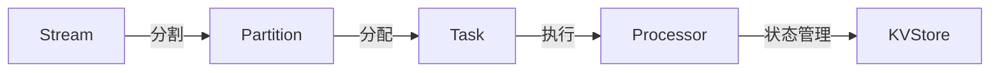

# Samza KV Store原理与代码实例讲解

## 1. 背景介绍
在大数据处理领域，实时数据流处理是一个不断发展的热点话题。Apache Samza是LinkedIn开发的一个开源流处理框架，它专为大规模数据流处理设计。Samza允许用户编写能够处理无限数据流的应用程序，并且能够在分布式计算环境中稳定运行。Samza的一个关键特性是其本地状态存储能力，即Samza KV Store，它允许每个任务在本地存储和查询状态，从而提高了整体的处理效率和可伸缩性。

## 2. 核心概念与联系
Samza的核心概念包括流、任务、分区、处理器和状态存储。流是数据的逻辑集合，任务是对流数据进行处理的逻辑单元，分区是流的物理分割，处理器是执行任务的物理实体，而状态存储则是用于持久化任务状态的机制。Samza KV Store是状态存储的一种实现，它使用键值对的方式存储数据，使得数据的读写变得高效和方便。



## 3. 核心算法原理具体操作步骤
Samza KV Store的核心算法原理是基于本地存储和远程备份的组合。每个任务都有一个本地KV Store，用于快速读写操作。同时，为了保证数据的可靠性，KV Store的数据会被复制到远程存储中。当任务需要恢复或迁移时，可以从远程存储中恢复其状态。

操作步骤如下：
1. 初始化本地KV Store。
2. 处理输入流数据，更新KV Store。
3. 定期将KV Store的更改同步到远程存储。
4. 在任务失败或迁移时，从远程存储恢复KV Store状态。

## 4. 数学模型和公式详细讲解举例说明
Samza KV Store的性能可以通过以下数学模型来描述：

$$
T = \frac{N}{R + W}
$$

其中：
- $T$ 是系统的吞吐量（每秒可以处理的请求数）。
- $N$ 是并发操作的数量。
- $R$ 是平均读取操作的延迟。
- $W$ 是平均写入操作的延迟。

例如，如果一个KV Store配置了100个并发操作，平均读取延迟是5ms，写入延迟是10ms，那么吞吐量为：

$$
T = \frac{100}{5 + 10} \approx 6.67 \text{ 请求/秒}
$$

## 5. 项目实践：代码实例和详细解释说明
以下是一个简单的Samza KV Store的代码实例：

```java
public class MySamzaTask implements StreamTask, InitableTask {
    private KeyValueStore<String, String> kvStore;

    @Override
    public void init(Config config, TaskContext context) {
        this.kvStore = (KeyValueStore<String, String>) context.getStore("my-kv-store");
    }

    @Override
    public void process(IncomingMessageEnvelope envelope, MessageCollector collector, TaskCoordinator coordinator) {
        String key = envelope.getKey().toString();
        String value = envelope.getMessage().toString();
        kvStore.put(key, value);
    }
}
```

在这个例子中，`MySamzaTask`类实现了`StreamTask`和`InitableTask`接口。在`init`方法中，我们从`TaskContext`获取名为`my-kv-store`的KV Store实例。在`process`方法中，我们将接收到的消息的键和值存储到KV Store中。

## 6. 实际应用场景
Samza KV Store可以应用于多种场景，例如：
- 实时统计和分析
- 个性化推荐系统
- 实时监控和报警系统
- 会话状态的维护

## 7. 工具和资源推荐
- Apache Samza官方文档：提供了详细的Samza使用指南和API文档。
- Kafka：常与Samza一起使用的分布式消息系统，用于流数据的生产和消费。
- RocksDB：一种高性能的嵌入式数据库，可以作为Samza KV Store的底层存储引擎。

## 8. 总结：未来发展趋势与挑战
随着实时数据处理需求的增长，Samza KV Store将继续发展，以支持更高的吞吐量、更低的延迟和更强的可伸缩性。未来的挑战包括处理更大规模的数据、提高状态存储的容错能力以及简化操作和维护。

## 9. 附录：常见问题与解答
Q1: Samza KV Store支持哪些数据类型？
A1: Samza KV Store支持任何序列化的数据类型，包括字符串、整数、自定义对象等。

Q2: 如何保证Samza KV Store的数据一致性？
A2: Samza通过与Kafka等消息系统集成，利用其日志复制特性来保证数据的一致性。

Q3: Samza KV Store的性能瓶颈在哪里？
A3: 性能瓶颈通常与底层存储引擎的性能、网络延迟以及系统资源（如CPU和内存）有关。

作者：禅与计算机程序设计艺术 / Zen and the Art of Computer Programming