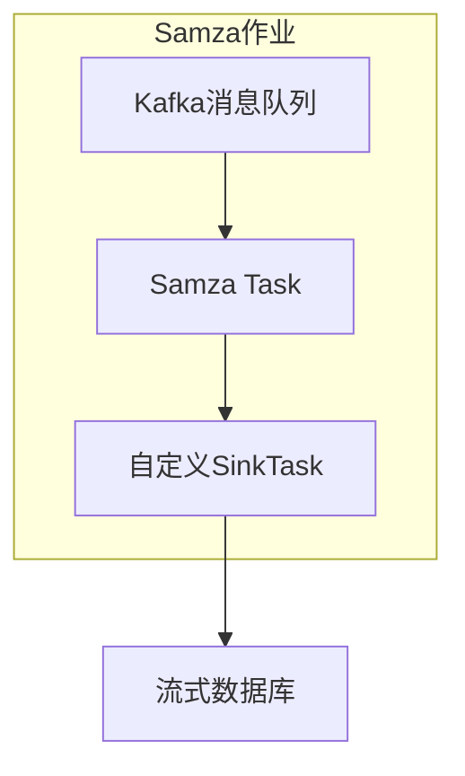
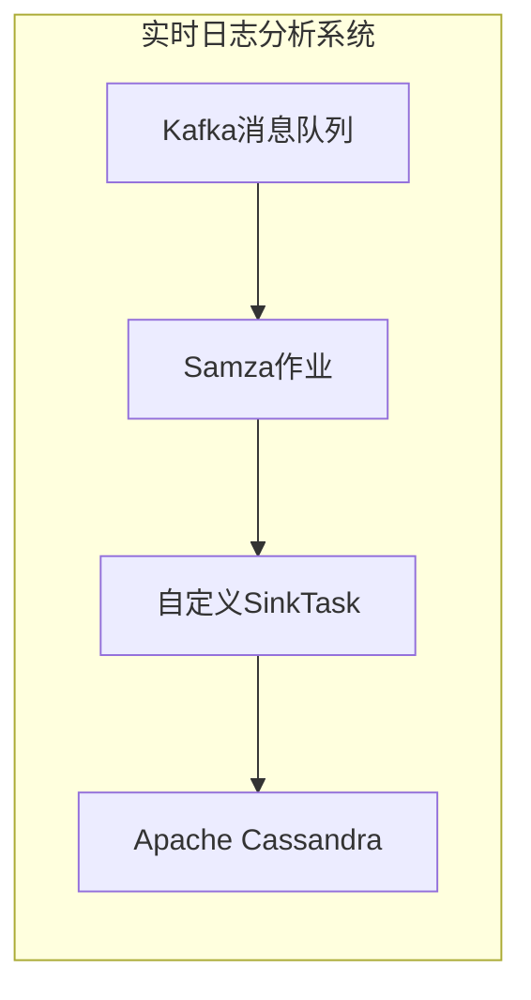

# SamzaTask与流式数据库集成

## 1.背景介绍

随着大数据时代的到来,越来越多的企业开始关注实时数据处理和分析。传统的数据库系统往往无法满足实时数据处理的需求,因为它们主要设计用于存储和查询静态数据。为了解决这一问题,流式数据处理系统应运而生。

Apache Samza是一个分布式的流式处理系统,由LinkedIn公司开发并开源。它基于Apache Kafka消息队列,可以从Kafka消费数据流,并对数据流进行实时处理和分析。Samza具有容错、可伸缩、简单部署等优点,非常适合构建实时大数据处理应用程序。

与传统的批处理系统不同,流式处理系统需要与数据库系统紧密集成,将实时处理后的数据持久化存储,以供后续查询和分析使用。常见的流式数据库有Apache Cassandra、InfluxDB、Couchbase等,它们都提供了与流式处理系统集成的方案。

本文将重点介绍如何将Samza与流式数据库集成,探讨相关的核心概念、算法原理、实现方式以及实际应用场景。

## 2.核心概念与联系

在讨论Samza与流式数据库集成之前,我们需要先了解以下几个核心概念:

### 2.1 Samza Task

Samza Task是Samza作业中最小的执行单元,负责从Kafka消费数据流、处理数据并输出结果。每个Samza作业由多个Task组成,这些Task可以并行执行以提高处理能力。

Samza Task有两种类型:`StreamTask`和`WindowableTask`。前者用于处理无边界的数据流,后者用于处理有边界的数据窗口。

### 2.2 Samza Job

Samza Job是一个完整的流式处理应用程序,包含一个或多个Samza Task。Job负责协调和管理Task的执行,并将处理结果输出到Kafka或其他系统。

### 2.3 流式数据库

流式数据库(Streaming Database)是一种专门为实时数据处理而设计的数据库系统。它能够高效地处理持续不断的数据流,并提供低延迟的数据写入和查询。

常见的流式数据库有Apache Cassandra、InfluxDB、Couchbase等。它们通常采用分布式架构,具有高可扩展性和容错能力。

### 2.4 数据管道

数据管道(Data Pipeline)是指将数据从源头传输到目的地的过程。在Samza与流式数据库集成场景中,数据管道包括以下几个环节:

1. Kafka作为数据源,接收实时数据流
2. Samza从Kafka消费数据,进行实时处理
3. 处理后的数据写入流式数据库
4. 应用程序从流式数据库查询数据,进行分析和可视化

## 3.核心算法原理具体操作步骤

### 3.1 Samza Task与流式数据库集成原理

要将Samza Task与流式数据库集成,关键是在Task的处理逻辑中添加将数据写入数据库的代码。Samza提供了一种称为"Sink"的机制,用于将处理后的数据输出到外部系统。

我们可以实现一个自定义的SinkTask,将其插入到Samza作业的执行流程中。当Samza Task完成数据处理后,SinkTask会被调用,负责将结果数据写入流式数据库。

下面是Samza Task与流式数据库集成的基本流程:



### 3.2 实现自定义SinkTask

要实现自定义SinkTask,我们需要继承Samza提供的`org.apache.samza.task.MessageChooserSink`抽象类,并重写其中的几个关键方法:

1. `putMessageBatch`方法: 该方法会在Samza Task完成数据处理后被调用,我们需要在该方法中实现将数据写入流式数据库的逻辑。
2. `flush`方法: 用于将缓存的数据批量写入数据库,确保数据不会丢失。
3. `close`方法: 在SinkTask关闭时被调用,我们可以在该方法中释放资源。

下面是一个简单的自定义SinkTask示例,它将数据写入Apache Cassandra数据库:

```java
import org.apache.samza.system.OutgoingMessageEnvelope;
import org.apache.samza.task.MessageChooserSink;

public class CassandraSink extends MessageChooserSink {

    private CassandraClient cassandraClient;

    public CassandraSink() {
        cassandraClient = new CassandraClient();
    }

    @Override
    public void putMessageBatch(List<OutgoingMessageEnvelope> envelopes) {
        for (OutgoingMessageEnvelope envelope : envelopes) {
            String key = envelope.getKey();
            String value = envelope.getMessage();
            cassandraClient.insert(key, value);
        }
    }

    @Override
    public void flush() {
        cassandraClient.flush();
    }

    @Override
    public void close() {
        cassandraClient.close();
    }
}
```

在上面的示例中,我们创建了一个`CassandraSink`类,它继承自`MessageChooserSink`。在`putMessageBatch`方法中,我们遍历Samza Task处理后的数据,并调用`CassandraClient`的`insert`方法将数据写入Cassandra数据库。`flush`方法用于将缓存的数据批量写入,而`close`方法用于释放资源。

### 3.3 配置Samza作业

实现了自定义SinkTask后,我们需要在Samza作业的配置文件中指定要使用的SinkTask。以下是一个配置示例:

```properties
# Samza作业配置
job.factory=org.apache.samza.job.yarn.YarnJobFactory
job.yarn.container.count=4

# Samza Task配置
task.inputs=kafka.system.stream1

# 自定义SinkTask配置
task.sink.factory=org.apache.samza.system.CassandraSinkFactory
systems.cassandra.samza.factory=org.apache.samza.system.cassandra.CassandraSystemFactory
systems.cassandra.cassandra.hosts=localhost
systems.cassandra.cassandra.port=9042
systems.cassandra.cassandra.keyspace=myKeyspace
systems.cassandra.cassandra.table=myTable
```

在上面的配置中,我们指定了要使用的自定义SinkTask工厂`CassandraSinkFactory`,以及Cassandra数据库的连接信息。Samza在运行时会根据这些配置创建并初始化SinkTask实例。

## 4.数学模型和公式详细讲解举例说明

在流式数据处理领域,常常需要使用一些数学模型和公式来描述和分析数据流的特性。以下是一些常见的数学模型和公式:

### 4.1 数据流模型

数据流可以被建模为一个无限序列,记作$\{x_t\}_{t=1}^\infty$,其中$x_t$表示时间$t$时刻的数据。

在实际应用中,我们通常需要对数据流进行窗口划分,以便进行有界的数据处理。常见的窗口类型包括滑动窗口(Sliding Window)和会话窗口(Session Window)。

对于滑动窗口,我们可以用下式表示:

$$W_t = \{x_{t-n+1}, x_{t-n+2}, \dots, x_t\}$$

其中$n$表示窗口大小,即包含的数据个数。

而会话窗口则是根据数据之间的时间间隔来划分,其数学表达式为:

$$W_i = \{x_j | t_i \le t_j \le t_i + \gamma, t_{j+1} - t_j \le \delta\}$$

其中$\gamma$表示会话超时时间,$\delta$表示数据之间的最大时间间隔。

### 4.2 数据流统计量

在处理数据流时,我们常常需要计算一些统计量,例如平均值、方差、中位数等。由于数据流是无限的,因此我们需要使用增量式计算方法,而不能一次性加载所有数据。

以计算平均值为例,我们可以使用如下公式进行增量式计算:

$$\mu_n = \mu_{n-1} + \frac{x_n - \mu_{n-1}}{n}$$

其中$\mu_n$表示前$n$个数据的平均值,$x_n$表示第$n$个数据。

对于方差的计算,我们可以使用如下公式:

$$\sigma_n^2 = \frac{n-1}{n}\sigma_{n-1}^2 + \frac{(x_n - \mu_n)^2}{n}$$

这些增量式计算公式可以有效地降低内存占用,适合用于流式数据处理场景。

### 4.3 数据流异常检测

在实时数据处理中,我们常常需要检测数据流中的异常值,以便进行及时的报警和处理。常见的异常检测算法包括基于统计量的方法、基于机器学习的方法等。

以基于统计量的方法为例,我们可以使用$3\sigma$原则来检测异常值。具体来说,如果一个数据点$x_t$满足以下条件,则被视为异常值:

$$|x_t - \mu| > 3\sigma$$

其中$\mu$和$\sigma$分别表示数据流的平均值和标准差。

对于基于机器学习的异常检测方法,常见的算法包括隔离森林(Isolation Forest)、一类支持向量机(One-Class SVM)等。这些算法通过学习数据的正常模式,从而能够有效地检测出偏离正常模式的异常数据。

## 5.项目实践:代码实例和详细解释说明

为了更好地理解Samza Task与流式数据库集成的实现细节,我们将通过一个具体的项目实践来进行说明。在这个项目中,我们将构建一个实时日志分析系统,从Kafka消费日志数据流,进行实时处理并将结果写入Apache Cassandra数据库。

### 5.1 项目概述

我们的实时日志分析系统包括以下几个主要组件:

1. **Kafka**:用于接收和存储实时日志数据流。
2. **Samza作业**:从Kafka消费日志数据,进行实时处理。
3. **自定义SinkTask**:将Samza作业处理后的结果写入Cassandra数据库。
4. **Apache Cassandra**:用于存储处理后的日志数据,供后续查询和分析。

下图展示了整个系统的架构:



### 5.2 实现自定义SinkTask

我们首先需要实现一个自定义的SinkTask,用于将Samza作业处理后的日志数据写入Cassandra数据库。以下是`CassandraSink`类的代码:

```java
import org.apache.samza.system.OutgoingMessageEnvelope;
import org.apache.samza.task.MessageChooserSink;

public class CassandraSink extends MessageChooserSink {

    private CassandraClient cassandraClient;

    public CassandraSink() {
        cassandraClient = new CassandraClient();
    }

    @Override
    public void putMessageBatch(List<OutgoingMessageEnvelope> envelopes) {
        for (OutgoingMessageEnvelope envelope : envelopes) {
            String logEntry = envelope.getMessage();
            cassandraClient.insert(logEntry);
        }
    }

    @Override
    public void flush() {
        cassandraClient.flush();
    }

    @Override
    public void close() {
        cassandraClient.close();
    }
}
```

在`putMessageBatch`方法中,我们遍历Samza作业处理后的日志数据,并调用`CassandraClient`的`insert`方法将每条日志写入Cassandra数据库。`flush`方法用于将缓存的数据批量写入,而`close`方法用于释放资源。

`CassandraClient`是一个封装了Cassandra数据库操作的辅助类,其实现细节如下:

```java
import com.datastax.driver.core.Cluster;
import com.datastax.driver.core.Session;

public class CassandraClient {

    private Cluster cluster;
    private Session session;

    public CassandraClient() {
        cluster = Cluster.builder()
                .addContactPoint("localhost")
                .build();
        session = cluster.connect("log_keyspace");
    }

    public void insert(String logEntry) {
        String cql = "INSERT INTO log_table (timestamp, message) VALUES (?, ?)";
        session.execute(cql, System.currentTimeMillis(), logEntry);
    }

    public void flush() {
        // No-op for Cassandra
    }

    public void close() {
        session.close();
        cluster.close();
    }
}
```

在`C