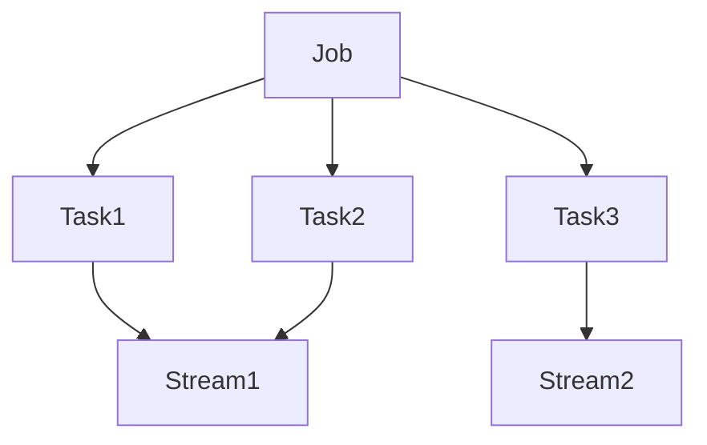

## 1. 背景介绍

随着互联网的快速发展，数据量的爆炸式增长，传统的批处理方式已经无法满足实时性和高并发的需求。流处理技术应运而生，它可以实时处理数据流，提供更快速、更准确的数据分析和决策支持。而Samza作为一款流处理框架，正是为了解决这些问题而诞生的。

Samza是由LinkedIn公司开发的一款分布式流处理框架，它基于Apache Kafka构建，可以实现高效、可扩展、容错的流处理。Samza的设计目标是提供一个简单易用的流处理框架，同时保证高性能和可靠性。它可以处理大规模的数据流，支持实时计算、流式处理、状态管理等功能，广泛应用于实时数据分析、实时监控、实时推荐等领域。

## 2. 核心概念与联系

Samza的核心概念包括：

- Job：一个Samza应用程序，由一个或多个Task组成。
- Task：Samza中的最小处理单元，负责处理一个或多个输入流，并生成一个或多个输出流。
- Stream：数据流，是Samza中的基本数据单元，可以是Kafka Topic、HDFS文件、Socket等。
- Message：消息，是Samza中的数据单元，可以是JSON、Avro、Protobuf等格式。

Samza的架构如下图所示：



在Samza中，Job由多个Task组成，每个Task负责处理一个或多个输入流，并生成一个或多个输出流。Task之间可以通过Stream进行数据交换，Stream可以是Kafka Topic、HDFS文件、Socket等。Samza的架构采用了分布式的方式，可以通过增加Task的数量来实现水平扩展，提高处理能力和吞吐量。

## 3. 核心算法原理具体操作步骤

Samza的核心算法原理是基于Kafka的消息队列和YARN的资源管理，它的具体操作步骤如下：

1. 定义Job：定义一个Samza Job，包括输入流、输出流、处理逻辑等。
2. 打包Job：将Job打包成一个Jar包，包含所有的依赖库和配置文件。
3. 提交Job：将Jar包提交到YARN集群上，由YARN进行资源管理和任务调度。
4. 启动Task：YARN启动Task，每个Task启动一个Samza Container，Container负责运行Task。
5. 处理数据：Task从输入流中读取数据，进行处理，并将结果写入输出流中。
6. 状态管理：Samza提供了状态管理功能，可以将Task的状态保存在本地磁盘或分布式存储系统中，以便容错和恢复。

## 4. 数学模型和公式详细讲解举例说明

Samza的数学模型和公式比较简单，主要是基于Kafka的消息队列和YARN的资源管理。它的核心原理是将数据流分成多个分区，每个分区由一个或多个Task处理，Task之间通过Kafka进行数据交换。Samza的公式如下：

$$Samza = Kafka + YARN$$

其中，Kafka是消息队列，YARN是资源管理器，Samza是基于它们构建的流处理框架。

## 5. 项目实践：代码实例和详细解释说明

下面是一个简单的Samza应用程序示例，它从一个Kafka Topic中读取数据，进行Word Count统计，并将结果写入另一个Kafka Topic中。

```java
public class WordCountTask implements StreamTask, InitableTask {
    private Counter counter;

    @Override
    public void init(Context context) {
        counter = new Counter();
    }

    @Override
    public void process(IncomingMessageEnvelope envelope, MessageCollector collector, TaskCoordinator coordinator) {
        String message = (String) envelope.getMessage();
        String[] words = message.split(" ");
        for (String word : words) {
            counter.increment(word);
        }
        collector.send(new OutgoingMessageEnvelope(new SystemStream("kafka", "word-count"), counter.toString()));
    }
}

public class WordCountJob implements StreamApplication {
    @Override
    public void init(StreamGraph graph, Config config) {
        MessageStream<String> input = graph.getInputStream(new SystemStream("kafka", "input"));
        OutputStream<String> output = graph.getOutputStream(new SystemStream("kafka", "word-count"));
        input
            .flatMap(message -> Arrays.asList(message.split(" ")))
            .map(word -> new KV<>(word, 1))
            .window(Windows.tumblingWindow(Duration.ofSeconds(10), new Serde<String>(), new IntegerSerde()))
            .reduce((count1, count2) -> count1 + count2)
            .map(kv -> kv.getKey() + ": " + kv.getValue())
            .sendTo(output);
    }
}
```

上面的代码中，WordCountTask是一个Task，负责从输入流中读取数据，进行Word Count统计，并将结果写入输出流中。WordCountJob是一个Job，定义了输入流、输出流和处理逻辑。它使用了Samza的流式处理API，包括flatMap、map、window、reduce等操作。

## 6. 实际应用场景

Samza可以应用于实时数据分析、实时监控、实时推荐等领域。下面是一些实际应用场景：

- 实时数据分析：Samza可以实时处理大规模的数据流，进行数据分析和挖掘，提供实时的数据分析和决策支持。
- 实时监控：Samza可以实时监控系统的运行状态和性能指标，及时发现和解决问题，提高系统的可靠性和稳定性。
- 实时推荐：Samza可以实时处理用户行为数据，进行个性化推荐，提高用户体验和满意度。

## 7. 工具和资源推荐

Samza的官方网站提供了丰富的工具和资源，包括：

- 官方文档：提供了详细的Samza使用说明和API文档。
- 示例代码：提供了多个Samza应用程序的示例代码，可以帮助用户快速上手。
- 社区支持：Samza有一个活跃的社区，提供了丰富的支持和帮助。

## 8. 总结：未来发展趋势与挑战

随着互联网的快速发展，流处理技术将会越来越重要。Samza作为一款流处理框架，具有高性能、可扩展、容错等优点，将会在未来得到广泛的应用。但是，Samza也面临着一些挑战，例如：

- 性能优化：Samza需要不断优化性能，提高处理能力和吞吐量。
- 容错机制：Samza需要提供更加完善的容错机制，保证系统的可靠性和稳定性。
- 生态建设：Samza需要建立更加完善的生态系统，提供更多的工具和资源，吸引更多的用户和开发者。

## 9. 附录：常见问题与解答

Q: Samza支持哪些数据格式？

A: Samza支持多种数据格式，包括JSON、Avro、Protobuf等。

Q: Samza的容错机制是怎样的？

A: Samza的容错机制包括Checkpoint和Changelog，可以将Task的状态保存在本地磁盘或分布式存储系统中，以便容错和恢复。

Q: Samza的性能如何？

A: Samza的性能非常高，可以处理大规模的数据流，提供高效、可扩展、容错的流处理。

作者：禅与计算机程序设计艺术 / Zen and the Art of Computer Programming