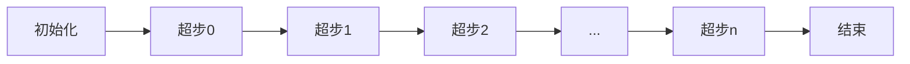
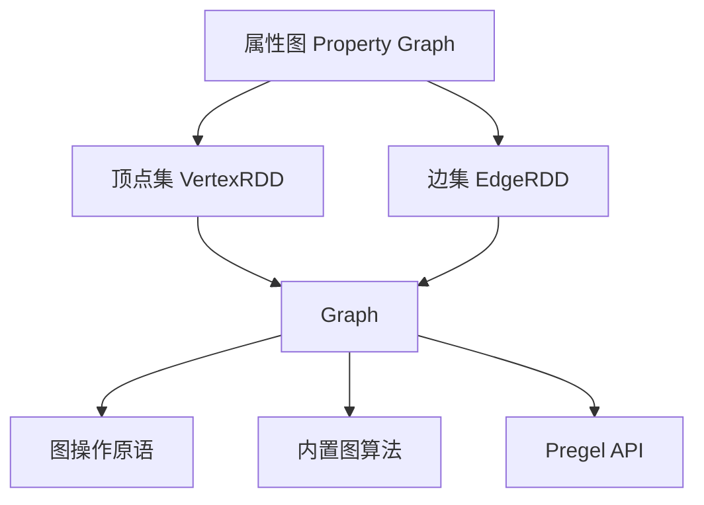
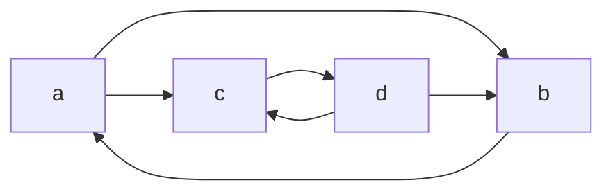

# Spark GraphX原理与代码实例讲解

## 1. 背景介绍

### 1.1 大数据时代的图计算需求

在当今大数据时代,图数据无处不在。社交网络、电商推荐、金融风控等诸多领域都涉及到复杂的关系网络,传统的数据处理和分析方法已经无法满足实时性和规模性的要求。图计算作为一种新兴的大数据分析技术,可以高效地分析数百亿节点和数万亿边的超大规模图数据,为各行各业的决策分析提供有力支撑。

### 1.2 Spark生态系统中的GraphX

Apache Spark是一个快速、通用的大规模数据处理引擎,提供了高度抽象的API,可以轻松地进行大规模数据处理。Spark生态系统中的GraphX是一个分布式图计算框架,基于Spark平台构建,支持图的并行化处理。GraphX继承了Spark RDD的特性,并在此基础上提供了丰富的图算法和图操作原语,使得在海量数据上进行复杂图计算变得简单高效。

### 1.3 GraphX的应用场景

GraphX在实际应用中有着广泛的应用场景,主要包括:

- 社交网络分析:利用GraphX可以对社交网络进行影响力分析、社区发现等。
- 推荐系统:通过构建用户-物品二部图,GraphX可以实现基于图的协同过滤等推荐算法。
- 欺诈检测:将交易数据构建成图,通过图算法可以发现异常交易模式,实现反欺诈。  
- 知识图谱:利用GraphX可以高效地存储和查询海量的知识图谱数据。

## 2. 核心概念与联系

### 2.1 Property Graph

GraphX使用Property Graph(属性图)作为图数据模型。属性图由一组顶点(Vertex)和一组边(Edge)组成,每个顶点和边都可以携带属性。形式化定义为:

```
G = (V, E, PV, PE)
V = {v1, v2, ..., vn}
E ⊆ {(src,dst) | src,dst ∈ V}
PV: V -> (K -> V)*
PE: E -> (K -> V)*
```

其中,V为顶点集合,E为边集合,PV和PE分别表示顶点属性映射和边属性映射。

### 2.2 Vertex RDD & Edge RDD

GraphX将属性图的顶点和边分别存储为两个RDD:VertexRDD[VD]和EdgeRDD[ED]。

- VertexRDD[VD]: 顶点RDD,以(VertexID, VD)的形式存储每个顶点,其中VertexID是64位整数,VD是顶点属性类型。
- EdgeRDD[ED]: 边RDD,以Edge[ED]的形式存储每条边,Edge是GraphX定义的 case class,包含srcId、dstId和attr三个属性,分别表示边的源顶点、目标顶点和边属性。

### 2.3 Graph

Graph是GraphX定义的图数据类型,由VertexRDD和EdgeRDD组成。定义如下:

```scala
class Graph[VD, ED] {
  val vertices: VertexRDD[VD] 
  val edges: EdgeRDD[ED]
}
```

Graph类封装了一系列图操作原语,如点操作(mapVertices)、边操作(mapEdges)、结构操作(reverse、subgraph)等,并提供了一组内置的图算法,如PageRank、连通分量、最短路径等。

### 2.4 Pregel API

除了Graph类提供的图操作原语外,GraphX还提供了一套类Pregel API用于自定义图算法。Pregel是Google提出的大规模图计算框架,基于BSP(Bulk Synchronous Parallel)模型。GraphX中的Pregel API包括如下几个核心概念:

- 顶点程序(Vertex Program):每个顶点上执行的用户自定义计算逻辑。
- 消息(Message):顶点之间传递的中间值。
- 聚合器(Aggregator):在迭代过程中跨顶点汇总的全局信息。
- 超步(Superstep):每轮迭代称为一个超步,由多个顶点并行计算组成。

下图展示了Pregel模型的基本计算过程:



### 2.5 核心概念联系

下图展示了GraphX中几个核心概念之间的关系:



可以看出,Property Graph是GraphX的基本数据模型,VertexRDD和EdgeRDD是图数据的分布式存储形式,Graph类封装了RDD并提供了图操作和计算接口,Pregel API在Graph的基础上进一步提供了图算法自定义的能力。

## 3. 核心算法原理与操作步骤

GraphX提供了一组内置的图算法,如PageRank、连通分量、最短路径等。这里以PageRank为例,介绍GraphX中图算法的实现原理和操作步骤。

### 3.1 PageRank 算法原理

PageRank最初由Google提出,用于评估网页的重要性。其基本思想是:如果一个网页被很多其他网页链接到,说明这个网页比较重要,它的PageRank值就高;同时,如果一个重要的网页链接到一个其他网页,后者的重要性也会提高。PageRank通过迭代计算收敛每个网页的PR值。

设网页 $i$ 的PageRank值为 $PR(i)$,网页 $i$ 的出链数为 $L(i)$,则第 $n$ 轮迭代的计算公式为:

$$
PR^{(n)}(i) = \frac{1-d}{N} + d \sum_{j \in B(i)} \frac{PR^{(n-1)}(j)}{L(j)}
$$

其中,$N$ 为网页总数,$B(i)$ 为所有链接到网页 $i$ 的网页集合,$d$ 为阻尼系数,一般取0.85。

### 3.2 GraphX中的PageRank实现

GraphX中实现PageRank的基本步骤如下:

1. 构建图:将网页和链接关系构建成Property Graph。顶点属性为(VertexId, PageRank值),边默认属性为1.0。

2. 计算出度:调用 `graph.outDegrees` 计算每个顶点的出度,并使用 `graph.joinVertices` 将出度信息关联到顶点。 

3. 发送消息:对每条边调用 `edge.sendToDst`,将源顶点的 PageRank值除以出度发送给目标顶点。

4. 聚合消息:对每个顶点调用 `vertexProgram`,将收到的 PageRank值求和,乘以阻尼系数,再加上 $(1-d)/N$,得到新的PageRank值。

5. 迭代计算:重复步骤3和4,直到PageRank值收敛或达到最大迭代次数。

6. 返回结果:输出最终的顶点 PageRank值。

下面是使用Pregel API实现PageRank的核心代码:

```scala
def runPageRank(graph: Graph[Double, Double], numIter: Int): Graph[Double, Double] = {
  val numVertices = graph.vertices.count()
  val initRank = 1.0 / numVertices
  
  def vertexProgram(id: VertexId, attr: Double, msgSum: Double): Double = {
    resetProb + (1.0 - resetProb) * msgSum
  }
  
  def sendMessage(edge: EdgeTriplet[Double, Double]): Iterator[(VertexId, Double)] = {
    Iterator((edge.dstId, edge.srcAttr / edge.srcAttr))
  }
  
  def messageCombiner(a: Double, b: Double): Double = a + b
  
  val resetProb = 0.15
  val initGraph = graph.mapVertices((id, _) => initRank)
  
  val rankGraph = initGraph.pregel(initRank, numIter, activeDirection = EdgeDirection.Out)(
    vertexProgram,
    sendMessage,
    messageCombiner)
    
  rankGraph
}
```

其中,`vertexProgram`定义了顶点程序,`sendMessage`定义了消息发送逻辑,`messageCombiner`定义了消息聚合逻辑。算法先使用`initGraph`初始化顶点的PageRank值,然后调用`pregel`方法启动迭代计算,返回最终的PageRank值。

## 4. 数学模型和公式详解

前面介绍了PageRank的计算公式,这里进一步说明该公式的数学含义。PageRank本质上可以看作一个状态转移过程,即一个随机浏览者从当前网页出发,有d的概率选择一个链接进入下一个网页,有1-d的概率随机跳转到任意网页。

设网页个数为N,PageRank值构成N维向量 $\mathbf{R}$,转移概率矩阵为 $\mathbf{M}$,则PageRank的迭代过程可以表示为:

$$
\mathbf{R}^{(n)} = (1-d) \frac{1}{N} \mathbf{1} + d \mathbf{M} \mathbf{R}^{(n-1)}
$$

其中, $\mathbf{1}$ 为全1向量。可以证明,当 $n$ 趋于无穷时,PageRank向量 $\mathbf{R}$ 收敛到以下方程的解:

$$
\mathbf{R} = (1-d) \frac{1}{N} \mathbf{1} + d \mathbf{M} \mathbf{R}
$$

进一步可以证明,上述方程存在唯一的非负解,且 $\sum_i R_i = 1$,即 PageRank向量是转移矩阵 $\mathbf{M}$ 对应马尔可夫链的平稳分布。

举个简单例子,假设有4个网页a、b、c、d,链接关系如下:



对应的转移概率矩阵为:

$$
\mathbf{M} = 
\begin{bmatrix} 
0 & 1/2 & 0 & 0\\
1/2 & 0 & 0 & 1/2\\
1/2 & 0 & 0 & 1/2\\
0 & 1/2 & 1 & 0
\end{bmatrix}
$$

取 $d=0.85$,则PageRank计算公式为:

$$
\mathbf{R}^{(n)} = 
0.15 
\begin{bmatrix}
1/4\\
1/4\\
1/4\\
1/4
\end{bmatrix} 
+ 0.85 \mathbf{M} \mathbf{R}^{(n-1)}
$$

经过若干轮迭代后,PageRank值最终收敛到:

$$
\mathbf{R} \approx
\begin{bmatrix}
0.2\\
0.3\\
0.2\\
0.3
\end{bmatrix}
$$

可以看出,网页b和d的重要性较高,这与它们的链接关系相符合。

## 5. 项目实践:代码实例与详解

下面通过一个完整的代码实例,展示如何使用GraphX进行PageRank计算。

### 5.1 创建Spark上下文

```scala
import org.apache.spark.graphx._
import org.apache.spark.rdd.RDD
import org.apache.spark.SparkContext
import org.apache.spark.SparkConf

object PageRankExample {
  def main(args: Array[String]): Unit = {
    val conf = new SparkConf().setAppName("PageRank")
    val sc = new SparkContext(conf)
    
    // ...
  }
}
```

首先创建Spark上下文,用于后续的图计算。

### 5.2 加载边数据并构建图

```scala
val edgeData: RDD[(Long, Long)] = sc.textFile("data/edges.txt").map {
  case line =>
    val fields = line.split("\\s+")
    (fields(0).toLong, fields(1).toLong)
}.distinct()

val graph: Graph[Double, Int] = Graph.fromEdgeTuples(edgeData, 1)
```

假设边数据保存在文本文件"data/edges.txt"中,每行格式为"srcId dstId",表示一条从srcId到dstId的有向边。使用`sc.textFile`加载数据并解析成元组,然后调用`Graph.fromEdgeTuples`构建图,顶点和边的初始属性分别为1.0和1。

### 5.3 调用Pregel API计算PageRank

```scala
val numIter = 10
val resetProb = 0.15

def vertexProgram(id: VertexId, attr: Double, msgSum: Double): Double = {
  resetProb + (1.0 - resetProb) * msgSum
}

def sendMessage(edge: EdgeTriplet[Double