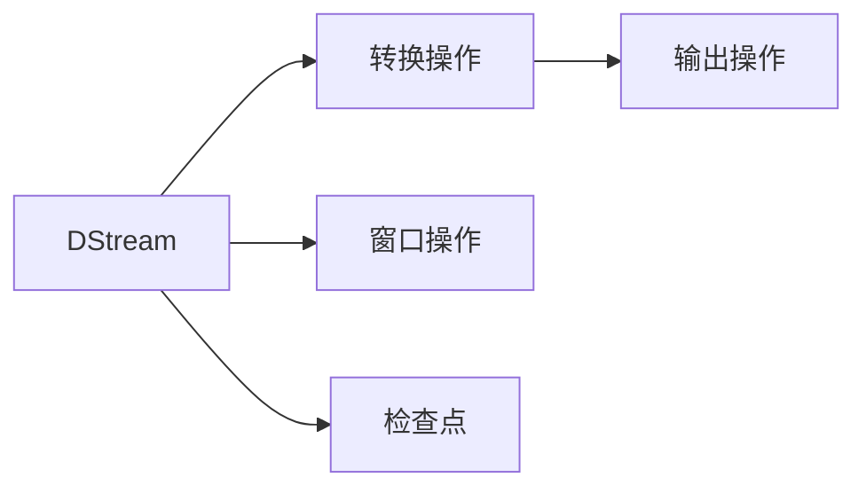

# Spark Streaming原理与代码实例讲解

## 1. 背景介绍
在大数据技术迅猛发展的今天，实时数据处理已成为众多企业和组织的核心需求。Apache Spark作为一个强大的开源集群计算系统，通过其扩展模块Spark Streaming，为实时数据处理提供了强有力的支持。Spark Streaming允许用户以近乎实时的方式处理数据流，使得数据分析和决策能够更加迅速和精准。

## 2. 核心概念与联系
Spark Streaming的核心概念包括DStream（离散流）、转换操作、输出操作、窗口操作和检查点。DStream是一系列连续的RDD（弹性分布式数据集），代表了一个连续的数据流。转换操作允许我们对DStream中的数据进行处理，如map、filter等。输出操作则是将转换后的数据推送到外部系统。窗口操作允许在指定的时间范围内对数据进行聚合处理。检查点则用于容错，可以将状态信息保存到可靠存储中。



## 3. 核心算法原理具体操作步骤
Spark Streaming的核心算法是基于微批处理模型。数据流被切分成一系列小批次，每个批次都是一个RDD，然后Spark引擎对这些RDD进行并行处理。具体操作步骤如下：

1. 定义输入源以接收数据流。
2. 将输入数据流转换为DStream。
3. 应用转换操作处理DStream。
4. 应用输出操作将结果输出到外部系统。
5. 启动Spark StreamingContext，并等待处理结束。

## 4. 数学模型和公式详细讲解举例说明
Spark Streaming的处理模型可以用以下数学公式表示：

$$
DStream = \bigcup_{t=0}^{T} RDD_t
$$

其中，$DStream$ 代表离散流，$RDD_t$ 代表时间点$t$的弹性分布式数据集，$T$ 代表时间范围。每个$RDD_t$ 包含了该时间点的数据，而DStream则是这些连续RDD的集合。

## 5. 项目实践：代码实例和详细解释说明
以下是一个Spark Streaming处理实时数据流的简单代码示例：

```scala
import org.apache.spark._
import org.apache.spark.streaming._

val conf = new SparkConf().setMaster("local[2]").setAppName("NetworkWordCount")
val ssc = new StreamingContext(conf, Seconds(1))

val lines = ssc.socketTextStream("localhost", 9999)
val words = lines.flatMap(_.split(" "))
val pairs = words.map(word => (word, 1))
val wordCounts = pairs.reduceByKey(_ + _)

wordCounts.print()

ssc.start()
ssc.awaitTermination()
```

在这个例子中，我们首先创建了一个Spark配置和StreamingContext。然后，我们定义了一个输入源（socketTextStream），它会从本地的9999端口接收数据。接着，我们将接收到的每行文本分割成单词，并将每个单词映射成一个键值对，最后通过reduceByKey操作进行计数。最终，我们打印出每个单词的计数结果。

## 6. 实际应用场景
Spark Streaming在多个领域都有广泛的应用，包括实时日志处理、社交媒体分析、在线推荐系统、欺诈检测等。

## 7. 工具和资源推荐
- Apache Spark官方文档
- Spark Streaming的GitHub仓库
- 相关书籍，如《Learning Spark》和《Advanced Analytics with Spark》

## 8. 总结：未来发展趋势与挑战
Spark Streaming作为实时数据处理的重要工具，其未来的发展趋势将更加注重性能优化、容错机制的完善以及与其他大数据技术的整合。同时，处理更大规模数据流、降低延迟和提高系统的稳定性也是其面临的挑战。

## 9. 附录：常见问题与解答
Q1: Spark Streaming和Apache Flink有什么区别？
A1: Spark Streaming是基于微批处理模型，而Flink是基于真正的流处理模型，这导致了它们在延迟和吞吐量上的差异。

Q2: 如何优化Spark Streaming应用的性能？
A2: 可以通过调整批处理大小、优化序列化机制、使用更高效的转换操作等方式来优化性能。

作者：禅与计算机程序设计艺术 / Zen and the Art of Computer Programming