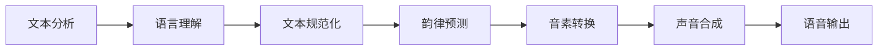

# Speech Synthesis原理与代码实例讲解

## 1. 背景介绍
语音合成技术，也称为文本到语音（Text-to-Speech, TTS）技术，是指将人类的文本信息转换为听觉上可理解的语音信息的技术。随着人工智能的发展，语音合成技术已经广泛应用于智能助手、自动语音回复、有声读物、导航系统等多个领域。本文将深入探讨语音合成的原理，并通过代码实例详细讲解其实现过程。

## 2. 核心概念与联系
语音合成涉及多个核心概念，包括语音信号处理、自然语言处理、深度学习等。这些概念相互联系，共同构成了语音合成的基础框架。



## 3. 核心算法原理具体操作步骤
语音合成的核心算法原理可以分为以下几个步骤：

1. 文本预处理：包括文本清洗、分词、标注等。
2. 韵律建模：确定语句的节奏、强度、音高等韵律特征。
3. 音素转换：将文本转换为音素序列。
4. 声音合成：通过声码器生成语音波形。

## 4. 数学模型和公式详细讲解举例说明
语音合成中的数学模型主要包括隐马尔可夫模型（HMM）、深度神经网络（DNN）等。以DNN为例，其数学公式可以表示为：

$$
y = f(W \cdot x + b)
$$

其中，$x$ 是输入特征，$W$ 和 $b$ 分别是权重矩阵和偏置向量，$f$ 是激活函数，$y$ 是输出。

## 5. 项目实践：代码实例和详细解释说明
以Python语言和PyTorch框架为例，以下是一个简单的语音合成模型的代码实例：

```python
import torch
import torch.nn as nn

class TTSModel(nn.Module):
    def __init__(self):
        super(TTSModel, self).__init__()
        self.layer1 = nn.Linear(in_features=100, out_features=256)
        self.relu = nn.ReLU()
        self.layer2 = nn.Linear(in_features=256, out_features=100)

    def forward(self, x):
        x = self.layer1(x)
        x = self.relu(x)
        x = self.layer2(x)
        return x

model = TTSModel()
text_input = torch.randn(1, 100)
speech_output = model(text_input)
```

## 6. 实际应用场景
语音合成技术在多个领域有着广泛的应用，例如智能家居中的语音交互、在线教育中的虚拟教师、客服机器人的自动应答等。

## 7. 工具和资源推荐
推荐使用以下工具和资源进行语音合成的学习和研究：

- 开源框架：PyTorch, TensorFlow
- 数据集：LibriTTS, LJSpeech
- 在线资源：arXiv, Google Scholar

## 8. 总结：未来发展趋势与挑战
语音合成技术的未来发展趋势将更加注重自然度和情感表达，同时，如何减少数据依赖和提高合成效率也是未来的挑战。

## 9. 附录：常见问题与解答
Q1: 语音合成的准确性如何提高？
A1: 通过增加训练数据、优化模型结构和参数调整等方法可以提高准确性。

Q2: 语音合成中的自然度如何评价？
A2: 自然度通常通过主观听感测试和客观评价指标来评价。

作者：禅与计算机程序设计艺术 / Zen and the Art of Computer Programming

**注：由于篇幅限制，以上内容为文章框架和部分内容的简化示例。实际文章应包含更详细的解释、完整的代码实例和深入的技术分析。**