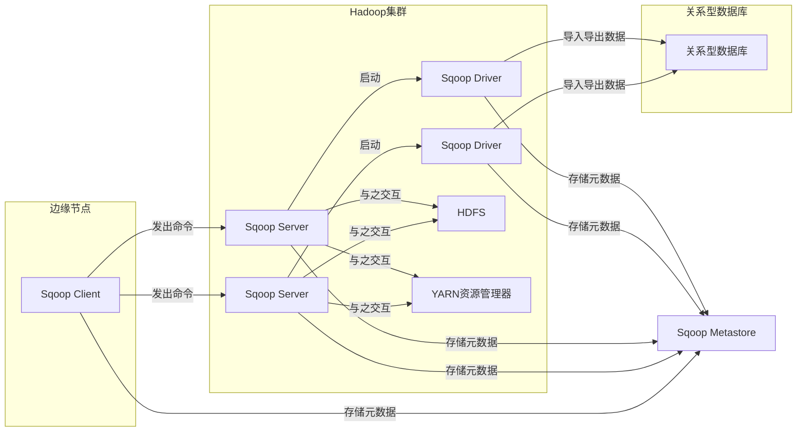
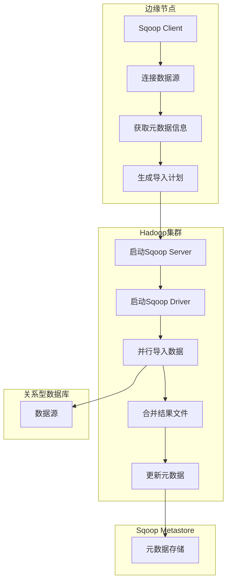
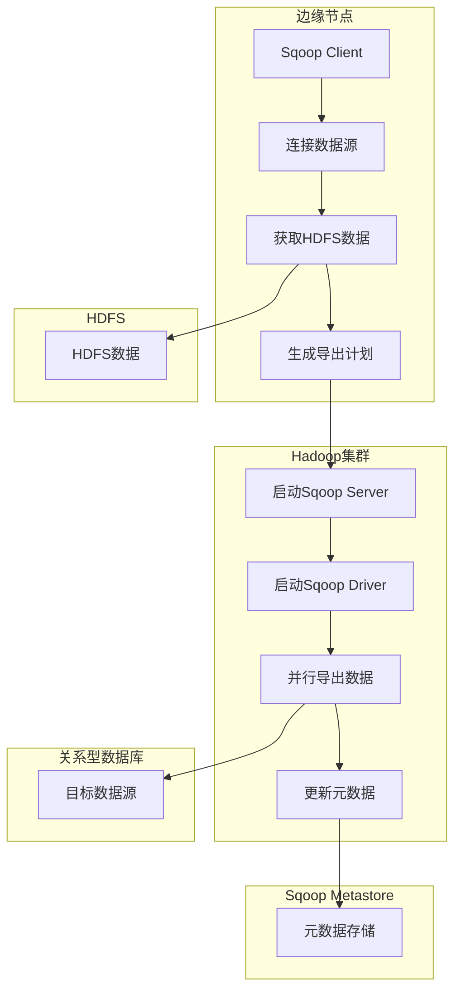

# Sqoop原理与代码实例讲解

## 1.背景介绍

在大数据时代,数据的存储和处理已经不再局限于单一的数据库系统。随着数据量的激增,传统的关系型数据库已经无法满足大规模数据处理的需求。这就催生了像Hadoop这样的分布式大数据存储和计算框架的出现。

Hadoop生态圈中有许多优秀的工具,而Sqoop就是其中一员。Sqoop是一款用于在Hadoop和关系型数据库之间高效传输大批量数据的工具。它支持从关系型数据库(如MySQL、Oracle等)中导入数据到Hadoop的HDFS中,也可以将HDFS的数据导出到关系型数据库中。Sqoop可以有效解决传统的数据导入导出工具无法处理大规模数据集的问题。

## 2.核心概念与联系

### 2.1 Sqoop架构

Sqoop由以下几个核心组件组成:

- **Sqoop Client**: 运行在边缘节点上的客户端工具,用于与其他组件交互并发出导入导出命令。
- **Sqoop Server**: 运行在数据节点上的服务器端组件,负责与HDFS、YARN资源管理器和数据库进行交互。
- **Sqoop Driver**: 运行在数据节点上的Java进程,执行实际的导入导出工作。
- **Sqoop Metastore**: 存储关于作业、连接器、记录等元数据信息的存储库。



### 2.2 Sqoop连接器

Sqoop使用连接器与不同的数据源进行交互。连接器负责解析特定数据源的元数据,并将数据导入或导出到HDFS。Sqoop内置了多种连接器,包括:

- **JDBC连接器**: 用于与关系型数据库进行交互。
- **Kafka连接器**: 用于与Kafka集群进行交互。
- **Accumulo连接器**: 用于与Accumulo数据库进行交互。

用户也可以根据需求开发自定义连接器。

### 2.3 Sqoop导入导出模式

Sqoop支持以下几种导入导出模式:

- **全量模式(Full Import)**: 将数据源中的全部数据导入到HDFS。
- **增量模式(Incremental Import)**: 只导入自上次导入后新增的数据。
- **最后修改时间模式(Last Modified Import)**: 根据数据的最后修改时间导入数据。
- **导出模式(Export)**: 将HDFS中的数据导出到数据源。

## 3.核心算法原理具体操作步骤  

### 3.1 Sqoop导入过程

Sqoop导入数据到HDFS的主要步骤如下:

1. **连接数据源**: Sqoop Client使用指定的连接器连接到数据源(如关系型数据库)。
2. **获取元数据信息**: 连接器获取数据源的元数据信息,如表结构、列信息等。
3. **生成导入计划**: Sqoop Client根据元数据信息生成导入计划。
4. **启动Sqoop Server**: Sqoop Client向Hadoop集群中的节点启动Sqoop Server进程。
5. **启动Sqoop Driver**: Sqoop Server在数据节点上启动Sqoop Driver进程。
6. **并行导入数据**: 多个Sqoop Driver并行从数据源导入数据到HDFS。
7. **合并结果文件**: 将多个Driver生成的结果文件合并成一个HDFS文件。
8. **更新元数据**: 将导入过程的元数据信息存储到Sqoop Metastore中。



### 3.2 Sqoop导出过程

Sqoop将HDFS中的数据导出到数据源(如关系型数据库)的主要步骤如下:

1. **连接数据源**: Sqoop Client使用指定的连接器连接到目标数据源。
2. **获取HDFS数据**: Sqoop Client从HDFS获取需要导出的数据。
3. **生成导出计划**: Sqoop Client根据数据源的元数据信息生成导出计划。
4. **启动Sqoop Server**: Sqoop Client向Hadoop集群中的节点启动Sqoop Server进程。  
5. **启动Sqoop Driver**: Sqoop Server在数据节点上启动Sqoop Driver进程。
6. **并行导出数据**: 多个Sqoop Driver并行将HDFS数据导出到数据源。
7. **更新元数据**: 将导出过程的元数据信息存储到Sqoop Metastore中。



## 4.数学模型和公式详细讲解举例说明

在Sqoop的并行导入导出过程中,会涉及到一些数学模型和公式,用于优化数据分片和任务调度。

### 4.1 数据分片

Sqoop在导入导出数据时,会将数据分成多个分片(split),由不同的Sqoop Driver并行处理。数据分片的大小会影响并行度和任务执行效率。Sqoop使用以下公式计算每个分片的大小:

$$
split\_size = max\{min\_split, \frac{total\_size}{max\_maps}\}
$$

其中:

- $split\_size$: 每个分片的大小(字节)
- $min\_split$: 分片的最小大小(字节),默认为64MB
- $total\_size$: 数据集的总大小(字节)
- $max\_maps$: 最大mapper(Sqoop Driver)数量,默认为4

例如,如果数据集总大小为1GB,最大mapper数量为4,则每个分片的大小为:

$$
split\_size = max\{64MB, \frac{1GB}{4}\} = 256MB
$$

因此,该数据集将被分成4个256MB的分片,由4个Sqoop Driver并行处理。

### 4.2 任务调度

在导入导出过程中,Sqoop需要将任务分配给多个Sqoop Driver执行。Sqoop使用一种基于权重的任务调度算法,确保每个Driver获得合理的任务分配。

假设有$n$个Driver,每个Driver $i$的权重为$w_i$,则Driver $i$获得的任务数量$t_i$计算如下:

$$
t_i = \left\lfloor\frac{w_i}{\sum_{j=1}^{n}w_j} \times total\_tasks\right\rfloor
$$

其中$total\_tasks$是总任务数量。

例如,有3个Driver,权重分别为2、3和5,总任务数为20,则每个Driver获得的任务数量为:

- Driver 1: $t_1 = \left\lfloor\frac{2}{2+3+5} \times 20\right\rfloor = 4$
- Driver 2: $t_2 = \left\lfloor\frac{3}{2+3+5} \times 20\right\rfloor = 6$
- Driver 3: $t_3 = \left\lfloor\frac{5}{2+3+5} \times 20\right\rfloor = 10$

## 5.项目实践：代码实例和详细解释说明

接下来,我们通过一个实际的例子来演示如何使用Sqoop导入和导出数据。

### 5.1 环境准备

- Hadoop集群版本: 3.2.2
- Sqoop版本: 1.4.7
- 关系型数据库: MySQL 8.0

首先,在MySQL中创建一个示例表`employees`:

```sql
CREATE TABLE employees (
  id INT PRIMARY KEY AUTO_INCREMENT,
  name VARCHAR(50) NOT NULL,
  department VARCHAR(50) NOT NULL,
  salary DECIMAL(10,2) NOT NULL
);

INSERT INTO employees (name, department, salary) VALUES
  ('John Doe', 'IT', 5000.00),
  ('Jane Smith', 'Sales', 6500.75),
  ('Bob Johnson', 'Marketing', 7200.50),
  ('Alice Williams', 'IT', 5800.25),
  ('Tom Brown', 'Sales', 6000.00);
```

### 5.2 导入数据到HDFS

使用以下Sqoop命令将`employees`表的数据导入到HDFS:

```bash
sqoop import \
  --connect jdbc:mysql://localhost/mydb \
  --username myuser \
  --password mypassword \
  --table employees \
  --target-dir /user/hadoop/employees \
  --fields-terminated-by '\t' \
  --lines-terminated-by '\n' \
  --mysql-delimiters
```

- `--connect`: 指定JDBC连接字符串
- `--username`和`--password`: 数据库认证信息
- `--table`: 要导入的表名
- `--target-dir`: HDFS目标路径
- `--fields-terminated-by`和`--lines-terminated-by`: 指定字段和行的分隔符
- `--mysql-delimiters`: 使用MySQL默认的分隔符

执行后,Sqoop会将`employees`表的数据导入到HDFS的`/user/hadoop/employees`路径下。

### 5.3 从HDFS导出数据

接下来,我们将HDFS中的数据导出到MySQL的另一个表`employees_export`:

```bash
sqoop export \
  --connect jdbc:mysql://localhost/mydb \
  --username myuser \
  --password mypassword \
  --table employees_export \
  --export-dir /user/hadoop/employees \
  --input-fields-terminated-by '\t'
```

- `--export`: 指定导出操作
- `--table`: 目标表名
- `--export-dir`: HDFS源路径
- `--input-fields-terminated-by`: 指定输入字段分隔符

执行后,Sqoop会将HDFS中的`/user/hadoop/employees`路径下的数据导出到MySQL的`employees_export`表中。

### 5.4 增量导入

Sqoop还支持增量导入,只导入自上次导入后新增的数据。我们先在`employees`表中插入一些新数据:

```sql
INSERT INTO employees (name, department, salary) VALUES
  ('Mike Taylor', 'IT', 6200.00),
  ('Emily Davis', 'Marketing', 7000.50);
```

然后使用`--check-column`和`--last-value`参数进行增量导入:

```bash
sqoop import \
  --connect jdbc:mysql://localhost/mydb \
  --username myuser \
  --password mypassword \
  --table employees \
  --target-dir /user/hadoop/employees \
  --fields-terminated-by '\t' \
  --lines-terminated-by '\n' \
  --mysql-delimiters \
  --check-column id \
  --last-value 5
```

- `--check-column`: 指定用于增量导入的列
- `--last-value`: 上次导入的最后一个值

执行后,Sqoop只会导入`id`大于5的新增数据。

## 6.实际应用场景

Sqoop在实际应用中有广泛的使用场景,例如:

1. **数据迁移**: 将企业内部的关系型数据库中的历史数据迁移到Hadoop集群中,用