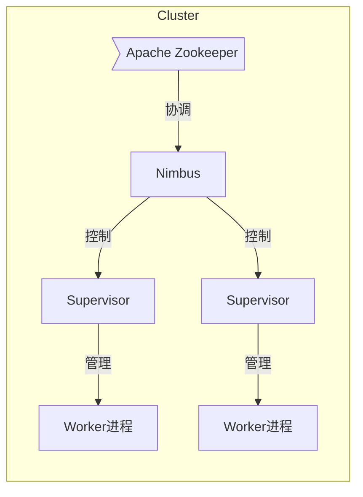
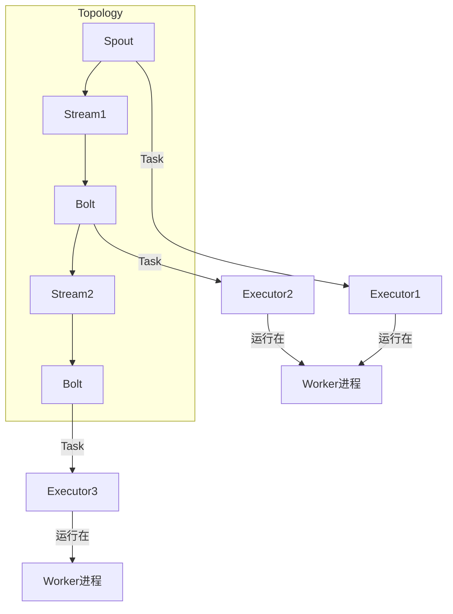

# Storm原理与代码实例讲解

## 1.背景介绍

### 1.1 什么是Storm

Storm是一个分布式实时计算系统,由Twitter公司开源,它用于实时处理大量的持续流式数据。Storm可以做到实时地连续计算,并且具有高可靠性、高可伸缩性和高容错性等特点。Storm适用于对数据流进行持续不断的计算,并实时地输出计算结果。

### 1.2 Storm应用场景

Storm可以广泛应用于各种实时数据处理场景,例如:

- 实时数据分析: 从数据流中提取有价值的信息,如网络日志分析、用户行为分析等。
- 在线机器学习: 从数据流中持续学习,不断更新模型。
- 连续计算: 对数据流进行持续的计算操作,如累加、合并等。
- 分布式RPC(远程过程调用): 通过Storm集群并行处理大量的RPC请求。
- 实时文件加工: 对日志文件等数据流进行实时加工处理。

### 1.3 Storm架构概览

Storm集群主要由以下几个组件构成:



- **Nimbus**: 是Storm集群的主控节点,负责分配代码在集群的哪些机器上运行,监控运行着的拓扑,并根据需要reassign工作。
- **Zookeeper**: 用于协调Nimbus和Supervisor,存储集群状态等元数据。
- **Supervisor**: 监控并管理在该节点上运行的Worker进程。
- **Worker进程**: 执行具体的数据处理逻辑,包含一个或多个Executor线程。

## 2.核心概念与联系

### 2.1 Topology(拓扑)

Topology定义了数据从源头流向bolt的路径。一个完整的Storm应用由一个Topology组成,包含了Spout(数据源)和Bolt(数据处理单元)。

### 2.2 Stream(数据流)

Stream是一个无边界的、连续的数据流,由无限个独立的数据元素(Tuple)组成。一个Spout会生成一个Source Stream,而Bolt会生成一个新的Stream。

### 2.3 Spout(数据源)

Spout是数据源,从外部系统(如Kafka、文件等)读取数据,并将数据流注入到Topology中。Spout可以是可靠的(Reliable)或不可靠的(Unreliable)。

### 2.4 Bolt(数据处理单元)

Bolt对数据流进行处理,执行过滤、函数操作、合并、写数据库等操作。Bolt可以订阅一个或多个Stream,并生成一个新的Stream。

### 2.5 Task

Task是Spout或Bolt在一个Worker进程中的执行线程。一个Spout/Bolt可能会有多个Task,以实现并行处理。

### 2.6 Worker进程

Worker进程是运行具体Topology子集的JVM进程。一个Worker进程会执行一个或多个Task。

### 2.7 Executor(执行器)

Executor是一个单线程,用于执行Task的线程。一个Worker进程会有一个或多个Executor。



## 3.核心算法原理具体操作步骤

### 3.1 数据处理流程

Storm的数据处理流程如下:

1. **Spout读取数据**:Spout从外部源(如Kafka、文件等)读取数据,并将数据封装为Source Stream注入Topology。

2. **分组(Stream Grouping)**:Topology根据分组策略,将Spout发出的Tuple分发给Bolt Task。

3. **Bolt处理数据**:Bolt接收Tuple,执行相应的处理逻辑,如过滤、函数操作、写数据库等。

4. **发射新Stream**:Bolt可发射新的Stream,供其他Bolt订阅。

5. **可靠性保证**:Storm通过至少一次处理语义和消息跟踪机制来保证数据处理的可靠性。

6. **持久化结果**:经过处理后的数据可以持久化到外部系统,如HDFS、数据库等。

### 3.2 数据分组策略

Storm提供了多种数据分组(Stream Grouping)策略,用于将Spout发出的Tuple分发给Bolt Task:

- **Shuffle Grouping**: 随机分发Tuple给Bolt中的任务。
- **Fields Grouping**: 根据Tuple中的某些Field值,将相同值的Tuple分发给同一个Task。
- **Global Grouping**: 将所有的Tuple分发给同一个Task。
- **None Grouping**: 将Tuple随机分发给下游Bolt中的某一个Task。
- **Direct Grouping**: 根据Tuple的源Task ID,将Tuple分发给下游Bolt的同一个Task ID。
- **Local or Shuffle Grouping**: 如果目标Bolt在同一个Worker进程,则使用直接分组;否则使用随机分组。

### 3.3 可靠性保证

Storm通过以下两种机制来保证数据处理的可靠性:

1. **至少一次处理语义(At Least Once)**:Storm保证每个Spout发出的Tuple至少被处理一次,除非Topology被杀死。

2. **消息跟踪(Message Tracking)**:Storm为每个Tuple分配一个唯一的ID(MessageId),并跟踪Tuple的处理过程。如果发生故障,可根据MessageId重新处理未完成的Tuple。

Storm的可靠性机制可确保在发生故障时不会丢失数据,但可能会导致重复处理。

## 4.数学模型和公式详细讲解举例说明

在Storm中,一个重要的概念是有效并行度(Effective Parallelism),它决定了Topology中各个组件的并行执行程度。有效并行度可通过以下公式计算:

$$
有效并行度 = \min(Parallelism_1, Parallelism_2 \times NumTasks_2)
$$

其中:

- $Parallelism_1$表示上游组件的并行度
- $Parallelism_2$表示下游组件的并行度
- $NumTasks_2$表示下游组件的Task数量

例如,假设一个Topology中,Spout的并行度为4,Bolt的并行度为8,Bolt有16个Task。那么Spout到Bolt的有效并行度为:

$$
有效并行度 = \min(4, 8 \times 16) = 4
$$

这意味着,尽管Bolt有16个Task,但最多只有4个Task会同时处理来自Spout的Tuple。

有效并行度的概念对于优化Topology的性能非常重要。通过调整各个组件的并行度和Task数量,可以最大化有效并行度,从而提高整个Topology的处理能力。

## 5.项目实践:代码实例和详细解释说明

下面我们通过一个实例项目,来演示如何使用Storm进行实时数据处理。我们将构建一个简单的WordCount应用,实时统计文本数据中单词出现的次数。

### 5.1 项目结构

```
- pom.xml
- src
    - main
        - java
            - com.example
                - WordCountTopology.java
                - WordCountSpout.java
                - WordCountBolt.java
```

### 5.2 WordCountSpout

`WordCountSpout`是一个简单的Spout实现,它会不断读取一个文本文件,并将每一行文本作为一个Tuple发射出去。

```java
import java.io.*;
import java.util.Map;

import org.apache.storm.spout.SpoutOutputCollector;
import org.apache.storm.task.TopologyContext;
import org.apache.storm.topology.OutputFieldsDeclarer;
import org.apache.storm.topology.base.BaseRichSpout;
import org.apache.storm.tuple.Fields;
import org.apache.storm.tuple.Values;

public class WordCountSpout extends BaseRichSpout {
    private SpoutOutputCollector collector;
    private FileReader fileReader;

    @Override
    public void open(Map conf, TopologyContext context, SpoutOutputCollector collector) {
        try {
            this.fileReader = new FileReader("data.txt");
        } catch (FileNotFoundException e) {
            throw new RuntimeException("Error reading file.", e);
        }
        this.collector = collector;
    }

    @Override
    public void nextTuple() {
        StringBuilder sb = new StringBuilder();
        int c;
        try {
            while ((c = fileReader.read()) != -1 && c != '\n') {
                sb.append((char) c);
            }
            if (sb.length() > 0) {
                collector.emit(new Values(sb.toString()));
            }
        } catch (IOException e) {
            throw new RuntimeException("Error reading tuple", e);
        }
    }

    @Override
    public void declareOutputFields(OutputFieldsDeclarer declarer) {
        declarer.declare(new Fields("line"));
    }
}
```

### 5.3 WordCountBolt

`WordCountBolt`订阅`WordCountSpout`发出的Stream,对每一行文本进行单词统计。它会维护一个`HashMap`来存储单词计数,并将统计结果打印到控制台。

```java
import java.util.HashMap;
import java.util.Map;

import org.apache.storm.task.OutputCollector;
import org.apache.storm.task.TopologyContext;
import org.apache.storm.topology.OutputFieldsDeclarer;
import org.apache.storm.topology.base.BaseRichBolt;
import org.apache.storm.tuple.Fields;
import org.apache.storm.tuple.Tuple;
import org.apache.storm.tuple.Values;

public class WordCountBolt extends BaseRichBolt {
    private OutputCollector collector;
    private Map<String, Integer> countMap;

    @Override
    public void prepare(Map conf, TopologyContext context, OutputCollector collector) {
        this.collector = collector;
        this.countMap = new HashMap<>();
    }

    @Override
    public void execute(Tuple tuple) {
        String line = tuple.getStringByField("line");
        String[] words = line.split(" ");
        for (String word : words) {
            Integer count = countMap.get(word);
            if (count == null) {
                count = 0;
            }
            countMap.put(word, ++count);
        }
        printResults();
    }

    private void printResults() {
        for (Map.Entry<String, Integer> entry : countMap.entrySet()) {
            System.out.println(entry.getKey() + ": " + entry.getValue());
        }
        System.out.println("======================");
    }

    @Override
    public void declareOutputFields(OutputFieldsDeclarer declarer) {
        declarer.declare(new Fields("word", "count"));
    }
}
```

### 5.4 WordCountTopology

`WordCountTopology`定义了完整的Topology结构,包括Spout、Bolt及它们之间的数据流。

```java
import org.apache.storm.Config;
import org.apache.storm.LocalCluster;
import org.apache.storm.topology.TopologyBuilder;
import org.apache.storm.tuple.Fields;

public class WordCountTopology {
    public static void main(String[] args) {
        TopologyBuilder builder = new TopologyBuilder();

        builder.setSpout("word-spout", new WordCountSpout(), 2);
        builder.setBolt("word-bolt", new WordCountBolt(), 4)
                .fieldsGrouping("word-spout", new Fields("line"));

        Config conf = new Config();
        conf.setDebug(true);

        LocalCluster cluster = new LocalCluster();
        cluster.submitTopology("word-count", conf, builder.createTopology());
    }
}
```

在这个例子中,我们创建了一个`WordCountSpout`实例,并行度为2;一个`WordCountBolt`实例,并行度为4。`WordCountBolt`通过Fields Grouping策略订阅`WordCountSpout`的输出流。

运行`WordCountTopology`的`main`方法,就可以在本地模式下启动这个Topology。控制台会实时打印出单词计数结果。

## 6.实际应用场景

Storm可以广泛应用于各种实时数据处理场景,下面列举了一些典型的应用:

1. **实时日志分析**:从大量的日志数据流中提取有价值的信息,如用户行为分析、网络安全监控等。

2. **物联网数据处理**:处理来自各种传感器的大量实时数据流,进行数据清洗、过滤、聚合等操作。

3. **在线机器学习**:从持续的数据流中不断学习,实时更新机器学习模型。

4. **实时推荐系统**:根据用户的实时行为,快速计算出个性化的推荐结果。

5. **实时监控和告警**:持续监控各种指标数据,及时发现异常并触发告警。

6. **实时数据ETL**:对实时数据流进行提取、转换