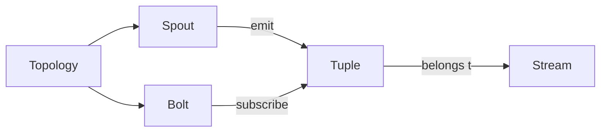

# Storm常见问题排查：性能瓶颈、异常处理

## 1. 背景介绍

### 1.1 Storm简介

Apache Storm是一个开源的分布式实时计算系统,用于处理大规模的流式数据。它提供了一个简单且强大的编程模型,允许开发人员构建可扩展、容错、高性能的实时应用程序。Storm广泛应用于实时分析、在线机器学习、持续计算、分布式RPC等领域。

### 1.2 Storm面临的挑战

尽管Storm为实时数据处理提供了强大的支持,但在实际应用中仍然会遇到各种性能瓶颈和异常问题,影响系统的稳定性和效率。常见的问题包括:

- 数据倾斜导致的性能瓶颈
- 数据反压(Backpressure)引起的系统阻塞
- 异常数据导致的处理失败
- 资源分配不合理导致的资源浪费
- 代码Bug引起的系统崩溃

因此,掌握Storm常见问题的排查和解决方法对于保障Storm应用的高可用性和高性能至关重要。

## 2. 核心概念与联系

### 2.1 Topology（拓扑）

在Storm中,一个实时应用程序被打包成一个Topology。Topology是一个有向无环图(DAG),由Spouts和Bolts组成,定义了数据流的转换过程。一个运行中的Topology会持续处理数据,直到被显式终止。

### 2.2 Spout（数据源）

Spout是Topology的数据源,负责从外部数据源读取数据并将其发射到Topology中。常见的Spout包括从Kafka读取数据、从Kestrel队列读取数据等。Spout会不断地发射元组(Tuple)到下游的Bolt。

### 2.3 Bolt（处理单元）

Bolt是Topology的处理单元,负责接收来自Spout或其他Bolt的元组,执行用户定义的处理逻辑,并可以将新的元组发射给下游的Bolt。Bolt可以执行过滤、转换、聚合、连接等各种操作。

### 2.4 Stream（数据流）

Stream表示Topology中的一个无界的元组序列。每个Stream都有一个唯一的ID,由Spout或Bolt声明和发射。Bolt可以订阅一个或多个Stream,并对接收到的元组进行处理。

### 2.5 元组（Tuple）

元组是Storm中数据的基本单位,是一个命名值的列表。每个元组都属于一个特定的Stream,并携带一个唯一的MessageId,用于可靠性处理。元组在Spout和Bolt之间流动,承载数据在Topology中的转换和传递。

### 2.6 核心概念关系图

下图展示了Storm核心概念之间的关系:



## 3. 核心算法原理具体操作步骤

Storm的核心算法主要体现在Topology的调度和任务分配、数据流的分区与路由、元组的可靠性处理等方面。下面详细介绍Storm的核心算法原理和操作步骤。

### 3.1 Topology的调度与任务分配

1. 提交Topology:用户将编写好的Topology提交到Storm集群运行。
2. 创建Thrift结构:Nimbus(Storm的中央协调器)将Topology转换为Thrift结构的任务分配计划。
3. 分配任务给Supervisor:Nimbus根据集群资源情况,将任务分配给集群中的Supervisor节点。
4. 启动Worker进程:每个Supervisor节点根据分配方案,为每个任务启动一个Worker进程。
5. 执行任务:每个Worker进程启动Executor线程,执行对应的Spout或Bolt任务。

### 3.2 数据流的分区与路由

1. 声明数据流:在Topology定义中,通过`declareStream`方法声明一个新的数据流。
2. 指定分区策略:在`setBolt`方法中,通过`customGrouping`、`fieldsGrouping`等方法指定数据流的分区策略。
3. 发射元组:Spout或Bolt通过`emit`方法将元组发射到指定的数据流中。
4. 分区与路由:根据指定的分区策略,元组被发送到下游Bolt的特定任务进行处理。

常见的数据流分区策略包括:
- `shuffleGrouping`:随机均匀分区,元组被随机发送到下游Bolt的任务。
- `fieldsGrouping`:按字段分组,相同字段值的元组被发送到同一个任务。
- `allGrouping`:广播分区,每个元组被发送到下游Bolt的所有任务。
- `globalGrouping`:全局分区,所有元组被发送到下游Bolt的同一个任务。

### 3.3 元组的可靠性处理

1. 锚定元组:在Spout或Bolt发射新元组时,可以通过`emit`方法的`anchors`参数指定锚定的元组。
2. 跟踪元组树:Storm通过跟踪元组的锚定关系,构建一棵元组树,记录每个元组的处理状态。
3. 确认或失败:Bolt在处理完元组后,通过`ack`方法确认成功,或通过`fail`方法声明失败。
4. 重放元组:对于失败的元组,Storm会重新发送给Spout或上游Bolt进行重新处理。
5. 超时机制:Storm为每个元组设置超时时间,超时未完成处理的元组会被视为失败。

通过元组的锚定和确认机制,Storm实现了"至少一次"的消息处理语义,保证每个元组都得到可靠处理。

## 4. 数学模型和公式详细讲解举例说明

### 4.1 数据倾斜度量模型

数据倾斜是Storm性能瓶颈的常见原因之一。我们可以使用基尼系数(Gini Coefficient)来度量数据在不同任务间的分布不均衡性。

假设有 $n$ 个任务,每个任务处理的元组数量为 $x_i$,则基尼系数的计算公式为:

$$
G = \frac{\sum_{i=1}^n\sum_{j=1}^n |x_i - x_j|}{2n\sum_{i=1}^n x_i}
$$

其中,$G$ 的取值范围为 $[0,1]$,值越大表示数据分布越不均衡。

举例说明:假设有3个任务,元组处理数量分别为 $[100, 200, 300]$,则基尼系数为:

$$
G = \frac{|100-200| + |100-300| + |200-300|}{2 \times 3 \times (100+200+300)} \approx 0.167
$$

### 4.2 反压模型

反压(Backpressure)是指下游Bolt处理速度跟不上上游数据生成速度,导致数据在内存中堆积,引起系统阻塞。我们可以使用Little's Law来估计系统的平均响应时间。

Little's Law的公式为:

$$
L = \lambda W
$$

其中,$L$ 表示系统中的平均任务数量,$\lambda$ 表示任务到达率,$W$ 表示任务的平均响应时间。

举例说明:假设一个Bolt平均每秒接收100个元组,元组的平均处理时间为0.5秒,则根据Little's Law,该Bolt的平均等待元组数量为:

$$
L = 100 \times 0.5 = 50
$$

如果等待元组数量持续增长,就说明存在反压现象,需要采取措施解决,如增加并行度、优化处理逻辑等。

## 5. 项目实践：代码实例和详细解释说明

下面通过一个简单的WordCount案例,演示如何使用Storm进行实时数据处理,并解释关键代码。

### 5.1 Topology定义

```java
public class WordCountTopology {
    public static void main(String[] args) throws Exception {
        // 创建Topology
        TopologyBuilder builder = new TopologyBuilder();
        
        // 设置Spout
        builder.setSpout("word-spout", new WordSpout());
        
        // 设置Bolt
        builder.setBolt("count-bolt", new CountBolt())
               .shuffleGrouping("word-spout");
        
        // 配置Topology
        Config config = new Config();
        config.setNumWorkers(2);
        
        // 提交Topology
        StormSubmitter.submitTopology("word-count-topology", config, builder.createTopology());
    }
}
```

说明:
- 通过`TopologyBuilder`创建Topology,并设置Spout和Bolt。
- 使用`shuffleGrouping`指定数据流的分区策略为随机分区。
- 通过`Config`配置Topology的并行度为2。
- 使用`StormSubmitter`提交Topology到Storm集群运行。

### 5.2 Spout实现

```java
public class WordSpout extends BaseRichSpout {
    private SpoutOutputCollector collector;
    private String[] words = {"apple", "banana", "orange", "grape"};
    
    @Override
    public void open(Map<String, Object> conf, TopologyContext context, SpoutOutputCollector collector) {
        this.collector = collector;
    }
    
    @Override
    public void nextTuple() {
        // 随机发射单词
        String word = words[new Random().nextInt(words.length)];
        collector.emit(new Values(word));
        
        // 模拟处理延迟
        Utils.sleep(100);
    }
    
    @Override
    public void declareOutputFields(OutputFieldsDeclarer declarer) {
        declarer.declare(new Fields("word"));
    }
}
```

说明:
- Spout需要继承`BaseRichSpout`,并实现`open`、`nextTuple`、`declareOutputFields`等方法。
- 在`open`方法中获取`SpoutOutputCollector`,用于发射元组。
- 在`nextTuple`方法中随机选择一个单词发射,并模拟处理延迟。
- 在`declareOutputFields`方法中声明输出字段为`"word"`。

### 5.3 Bolt实现

```java
public class CountBolt extends BaseRichBolt {
    private OutputCollector collector;
    private Map<String, Integer> counts = new HashMap<>();
    
    @Override
    public void prepare(Map<String, Object> conf, TopologyContext context, OutputCollector collector) {
        this.collector = collector;
    }
    
    @Override
    public void execute(Tuple tuple) {
        String word = tuple.getStringByField("word");
        // 统计单词数量
        counts.put(word, counts.getOrDefault(word, 0) + 1);
        collector.ack(tuple);
    }
    
    @Override
    public void declareOutputFields(OutputFieldsDeclarer declarer) {
        // 不发射数据流
    }
}
```

说明:
- Bolt需要继承`BaseRichBolt`,并实现`prepare`、`execute`、`declareOutputFields`等方法。 
- 在`prepare`方法中获取`OutputCollector`,用于发射元组和元组确认。
- 在`execute`方法中处理接收到的元组,更新单词计数,并确认元组处理成功。
- 由于该Bolt不发射数据流,`declareOutputFields`方法为空实现。

通过以上代码,我们实现了一个简单的实时单词计数应用。Spout随机发射单词,Bolt接收单词并统计数量。Storm会自动管理任务的调度和容错,确保数据得到实时、可靠的处理。

## 6. 实际应用场景

Storm在实际生产环境中有广泛的应用,下面列举几个典型的应用场景:

### 6.1 实时日志处理

Web服务器、移动应用等系统每天会产生大量的日志数据。使用Storm可以实时处理这些日志,进行异常检测、用户行为分析、安全审计等。

### 6.2 实时数据分析

电商网站、社交网络每时每刻都会产生海量的用户行为数据。使用Storm可以实时分析这些数据,进行实时推荐、趋势预测、异常检测等。

### 6.3 实时数据集成

在复杂的企业IT环境中,数据来源多样、格式各异。使用Storm可以实时接收和处理来自不同数据源的数据,进行清洗、转换、关联,并最终载入数据仓库或其他系统。

### 6.4 实时流处理

在物联网、车联网等场景下,设备会持续不断地产生各种传感器数据。使用Storm可以实时处理这些数据流,进行实时监控、预警、控制等。

## 7. 工具和资源推荐

### 7.1 开发工具

- IntelliJ IDEA:功能强大的Java IDE,提供了很好的Storm开发支持。
- Eclipse:另一款流行的Java IDE,也可用于Storm开发。
- Maven:Java项目管理和构建工具,可以方便地管理Storm项目的依赖。

### 7.2 部署工具

- Storm UI:Storm提供的Web管理界面,可以监控Topology的运行状态、性能指标等。
- Ambari:Hadoop生态